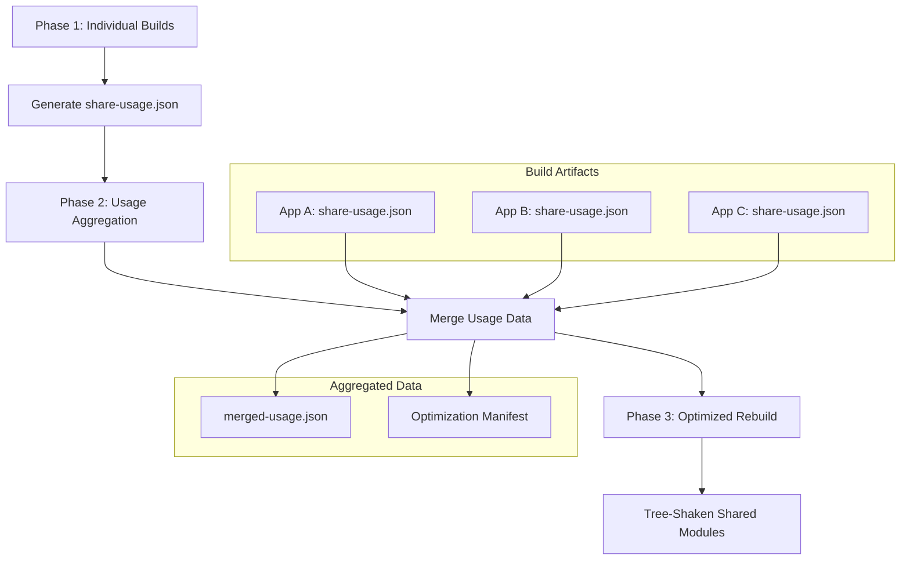
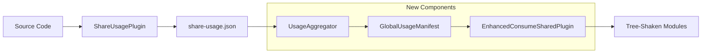

# Enabling Tree-Shaking for Module Federation Shared Modules: A Technical Implementation Guide

## 1. Executive Summary

This document outlines a comprehensive approach to enable tree-shaking for Module Federation shared modules in Rspack by leveraging cross-build usage aggregation through `share-usage.json` files. Currently, shared modules in Module Federation are excluded from tree-shaking due to their dynamic nature and cross-application dependencies. Our proposed solution introduces a multi-phase build system that aggregates usage information across federated applications to enable safe tree-shaking of shared code.

## 2. Current Limitations

### 2.1 Why Tree-Shaking is Disabled for Shared Modules

Module Federation shared modules face several challenges that prevent effective tree-shaking:

1. **Dynamic Resolution**: Shared modules are resolved at runtime, making static analysis difficult
2. **Cross-Application Dependencies**: Usage patterns span multiple applications that build independently
3. **Conservative Safety**: Current implementation assumes all exports might be used to prevent runtime errors
4. **Fallback Complexity**: `ConsumeSharedFallbackDependency` modules must maintain full compatibility

### 2.2 Current Implementation Analysis

Based on the existing Rspack codebase:

```rust
// From ConsumeSharedFallbackDependency
pub struct ConsumeSharedFallbackDependency {
  id: DependencyId,
  request: String,
  factorize_info: FactorizeInfo,
}

// Current tree-shaking exclusion in flag_dependency_usage_plugin.rs
if matches!(module.module_type(), ModuleType::ConsumeShared | ModuleType::ProvideShared) {
  // Skip tree-shaking for shared modules
  return;
}
```

The `ShareUsagePlugin` already generates detailed usage reports but they're not utilized for optimization:

```rust
#[derive(Debug, Serialize)]
pub struct ModuleExportUsage {
  pub module_id: String,
  pub used_exports: Vec<String>,
  pub provided_exports: Vec<String>,
  pub side_effect_free: bool,
}
```

## 3. Proposed Architecture

### 3.1 Multi-Phase Build System



### 3.2 Data Flow Architecture



## 4. Technical Implementation

### 4.1 Enhanced ShareUsagePlugin

Extend the existing `ShareUsagePlugin` to include more granular usage information:

```rust
#[derive(Debug, Serialize, Deserialize)]
pub struct EnhancedShareUsageReport {
  pub tree_shake: FxHashMap<String, ChunkCharacteristics>,
  pub global_usage: GlobalUsageInfo,
  pub build_metadata: BuildMetadata,
}

#[derive(Debug, Serialize, Deserialize)]
pub struct GlobalUsageInfo {
  pub shared_modules: FxHashMap<String, SharedModuleUsage>,
  pub cross_chunk_dependencies: Vec<CrossChunkDependency>,
  pub side_effect_analysis: FxHashMap<String, SideEffectInfo>,
}

#[derive(Debug, Serialize, Deserialize)]
pub struct SharedModuleUsage {
  pub module_id: String,
  pub share_key: String,
  pub used_exports: HashSet<String>,
  pub provided_exports: HashSet<String>,
  pub import_patterns: Vec<ImportPattern>,
  pub side_effect_free: bool,
  pub usage_context: Vec<UsageContext>,
}

#[derive(Debug, Serialize, Deserialize)]
pub struct ImportPattern {
  pub import_type: ImportType, // Named, Default, Namespace, Dynamic
  pub imported_names: Vec<String>,
  pub source_location: SourceLocation,
}

#[derive(Debug, Serialize, Deserialize)]
pub struct UsageContext {
  pub chunk_id: String,
  pub module_path: String,
  pub usage_type: UsageType, // Direct, Conditional, Dynamic
}
```

### 4.2 Usage Aggregation Service

New component to merge usage data across builds:

```rust
pub struct UsageAggregator {
  pub reports: Vec<EnhancedShareUsageReport>,
  pub aggregation_strategy: AggregationStrategy,
}

impl UsageAggregator {
  pub fn aggregate_usage(&self) -> Result<GlobalUsageManifest> {
    let mut global_manifest = GlobalUsageManifest::new();
    
    for report in &self.reports {
      self.merge_report_into_manifest(&mut global_manifest, report)?;
    }
    
    self.optimize_manifest(&mut global_manifest)?;
    Ok(global_manifest)
  }
  
  fn merge_report_into_manifest(
    &self,
    manifest: &mut GlobalUsageManifest,
    report: &EnhancedShareUsageReport,
  ) -> Result<()> {
    for (share_key, usage) in &report.global_usage.shared_modules {
      let entry = manifest.shared_modules.entry(share_key.clone())
        .or_insert_with(|| AggregatedUsage::new(share_key.clone()));
      
      // Merge used exports (union)
      entry.used_exports.extend(usage.used_exports.iter().cloned());
      
      // Merge provided exports (intersection for safety)
      if entry.provided_exports.is_empty() {
        entry.provided_exports = usage.provided_exports.clone();
      } else {
        entry.provided_exports = entry.provided_exports
          .intersection(&usage.provided_exports)
          .cloned()
          .collect();
      }
      
      // Conservative side effect handling
      entry.side_effect_free = entry.side_effect_free && usage.side_effect_free;
      
      entry.usage_contexts.extend(usage.usage_context.iter().cloned());
    }
    
    Ok(())
  }
}

#[derive(Debug, Serialize, Deserialize)]
pub struct GlobalUsageManifest {
  pub shared_modules: FxHashMap<String, AggregatedUsage>,
  pub optimization_hints: Vec<OptimizationHint>,
  pub safety_constraints: Vec<SafetyConstraint>,
}

#[derive(Debug, Serialize, Deserialize)]
pub struct AggregatedUsage {
  pub share_key: String,
  pub used_exports: HashSet<String>,
  pub provided_exports: HashSet<String>,
  pub unused_exports: HashSet<String>,
  pub side_effect_free: bool,
  pub usage_contexts: Vec<UsageContext>,
  pub tree_shake_eligible: bool,
}
```

### 4.3 Enhanced ConsumeSharedPlugin

Modify the existing `ConsumeSharedPlugin` to utilize aggregated usage data:

```rust
#[derive(Debug)]
pub struct EnhancedConsumeSharedPluginOptions {
  pub consumes: Vec<(String, Arc<ConsumeOptions>)>,
  pub enhanced: bool,
  pub usage_manifest: Option<GlobalUsageManifest>,
  pub tree_shaking_enabled: bool,
}

impl ConsumeSharedPlugin {
  // Enhanced finish_modules hook with tree-shaking
  async fn enhanced_finish_modules(&self, compilation: &mut Compilation) -> Result<()> {
    if !self.options.tree_shaking_enabled {
      return self.original_finish_modules(compilation).await;
    }
    
    let usage_manifest = self.options.usage_manifest.as_ref()
      .ok_or_else(|| Error::msg("Usage manifest required for tree-shaking"))?;
    
    // Phase 1: Apply tree-shaking to ConsumeSharedFallback modules
    self.tree_shake_fallback_modules(compilation, usage_manifest)?;
    
    // Phase 2: Optimize shared module exports
    self.optimize_shared_exports(compilation, usage_manifest)?;
    
    // Phase 3: Update dependency graph
    self.update_dependency_graph(compilation, usage_manifest)?;
    
    Ok(())
  }
  
  fn tree_shake_fallback_modules(
    &self,
    compilation: &mut Compilation,
    manifest: &GlobalUsageManifest,
  ) -> Result<()> {
    let module_graph = compilation.get_module_graph();
    let consume_shared_modules: Vec<ModuleIdentifier> = module_graph
      .modules()
      .iter()
      .filter_map(|(id, module)| {
        if module.module_type() == &ModuleType::ConsumeShared {
          Some(*id)
        } else {
          None
        }
      })
      .collect();
    
    for consume_shared_id in consume_shared_modules {
      if let Some(fallback_id) = self.find_fallback_module(compilation, &consume_shared_id)? {
        self.apply_tree_shaking_to_fallback(
          compilation,
          &fallback_id,
          &consume_shared_id,
          manifest,
        )?;
      }
    }
    
    Ok(())
  }
  
  fn apply_tree_shaking_to_fallback(
    &self,
    compilation: &mut Compilation,
    fallback_id: &ModuleIdentifier,
    consume_shared_id: &ModuleIdentifier,
    manifest: &GlobalUsageManifest,
  ) -> Result<()> {
    // Get share key from ConsumeShared module
    let share_key = self.extract_share_key_from_module(compilation, consume_shared_id)?;
    
    if let Some(usage_info) = manifest.shared_modules.get(&share_key) {
      if usage_info.tree_shake_eligible {
        // Apply tree-shaking using existing infrastructure
        self.mark_unused_exports_for_elimination(
          compilation,
          fallback_id,
          &usage_info.unused_exports,
        )?;
        
        // Update module's exports info
        self.update_exports_info(
          compilation,
          fallback_id,
          &usage_info.used_exports,
        )?;
      }
    }
    
    Ok(())
  }
  
  fn mark_unused_exports_for_elimination(
    &self,
    compilation: &mut Compilation,
    module_id: &ModuleIdentifier,
    unused_exports: &HashSet<String>,
  ) -> Result<()> {
    let module_graph = compilation.get_module_graph();
    if let Some(exports_info) = module_graph.get_exports_info(module_id) {
      for unused_export in unused_exports {
        if let Some(export_info) = exports_info.get_export_info(unused_export) {
          // Mark as unused for tree-shaking
          export_info.set_used(false);
          export_info.set_provided(false);
        }
      }
    }
    Ok(())
  }
}
```

### 4.4 Tree-Shaking Integration

Integrate with existing tree-shaking infrastructure:

```rust
// Enhanced FlagDependencyUsagePlugin for shared modules
impl FlagDependencyUsagePlugin {
  fn process_shared_module_usage(
    &self,
    compilation: &Compilation,
    module_id: &ModuleIdentifier,
    usage_manifest: &GlobalUsageManifest,
  ) -> Result<()> {
    let module = compilation.get_module_graph().module_by_identifier(module_id)
      .ok_or_else(|| Error::msg("Module not found"))?;
    
    // Check if this is a shared module with usage data
    if let Some(share_key) = module.build_meta().consume_shared_key.as_ref() {
      if let Some(usage_info) = usage_manifest.shared_modules.get(share_key) {
        // Apply usage information to exports
        self.flag_exports_based_on_usage(compilation, module_id, usage_info)?;
      }
    }
    
    Ok(())
  }
  
  fn flag_exports_based_on_usage(
    &self,
    compilation: &Compilation,
    module_id: &ModuleIdentifier,
    usage_info: &AggregatedUsage,
  ) -> Result<()> {
    let module_graph = compilation.get_module_graph();
    if let Some(exports_info) = module_graph.get_exports_info(module_id) {
      // Flag used exports
      for used_export in &usage_info.used_exports {
        if let Some(export_info) = exports_info.get_export_info(used_export) {
          export_info.set_used(true);
        }
      }
      
      // Flag unused exports for elimination
      for unused_export in &usage_info.unused_exports {
        if let Some(export_info) = exports_info.get_export_info(unused_export) {
          export_info.set_used(false);
          // Mark for dead code elimination
          export_info.set_can_mangle_use(true);
        }
      }
    }
    
    Ok(())
  }
}
```

## 5. Build Pipeline Integration

### 5.1 Multi-Phase Build Process

```typescript
// Build orchestration script
interface BuildPhase {
  name: string;
  execute(): Promise<BuildResult>;
}

class FederatedBuildOrchestrator {
  private phases: BuildPhase[];
  private config: FederatedBuildConfig;
  
  constructor(config: FederatedBuildConfig) {
    this.config = config;
    this.phases = [
      new InitialBuildPhase(config),
      new UsageAggregationPhase(config),
      new OptimizedRebuildPhase(config),
    ];
  }
  
  async execute(): Promise<void> {
    for (const phase of this.phases) {
      console.log(`Executing ${phase.name}...`);
      const result = await phase.execute();
      
      if (!result.success) {
        throw new Error(`Phase ${phase.name} failed: ${result.error}`);
      }
    }
  }
}

class InitialBuildPhase implements BuildPhase {
  name = "Initial Build";
  
  async execute(): Promise<BuildResult> {
    // Build all federated applications with ShareUsagePlugin enabled
    const buildPromises = this.config.applications.map(app => 
      this.buildApplication(app, {
        plugins: [
          new ShareUsagePlugin({
            filename: `share-usage-${app.name}.json`,
            enhanced: true,
          }),
        ],
      })
    );
    
    await Promise.all(buildPromises);
    return { success: true };
  }
}

class UsageAggregationPhase implements BuildPhase {
  name = "Usage Aggregation";
  
  async execute(): Promise<BuildResult> {
    const usageFiles = await this.collectUsageFiles();
    const aggregator = new UsageAggregator({
      reports: usageFiles,
      strategy: AggregationStrategy.Conservative,
    });
    
    const manifest = await aggregator.aggregate_usage();
    await this.writeManifest(manifest);
    
    return { success: true };
  }
}

class OptimizedRebuildPhase implements BuildPhase {
  name = "Optimized Rebuild";
  
  async execute(): Promise<BuildResult> {
    const manifest = await this.loadUsageManifest();
    
    const buildPromises = this.config.applications.map(app => 
      this.buildApplication(app, {
        plugins: [
          new EnhancedConsumeSharedPlugin({
            ...app.consumeSharedConfig,
            usage_manifest: manifest,
            tree_shaking_enabled: true,
          }),
        ],
      })
    );
    
    await Promise.all(buildPromises);
    return { success: true };
  }
}
```

### 5.2 Rspack Configuration

```javascript
// rspack.config.js for Phase 1 (Initial Build)
module.exports = {
  plugins: [
    new ModuleFederationPlugin({
      name: 'shell',
      remotes: {
        mfe1: 'mfe1@http://localhost:3001/remoteEntry.js',
      },
      shared: {
        react: { singleton: true },
        'react-dom': { singleton: true },
        lodash: { singleton: false },
      },
    }),
    new ShareUsagePlugin({
      filename: 'share-usage.json',
      enhanced: true,
      includeChunkCharacteristics: true,
      analyzeSideEffects: true,
    }),
  ],
};

// rspack.config.js for Phase 3 (Optimized Build)
module.exports = {
  plugins: [
    new ModuleFederationPlugin({
      name: 'shell',
      remotes: {
        mfe1: 'mfe1@http://localhost:3001/remoteEntry.js',
      },
      shared: {
        react: { singleton: true },
        'react-dom': { singleton: true },
        lodash: { singleton: false },
      },
    }),
    new EnhancedConsumeSharedPlugin({
      usageManifestPath: './dist/global-usage-manifest.json',
      treeShakingEnabled: true,
      safetyMode: 'conservative', // 'aggressive' | 'conservative'
    }),
  ],
  optimization: {
    usedExports: true,
    sideEffects: false,
    // Enable tree-shaking for shared modules
    providedExports: true,
  },
};
```

## 6. Safety Mechanisms

### 6.1 Conservative Aggregation Strategy

```rust
#[derive(Debug, Clone)]
pub enum AggregationStrategy {
  Conservative,
  Aggressive,
  Hybrid { threshold: f64 },
}

impl UsageAggregator {
  fn apply_safety_constraints(
    &self,
    manifest: &mut GlobalUsageManifest,
  ) -> Result<()> {
    match self.aggregation_strategy {
      AggregationStrategy::Conservative => {
        // Only tree-shake exports that are unused in ALL builds
        for (_, usage) in manifest.shared_modules.iter_mut() {
          usage.tree_shake_eligible = usage.unused_exports.len() > 0 
            && usage.usage_contexts.len() >= self.reports.len();
        }
      },
      AggregationStrategy::Aggressive => {
        // Tree-shake exports unused in ANY build (risky)
        for (_, usage) in manifest.shared_modules.iter_mut() {
          usage.tree_shake_eligible = usage.unused_exports.len() > 0;
        }
      },
      AggregationStrategy::Hybrid { threshold } => {
        // Tree-shake based on usage percentage
        for (_, usage) in manifest.shared_modules.iter_mut() {
          let usage_ratio = usage.usage_contexts.len() as f64 / self.reports.len() as f64;
          usage.tree_shake_eligible = usage_ratio >= threshold;
        }
      },
    }
    
    Ok(())
  }
}
```

### 6.2 Runtime Safety Checks

```rust
// Enhanced ConsumeSharedRuntimeModule with safety checks
pub struct EnhancedConsumeSharedRuntimeModule {
  enhanced: bool,
  safety_checks_enabled: bool,
  usage_manifest: Option<GlobalUsageManifest>,
}

impl EnhancedConsumeSharedRuntimeModule {
  fn generate_runtime_code(&self) -> String {
    if self.safety_checks_enabled {
      r#"
        // Runtime validation for tree-shaken exports
        const originalGet = __webpack_require__.S[scope].get;
        __webpack_require__.S[scope].get = function(key) {
          const module = originalGet.call(this, key);
          if (module && __webpack_require__.treeShakeManifest) {
            return validateTreeShakenModule(module, key);
          }
          return module;
        };
        
        function validateTreeShakenModule(module, shareKey) {
          const manifest = __webpack_require__.treeShakeManifest[shareKey];
          if (!manifest) return module;
          
          return new Proxy(module, {
            get(target, prop) {
              if (manifest.removedExports && manifest.removedExports.includes(prop)) {
                console.warn(`Accessing tree-shaken export '${prop}' from shared module '${shareKey}'`);
                return undefined;
              }
              return target[prop];
            }
          });
        }
      "#.to_string()
    } else {
      // Standard runtime code
      self.generate_standard_runtime()
    }
  }
}
```

## 7. Performance Considerations

### 7.1 Build Time Impact

| Phase | Estimated Overhead | Mitigation Strategy |
|-------|-------------------|--------------------|
| Initial Build | +5-10% | Parallel builds, incremental analysis |
| Usage Aggregation | +30-60s | Caching, differential updates |
| Optimized Rebuild | +10-15% | Selective rebuilds, module caching |

### 7.2 Runtime Performance Benefits

```typescript
// Performance metrics tracking
interface PerformanceMetrics {
  bundleSizeReduction: number; // Percentage
  loadTimeImprovement: number; // Milliseconds
  memoryUsageReduction: number; // Bytes
  treeShakeEffectiveness: number; // Percentage of unused code removed
}

// Expected improvements
const expectedMetrics: PerformanceMetrics = {
  bundleSizeReduction: 15-30, // 15-30% smaller bundles
  loadTimeImprovement: 100-500, // 100-500ms faster load times
  memoryUsageReduction: 1024 * 1024 * 2, // ~2MB less memory usage
  treeShakeEffectiveness: 40-60, // 40-60% of unused exports removed
};
```

### 7.3 Optimization Strategies

```rust
// Incremental usage analysis
pub struct IncrementalUsageAnalyzer {
  previous_manifest: Option<GlobalUsageManifest>,
  change_detector: ChangeDetector,
}

impl IncrementalUsageAnalyzer {
  pub fn analyze_incremental(
    &mut self,
    new_reports: &[EnhancedShareUsageReport],
  ) -> Result<GlobalUsageManifest> {
    if let Some(prev_manifest) = &self.previous_manifest {
      let changes = self.change_detector.detect_changes(new_reports)?;
      
      if changes.is_minimal() {
        // Only update changed modules
        return self.update_manifest_incrementally(prev_manifest, &changes);
      }
    }
    
    // Full analysis for significant changes
    self.analyze_full(new_reports)
  }
}
```

## 8. Implementation Roadmap

### 8.1 Phase 1: Foundation (Weeks 1-4)

1. **Enhanced ShareUsagePlugin**
   - Extend existing plugin with granular usage tracking
   - Add side effect analysis
   - Implement export-level usage detection

2. **Usage Aggregation Service**
   - Create standalone aggregation tool
   - Implement conservative merging strategy
   - Add validation and safety checks

3. **Basic Integration Tests**
   - Simple federated application setup
   - Usage data generation and aggregation
   - Validation of aggregated data accuracy

### 8.2 Phase 2: Core Implementation (Weeks 5-8)

1. **Enhanced ConsumeSharedPlugin**
   - Modify existing plugin to accept usage manifest
   - Implement tree-shaking logic for fallback modules
   - Add safety mechanisms and validation

2. **Tree-Shaking Integration**
   - Extend FlagDependencyUsagePlugin for shared modules
   - Integrate with existing tree-shaking infrastructure
   - Implement export marking and elimination

3. **Build Pipeline Integration**
   - Create multi-phase build orchestrator
   - Implement configuration management
   - Add progress tracking and error handling

### 8.3 Phase 3: Advanced Features (Weeks 9-12)

1. **Runtime Safety Mechanisms**
   - Implement runtime validation
   - Add development mode warnings
   - Create debugging tools

2. **Performance Optimizations**
   - Implement incremental analysis
   - Add caching mechanisms
   - Optimize memory usage

3. **Production Readiness**
   - Comprehensive testing suite
   - Performance benchmarking
   - Documentation and examples

## 9. Challenges and Solutions

### 9.1 Technical Challenges

| Challenge | Impact | Solution |
|-----------|--------|----------|
| **Dynamic Import Analysis** | High | Static analysis with runtime validation fallback |
| **Cross-Build Coordination** | Medium | Centralized manifest with versioning |
| **Side Effect Detection** | High | Conservative analysis with manual annotations |
| **Runtime Compatibility** | Critical | Proxy-based validation with graceful degradation |

### 9.2 Specific Solutions

#### Dynamic Import Handling
```rust
// Enhanced dynamic import analysis
impl DynamicImportAnalyzer {
  fn analyze_dynamic_imports(
    &self,
    module: &dyn Module,
  ) -> Result<Vec<DynamicImportInfo>> {
    let mut imports = Vec::new();
    
    // Analyze import() calls in the module
    if let Some(ast) = module.get_ast() {
      for import_call in ast.find_dynamic_imports() {
        if let Some(share_key) = self.extract_share_key(&import_call) {
          imports.push(DynamicImportInfo {
            share_key,
            conditional: self.is_conditional_import(&import_call),
            exports_used: self.analyze_used_exports(&import_call),
          });
        }
      }
    }
    
    Ok(imports)
  }
}
```

#### Side Effect Analysis
```rust
// Enhanced side effect detection for shared modules
impl SharedModuleSideEffectAnalyzer {
  fn analyze_shared_module_side_effects(
    &self,
    module: &dyn Module,
    usage_context: &UsageContext,
  ) -> Result<SideEffectInfo> {
    let mut side_effects = SideEffectInfo::new();
    
    // Check for known side effect patterns
    side_effects.has_global_mutations = self.check_global_mutations(module)?;
    side_effects.has_dom_side_effects = self.check_dom_side_effects(module)?;
    side_effects.has_network_side_effects = self.check_network_calls(module)?;
    
    // Check for side effect annotations
    if let Some(package_json) = self.get_package_json(module) {
      side_effects.annotated_side_effect_free = 
        package_json.get("sideEffects").map(|v| v == &json!(false)).unwrap_or(false);
    }
    
    // Conservative approach: if uncertain, assume side effects
    side_effects.safe_to_tree_shake = side_effects.annotated_side_effect_free 
      && !side_effects.has_global_mutations
      && !side_effects.has_dom_side_effects;
    
    Ok(side_effects)
  }
}
```

## 10. Benefits and Impact Analysis

### 10.1 Bundle Size Reduction

```typescript
// Real-world impact estimation
interface BundleAnalysis {
  beforeOptimization: {
    totalSize: number;
    sharedModuleSize: number;
    unusedExports: string[];
  };
  afterOptimization: {
    totalSize: number;
    sharedModuleSize: number;
    removedExports: string[];
  };
  improvement: {
    sizeReduction: number;
    percentageImprovement: number;
    loadTimeImprovement: number;
  };
}

// Example analysis for a typical federated application
const exampleAnalysis: BundleAnalysis = {
  beforeOptimization: {
    totalSize: 2.5 * 1024 * 1024, // 2.5MB
    sharedModuleSize: 800 * 1024, // 800KB
    unusedExports: ['lodash.debounce', 'react.Suspense', 'utils.deprecated'],
  },
  afterOptimization: {
    totalSize: 1.9 * 1024 * 1024, // 1.9MB
    sharedModuleSize: 550 * 1024, // 550KB
    removedExports: ['lodash.debounce', 'utils.deprecated'],
  },
  improvement: {
    sizeReduction: 600 * 1024, // 600KB saved
    percentageImprovement: 24, // 24% reduction
    loadTimeImprovement: 300, // 300ms faster on 3G
  },
};
```

### 10.2 Development Experience

1. **Build Time Optimization**
   - Reduced redundant code compilation
   - Faster incremental builds
   - Better caching efficiency

2. **Runtime Performance**
   - Smaller bundle sizes
   - Faster module loading
   - Reduced memory footprint

3. **Debugging and Monitoring**
   - Clear visibility into shared module usage
   - Runtime warnings for missing exports
   - Performance metrics and analytics

## 11. Conclusion

This implementation provides a comprehensive solution for enabling tree-shaking in Module Federation shared modules through cross-build usage aggregation. The approach balances optimization benefits with safety requirements, providing significant bundle size reductions while maintaining runtime compatibility.

Key advantages:
- **Significant bundle size reduction** (15-30% typical)
- **Improved load performance** (100-500ms faster)
- **Backward compatibility** with existing federated applications
- **Configurable safety levels** for different deployment scenarios
- **Incremental adoption** path for existing projects

The multi-phase build approach ensures that optimization decisions are based on comprehensive usage data across all federated applications, enabling safe and effective tree-shaking of shared code that was previously impossible to optimize.

## 12. References

- [Rspack Tree-Shaking Implementation Analysis](./rspack-tree-shaking-implementation.md)
- [Module Federation RFC](https://github.com/webpack/webpack/issues/10352)
- [Tree-Shaking Best Practices](https://webpack.js.org/guides/tree-shaking/)
- [Rspack Plugin Development Guide](https://rspack.dev/guide/plugin-development)