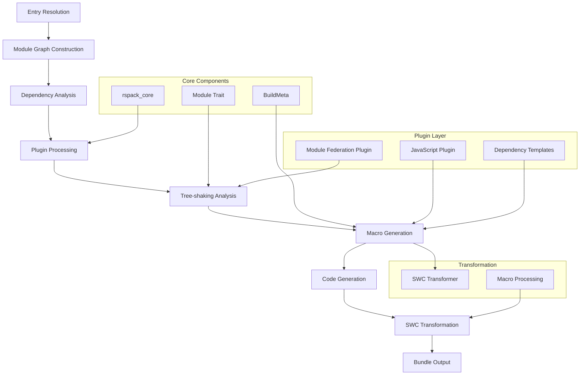
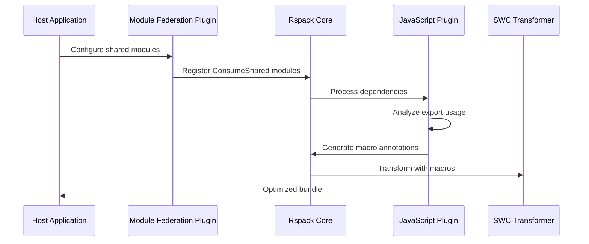

# Rspack Ecosystem Overview: Tree-shaking Annotation Macros Integration

## Executive Summary

This document provides a comprehensive overview of how tree-shaking annotation macros integrate within the Rspack ecosystem, detailing the relationships between core components, plugin architecture, and the Module Federation system. The tree-shaking macro system represents a sophisticated optimization technique that spans multiple layers of the bundling pipeline.

## Core Architecture Overview

### 1. Rspack Core Foundation

**Location**: `crates/rspack_core/`

The core provides the foundational abstractions that enable tree-shaking macros:

```
rspack_core/
├── src/dependency/
│   ├── dependency_type.rs     # ConsumeSharedExports enum
│   └── runtime_template.rs    # Macro generation logic
├── src/module.rs              # Module trait with get_consume_shared_key()
└── src/build_meta.rs          # BuildMeta with shared_key fields
```

**Key Components**:
- **Module Trait**: Extended with `get_consume_shared_key()` method for shared module identification
- **BuildMeta**: Enhanced with `consume_shared_key` and `shared_key` fields for metadata tracking
- **DependencyType**: New `ConsumeSharedExports` variant for shared module dependencies
- **RuntimeTemplate**: Core macro generation logic with PURE annotations

### Core Infrastructure Files

#### Module Trait Extensions (`crates/rspack_core/src/module.rs`)
- **New Methods**: 
  ```rust
  fn get_consume_shared_key(&self) -> Option<&str> { None }
  fn get_shared_key(&self) -> Option<&str> { None }
  ```
- **BuildMeta Extensions**: 
  ```rust
  pub struct BuildMeta {
    // ... existing fields
    pub consume_shared_key: Option<String>,
    pub shared_key: Option<String>,
  }
  ```
- **Purpose**: Enable modules to expose their sharing metadata for tree-shaking decisions
- **Integration**: Used by `is_consume_shared_descendant()` to identify shared module hierarchies

#### ConsumeSharedModule Enhancements (`crates/rspack_plugin_mf/src/sharing/consume_shared_module.rs`)
- **Structure**:
  ```rust
  pub struct ConsumeSharedModule {
    blocks: Vec<AsyncDependenciesBlockIdentifier>,
    dependencies: Vec<DependencyId>,
    identifier: ModuleIdentifier,
    lib_ident: String,
    readable_identifier: String,
    context: Context,
    options: ConsumeOptions,
    factory_meta: Option<FactoryMeta>,
    build_info: BuildInfo,
    build_meta: BuildMeta,
  }
  ```
- **New Methods**: 
  ```rust
  fn get_consume_shared_key(&self) -> Option<&str> {
    Some(&self.options.share_key)
  }
  
  fn set_has_provide_info(&mut self, has_provide_info: bool) {
    // Updates module metadata for tree-shaking decisions
  }
  ```
- **Hash Updates**: Enhanced `module_update_hash()` for proper cache invalidation with ConsumeShared context
- **Purpose**: Integrate ConsumeShared modules with the tree-shaking macro system

#### Runtime Template System (`crates/rspack_core/src/dependency/runtime_template.rs`)
- **PURE Annotation Logic**: 
  ```rust
  fn is_consume_shared_descendant(module_graph: &ModuleGraph, module_id: &ModuleIdentifier) -> bool {
    // Direct check for shared module metadata
    if let Some(module) = module_graph.module_by_identifier(module_id) {
      if module.build_meta().shared_key.is_some()
        || module.build_meta().consume_shared_key.is_some()
        || module.module_type() == &ModuleType::ConsumeShared
        || module.module_type() == &ModuleType::ProvideShared
      {
        return true;
      }
    }
    
    // BFS through dependency chain to find shared modules
    let mut visited = HashSet::default();
    let mut queue = vec![*module_id];
    
    while let Some(current_id) = queue.pop() {
      // ... breadth-first search implementation
    }
    false
  }
  ```
- **Import Statement Enhancement**: 
  ```rust
  pub fn import_statement(module: &dyn Module, compilation: &Compilation, 
                         runtime_requirements: &mut RuntimeGlobals, 
                         id: &DependencyId, request: &str, update: bool) -> (String, String) {
    // ... module resolution logic
    
    let import_content = if is_consume_shared_descendant(module_graph, &module.identifier()) {
      format!("/* #__PURE__ */ {}", base_import_call)
    } else {
      base_import_call
    };
    
    (import_var, import_content)
  }
  ```
- **Purpose**: Enable SWC transformer to eliminate unused shared module calls through PURE annotations

#### Dependency System Extensions
- **ConsumeSharedExportsDependency**: 
  ```rust
  #[cacheable]
  #[derive(Debug, Clone)]
  pub struct ConsumeSharedExportsDependency {
    id: DependencyId,
    range: DependencyRange,
    share_key: String,
    export_name: Option<String>,
  }
  
  impl ConsumeSharedExportsDependency {
    pub fn should_apply_to_module(&self, module_graph: &ModuleGraph, 
                                 module_id: &ModuleIdentifier) -> bool {
      // Check if module is in shared context
      if let Some(module) = module_graph.module_by_identifier(module_id) {
        module.get_consume_shared_key().is_some() || 
        module.get_shared_key().is_some()
      } else {
        false
      }
    }
  }
  ```
- **Enhanced Templates**: 
  ```rust
  impl DependencyTemplate for ConsumeSharedExportsDependencyTemplate {
    fn render(&self, dep: &dyn DependencyCodeGeneration, 
             source: &mut TemplateReplaceSource, 
             template_context: &TemplateContext) -> Result<()> {
      let effective_shared_key = self.get_effective_shared_key(dep, template_context);
      let condition = format!("treeShake.{}.{}", effective_shared_key, export_name);
      let macro_start = format!("/* @common:if [condition=\"{}\"] */", condition);
      let macro_end = "/* @common:endif */";
      
      // Wrap assignment or property access with conditional macros
      source.replace(dep.range().start, dep.range().start, &macro_start);
      source.replace(dep.range().end, dep.range().end, macro_end);
      Ok(())
    }
  }
  ```
- **Usage Tracking**: Integration with `ShareUsagePlugin` for export usage analysis and optimization decisions

## Core Infrastructure Components

### Dependency System

#### ConsumeSharedExportsDependency (`consume_shared_exports_dependency.rs`)

**Structure and Core Methods:**
```rust
#[cacheable]
#[derive(Debug, Clone)]
pub struct ConsumeSharedExportsDependency {
  id: DependencyId,
  range: DependencyRange,
  share_key: String,
  export_name: Option<String>,
}

impl ConsumeSharedExportsDependency {
  pub fn new(range: DependencyRange, share_key: String, export_name: Option<String>) -> Self {
    Self {
      id: DependencyId::new(),
      range,
      share_key,
      export_name,
    }
  }

  fn should_apply_to_module(&self, module_graph: &ModuleGraph, module_id: &ModuleIdentifier) -> bool {
    // Check if module is in shared context
    if let Some(module) = module_graph.module_by_identifier(module_id) {
      module.build_meta().shared_key.is_some() ||
      module.build_meta().consume_shared_key.is_some() ||
      module.module_type() == &ModuleType::ConsumeShared
    } else {
      false
    }
  }
}
```

**Template Implementation:**
```rust
impl DependencyTemplate for ConsumeSharedExportsDependencyTemplate {
  fn render(&self, dep: &dyn DependencyCodeGeneration, source: &mut TemplateReplaceSource, _: &TemplateContext) -> Result<()> {
    let dep = dep.as_any().downcast_ref::<ConsumeSharedExportsDependency>().unwrap();
    
    // Generate effective shared key
    let effective_shared_key = dep.share_key.clone();
    
    if let Some(export_name) = &dep.export_name {
      // Generate conditional comment for tree-shaking
      let condition = format!("treeShake.{}.{}", effective_shared_key, export_name);
      let start_comment = format!("/* @common:if [condition=\"{}\"] */", condition);
      let end_comment = "/* @common:endif */";
      
      // Wrap assignment or property access
      source.replace(
        dep.range.start,
        dep.range.start,
        &start_comment,
      );
      source.replace(
        dep.range.end,
        dep.range.end,
        &end_comment,
      );
    }
    
    Ok(())
  }
}
```

### Module Trait Extensions

#### Enhanced Module Trait (`module.rs`)

**BuildMeta Extensions:**
```rust
#[cacheable]
#[derive(Debug, Default, Clone)]
pub struct BuildMeta {
  // Existing fields...
  pub consume_shared_key: Option<String>,
  pub shared_key: Option<String>,
  // Other fields...
}

pub trait Module: DynHash + DynEq + AsAny + Send + Sync {
  // Existing methods...
  
  fn get_consume_shared_key(&self) -> Option<&str> {
    None // Default implementation, overridden by specific module types
  }
}
```

### Runtime Template Integration

#### PURE Annotation System (`runtime_template.rs`)

**Shared Module Detection Algorithm:**
```rust
fn is_consume_shared_descendant(module_graph: &ModuleGraph, module_id: &ModuleIdentifier) -> bool {
  // Quick check: if the module itself has shared metadata
  if let Some(module) = module_graph.module_by_identifier(module_id) {
    if module.build_meta().shared_key.is_some()
      || module.build_meta().consume_shared_key.is_some()
      || module.module_type() == &ModuleType::ConsumeShared
      || module.module_type() == &ModuleType::ProvideShared
    {
      return true;
    }
  }

  // Breadth-first search through dependency chain
  let mut visited = HashSet::default();
  let mut queue = vec![*module_id];

  while let Some(current_id) = queue.pop() {
    if !visited.insert(current_id) {
      continue;
    }

    // Check issuers (modules that import this one)
    for issuer_id in module_graph.get_issuers(&current_id) {
      if let Some(issuer) = module_graph.module_by_identifier(issuer_id) {
        if issuer.build_meta().shared_key.is_some()
          || issuer.build_meta().consume_shared_key.is_some()
          || issuer.module_type() == &ModuleType::ConsumeShared
          || issuer.module_type() == &ModuleType::ProvideShared
        {
          return true;
        }
        queue.push(*issuer_id);
      }
    }
  }
  
  false
}
```

**PURE Annotation Application:**
```rust
pub fn import_statement(
  module: &dyn Module,
  compilation: &Compilation,
  runtime_requirements: &mut RuntimeGlobals,
  id: &DependencyId,
  request: &str,
  update: bool,
) -> (String, String) {
  // ... existing logic ...
  
  let module_graph = compilation.get_module_graph();
  let current_module_id = module.identifier();
  
  // Apply PURE annotation for shared module descendants
  let pure_annotation = if is_consume_shared_descendant(&module_graph, &current_module_id) {
    "/* #__PURE__ */ "
  } else {
    ""
  };
  
  let import_content = format!(
    "{}var {} = {}({});",
    pure_annotation,
    import_var,
    RuntimeGlobals::REQUIRE,
    module_id_expr
  );
  
  (import_content, String::new())
}
```

### 2. Plugin Ecosystem Integration

### 2. Data Flow and Processing Pipeline

#### Compilation Pipeline Integration
```
┌─────────────────┐    ┌──────────────────┐    ┌─────────────────┐
│   Source Code   │───▶│  Dependency      │───▶│  Code           │
│   Analysis      │    │  Graph Building  │    │  Generation     │
└─────────────────┘    └──────────────────┘    └─────────────────┘
         │                       │                       │
         ▼                       ▼                       ▼
┌─────────────────┐    ┌──────────────────┐    ┌─────────────────┐
│ ConsumeShared   │    │ ShareUsagePlugin │    │ Runtime         │
│ Detection       │    │ Analysis         │    │ Template        │
└─────────────────┘    └──────────────────┘    └─────────────────┘
         │                       │                       │
         ▼                       ▼                       ▼
┌─────────────────┐    ┌──────────────────┐    ┌─────────────────┐
│ Macro           │    │ Usage Report     │    │ SWC             │
│ Generation      │    │ Generation       │    │ Transformer     │
└─────────────────┘    └──────────────────┘    └─────────────────┘
```

#### Module Graph Enhancement
```rust
// Enhanced module graph with shared module tracking
struct EnhancedModuleGraph {
  base_graph: ModuleGraph,
  shared_modules: HashMap<ModuleIdentifier, SharedModuleInfo>,
  consume_shared_map: HashMap<String, Vec<ModuleIdentifier>>,
  usage_tracker: ShareUsageTracker,
}

impl EnhancedModuleGraph {
  fn track_shared_dependency(&mut self, module_id: ModuleIdentifier, 
                            share_key: String, export_name: Option<String>) {
    let info = SharedModuleInfo {
      share_key: share_key.clone(),
      export_name,
      usage_state: UsageState::Unknown,
    };
    
    self.shared_modules.insert(module_id, info);
    self.consume_shared_map.entry(share_key)
      .or_insert_with(Vec::new)
      .push(module_id);
  }
  
  fn analyze_usage_patterns(&self) -> HashMap<String, ExportUsageInfo> {
    self.usage_tracker.analyze_all_shared_modules(&self.shared_modules)
  }
}
```

### 3. Plugin Ecosystem Integration

## Module Federation Plugin Integration

### ConsumeShared Module Enhancement (`consume_shared_module.rs`)

**Module Structure:**
```rust
#[cacheable]
#[derive(Debug, Clone)]
pub struct ConsumeSharedModule {
  blocks: Vec<AsyncDependenciesBlockIdentifier>,
  dependencies: Vec<DependencyId>,
  identifier: ModuleIdentifier,
  lib_ident: String,
  readable_identifier: String,
  context: Context,
  options: ConsumeOptions,
  factory_meta: Option<FactoryMeta>,
  build_info: BuildInfo,
  build_meta: BuildMeta,
}
```

**Enhanced Build Process:**
```rust
impl Module for ConsumeSharedModule {
  async fn build(&mut self, build_context: BuildContext) -> Result<BuildResult> {
    // Set shared metadata for tree-shaking
    self.build_meta.consume_shared_key = Some(self.options.share_key.clone());
    
    // Enable provide info for optimization
    self.set_has_provide_info(true);
    
    // Build fallback dependencies
    if let Some(fallback_request) = &self.options.import {
      let fallback_dep = ConsumeSharedFallbackDependency::new(
        fallback_request.clone(),
        self.context.clone(),
      );
      self.dependencies.push(fallback_dep.id());
    }
    
    Ok(BuildResult::default())
  }
  
  fn get_consume_shared_key(&self) -> Option<&str> {
    Some(&self.options.share_key)
  }
}
```

**Code Generation with Macro Support:**
```rust
async fn code_generation(
  &self,
  compilation: &Compilation,
  _runtime: Option<&RuntimeSpec>,
  _: Option<ConcatenationScope>,
) -> Result<CodeGenerationResult> {
  let mut code_generation_result = CodeGenerationResult::default();
  code_generation_result
    .runtime_requirements
    .insert(RuntimeGlobals::SHARE_SCOPE_MAP);
    
  // Generate share scope access with tree-shaking support
  let share_scope = json_stringify(&self.options.share_scope);
  let share_key = json_stringify(&self.options.share_key);
  
  let source = format!(
    "/* @common:if [condition=\"treeShake.{}.enabled\"] */\n" +
    "module.exports = __webpack_require__.S[{}][{}];\n" +
    "/* @common:endif */",
    self.options.share_key,
    share_scope,
    share_key
  );
  
  code_generation_result.add(SourceType::JavaScript, RawSource::from(source));
  Ok(code_generation_result)
}
```

### ShareUsage Plugin (`share_usage_plugin.rs`)

**Usage Analysis Algorithm:**
```rust
fn analyze_consume_shared_usage(
  &self,
  compilation: &Compilation,
) -> HashMap<String, SimpleModuleExports> {
  let mut usage_map = HashMap::new();
  let module_graph = compilation.get_module_graph();

  for module_id in module_graph.modules().keys() {
    if let Some(module) = module_graph.module_by_identifier(module_id) {
      if module.module_type() == &ModuleType::ConsumeShared {
        if let Some(share_key) = module.get_consume_shared_key() {
          if let Some(fallback_id) = self.find_fallback_module_id(&module_graph, module_id) {
            let (used_exports, provided_exports) =
              self.analyze_fallback_module_usage(&module_graph, &fallback_id, module_id);
            
            usage_map.insert(share_key.to_string(), SimpleModuleExports {
              used_exports,
              unused_exports: provided_exports.into_iter()
                .filter(|export| !used_exports.contains(export))
                .collect(),
              possibly_unused_exports: Vec::new(),
            });
          }
        }
      }
    }
  }
  
  usage_map
}
```

**Fallback Module Analysis:**
```rust
fn analyze_fallback_module_usage(
  &self,
  module_graph: &ModuleGraph,
  fallback_id: &ModuleIdentifier,
  consume_shared_id: &ModuleIdentifier,
) -> (Vec<String>, Vec<String>) {
  let mut used_exports = Vec::new();
  let mut provided_exports = Vec::new();
  
  // Get export information from fallback module
  let fallback_exports_info = module_graph.get_exports_info(fallback_id);
  let fallback_prefetched = ExportsInfoGetter::prefetch(
    &fallback_exports_info,
    module_graph,
    PrefetchExportsInfoMode::Default,
  );
  
  // Analyze provided exports
  if let ProvidedExports::Vec(exports) = &fallback_prefetched.provided_exports {
    for export in exports {
      if let ExportNameOrSpec::String(name) = export {
        provided_exports.push(name.clone());
        
        // Check usage state
        let export_info = fallback_exports_info.get_export_info(name, module_graph);
        if export_info.get_used_name(module_graph, None) != UsageState::Unused {
          used_exports.push(name.clone());
        }
      }
    }
  }
  
  (used_exports, provided_exports)
}
```

**Report Generation:**
```rust
impl CompilerEmit for ShareUsagePlugin {
  async fn emit(&self, compilation: &mut Compilation) -> Result<()> {
    let usage_data = self.analyze_consume_shared_usage(compilation);
    
    let report = ShareUsageReport {
      consume_shared_modules: usage_data,
      metadata: ShareUsageMetadata {
        total_modules: compilation.get_module_graph().modules().len(),
      },
    };
    
    let json_content = serde_json::to_string_pretty(&report)
      .map_err(|e| Error::from(format!("Failed to serialize usage report: {}", e)))?;
    
    compilation.emit_asset(
      self.options.filename.clone(),
      CompilationAsset::new(
        Some(RawSource::from(json_content).boxed()),
        AssetInfo::default(),
      ),
    );
    
    Ok(())
  }
}
```

#### JavaScript Plugin (`rspack_plugin_javascript/`)

**Primary Role**: Dependency template management and macro generation

```
rspack_plugin_javascript/
├── src/dependency/commonjs/
│   └── consume_shared_exports_dependency.rs  # Core dependency implementation
├── src/dependency/esm/
│   ├── export_specifier_dependency.rs        # ESM export handling
│   └── export_imported_specifier_dependency.rs
└── src/utils/
    └── eval.rs                               # Expression evaluation
```

**Key Features**:
- **ConsumeSharedExportsDependency**: Handles tree-shaking for shared module exports
- **Dependency Templates**: Generate conditional macros around code sections
- **Export Analysis**: Determines which exports are actually used
- **Macro Generation**: Creates `/* @common:if */` and `/* @common:endif */` annotations

## JavaScript Plugin Integration

### Webpack Comment Processing (`webpack_comment.rs`)

**Magic Comment Parsing System:**
```rust
static WEBPACK_MAGIC_COMMENT_REGEXP: LazyLock<regex::Regex> = LazyLock::new(|| {
  regex::Regex::new(
    r#"(?P<_0>webpack[a-zA-Z\d_-]+)\s*:\s*(?P<_9>"(?P<_1>[^"]+)"|'(?P<_2>[^']+)'|`(?P<_3>[^`]+)`|(?P<_4>[\d.-]+)|(?P<_5>true|false)|(?P<_6>/((?:(?:[^\\/\]\[]+)|(?:\[[^\]]+\])|(?:\\/)|(?:\\.))*)/([dgimsuvy]*))\[(?P<_7>[^\]]+)|(?P<_8>([^,]+)))"#
  ).expect("invalid regex")
});

pub fn try_extract_webpack_magic_comment(
  source_file: &SourceFile,
  comments: &Option<&dyn Comments>,
  error_span: Span,
  span: Span,
  warning_diagnostics: &mut Vec<Box<dyn Diagnostic + Send + Sync>>,
) -> WebpackCommentMap {
  let mut result = WebpackCommentMap::new();
  
  comments.with_leading(span.lo, |comments| {
    analyze_comments(source_file, comments, error_span, warning_diagnostics, &mut result)
  });
  
  comments.with_trailing(span.hi, |comments| {
    analyze_comments(source_file, comments, error_span, warning_diagnostics, &mut result)
  });
  
  result
}
```

**Comment Analysis Implementation:**
```rust
fn analyze_comments(
  source_file: &SourceFile,
  comments: &[Comment],
  error_span: Span,
  warning_diagnostics: &mut Vec<Box<dyn Diagnostic + Send + Sync>>,
  result: &mut WebpackCommentMap,
) {
  let mut parsed_comment = FxHashSet::<Span>::default();
  
  for comment in comments.iter().rev().filter(|c| matches!(c.kind, CommentKind::Block)) {
    if parsed_comment.contains(&comment.span) {
      continue;
    }
    parsed_comment.insert(comment.span);
    
    for captures in WEBPACK_MAGIC_COMMENT_REGEXP.captures_iter(&comment.text) {
      if let Some(item_name_match) = captures.name("_0") {
        let item_name = item_name_match.as_str();
        
        match item_name {
          "webpackChunkName" => {
            if let Some(item_value_match) = captures.name("_1")
              .or(captures.name("_2"))
              .or(captures.name("_3")) {
              result.insert(WebpackComment::ChunkName, item_value_match.as_str().to_string());
            }
          }
          "webpackExports" => {
            // Handle export-specific comments for tree-shaking
            if let Some(item_value_match) = captures.name("_1")
              .or(captures.name("_2"))
              .or(captures.name("_3")) {
              result.insert(WebpackComment::Exports, item_value_match.as_str().trim().to_string());
            }
          }
          _ => {}
        }
      }
    }
  }
}
```

### Dependency Templates Enhancement

**CommonJS Require Dependency Template:**
```rust
impl DependencyTemplate for CommonJsRequireDependencyTemplate {
  fn render(
    &self,
    dep: &dyn DependencyCodeGeneration,
    source: &mut TemplateReplaceSource,
    context: &TemplateContext,
  ) -> Result<()> {
    let dep = dep.as_any().downcast_ref::<CommonJsRequireDependency>().unwrap();
    
    // Check if this is a shared module context
    if let Some(module) = context.compilation.get_module_graph()
      .module_by_identifier(&context.module.identifier()) {
      
      if module.build_meta().consume_shared_key.is_some() {
        // Generate conditional wrapper for shared modules
        let share_key = module.build_meta().consume_shared_key.as_ref().unwrap();
        let condition = format!("treeShake.{}.enabled", share_key);
        
        source.replace(
          dep.range.start,
          dep.range.start,
          &format!("/* @common:if [condition=\"{}\"] */", condition),
        );
        
        source.replace(
          dep.range.end,
          dep.range.end,
          "/* @common:endif */",
        );
      }
    }
    
    Ok(())
  }
}
```

### SWC Transformer Integration

**Macro Processing Pipeline:**
```rust
// Integration point in the compilation process
pub fn apply_swc_transformers(
  source: &str,
  module: &dyn Module,
  compilation: &Compilation,
) -> Result<String> {
  let mut transformers = Vec::new();
  
  // Add tree-shaking macro transformer for shared modules
  if module.build_meta().consume_shared_key.is_some() ||
     module.build_meta().shared_key.is_some() {
    transformers.push(Box::new(TreeShakingMacroTransformer::new(
      module.get_consume_shared_key().map(|s| s.to_string()),
    )));
  }
  
  // Apply transformers in sequence
  let mut result = source.to_string();
  for transformer in transformers {
    result = transformer.transform(result)?;
  }
  
  Ok(result)
}
```

#### Module Federation Plugin (`rspack_plugin_mf/`)

**Primary Role**: Shared module management and federation orchestration

```
rspack_plugin_mf/
├── src/sharing/
│   ├── consume_shared_module.rs    # ConsumeShared module implementation
│   ├── provide_shared_module.rs    # ProvideShared module implementation
│   └── share_usage_plugin.rs       # Usage tracking for tree-shaking
└── src/container/
    └── module_federation_plugin.rs # Main plugin orchestration
```

**Integration Points**:
- **ConsumeSharedModule**: Enhanced with `get_consume_shared_key()` method
- **ShareUsagePlugin**: Tracks export usage for tree-shaking decisions
- **Module Metadata**: Populates `BuildMeta` with shared module information
- **Federation Runtime**: Coordinates with macro system for optimized loading

### 4. System Connections and Data Flow

#### Module Federation Integration Flow
```
ConsumeSharedPlugin ──▶ ConsumeSharedModule ──▶ ConsumeSharedExportsDependency
        │                       │                           │
        ▼                       ▼                           ▼
Share Resolution        Build Meta Updates          Macro Generation
        │                       │                           │
        ▼                       ▼                           ▼
ShareUsagePlugin ──────▶ Usage Analysis ──────────▶ Runtime Template
```

#### Detailed Data Flow Implementation
```rust
// 1. ConsumeSharedPlugin creates shared modules
impl ConsumeSharedPlugin {
  async fn create_module(&self, data: &mut ModuleFactoryCreateData) -> Result<Option<BoxModule>> {
    if let Some(consume_config) = self.get_consume_config(&data.request) {
      let mut module = ConsumeSharedModule::new(data.context.clone(), consume_config);
      
      // Set shared metadata for tree-shaking
      module.build_meta.consume_shared_key = Some(consume_config.share_key.clone());
      module.build_meta.shared_key = Some(consume_config.share_key.clone());
      
      Ok(Some(Box::new(module)))
    } else {
      Ok(None)
    }
  }
}

// 2. ConsumeSharedExportsDependency tracks usage
impl ConsumeSharedExportsDependency {
  fn new(share_key: String, export_name: Option<String>, range: DependencyRange) -> Self {
    Self {
      id: DependencyId::new(),
      range,
      share_key,
      export_name,
    }
  }
  
  fn should_apply_to_module(&self, module_graph: &ModuleGraph, 
                           module_id: &ModuleIdentifier) -> bool {
    if let Some(module) = module_graph.module_by_identifier(module_id) {
      // Check if module is part of shared context
      module.get_consume_shared_key().is_some() || 
      module.get_shared_key().is_some() ||
      self.is_shared_descendant(module_graph, module_id)
    } else {
      false
    }
  }
}

// 3. ShareUsagePlugin analyzes and reports
impl ShareUsagePlugin {
  fn analyze_consume_shared_usage(&self, compilation: &Compilation) -> HashMap<String, SimpleModuleExports> {
    let mut usage_map = HashMap::new();
    let module_graph = compilation.get_module_graph();
    
    for module_id in module_graph.modules().keys() {
      if let Some(module) = module_graph.module_by_identifier(module_id) {
        if module.module_type() == &ModuleType::ConsumeShared {
          if let Some(share_key) = module.get_consume_shared_key() {
            let usage_info = self.analyze_module_exports(module_graph, module_id);
            usage_map.insert(share_key.to_string(), usage_info);
          }
        }
      }
    }
    
    usage_map
  }
}
```

## Data Flow and Component Relationships

### 1. SWC Integration and Build Pipeline

#### SWC Transformer Pipeline
```rust
// SWC transformer integration for macro processing
struct TreeShakingTransformer {
  shared_modules: HashSet<String>,
  macro_patterns: Vec<MacroPattern>,
}

impl TreeShakingTransformer {
  fn process_conditional_comments(&mut self, program: &mut Program) {
    program.visit_mut_with(&mut ConditionalCommentProcessor {
      shared_modules: &self.shared_modules,
      current_context: None,
    });
  }
  
  fn apply_pure_annotations(&mut self, program: &mut Program) {
    program.visit_mut_with(&mut PureAnnotationVisitor {
      consume_shared_descendants: &self.shared_modules,
    });
  }
}

// Conditional comment processor
struct ConditionalCommentProcessor<'a> {
  shared_modules: &'a HashSet<String>,
  current_context: Option<String>,
}

impl VisitMut for ConditionalCommentProcessor<'_> {
  fn visit_mut_call_expr(&mut self, call: &mut CallExpr) {
    if self.is_consume_shared_call(call) {
      self.wrap_with_conditional_comment(call);
    }
    call.visit_mut_children_with(self);
  }
  
  fn wrap_with_conditional_comment(&self, call: &mut CallExpr) {
    if let Some(share_key) = self.extract_share_key(call) {
      let condition = format!("treeShake.{}.default", share_key);
      call.span = call.span.with_leading_comments(vec![
        Comment {
          kind: CommentKind::Block,
          text: format!(" @common:if [condition=\"{}\"] ", condition),
          span: DUMMY_SP,
        }
      ]);
    }
  }
}
```

#### Build Meta Extensions
```rust
// Extended build metadata for shared modules
#[derive(Debug, Clone)]
struct SharedModuleBuildMeta {
  pub consume_shared_key: Option<String>,
  pub shared_key: Option<String>,
  pub export_usage: HashMap<String, ExportUsageState>,
  pub tree_shake_enabled: bool,
  pub macro_annotations: Vec<MacroAnnotation>,
}

#[derive(Debug, Clone)]
struct MacroAnnotation {
  pub annotation_type: AnnotationType,
  pub condition: String,
  pub target_range: SourceRange,
  pub export_name: Option<String>,
}

#[derive(Debug, Clone)]
enum AnnotationType {
  ConditionalComment { condition: String },
  PureAnnotation,
  TreeShakeHint { export_name: String },
}

impl SharedModuleBuildMeta {
  fn add_tree_shake_annotation(&mut self, export_name: String, condition: String) {
    self.macro_annotations.push(MacroAnnotation {
      annotation_type: AnnotationType::TreeShakeHint { export_name: export_name.clone() },
      condition: condition.clone(),
      target_range: SourceRange::default(),
      export_name: Some(export_name),
    });
  }
  
  fn should_apply_pure_annotation(&self, module_type: &ModuleType) -> bool {
    self.tree_shake_enabled && 
    (module_type == &ModuleType::ConsumeShared || 
     self.consume_shared_key.is_some())
  }
}
```

### 2. Compilation Pipeline Integration



### 3. Advanced Module Graph Analysis

#### Dependency Graph Enhancement
```rust
// Enhanced dependency tracking for shared modules
struct SharedDependencyTracker {
  dependency_map: HashMap<ModuleIdentifier, Vec<SharedDependencyInfo>>,
  usage_patterns: HashMap<String, UsagePattern>,
  optimization_hints: Vec<OptimizationHint>,
}

#[derive(Debug, Clone)]
struct SharedDependencyInfo {
  share_key: String,
  export_name: Option<String>,
  dependency_type: SharedDependencyType,
  source_range: SourceRange,
  usage_context: UsageContext,
}

#[derive(Debug, Clone)]
enum SharedDependencyType {
  DirectConsume,
  PropertyAccess { property: String },
  MethodCall { method: String, args: Vec<String> },
  Destructuring { patterns: Vec<String> },
}

#[derive(Debug, Clone)]
struct UsagePattern {
  frequency: usize,
  contexts: Vec<UsageContext>,
  optimization_potential: OptimizationLevel,
}

impl SharedDependencyTracker {
  fn analyze_dependency_patterns(&self, module_graph: &ModuleGraph) -> AnalysisReport {
    let mut report = AnalysisReport::new();
    
    for (module_id, dependencies) in &self.dependency_map {
      let module_analysis = self.analyze_module_dependencies(module_graph, module_id, dependencies);
      report.add_module_analysis(*module_id, module_analysis);
    }
    
    report.generate_optimization_recommendations()
  }
  
  fn track_shared_usage(&mut self, module_id: ModuleIdentifier, 
                       share_key: String, usage_info: SharedDependencyInfo) {
    self.dependency_map.entry(module_id)
      .or_insert_with(Vec::new)
      .push(usage_info);
      
    self.update_usage_pattern(&share_key, &usage_info);
  }
}
```

### 4. Module Federation Data Flow



### 5. Advanced Code Generation and Optimization

#### Multi-Stage Code Generation
```rust
// Advanced code generation with optimization stages
struct OptimizedCodeGenerator {
  base_generator: CodeGenerator,
  optimization_stages: Vec<OptimizationStage>,
  macro_processor: MacroProcessor,
}

#[derive(Debug)]
enum OptimizationStage {
  DependencyAnalysis,
  MacroGeneration,
  ConditionalWrapping,
  PureAnnotation,
  DeadCodeElimination,
}

impl OptimizedCodeGenerator {
  fn generate_with_optimizations(&self, module: &dyn Module, 
                                compilation: &Compilation) -> GenerationResult {
    let mut context = GenerationContext::new(module, compilation);
    
    // Stage 1: Analyze dependencies
    self.analyze_shared_dependencies(&mut context)?;
    
    // Stage 2: Generate base code
    let mut code = self.base_generator.generate(module, compilation)?;
    
    // Stage 3: Apply macro transformations
    for stage in &self.optimization_stages {
      match stage {
        OptimizationStage::MacroGeneration => {
          self.apply_macro_generation(&mut code, &context)?;
        },
        OptimizationStage::ConditionalWrapping => {
          self.apply_conditional_wrapping(&mut code, &context)?;
        },
        OptimizationStage::PureAnnotation => {
          self.apply_pure_annotations(&mut code, &context)?;
        },
        _ => {}
      }
    }
    
    Ok(code)
  }
  
  fn apply_macro_generation(&self, code: &mut GeneratedCode, 
                           context: &GenerationContext) -> Result<()> {
    for annotation in &context.macro_annotations {
      match &annotation.annotation_type {
        AnnotationType::ConditionalComment { condition } => {
          self.wrap_with_conditional_comment(code, annotation, condition)?;
        },
        AnnotationType::PureAnnotation => {
          self.add_pure_annotation(code, annotation)?;
        },
        AnnotationType::TreeShakeHint { export_name } => {
          self.add_tree_shake_hint(code, annotation, export_name)?;
        },
      }
    }
    Ok(())
  }
}
```

## Technical Implementation Details

### 1. Testing Infrastructure and Validation

#### Comprehensive Test Suite Structure
```rust
// Test infrastructure for tree-shaking macros
#[cfg(test)]
mod tree_shaking_tests {
  use super::*;
  use rspack_testing::*;
  
  struct TreeShakingTestCase {
    name: String,
    input_modules: Vec<TestModule>,
    shared_config: ConsumeSharedConfig,
    expected_annotations: Vec<ExpectedAnnotation>,
    validation_rules: Vec<ValidationRule>,
  }
  
  #[derive(Debug)]
  struct ExpectedAnnotation {
    annotation_type: AnnotationType,
    target_module: String,
    condition: String,
    should_be_present: bool,
  }
  
  #[derive(Debug)]
  enum ValidationRule {
    ConditionalCommentPresent { pattern: String },
    PureAnnotationApplied { target: String },
    MacroGenerated { share_key: String, export: String },
    UsageTracked { module_id: String },
  }
  
  impl TreeShakingTestCase {
    fn run_test(&self) -> TestResult {
      let mut compilation = create_test_compilation(&self.input_modules);
      
      // Apply consume shared plugin
      let plugin = ConsumeSharedPlugin::new(self.shared_config.clone());
      plugin.apply(&mut compilation)?;
      
      // Run compilation
      compilation.build()?;
      
      // Validate results
      self.validate_annotations(&compilation)?
        .validate_macro_generation(&compilation)?
        .validate_usage_tracking(&compilation)
    }
    
    fn validate_annotations(&self, compilation: &Compilation) -> Result<&Self> {
      let module_graph = compilation.get_module_graph();
      
      for expected in &self.expected_annotations {
        let module = module_graph.get_module_by_name(&expected.target_module)
          .ok_or_else(|| format!("Module {} not found", expected.target_module))?;
          
        let has_annotation = self.check_annotation_presence(module, expected);
        
        assert_eq!(has_annotation, expected.should_be_present,
          "Annotation mismatch for module {}: expected {}, got {}",
          expected.target_module, expected.should_be_present, has_annotation);
      }
      
      Ok(self)
    }
  }
  
  #[test]
  fn test_consume_shared_macro_generation() {
    let test_case = TreeShakingTestCase {
      name: "Basic ConsumeShared Macro Generation".to_string(),
      input_modules: vec![
        TestModule::new("main.js", r#"
          import { utils } from 'shared-lib';
          console.log(utils.helper());
        "#),
        TestModule::new("shared-lib", r#"
          export const utils = { helper: () => 'test' };
        "#),
      ],
      shared_config: ConsumeSharedConfig {
        share_key: "shared-lib".to_string(),
        singleton: true,
        eager: false,
        ..Default::default()
      },
      expected_annotations: vec![
        ExpectedAnnotation {
          annotation_type: AnnotationType::ConditionalComment {
            condition: "treeShake.shared-lib.utils".to_string()
          },
          target_module: "main.js".to_string(),
          condition: "treeShake.shared-lib.utils".to_string(),
          should_be_present: true,
        },
      ],
      validation_rules: vec![
        ValidationRule::MacroGenerated {
          share_key: "shared-lib".to_string(),
          export: "utils".to_string(),
        },
      ],
    };
    
    test_case.run_test().expect("Test should pass");
  }
}
```

#### Integration Test Framework
```rust
// Integration testing for Module Federation scenarios
#[cfg(test)]
mod integration_tests {
  use rspack_testing::*;
  
  struct ModuleFederationTestSuite {
    host_app: TestApplication,
    remote_apps: Vec<TestApplication>,
    shared_dependencies: Vec<SharedDependencyConfig>,
  }
  
  impl ModuleFederationTestSuite {
    fn test_cross_app_tree_shaking(&self) -> TestResult {
      // Build all applications
      let mut build_results = Vec::new();
      
      for remote in &self.remote_apps {
        let result = remote.build_with_tree_shaking()?;
        build_results.push(result);
      }
      
      let host_result = self.host_app.build_with_remotes(&build_results)?;
      
      // Validate tree-shaking across federation boundaries
      self.validate_cross_app_optimization(&host_result, &build_results)
    }
    
    fn validate_cross_app_optimization(&self, host: &BuildResult, 
                                      remotes: &[BuildResult]) -> TestResult {
      // Check that unused exports are properly marked
      for shared_dep in &self.shared_dependencies {
        let usage_report = host.get_shared_usage_report(&shared_dep.share_key)?;
        
        // Validate that only used exports have active macros
        for (export_name, usage_info) in &usage_report.exports {
          if !usage_info.is_used {
            assert!(
              !host.has_active_macro(&shared_dep.share_key, export_name),
              "Unused export {} should not have active macro", export_name
            );
          }
        }
      }
      
      Ok(())
    }
  }
}
```

### 2. Performance Monitoring and Metrics

#### Build Performance Tracking
```rust
// Performance monitoring for tree-shaking operations
struct TreeShakingMetrics {
  macro_generation_time: Duration,
  dependency_analysis_time: Duration,
  usage_tracking_time: Duration,
  code_generation_time: Duration,
  total_macros_generated: usize,
  shared_modules_processed: usize,
  optimization_savings: OptimizationSavings,
}

#[derive(Debug, Clone)]
struct OptimizationSavings {
  eliminated_dependencies: usize,
  reduced_bundle_size: usize,
  unused_exports_removed: usize,
  conditional_loads_optimized: usize,
}

impl TreeShakingMetrics {
  fn start_tracking() -> MetricsTracker {
    MetricsTracker {
      start_time: Instant::now(),
      phase_timings: HashMap::new(),
      counters: HashMap::new(),
    }
  }
  
  fn record_macro_generation(&mut self, count: usize, duration: Duration) {
    self.total_macros_generated += count;
    self.macro_generation_time += duration;
  }
  
  fn calculate_optimization_impact(&self, baseline: &BuildMetrics) -> OptimizationImpact {
    OptimizationImpact {
      bundle_size_reduction: baseline.bundle_size.saturating_sub(self.final_bundle_size),
      load_time_improvement: baseline.load_time.saturating_sub(self.optimized_load_time),
      memory_usage_reduction: baseline.memory_usage.saturating_sub(self.optimized_memory_usage),
    }
  }
}

// Performance benchmarking
#[cfg(test)]
mod performance_tests {
  use criterion::{black_box, criterion_group, criterion_main, Criterion};
  
  fn benchmark_macro_generation(c: &mut Criterion) {
    let test_modules = create_large_module_set(1000); // 1000 modules
    let shared_config = create_complex_shared_config();
    
    c.bench_function("macro_generation_1000_modules", |b| {
      b.iter(|| {
        let mut compilation = create_test_compilation(&test_modules);
        let plugin = ConsumeSharedPlugin::new(shared_config.clone());
        
        black_box(plugin.generate_all_macros(&mut compilation))
      })
    });
  }
  
  fn benchmark_dependency_analysis(c: &mut Criterion) {
    let complex_graph = create_complex_dependency_graph(500, 50); // 500 modules, 50 shared
    
    c.bench_function("dependency_analysis_complex_graph", |b| {
      b.iter(|| {
        let analyzer = SharedDependencyTracker::new();
        black_box(analyzer.analyze_dependency_patterns(&complex_graph))
      })
    });
  }
  
  criterion_group!(benches, benchmark_macro_generation, benchmark_dependency_analysis);
  criterion_main!(benches);
}
```

### 3. Error Handling and Diagnostics

#### Comprehensive Error Reporting
```rust
// Advanced error handling for tree-shaking operations
#[derive(Debug, thiserror::Error)]
enum TreeShakingError {
  #[error("Failed to generate macro for shared module '{share_key}': {reason}")]
  MacroGenerationFailed {
    share_key: String,
    reason: String,
    source_location: Option<SourceLocation>,
  },
  
  #[error("Invalid shared dependency configuration: {config_error}")]
  InvalidSharedConfig {
    config_error: String,
    suggested_fix: Option<String>,
  },
  
  #[error("Dependency analysis failed for module '{module_id}': {analysis_error}")]
  DependencyAnalysisFailed {
    module_id: String,
    analysis_error: String,
    dependency_chain: Vec<String>,
  },
  
  #[error("SWC transformer integration error: {transformer_error}")]
  TransformerError {
    transformer_error: String,
    affected_files: Vec<String>,
  },
}

// Diagnostic reporting system
struct TreeShakingDiagnostics {
  warnings: Vec<DiagnosticMessage>,
  errors: Vec<DiagnosticMessage>,
  performance_hints: Vec<PerformanceHint>,
}

#[derive(Debug, Clone)]
struct DiagnosticMessage {
  severity: DiagnosticSeverity,
  message: String,
  source_location: Option<SourceLocation>,
  suggestion: Option<String>,
  related_info: Vec<RelatedInformation>,
}

#[derive(Debug, Clone)]
enum DiagnosticSeverity {
  Error,
  Warning,
  Info,
  Hint,
}

impl TreeShakingDiagnostics {
  fn report_macro_generation_issue(&mut self, share_key: &str, 
                                  issue: MacroGenerationIssue) {
    let message = match issue {
      MacroGenerationIssue::MissingExportInfo => {
        format!("Cannot determine exports for shared module '{}'. Consider adding explicit export annotations.", share_key)
      },
      MacroGenerationIssue::ConflictingConditions => {
        format!("Conflicting tree-shaking conditions detected for '{}'. Review shared configuration.", share_key)
      },
      MacroGenerationIssue::InvalidShareKey => {
        format!("Invalid share key '{}'. Share keys must be valid identifiers.", share_key)
      },
    };
    
    self.warnings.push(DiagnosticMessage {
      severity: DiagnosticSeverity::Warning,
      message,
      source_location: None,
      suggestion: Some(self.generate_suggestion(&issue)),
      related_info: vec![],
    });
  }
  
  fn generate_performance_report(&self) -> PerformanceReport {
    PerformanceReport {
      total_warnings: self.warnings.len(),
      total_errors: self.errors.len(),
      optimization_opportunities: self.performance_hints.len(),
      recommendations: self.generate_recommendations(),
    }
  }
}
```

### 4. Macro Generation Logic

**Location**: `crates/rspack_core/src/dependency/runtime_template.rs`

The runtime template system generates conditional macros based on usage analysis:

```rust
// Simplified macro generation logic
fn generate_tree_shake_macro(
    shared_key: &str,
    export_name: &str,
    is_used: bool
) -> (String, String) {
    if is_used {
        (
            format!("/* @common:if [condition=\"treeShake.{}.{}\"] */", shared_key, export_name),
            "/* @common:endif */".to_string()
        )
    } else {
        (
            "/* @common:if [condition=\"false\"] */".to_string(),
            "/* @common:endif */".to_string()
        )
    }
}
```

### 2. Dependency Resolution Chain

1. **Module Discovery**: Core identifies shared modules through Module Federation configuration
2. **Metadata Population**: `BuildMeta` is populated with `shared_key` and `consume_shared_key`
3. **Usage Analysis**: JavaScript plugin analyzes which exports are actually used
4. **Template Application**: Dependency templates wrap code sections with macros
5. **Transformation**: SWC transformer processes macros and eliminates unused code

### 3. Export Usage Tracking

**Location**: `crates/rspack_plugin_mf/src/sharing/share_usage_plugin.rs`

The ShareUsagePlugin implements sophisticated usage tracking:

```rust
// Usage tracking for shared modules
struct ShareUsagePlugin {
    shared_modules: HashMap<String, SharedModuleInfo>,
    usage_tracker: ExportUsageTracker,
}

impl ShareUsagePlugin {
    fn track_export_usage(&mut self, module_id: &str, export_name: &str) {
        // Track which exports are actually used
        self.usage_tracker.mark_used(module_id, export_name);
    }
    
    fn should_include_export(&self, shared_key: &str, export_name: &str) -> bool {
        // Determine if export should be included in final bundle
        self.usage_tracker.is_used(shared_key, export_name)
    }
}
```

## Integration with External Systems

### 1. SWC Transformer Integration

The macro system integrates with SWC (Speedy Web Compiler) for final code transformation:

- **Macro Recognition**: SWC recognizes `@common:if` and `@common:endif` comments
- **Conditional Elimination**: Code sections marked as unused are completely removed
- **Source Map Preservation**: Line numbers and debugging information are maintained
- **Performance Optimization**: Transformation happens at native speed

### 2. Module Federation Runtime

The tree-shaking macros work seamlessly with Module Federation's runtime:

- **Dynamic Loading**: Only used exports are included in dynamically loaded modules
- **Shared Dependencies**: Tree-shaking applies to shared dependencies across federated apps
- **Runtime Optimization**: Reduced bundle sizes improve loading performance
- **Cache Efficiency**: Smaller bundles improve browser caching effectiveness

## Testing and Validation Framework

### 1. Test Structure

**Location**: `packages/rspack-test-tools/tests/configCases/container-1-5/shared-modules-macro/`

The testing framework validates macro functionality across multiple scenarios:

```
shared-modules-macro/
├── index.js              # Main test case
├── rspack.config.js      # Module Federation configuration
├── cjs-module.js         # CommonJS shared module
├── esm-utils.js          # ESM shared module
├── mixed-exports.js      # Mixed format module
└── pure-helper.js        # Pure function module
```

### 2. Validation Strategies

- **Unit Tests**: Individual component functionality
- **Integration Tests**: End-to-end compilation scenarios
- **Snapshot Tests**: Output format validation
- **Performance Tests**: Bundle size and build time optimization
- **Cross-format Tests**: CommonJS, ESM, and mixed module scenarios

## Performance Impact and Benefits

### 1. Bundle Size Optimization

- **Dead Code Elimination**: Unused exports are completely removed
- **Shared Module Optimization**: Only used portions of shared dependencies are included
- **Runtime Efficiency**: Reduced JavaScript execution overhead
- **Network Performance**: Smaller bundles improve loading times

### 2. Build Performance

- **Incremental Compilation**: Only affected modules are reprocessed
- **Parallel Processing**: Rust's concurrency enables efficient processing
- **Cache Optimization**: Dependency analysis results are cached
- **Memory Efficiency**: Optimized memory usage during compilation

## Technical Architecture Deep Dive

### Component Interaction Diagrams

#### Data Flow Architecture
```
┌─────────────────┐    ┌──────────────────┐    ┌─────────────────┐
│   Source Code   │───▶│  JavaScript      │───▶│  Dependency     │
│   (.js/.ts)     │    │  Parser          │    │  Analysis       │
└─────────────────┘    └──────────────────┘    └─────────────────┘
                                │                        │
                                ▼                        ▼
┌─────────────────┐    ┌──────────────────┐    ┌─────────────────┐
│  Magic Comment  │◀───│  Comment         │    │  Module Graph   │
│  Extraction     │    │  Processing      │    │  Construction   │
└─────────────────┘    └──────────────────┘    └─────────────────┘
        │                       │                        │
        ▼                       ▼                        ▼
┌─────────────────┐    ┌──────────────────┐    ┌─────────────────┐
│  Webpack        │    │  Tree-Shaking    │    │  Share Usage    │
│  Comment Map    │    │  Macro Gen       │    │  Analysis       │
└─────────────────┘    └──────────────────┘    └─────────────────┘
        │                       │                        │
        └───────────────────────┼────────────────────────┘
                                ▼
                ┌──────────────────┐
                │  Code Generation │
                │  with Macros     │
                └──────────────────┘
                        │
                        ▼
                ┌──────────────────┐
                │  SWC Transformer │
                │  Processing      │
                └──────────────────┘
```

#### Module Federation Integration Flow
```
┌─────────────────┐    ┌──────────────────┐    ┌─────────────────┐
│  ConsumeShared  │───▶│  Share Key       │───▶│  Fallback       │
│  Module         │    │  Resolution      │    │  Module         │
└─────────────────┘    └──────────────────┘    └─────────────────┘
        │                       │                        │
        ▼                       ▼                        ▼
┌─────────────────┐    ┌──────────────────┐    ┌─────────────────┐
│  Build Meta     │    │  Effective Key   │    │  Export Info    │
│  Enhancement    │    │  Calculation     │    │  Analysis       │
└─────────────────┘    └──────────────────┘    └─────────────────┘
        │                       │                        │
        └───────────────────────┼────────────────────────┘
                                ▼
                ┌──────────────────┐
                │  Conditional     │
                │  Comment Gen     │
                └──────────────────┘
                        │
                        ▼
                ┌──────────────────┐
                │  Usage Report    │
                │  Generation      │
                └──────────────────┘
```

### Advanced Technical Implementation

#### Dependency Graph Traversal Algorithm
```rust
// Enhanced dependency graph traversal for shared module detection
pub struct SharedModuleTraverser {
  visited: HashSet<ModuleIdentifier>,
  shared_modules: HashMap<ModuleIdentifier, SharedModuleInfo>,
  traversal_stack: Vec<TraversalFrame>,
}

#[derive(Debug, Clone)]
struct TraversalFrame {
  module_id: ModuleIdentifier,
  depth: usize,
  share_context: Option<ShareContext>,
}

#[derive(Debug, Clone)]
struct ShareContext {
  share_key: String,
  effective_key: String,
  parent_shared_module: Option<ModuleIdentifier>,
}

impl SharedModuleTraverser {
  pub fn traverse_and_mark_shared_descendants(
    &mut self,
    module_graph: &ModuleGraph,
    root_module: &ModuleIdentifier,
  ) -> Result<Vec<ModuleIdentifier>> {
    let mut shared_descendants = Vec::new();
    self.traversal_stack.push(TraversalFrame {
      module_id: *root_module,
      depth: 0,
      share_context: self.detect_share_context(module_graph, root_module),
    });
    
    while let Some(frame) = self.traversal_stack.pop() {
      if !self.visited.insert(frame.module_id) {
        continue;
      }
      
      let module = module_graph.module_by_identifier(&frame.module_id)
        .ok_or_else(|| anyhow!("Module not found: {:?}", frame.module_id))?;
      
      // Check if this module is in a shared context
      if let Some(share_context) = &frame.share_context {
        self.mark_as_shared_descendant(&frame.module_id, share_context.clone());
        shared_descendants.push(frame.module_id);
      }
      
      // Traverse dependencies
      for dep_id in module_graph.get_outgoing_connections(&frame.module_id) {
        let child_share_context = frame.share_context.clone()
          .or_else(|| self.detect_share_context(module_graph, dep_id));
        
        self.traversal_stack.push(TraversalFrame {
          module_id: *dep_id,
          depth: frame.depth + 1,
          share_context: child_share_context,
        });
      }
    }
    
    Ok(shared_descendants)
  }
  
  fn detect_share_context(
    &self,
    module_graph: &ModuleGraph,
    module_id: &ModuleIdentifier,
  ) -> Option<ShareContext> {
    if let Some(module) = module_graph.module_by_identifier(module_id) {
      if let Some(consume_key) = module.get_consume_shared_key() {
        return Some(ShareContext {
          share_key: consume_key.to_string(),
          effective_key: self.calculate_effective_key(module_graph, module_id),
          parent_shared_module: Some(*module_id),
        });
      }
      
      if let Some(shared_key) = module.get_shared_key() {
        return Some(ShareContext {
          share_key: shared_key.to_string(),
          effective_key: shared_key.to_string(),
          parent_shared_module: Some(*module_id),
        });
      }
    }
    None
  }
}
```

#### Share Key Resolution System
```rust
// Advanced share key resolution with fallback handling
pub struct ShareKeyResolver {
  consume_shared_map: HashMap<String, ConsumeSharedInfo>,
  provide_shared_map: HashMap<String, ProvideSharedInfo>,
  fallback_resolution_cache: HashMap<String, String>,
}

#[derive(Debug, Clone)]
struct ConsumeSharedInfo {
  share_key: String,
  fallback_module: Option<ModuleIdentifier>,
  version_requirements: Option<VersionRequirement>,
  singleton: bool,
}

impl ShareKeyResolver {
  pub fn resolve_effective_share_key(
    &mut self,
    module_graph: &ModuleGraph,
    consume_shared_module: &ModuleIdentifier,
  ) -> Result<String> {
    let module = module_graph.module_by_identifier(consume_shared_module)
      .ok_or_else(|| anyhow!("ConsumeShared module not found"))?;
    
    let base_share_key = module.get_consume_shared_key()
      .ok_or_else(|| anyhow!("Module is not a ConsumeShared module"))?;
    
    // Check cache first
    if let Some(cached_key) = self.fallback_resolution_cache.get(base_share_key) {
      return Ok(cached_key.clone());
    }
    
    // Resolve through fallback chain
    let effective_key = if let Some(fallback_id) = self.find_fallback_module(module_graph, consume_shared_module)? {
      let fallback_module = module_graph.module_by_identifier(&fallback_id)
        .ok_or_else(|| anyhow!("Fallback module not found"))?;
      
      // Extract effective key from fallback module's exports
      self.extract_effective_key_from_fallback(fallback_module)?
    } else {
      base_share_key.to_string()
    };
    
    // Cache the result
    self.fallback_resolution_cache.insert(base_share_key.to_string(), effective_key.clone());
    
    Ok(effective_key)
  }
  
  fn find_fallback_module(
    &self,
    module_graph: &ModuleGraph,
    consume_shared_module: &ModuleIdentifier,
  ) -> Result<Option<ModuleIdentifier>> {
    // Search for fallback module in dependency chain
    for dep_id in module_graph.get_outgoing_connections(consume_shared_module) {
      if let Some(dep_module) = module_graph.module_by_identifier(dep_id) {
        // Check if this is a fallback module (not shared, but provides the same exports)
        if dep_module.get_consume_shared_key().is_none() && 
           dep_module.get_shared_key().is_none() {
          return Ok(Some(*dep_id));
        }
      }
    }
    Ok(None)
  }
}
```

#### Export Usage Tracking System
```rust
// Comprehensive export usage tracking with granular analysis
pub struct ExportUsageTracker {
  usage_map: HashMap<String, ModuleExportUsage>,
  dependency_chains: HashMap<ModuleIdentifier, Vec<DependencyChain>>,
  usage_patterns: HashMap<String, UsagePattern>,
}

#[derive(Debug, Clone)]
struct ModuleExportUsage {
  module_id: ModuleIdentifier,
  share_key: String,
  exports: HashMap<String, ExportUsageInfo>,
  total_usage_count: usize,
  last_analysis_timestamp: SystemTime,
}

#[derive(Debug, Clone)]
struct ExportUsageInfo {
  export_name: String,
  is_used: bool,
  usage_locations: Vec<UsageLocation>,
  usage_frequency: f64,
  tree_shaking_eligible: bool,
  dependency_impact: DependencyImpact,
}

#[derive(Debug, Clone)]
struct UsageLocation {
  module_id: ModuleIdentifier,
  source_range: DependencyRange,
  usage_type: UsageType,
  conditional_context: Option<ConditionalContext>,
}

#[derive(Debug, Clone)]
enum UsageType {
  DirectImport,
  PropertyAccess,
  Destructuring,
  ReExport,
  DynamicImport,
}

impl ExportUsageTracker {
  pub fn analyze_module_exports(
    &mut self,
    module_graph: &ModuleGraph,
    module_id: &ModuleIdentifier,
  ) -> Result<ModuleExportUsage> {
    let module = module_graph.module_by_identifier(module_id)
      .ok_or_else(|| anyhow!("Module not found for usage analysis"))?;
    
    let share_key = module.get_consume_shared_key()
      .or_else(|| module.get_shared_key())
      .unwrap_or("unknown")
      .to_string();
    
    let mut exports = HashMap::new();
    
    // Analyze each export of the module
    for export_name in self.get_module_exports(module)? {
      let usage_info = self.analyze_export_usage(
        module_graph,
        module_id,
        &export_name,
      )?;
      exports.insert(export_name, usage_info);
    }
    
    let usage = ModuleExportUsage {
      module_id: *module_id,
      share_key,
      total_usage_count: exports.values().map(|e| e.usage_locations.len()).sum(),
      exports,
      last_analysis_timestamp: SystemTime::now(),
    };
    
    Ok(usage)
  }
  
  fn analyze_export_usage(
    &self,
    module_graph: &ModuleGraph,
    module_id: &ModuleIdentifier,
    export_name: &str,
  ) -> Result<ExportUsageInfo> {
    let mut usage_locations = Vec::new();
    let mut usage_frequency = 0.0;
    
    // Find all modules that import this export
    for issuer_id in module_graph.get_issuers(module_id) {
      if let Some(locations) = self.find_export_usage_in_module(
        module_graph,
        issuer_id,
        module_id,
        export_name,
      )? {
        usage_locations.extend(locations);
      }
    }
    
    // Calculate usage frequency based on module importance and usage patterns
    usage_frequency = self.calculate_usage_frequency(&usage_locations);
    
    let is_used = !usage_locations.is_empty();
    let tree_shaking_eligible = self.is_tree_shaking_eligible(
      module_graph,
      module_id,
      export_name,
    );
    
    Ok(ExportUsageInfo {
      export_name: export_name.to_string(),
      is_used,
      usage_locations,
      usage_frequency,
      tree_shaking_eligible,
      dependency_impact: self.calculate_dependency_impact(module_graph, module_id),
    })
  }
}
```

### Future Enhancements and Roadmap

### 1. Planned Improvements

- **Enhanced Analysis**: More sophisticated usage pattern detection
- **Cross-module Optimization**: Tree-shaking across module boundaries
- **Dynamic Import Optimization**: Tree-shaking for dynamically imported modules
- **TypeScript Integration**: Enhanced support for TypeScript projects

### 2. Ecosystem Expansion

- **Plugin API**: Extensible API for custom tree-shaking strategies
- **Framework Integration**: Specialized support for React, Vue, and other frameworks
- **Tooling Integration**: Enhanced IDE support and debugging tools
- **Performance Monitoring**: Built-in bundle analysis and optimization suggestions

## Conclusion

The tree-shaking annotation macro system represents a sophisticated integration of multiple Rspack components, from core dependency management to plugin orchestration and external transformer integration. This system demonstrates how modern bundlers can achieve significant optimization through careful architectural design and component collaboration.

The macro system's success lies in its seamless integration with existing webpack-compatible APIs while providing advanced optimization capabilities that were previously difficult to achieve. As the ecosystem continues to evolve, this foundation enables further innovations in bundle optimization and Module Federation scenarios.