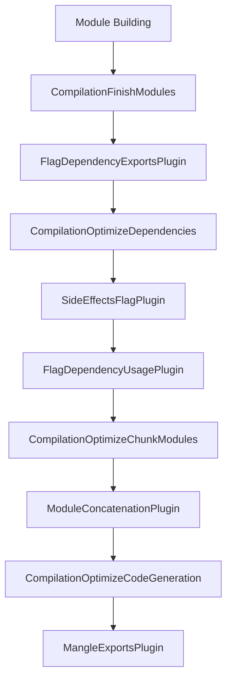
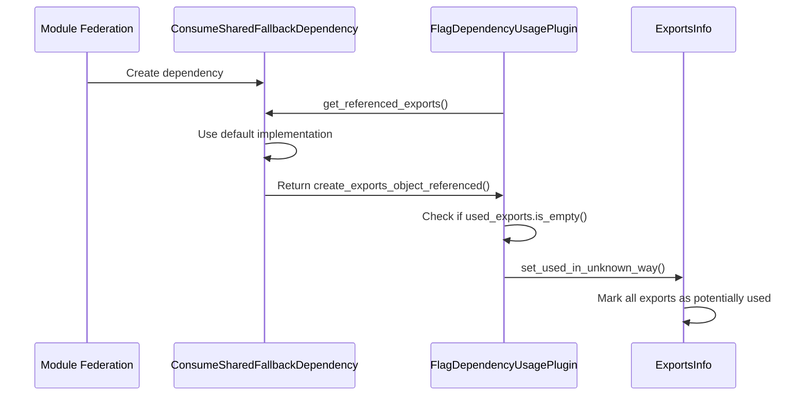

# Rspack Tree-Shaking Implementation: A Complete Technical Analysis

## 1. Overview of Rspack's Tree-Shaking Architecture

Rspack implements a sophisticated tree-shaking system that eliminates dead code through a multi-phase optimization process. The tree-shaking architecture is built around several key plugins that work together during the compilation pipeline to:

- Analyze module exports and their usage patterns
- Detect side effects in modules and statements
- Mark unused exports for elimination
- Optimize export names through mangling
- Concatenate modules when safe to do so

The tree-shaking process is deeply integrated into Rspack's compilation hooks, ensuring that dead code elimination happens at the optimal points in the build process.

## 2. Key Tree-Shaking Plugins and Their Roles

### 2.1 SideEffectsFlagPlugin

**Location**: <mcfile name="side_effects_flag_plugin.rs" path="/Users/bytedance/RustroverProjects/rspack/crates/rspack_plugin_javascript/src/plugin/side_effects_flag_plugin.rs"></mcfile>

**Purpose**: Analyzes modules to determine if they have side effects, which is crucial for safe tree-shaking.

**Key Features**:
- Reads `sideEffects` field from `package.json` files
- Performs AST analysis to detect side effects in code
- Uses glob patterns to match files with side effects
- Implements the <mcsymbol name="SideEffectsFlagPluginVisitor" filename="side_effects_flag_plugin.rs" path="/Users/bytedance/RustroverProjects/rspack/crates/rspack_plugin_javascript/src/plugin/side_effects_flag_plugin.rs" startline="200" type="class"></mcsymbol> for statement analysis

**Hook**: `CompilationOptimizeDependencies`

### 2.2 FlagDependencyExportsPlugin

**Location**: <mcfile name="flag_dependency_exports_plugin.rs" path="/Users/bytedance/RustroverProjects/rspack/crates/rspack_plugin_javascript/src/plugin/flag_dependency_exports_plugin.rs"></mcfile>

**Purpose**: Analyzes and flags which exports are provided by each module.

**Key Features**:
- Determines what exports each module provides
- Handles different export types (named, default, namespace)
- Works with both ESM and CommonJS modules
- Sets up export information for later usage analysis

**Hook**: `CompilationFinishModules`

### 2.3 FlagDependencyUsagePlugin

**Location**: <mcfile name="flag_dependency_usage_plugin.rs" path="/Users/bytedance/RustroverProjects/rspack/crates/rspack_plugin_javascript/src/plugin/flag_dependency_usage_plugin.rs"></mcfile>

**Purpose**: The core tree-shaking plugin that analyzes export usage and marks unused exports.

**Key Features**:
- Implements <mcsymbol name="FlagDependencyUsagePluginProxy" filename="flag_dependency_usage_plugin.rs" path="/Users/bytedance/RustroverProjects/rspack/crates/rspack_plugin_javascript/src/plugin/flag_dependency_usage_plugin.rs" startline="50" type="class"></mcsymbol> for usage analysis
- Processes referenced exports from dependencies
- Handles both specific export usage and "exports object referenced" scenarios
- Calls <mcsymbol name="set_used_in_unknown_way" filename="exports_info.rs" path="/Users/bytedance/RustroverProjects/rspack/crates/rspack_core/src/exports_info.rs" startline="400" type="function"></mcsymbol> when exports usage cannot be determined
- Manages side effects through <mcsymbol name="set_used_for_side_effects_only" filename="exports_info.rs" path="/Users/bytedance/RustroverProjects/rspack/crates/rspack_core/src/exports_info.rs" startline="450" type="function"></mcsymbol>

**Hook**: `CompilationOptimizeDependencies`

### 2.4 MangleExportsPlugin

**Location**: <mcfile name="mangle_exports_plugin.rs" path="/Users/bytedance/RustroverProjects/rspack/crates/rspack_plugin_javascript/src/plugin/mangle_exports_plugin.rs"></mcfile>

**Purpose**: Optimizes export names by shortening them to reduce bundle size.

**Key Features**:
- Renames exports to shorter identifiers (a, b, c, etc.)
- Supports both deterministic and non-deterministic mangling
- Respects export usage patterns to avoid breaking references
- Uses <mcsymbol name="number_to_identifier" filename="mangle_exports.rs" path="/Users/bytedance/RustroverProjects/rspack/crates/rspack_plugin_javascript/src/utils/mangle_exports.rs" startline="50" type="function"></mcsymbol> for identifier generation

**Hook**: `CompilationOptimizeCodeGeneration`

### 2.5 ModuleConcatenationPlugin

**Location**: <mcfile name="module_concatenation_plugin.rs" path="/Users/bytedance/RustroverProjects/rspack/crates/rspack_plugin_javascript/src/plugin/module_concatenation_plugin.rs"></mcfile>

**Purpose**: Concatenates modules into a single scope when safe, enabling more aggressive optimizations.

**Key Features**:
- Analyzes module dependencies for concatenation safety
- Handles scope conflicts and variable renaming
- Creates concatenated modules that reduce runtime overhead
- Works in conjunction with tree-shaking to eliminate more dead code

**Hook**: `CompilationOptimizeChunkModules`

## 3. The Compilation Pipeline and Hook Execution Order

The tree-shaking process follows a specific order in the compilation pipeline:



**Hook Definitions** (from <mcfile name="compilation.rs" path="/Users/bytedance/RustroverProjects/rspack/crates/rspack_core/src/compiler/compilation.rs"></mcfile>):

1. **CompilationFinishModules**: Triggered after all modules are built
2. **CompilationOptimizeDependencies**: First optimization phase for dependency analysis
3. **CompilationOptimizeChunkModules**: Optimizes modules within chunks
4. **CompilationOptimizeCodeGeneration**: Final code generation optimizations

## 4. How Side Effects Are Detected and Handled

### 4.1 Package.json Side Effects

The <mcsymbol name="SideEffectsFlagPlugin" filename="side_effects_flag_plugin.rs" path="/Users/bytedance/RustroverProjects/rspack/crates/rspack_plugin_javascript/src/plugin/side_effects_flag_plugin.rs" startline="100" type="class"></mcsymbol> reads the `sideEffects` field from package.json:

```rust
// From side_effects_flag_plugin.rs
enum SideEffects {
  Bool(bool),
  String(String),
  Array(Vec<String>),
}
```

### 4.2 AST-Level Side Effect Detection

The plugin analyzes JavaScript AST nodes to detect side effects:

- **Function calls**: Checked for purity using `__PURE__` comments
- **Variable declarations**: Analyzed for side effects in initializers
- **Statements**: If, While, For, Switch statements are recursively analyzed
- **Expressions**: Method calls and property access are evaluated for side effects

### 4.3 Side Effect Handling in Tree-Shaking

When a module has side effects:
1. The module cannot be completely eliminated
2. <mcsymbol name="set_used_for_side_effects_only" filename="exports_info.rs" path="/Users/bytedance/RustroverProjects/rspack/crates/rspack_core/src/exports_info.rs" startline="450" type="function"></mcsymbol> is called
3. The module is included in the bundle but its unused exports may still be eliminated

## 5. Export Usage Analysis and Marking

### 5.1 Referenced Export Processing

The <mcsymbol name="FlagDependencyUsagePlugin" filename="flag_dependency_usage_plugin.rs" path="/Users/bytedance/RustroverProjects/rspack/crates/rspack_plugin_javascript/src/plugin/flag_dependency_usage_plugin.rs" startline="200" type="class"></mcsymbol> processes exports through:

```rust
// From flag_dependency_usage_plugin.rs
fn process_referenced_exports(
  &mut self,
  module_id: ModuleIdentifier,
  referenced_exports: Vec<ExtendedReferencedExport>,
  runtime: Option<RuntimeSpec>,
) -> Vec<ProcessModuleTask>
```

### 5.2 Export Usage States

Exports can be in different usage states (from <mcfile name="exports_info.rs" path="/Users/bytedance/RustroverProjects/rspack/crates/rspack_core/src/exports_info.rs"></mcfile>):

- **Unused**: Export is not referenced anywhere
- **OnlyPropertiesUsed**: Only specific properties of the export are used
- **NoInfo**: Usage information is not available
- **Unknown**: Usage cannot be determined (triggers conservative behavior)
- **Used**: Export is definitely used

### 5.3 Conservative Fallback Behavior

When export usage cannot be determined precisely, Rspack falls back to conservative behavior:

```rust
// From flag_dependency_usage_plugin.rs
if used_exports.is_empty() {
  mgm_exports_info.set_used_in_unknown_way(runtime.as_ref());
}
```

This ensures that potentially used exports are not eliminated, preventing runtime errors.

## 6. Dead Code Elimination Process

### 6.1 Module-Level Elimination

Modules are eliminated when:
1. They have no side effects (`side_effect_free: true`)
2. None of their exports are used
3. They are not entry points

### 6.2 Export-Level Elimination

Individual exports within modules are eliminated when:
1. They are marked as `UsageState::Unused`
2. The module allows partial elimination
3. No dynamic references exist

### 6.3 Statement-Level Elimination

Within modules, individual statements can be eliminated if:
1. They only define unused exports
2. They have no side effects
3. They are not reachable from used code paths

## 7. Module Federation's Impact on Tree-Shaking

### 7.1 Conservative Behavior for Shared Modules

Module federation significantly impacts tree-shaking through its dependency system. The key issue is in how module federation dependencies handle export references.

**Root Cause**: Module federation dependencies like <mcsymbol name="ConsumeSharedFallbackDependency" filename="consume_shared_fallback_dependency.rs" path="/Users/bytedance/RustroverProjects/rspack/crates/rspack_plugin_module_federation/src/dependency/consume_shared_fallback_dependency.rs" startline="20" type="class"></mcsymbol> do not override the `get_referenced_exports` method.

**Default Behavior**: The default implementation in the <mcsymbol name="Dependency" filename="dependency_trait.rs" path="/Users/bytedance/RustroverProjects/rspack/crates/rspack_core/src/dependency/dependency_trait.rs" startline="100" type="class"></mcsymbol> trait calls:

```rust
// From dependency_trait.rs
fn get_referenced_exports(&self, ...) -> Vec<ExtendedReferencedExport> {
  create_exports_object_referenced()
}
```

**Impact on Tree-Shaking**: The <mcsymbol name="create_exports_object_referenced" filename="referenced_export.rs" path="/Users/bytedance/RustroverProjects/rspack/crates/rspack_core/src/dependency/referenced_export.rs" startline="50" type="function"></mcsymbol> function returns:

```rust
// From referenced_export.rs
pub fn create_exports_object_referenced() -> Vec<ExtendedReferencedExport> {
  vec![ExtendedReferencedExport::Array(vec![])]
}
```

This empty array triggers the conservative fallback in <mcsymbol name="FlagDependencyUsagePlugin" filename="flag_dependency_usage_plugin.rs" path="/Users/bytedance/RustroverProjects/rspack/crates/rspack_plugin_javascript/src/plugin/flag_dependency_usage_plugin.rs" startline="300" type="class"></mcsymbol>:

```rust
// From flag_dependency_usage_plugin.rs
if used_exports.is_empty() {
  mgm_exports_info.set_used_in_unknown_way(runtime.as_ref());
}
```

### 7.2 Why This Behavior is Necessary

1. **Runtime Uncertainty**: Shared modules may be consumed by multiple applications with different usage patterns
2. **Dynamic Loading**: Module federation supports dynamic loading where usage cannot be statically determined
3. **Cross-Application Safety**: Conservative behavior prevents breaking other applications that share the same modules

### 7.3 Technical Flow



## 8. Code Examples and Technical Flow

### 8.1 Basic Tree-Shaking Example

**Input Code**:
```javascript
// math.js
export function add(a, b) { return a + b; }
export function subtract(a, b) { return a - b; }
export function multiply(a, b) { return a * b; }

// main.js
import { add } from './math.js';
console.log(add(1, 2));
```

**Tree-Shaking Process**:
1. **FlagDependencyExportsPlugin**: Identifies `add`, `subtract`, `multiply` as available exports
2. **FlagDependencyUsagePlugin**: Marks only `add` as used
3. **Code Generation**: Eliminates `subtract` and `multiply` functions

### 8.2 Side Effects Example

**Input Code**:
```javascript
// utils.js
console.log('Module loaded'); // Side effect
export function helper() { return 'help'; }

// main.js
// No imports from utils.js
```

**Tree-Shaking Process**:
1. **SideEffectsFlagPlugin**: Detects `console.log` as a side effect
2. **FlagDependencyUsagePlugin**: Calls `set_used_for_side_effects_only`
3. **Result**: Module is included but `helper` function may be eliminated

## 9. Comparison with Webpack's Implementation

### 9.1 Architectural Similarities

- Both use a multi-phase optimization approach
- Similar plugin architecture with compilation hooks
- Comparable side effects detection mechanisms
- Both support package.json `sideEffects` field

### 9.2 Key Differences

**Performance**:
- Rspack implements tree-shaking in Rust for better performance
- Parallel processing capabilities in Rspack's implementation
- More efficient AST analysis due to SWC integration

**Module Federation**:
- Rspack's module federation has more conservative tree-shaking behavior
- Different dependency handling mechanisms
- Enhanced safety for cross-application module sharing

**Plugin System**:
- Rspack uses Rust-based plugins for core tree-shaking logic
- More type-safe plugin interfaces
- Better integration with the compilation pipeline

## 10. Performance Considerations and Optimizations

### 10.1 Compilation Performance

**Parallel Processing**: Tree-shaking analysis can be parallelized across modules:
```rust
// From mangle_exports_plugin.rs
let batch = items
  .par_iter()
  .filter_map(|(exports_info, is_namespace)| {
    // Parallel processing of export analysis
  })
  .collect::<Vec<_>>();
```

**Incremental Analysis**: Rspack supports incremental compilation with tree-shaking:
- Cached export information across builds
- Selective re-analysis of changed modules
- Preserved optimization state

### 10.2 Bundle Size Optimizations

**Export Mangling**: The <mcsymbol name="MangleExportsPlugin" filename="mangle_exports_plugin.rs" path="/Users/bytedance/RustroverProjects/rspack/crates/rspack_plugin_javascript/src/plugin/mangle_exports_plugin.rs" startline="50" type="class"></mcsymbol> reduces bundle size by:
- Shortening export names
- Deterministic mangling for consistent builds
- Preserving semantic correctness

**Module Concatenation**: When safe, modules are concatenated to:
- Reduce function call overhead
- Enable more aggressive dead code elimination
- Improve runtime performance

### 10.3 Memory Optimizations

**Efficient Data Structures**: 
- Use of `IdentifierMap` and `IdentifierSet` for fast lookups
- Lazy evaluation of export information
- Memory-efficient representation of usage states

**Garbage Collection**: 
- Automatic cleanup of unused analysis data
- Efficient memory usage during large builds
- Optimized data structure lifecycle management

## Conclusion

Rspack's tree-shaking implementation represents a sophisticated approach to dead code elimination that balances aggressive optimization with safety and correctness. The multi-plugin architecture allows for fine-grained control over different aspects of the optimization process, while the conservative handling of uncertain scenarios (like module federation) ensures runtime safety.

The implementation leverages Rust's performance characteristics and type safety to provide a robust foundation for tree-shaking that can handle complex modern JavaScript applications while maintaining compatibility with existing webpack-based workflows.

---

**Key Files Analyzed**:
- <mcfile name="side_effects_flag_plugin.rs" path="/Users/bytedance/RustroverProjects/rspack/crates/rspack_plugin_javascript/src/plugin/side_effects_flag_plugin.rs"></mcfile>
- <mcfile name="flag_dependency_exports_plugin.rs" path="/Users/bytedance/RustroverProjects/rspack/crates/rspack_plugin_javascript/src/plugin/flag_dependency_exports_plugin.rs"></mcfile>
- <mcfile name="flag_dependency_usage_plugin.rs" path="/Users/bytedance/RustroverProjects/rspack/crates/rspack_plugin_javascript/src/plugin/flag_dependency_usage_plugin.rs"></mcfile>
- <mcfile name="mangle_exports_plugin.rs" path="/Users/bytedance/RustroverProjects/rspack/crates/rspack_plugin_javascript/src/plugin/mangle_exports_plugin.rs"></mcfile>
- <mcfile name="module_concatenation_plugin.rs" path="/Users/bytedance/RustroverProjects/rspack/crates/rspack_plugin_javascript/src/plugin/module_concatenation_plugin.rs"></mcfile>
- <mcfile name="exports_info.rs" path="/Users/bytedance/RustroverProjects/rspack/crates/rspack_core/src/exports_info.rs"></mcfile>
- <mcfile name="dependency_trait.rs" path="/Users/bytedance/RustroverProjects/rspack/crates/rspack_core/src/dependency/dependency_trait.rs"></mcfile>
- <mcfile name="compilation.rs" path="/Users/bytedance/RustroverProjects/rspack/crates/rspack_core/src/compiler/compilation.rs"></mcfile>