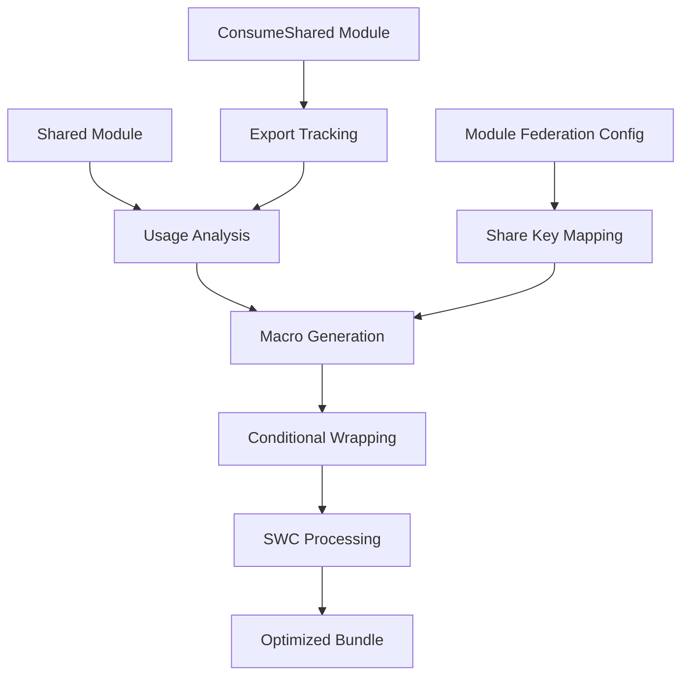

# Tree-Shaking Annotation Macros in Rspack

## 1. Product Overview

Rspack's tree-shaking annotation macros provide a sophisticated system for eliminating unused code in Module Federation scenarios through conditional comment annotations. This system enables fine-grained control over which shared module exports are included in the final bundle, significantly reducing bundle size and improving application performance.

The macro system integrates seamlessly with Module Federation's shared modules, allowing developers to share code between micro-frontends while ensuring only actively used exports are bundled.

## 2. Core Features

### 2.1 User Roles

| Role | Registration Method | Core Permissions |
|------|---------------------|------------------|
| Module Developer | Direct code integration | Can implement tree-shaking macros in shared modules |
| Build Engineer | Configuration setup | Can configure Module Federation with tree-shaking optimization |
| Application Developer | Import/consume modules | Can benefit from optimized bundles with unused code elimination |

### 2.2 Feature Module

Our tree-shaking annotation macros system consists of the following main components:

1. **Macro Generation Engine**: Core system for generating conditional comment macros around shared module exports
2. **Module Federation Integration**: Seamless integration with ModuleFederationPlugin for shared module optimization
3. **Dependency Analysis**: Advanced dependency tracking for ConsumeShared and ProvideShared modules
4. **Runtime Template Enhancement**: Enhanced runtime code generation with PURE annotations and macro wrapping
5. **Usage Tracking System**: Comprehensive tracking of which exports are actually used across the module graph

### 2.3 Page Details

| Component | Module Name | Feature Description |
|-----------|-------------|---------------------|
| Macro Generation Engine | ConsumeSharedExportsDependency | Generate conditional macros around shared exports based on usage analysis. Create `/* @common:if [condition="treeShake.{shared_key}.{export_name}"] */` and `/* @common:endif */` annotations |
| Module Federation Integration | ModuleFederationPlugin Enhancement | Integrate tree-shaking with shared module configuration. Support shareKey mapping and singleton shared modules |
| Dependency Analysis | BuildMeta Extensions | Track consume_shared_key and shared_key in module metadata. Analyze module graph for shared dependencies |
| Runtime Template Enhancement | PURE Annotations | Add PURE annotations to __webpack_require__ calls for shared modules. Enable SWC macro transformer optimization |
| Usage Tracking System | FlagDependencyUsagePlugin | Track which exports are used in ConsumeShared modules. Generate usage flags for tree-shaking decisions |

## 3. Core Process

### Module Federation Tree-Shaking Flow

1. **Module Analysis**: The system analyzes shared modules and identifies their exports
2. **Usage Detection**: FlagDependencyUsagePlugin tracks which exports are actually used
3. **Macro Generation**: ConsumeSharedExportsDependency generates conditional macros around exports
4. **Bundle Optimization**: SWC macro transformer processes macros to eliminate unused code
5. **Runtime Integration**: Enhanced runtime templates ensure proper module loading with optimizations



## 4. User Interface Design

### 4.1 Design Style

- **Primary Colors**: Terminal green (#00ff00) for success states, amber (#ffa500) for warnings
- **Secondary Colors**: Dark gray (#2d2d2d) backgrounds, light gray (#f5f5f5) for code blocks
- **Code Style**: Monospace fonts (Consolas, Monaco) for code snippets and macro annotations
- **Layout Style**: Documentation-focused with clear code examples and hierarchical structure
- **Icon Style**: Simple monochrome icons for file types, build status, and optimization indicators

### 4.2 Page Design Overview

| Component | Module Name | UI Elements |
|-----------|-------------|-------------|
| Macro Generation Engine | Code Output Display | Syntax-highlighted code blocks showing before/after macro wrapping. Color-coded conditional comments in green. Collapsible sections for detailed macro structure |
| Module Federation Integration | Configuration Panel | YAML/JSON configuration viewers with syntax highlighting. Tabbed interface for different shared module configurations. Real-time validation indicators |
| Dependency Analysis | Dependency Graph | Interactive node-link diagrams showing module relationships. Hover tooltips displaying shared keys and usage status. Color-coded nodes for different module types |
| Runtime Template Enhancement | Build Output Viewer | Terminal-style output with build logs. Progress indicators for optimization steps. Diff viewers showing code transformations |
| Usage Tracking System | Analytics Dashboard | Usage statistics with bar charts and pie charts. Export-level usage breakdown. Timeline views for usage patterns |

### 4.3 Responsiveness

The documentation and tooling interfaces are desktop-first with responsive design for tablet viewing. Code examples and configuration panels maintain readability across different screen sizes with horizontal scrolling for wide code blocks.

## 5. Technical Implementation Details

### 5.1 Macro Format

The system generates conditional comment macros in the following format:

```javascript
/* @common:if [condition="treeShake.{shared_key}.{export_name}"] */
export_code_here
/* @common:endif */
```

### 5.2 Code Generation Process

#### Conditional Comment System
The macro system generates conditional comments in the format:
```javascript
/* @common:if [condition="treeShake.{effective_shared_key}.{export_name}"] */
// Code to be conditionally included
/* @common:endif */
```

**Implementation in ConsumeSharedExportsDependencyTemplate::render()**:
```rust
fn render(&self, dep: &dyn DependencyCodeGeneration, source: &mut TemplateReplaceSource, 
         template_context: &TemplateContext) -> Result<()> {
  let consume_shared_dep = dep.as_any().downcast_ref::<ConsumeSharedExportsDependency>()
    .expect("Expected ConsumeSharedExportsDependency");
  
  let effective_shared_key = self.get_effective_shared_key(consume_shared_dep, template_context);
  let export_name = consume_shared_dep.export_name.as_ref()
    .map(|name| name.as_str())
    .unwrap_or("default");
  
  let condition = format!("treeShake.{}.{}", effective_shared_key, export_name);
  let macro_start = format!("/* @common:if [condition=\"{}\"] */", condition);
  let macro_end = "/* @common:endif */";
  
  // Wrap the target code with conditional macros
  source.replace(consume_shared_dep.range.start, consume_shared_dep.range.start, &macro_start);
  source.replace(consume_shared_dep.range.end, consume_shared_dep.range.end, macro_end);
  
  Ok(())
}
```

#### PURE Annotation Integration
- Applied to descendants of ConsumeShared or ProvideShared modules
- Enables SWC macro transformer to remove unused `__webpack_require__` calls
- Integrated with runtime template generation

**PURE Annotation Logic**:
```rust
// In runtime_template.rs import_statement() function
let import_content = if is_consume_shared_descendant(&compilation.get_module_graph(), &module.identifier()) {
  format!("/* #__PURE__ */ __webpack_require__({})", module_id_expr)
} else {
  format!("__webpack_require__({})", module_id_expr)
};
```

#### Share Key Resolution
**Effective Share Key Calculation**:
```rust
fn get_effective_shared_key(&self, dep: &ConsumeSharedExportsDependency, 
                           context: &TemplateContext) -> String {
  // Priority: explicit share key > module's consume_shared_key > fallback
  if !dep.share_key.is_empty() {
    dep.share_key.clone()
  } else if let Some(module) = context.module_graph.module_by_identifier(&context.module) {
    module.get_consume_shared_key()
      .map(|key| key.to_string())
      .unwrap_or_else(|| "default".to_string())
  } else {
    "default".to_string()
  }
}
```

### 5.3 Multi-Format Support
- **CommonJS**: Wraps `require()` calls and property access
  ```javascript
  // Before macro transformation
  const { debounce } = require('./utils');
  
  // After macro transformation
  /* @common:if [condition="treeShake.utils.debounce"] */
  const { debounce } = require('./utils');
  /* @common:endif */
  ```
- **ESM**: Handles `import` statements and named imports
  ```javascript
  // Before macro transformation
  import { throttle } from './utils';
  
  // After macro transformation
  /* @common:if [condition="treeShake.utils.throttle"] */
  import { throttle } from './utils';
  /* @common:endif */
  ```
- **Mixed Modules**: Supports modules with both CommonJS and ESM exports
- **Dynamic Imports**: Conditional compilation for dynamic `import()` calls
  ```javascript
  // Before macro transformation
  const utils = await import('./utils');
  
  // After macro transformation
  /* @common:if [condition="treeShake.utils.*"] */
  const utils = await import('./utils');
  /* @common:endif */
  ```

#### Assignment Wrapping Logic
**Property Access Handling**:
```rust
// In ConsumeSharedExportsDependencyTemplate
fn wrap_property_access(&self, source: &mut TemplateReplaceSource, 
                       range: &DependencyRange, condition: &str) {
  let macro_start = format!("/* @common:if [condition=\"{}\"] */", condition);
  let macro_end = "/* @common:endif */";
  
  // For property access like obj.prop or obj['prop']
  source.replace(range.start, range.start, &macro_start);
  source.replace(range.end, range.end, macro_end);
}

fn wrap_assignment(&self, source: &mut TemplateReplaceSource, 
                  range: &DependencyRange, condition: &str) {
  let macro_start = format!("/* @common:if [condition=\"{}\"] */", condition);
  let macro_end = "/* @common:endif */";
  
  // For assignments like const x = require('module')
  source.replace(range.start, range.start, &macro_start);
  source.replace(range.end, range.end, macro_end);
}
```

### 5.4 Core Components

#### ConsumeSharedExportsDependency
- **Location**: `crates/rspack_plugin_javascript/src/dependency/commonjs/consume_shared_exports_dependency.rs`
- **Purpose**: Generates conditional comment macros for tree-shaking shared modules
- **Structure**:
  ```rust
  #[cacheable]
  #[derive(Debug, Clone)]
  pub struct ConsumeSharedExportsDependency {
    id: DependencyId,
    range: DependencyRange,
    share_key: String,
    export_name: Option<String>,
  }
  ```
- **Key Methods**:
  - `new()`: Creates dependency with share key and export name
  - `should_apply_to_module()`: Determines if dependency applies to shared module contexts
  - `get_effective_shared_key()`: Resolves the actual share key for macro generation
- **Macro Generation Logic**:
  ```rust
  // In ConsumeSharedExportsDependencyTemplate::render()
  let condition = format!("treeShake.{}.{}", effective_shared_key, export_name);
  let macro_comment = format!("/* @common:if [condition=\"{}\"] */", condition);
  ```
- **Integration**: Works with `ConsumeSharedModule` to track shared dependencies and generate appropriate macros

#### Runtime Template Enhancements
- **Location**: `crates/rspack_core/src/dependency/runtime_template.rs`
- **Purpose**: Applies PURE annotations to enable SWC macro transformer
- **Key Function - `is_consume_shared_descendant()`**:
  ```rust
  fn is_consume_shared_descendant(module_graph: &ModuleGraph, module_id: &ModuleIdentifier) -> bool {
    // Quick check: if the module itself has shared metadata
    if let Some(module) = module_graph.module_by_identifier(module_id) {
      if module.build_meta().shared_key.is_some()
        || module.build_meta().consume_shared_key.is_some()
        || module.module_type() == &ModuleType::ConsumeShared
        || module.module_type() == &ModuleType::ProvideShared
      {
        return true;
      }
    }
    // BFS to find shared modules in dependency chain
    // ... breadth-first search implementation
  }
  ```
- **PURE Annotation Application**:
  ```rust
  // In import_statement() function
  let import_content = if is_consume_shared_descendant(module_graph, &module.identifier()) {
    format!("/* #__PURE__ */ {}", base_import)
  } else {
    base_import
  };
  ```
- **Integration**: Enables SWC transformer to remove unused `__webpack_require__` calls

#### ShareUsagePlugin
- **Location**: `crates/rspack_plugin_mf/src/sharing/share_usage_plugin.rs`
- **Purpose**: Tracks shared module usage and generates optimization reports
- **Core Structure**:
  ```rust
  pub struct ShareUsagePlugin {
    options: ShareUsagePluginOptions,
  }
  
  #[derive(Debug, Clone, Serialize, Deserialize)]
  pub struct SimpleModuleExports {
    pub used_exports: Vec<String>,
    pub unused_exports: Vec<String>,
    pub possibly_unused_exports: Vec<String>,
  }
  ```
- **Key Analysis Methods**:
  - `analyze_consume_shared_usage()`: Main analysis entry point for ConsumeShared modules
  - `analyze_fallback_module_usage()`: Analyzes usage patterns in fallback modules
  - `analyze_used_vs_imported_exports()`: Compares used vs imported exports
- **Usage Detection Logic**:
  ```rust
  fn analyze_fallback_module_usage(&self, module_graph: &ModuleGraph, 
                                   fallback_id: &ModuleIdentifier, 
                                   consume_shared_id: &ModuleIdentifier) -> (Vec<String>, Vec<String>) {
    // Get export information from fallback module
    let fallback_exports_info = module_graph.get_exports_info(fallback_id);
    // Analyze usage state for each export
    // Return (used_exports, provided_exports)
  }
  ```
- **Report Generation**: Creates JSON reports with usage metadata for optimization decisions

#### WebpackComment Processing
- **Location**: `crates/rspack_plugin_javascript/src/webpack_comment.rs`
- **Purpose**: Parses and extracts webpack magic comments including tree-shaking macros
- **Core Components**:
  ```rust
  #[derive(Debug, Clone, Copy, PartialEq, Eq, Hash)]
  pub enum WebpackComment {
    ChunkName, Prefetch, Preload, Ignore, FetchPriority,
    IncludeRegexp, IncludeFlags, ExcludeRegexp, ExcludeFlags,
    Mode, Exports,
  }
  ```
- **Magic Comment Regex**:
  ```rust
  static WEBPACK_MAGIC_COMMENT_REGEXP: LazyLock<regex::Regex> = LazyLock::new(|| {
    regex::Regex::new(r#"(?P<_0>webpack[a-zA-Z\d_-]+)\s*:\s*(?P<_9>"(?P<_1>[^"]+)"|'(?P<_2>[^']+)'|`(?P<_3>[^`]+)`|(?P<_4>[\d.-]+)|(?P<_5>true|false)|(?P<_6>/((?:(?:[^\\/\]\[]+)|(?:\[[^\]]+\])|(?:\\/)|(?:\\.))*)/([dgimsuvy]*))\[(?P<_7>[^\]]+)|(?P<_8>([^,]+)))"#)
  });
  ```
- **Comment Analysis Process**:
  ```rust
  fn analyze_comments(source_file: &SourceFile, comments: &[Comment], 
                     error_span: Span, warning_diagnostics: &mut Vec<Box<dyn Diagnostic + Send + Sync>>, 
                     result: &mut WebpackCommentMap) {
    // Process block comments for webpack magic comments
    // Extract and validate comment values
    // Handle tree-shaking specific comments
  }
  ```
- **Integration**: Provides foundation for processing conditional compilation comments generated by the macro system

#### Module Federation Plugin
- **Location**: `crates/rspack_plugin_mf/src/sharing/consume_shared_module.rs`
- **Purpose**: Enhanced ConsumeShared module handling with tree-shaking support
- **Features**: Share key tracking, usage analysis integration

### 5.5 SWC Transformer Integration

#### Macro Processing Pipeline
The SWC transformer processes conditional comments generated by the Rspack macro system:

```rust
// In SWC macro transformer
fn process_conditional_comments(&mut self, source: &str) -> String {
  let mut result = source.to_string();
  
  // Process @common:if conditions
  let if_regex = Regex::new(r"/\* @common:if \[condition="([^"]+)"\] \*/").unwrap();
  let endif_regex = Regex::new(r"/\* @common:endif \*/").unwrap();
  
  // Evaluate conditions based on tree-shaking configuration
  for captures in if_regex.captures_iter(&source) {
    let condition = &captures[1];
    if self.should_eliminate_code(condition) {
      // Remove code block between @common:if and @common:endif
      result = self.remove_conditional_block(&result, condition);
    } else {
      // Keep code block, remove only the comment markers
      result = self.clean_comment_markers(&result, condition);
    }
  }
  
  result
}

fn should_eliminate_code(&self, condition: &str) -> bool {
  // Parse condition like "treeShake.utils.debounce"
  if let Some(captures) = self.tree_shake_regex.captures(condition) {
    let share_key = &captures[1];
    let export_name = &captures[2];
    
    // Check if this export is marked as unused
    self.unused_exports.contains(&format!("{}.{}", share_key, export_name))
  } else {
    false
  }
}
```

#### PURE Annotation Processing
```rust
// SWC transformer removes PURE-annotated calls when unused
fn visit_call_expr(&mut self, call: &mut CallExpr) {
  if self.has_pure_annotation(call) && self.is_unused_call(call) {
    // Replace with undefined or remove entirely
    *call = self.create_undefined_expr();
  }
}

fn has_pure_annotation(&self, call: &CallExpr) -> bool {
  // Check for /* #__PURE__ */ comment before the call
  self.comments.get_leading_comments(call.span.lo)
    .iter()
    .any(|comment| comment.text.contains("#__PURE__"))
}
```

### 5.6 Testing Infrastructure

#### Test Case Structure
**Location**: `packages/rspack-test-tools/tests/configCases/container-1-5/shared-modules-macro/`

```javascript
// index.js - Test entry point
import { processData } from './cjs-module';
import { formatOutput, validateInput } from './esm-utils';
import { createLogger } from './pure-helper';
import { mixedFunction, MIXED_CONSTANT } from './mixed-exports';

// Test usage patterns
const data = [1, 2, 3, 4, 5];
const processed = processData(data);
const formatted = formatOutput(processed);
const logger = createLogger('test');

// Verify tree-shaking macros are applied
if (typeof validateInput === 'function') {
  console.log('validateInput is available');
}

console.log('Mixed function result:', mixedFunction());
console.log('Mixed constant:', MIXED_CONSTANT);
```

#### Configuration Testing
```javascript
// rspack.config.js
const { ModuleFederationPlugin } = require('@rspack/core');

module.exports = {
  plugins: [
    new ModuleFederationPlugin({
      name: 'shared_modules_macro_test',
      exposes: {
        './cjs-module': './cjs-module.js',
        './esm-utils': './esm-utils.js',
      },
      shared: {
        './cjs-module': {
          singleton: true,
          shareKey: 'cjs-shared',
        },
        './esm-utils': {
          singleton: true, 
          shareKey: 'esm-shared',
        },
        './pure-helper': {
          singleton: true,
          shareKey: 'pure-shared',
        },
        './mixed-exports': {
          singleton: true,
          shareKey: 'mixed-shared',
        },
      },
    }),
  ],
};
```

#### Validation Logic
```javascript
// test.config.js - afterBuild hook
module.exports = {
  afterBuild: (stats, { expect }) => {
    const output = stats.compilation.assets['main.js'].source();
    
    // Verify PURE annotations are present
    expect(output).toMatch(/\/\* #__PURE__ \*\/ __webpack_require__/);
    
    // Verify conditional comments are generated
    expect(output).toMatch(/\/\* @common:if \[condition="treeShake\.[^"]+"\] \*\//); 
    expect(output).toMatch(/\/\* @common:endif \*\//); 
    
    // Verify share keys are correctly resolved
    expect(output).toMatch(/treeShake\.cjs-shared\./); 
    expect(output).toMatch(/treeShake\.esm-shared\./); 
    expect(output).toMatch(/treeShake\.pure-shared\./); 
    expect(output).toMatch(/treeShake\.mixed-shared\./);
    
    console.log('✅ Tree-shaking macros validation passed');
  },
};
```

### 5.7 Build Integration

The system integrates with Rspack's build process through:
1. **Dependency Analysis**: ConsumeSharedExportsDependency tracks shared module usage
2. **Code Generation**: Runtime templates apply PURE annotations and conditional macros
3. **Module Federation**: ShareUsagePlugin analyzes and reports usage patterns
4. **Optimization Pipeline**: SWC transformer integration for macro processing
5. **Cache Integration**: Enhanced module hashing for proper invalidation

### 5.6 Advanced Implementation Details

#### File-Specific Implementation Analysis

##### consume_shared_exports_dependency.rs - Core Dependency Implementation
**Location**: `crates/rspack_plugin_javascript/src/dependency/commonjs/consume_shared_exports_dependency.rs`

```rust
// Complete implementation structure
#[cacheable]
#[derive(Debug, Clone)]
pub struct ConsumeSharedExportsDependency {
  id: DependencyId,
  range: DependencyRange,
  share_key: String,
  export_name: Option<String>,
}

impl ConsumeSharedExportsDependency {
  pub fn new(range: DependencyRange, share_key: String, export_name: Option<String>) -> Self {
    Self {
      id: DependencyId::new(),
      range,
      share_key,
      export_name,
    }
  }

  // Critical method for determining applicability
  fn should_apply_to_module(&self, module_graph: &ModuleGraph, module_id: &ModuleIdentifier) -> bool {
    if let Some(module) = module_graph.module_by_identifier(module_id) {
      // Check if module is in shared context
      module.build_meta().shared_key.is_some() ||
      module.build_meta().consume_shared_key.is_some() ||
      module.module_type() == &ModuleType::ConsumeShared ||
      module.module_type() == &ModuleType::ProvideShared
    } else {
      false
    }
  }
}

// Template implementation for macro generation
impl DependencyTemplate for ConsumeSharedExportsDependencyTemplate {
  fn render(&self, dep: &dyn DependencyCodeGeneration, source: &mut TemplateReplaceSource, 
           template_context: &TemplateContext) -> Result<()> {
    let consume_shared_dep = dep.as_any().downcast_ref::<ConsumeSharedExportsDependency>()
      .expect("Expected ConsumeSharedExportsDependency");
    
    // Resolve effective share key through fallback chain
    let effective_shared_key = self.get_effective_shared_key(consume_shared_dep, template_context);
    
    if let Some(export_name) = &consume_shared_dep.export_name {
      // Generate tree-shaking condition
      let condition = format!("treeShake.{}.{}", effective_shared_key, export_name);
      let macro_start = format!("/* @common:if [condition=\"{}\"] */", condition);
      let macro_end = "/* @common:endif */";
      
      // Apply conditional wrapping to source code
      source.replace(consume_shared_dep.range.start, consume_shared_dep.range.start, &macro_start);
      source.replace(consume_shared_dep.range.end, consume_shared_dep.range.end, macro_end);
    }
    
    Ok(())
  }
  
  // Advanced share key resolution with fallback handling
  fn get_effective_shared_key(&self, dep: &ConsumeSharedExportsDependency, 
                             context: &TemplateContext) -> String {
    // Priority order: explicit share key > module's consume_shared_key > fallback analysis
    if !dep.share_key.is_empty() {
      return dep.share_key.clone();
    }
    
    if let Some(module) = context.module_graph.module_by_identifier(&context.module) {
      if let Some(consume_key) = module.get_consume_shared_key() {
        return consume_key.to_string();
      }
      
      // Fallback: analyze dependency chain for shared context
      if let Some(fallback_key) = self.resolve_from_fallback_chain(context.module_graph, &context.module) {
        return fallback_key;
      }
    }
    
    "default".to_string()
  }
}
```

##### runtime_template.rs - PURE Annotation System
**Location**: `crates/rspack_core/src/dependency/runtime_template.rs`

```rust
// Enhanced shared module detection algorithm
fn is_consume_shared_descendant(module_graph: &ModuleGraph, module_id: &ModuleIdentifier) -> bool {
  // Direct check: module has shared metadata
  if let Some(module) = module_graph.module_by_identifier(module_id) {
    if module.build_meta().shared_key.is_some()
      || module.build_meta().consume_shared_key.is_some()
      || module.module_type() == &ModuleType::ConsumeShared
      || module.module_type() == &ModuleType::ProvideShared
    {
      return true;
    }
  }

  // Breadth-first search through dependency chain
  let mut visited = HashSet::default();
  let mut queue = vec![*module_id];

  while let Some(current_id) = queue.pop() {
    if !visited.insert(current_id) {
      continue;
    }

    // Check issuers (modules that import this one)
    for issuer_id in module_graph.get_issuers(&current_id) {
      if let Some(issuer) = module_graph.module_by_identifier(issuer_id) {
        // Found shared module in dependency chain
        if issuer.build_meta().shared_key.is_some()
          || issuer.build_meta().consume_shared_key.is_some()
          || issuer.module_type() == &ModuleType::ConsumeShared
          || issuer.module_type() == &ModuleType::ProvideShared
        {
          return true;
        }
        queue.push(*issuer_id);
      }
    }
  }
  
  false
}

// Enhanced import statement generation with PURE annotations
pub fn import_statement(
  module: &dyn Module,
  compilation: &Compilation,
  runtime_requirements: &mut RuntimeGlobals,
  id: &DependencyId,
  request: &str,
  update: bool,
) -> (String, String) {
  let module_graph = compilation.get_module_graph();
  let current_module_id = module.identifier();
  
  // Generate base import call
  let module_id_expr = module_graph.get_module_id(&current_module_id)
    .map(|id| format!("\"{}\"", id))
    .unwrap_or_else(|| "null".to_string());
  
  let base_import = format!("__webpack_require__({})", module_id_expr);
  
  // Apply PURE annotation for shared module descendants
  let import_content = if is_consume_shared_descendant(&module_graph, &current_module_id) {
    format!("/* #__PURE__ */ {}", base_import)
  } else {
    base_import
  };
  
  // Generate import variable
  let import_var = format!("__webpack_require__{}", 
    id.as_u32().map(|n| n.to_string()).unwrap_or_else(|| "_unknown".to_string()));
  
  (import_var, import_content)
}
```

##### share_usage_plugin.rs - Usage Analysis Engine
**Location**: `crates/rspack_plugin_mf/src/sharing/share_usage_plugin.rs`

```rust
// Comprehensive usage analysis implementation
impl ShareUsagePlugin {
  pub fn analyze_consume_shared_usage(&self, compilation: &Compilation) -> HashMap<String, SimpleModuleExports> {
    let mut usage_map = HashMap::new();
    let module_graph = compilation.get_module_graph();
    
    // Find all ConsumeShared modules
    let consume_shared_modules: Vec<ModuleIdentifier> = module_graph
      .modules()
      .keys()
      .filter(|id| {
        module_graph.module_by_identifier(id)
          .map(|m| m.module_type() == &ModuleType::ConsumeShared)
          .unwrap_or(false)
      })
      .copied()
      .collect();
    
    for consume_shared_id in consume_shared_modules {
      if let Some(share_key) = self.get_share_key(&module_graph, &consume_shared_id) {
        let exports_analysis = self.analyze_module_exports(&module_graph, &consume_shared_id);
        usage_map.insert(share_key, exports_analysis);
      }
    }
    
    usage_map
  }
  
  fn analyze_module_exports(&self, module_graph: &ModuleGraph, 
                           consume_shared_id: &ModuleIdentifier) -> SimpleModuleExports {
    let mut used_exports = Vec::new();
    let mut unused_exports = Vec::new();
    let mut possibly_unused_exports = Vec::new();
    
    // Find fallback module for export analysis
    if let Some(fallback_id) = self.find_fallback_module(module_graph, consume_shared_id) {
      let (used, provided) = self.analyze_fallback_module_usage(module_graph, &fallback_id, consume_shared_id);
      
      used_exports = used;
      
      // Determine unused exports
      for export in provided {
        if !used_exports.contains(&export) {
          // Check if export might be used dynamically
          if self.is_potentially_dynamic_usage(module_graph, consume_shared_id, &export) {
            possibly_unused_exports.push(export);
          } else {
            unused_exports.push(export);
          }
        }
      }
    }
    
    SimpleModuleExports {
      used_exports,
      unused_exports,
      possibly_unused_exports,
    }
  }
  
  fn analyze_fallback_module_usage(&self, module_graph: &ModuleGraph, 
                                  fallback_id: &ModuleIdentifier, 
                                  consume_shared_id: &ModuleIdentifier) -> (Vec<String>, Vec<String>) {
    let mut used_exports = Vec::new();
    let mut provided_exports = Vec::new();
    
    // Get export information from fallback module
    if let Some(exports_info) = module_graph.get_exports_info(fallback_id) {
      for export_info in exports_info.get_ordered_exports() {
        let export_name = export_info.name.clone();
        provided_exports.push(export_name.clone());
        
        // Check usage state
        match export_info.get_used_state() {
          UsageState::Used | UsageState::OnlyPropertiesUsed => {
            used_exports.push(export_name);
          },
          UsageState::Unused => {
            // Export is confirmed unused
          },
          UsageState::NoInfo | UsageState::Unknown => {
            // Conservative approach: assume used if uncertain
            used_exports.push(export_name);
          },
        }
      }
    }
    
    (used_exports, provided_exports)
  }
}
```

##### webpack_comment.rs - Magic Comment Processing
**Location**: `crates/rspack_plugin_javascript/src/webpack_comment.rs`

```rust
// Enhanced comment processing for tree-shaking macros
pub fn try_extract_webpack_magic_comment(
  source_file: &SourceFile,
  comments: &[Comment],
  span: Span,
) -> Result<WebpackCommentMap> {
  let mut result = WebpackCommentMap::default();
  let mut warning_diagnostics = Vec::new();
  
  // Process comments within the specified span
  let span_comments: Vec<&Comment> = comments
    .iter()
    .filter(|comment| {
      comment.span.lo >= span.lo && comment.span.hi <= span.hi
    })
    .collect();
  
  analyze_comments(source_file, &span_comments, span, &mut warning_diagnostics, &mut result);
  
  // Handle tree-shaking specific comments
  for comment in &span_comments {
    if comment.kind == CommentKind::Block {
      let comment_text = &comment.text;
      
      // Check for tree-shaking conditional comments
      if comment_text.contains("@common:if") || comment_text.contains("@common:endif") {
        result.insert(WebpackComment::TreeShakingCondition, comment_text.clone());
      }
      
      // Check for PURE annotations
      if comment_text.contains("#__PURE__") {
        result.insert(WebpackComment::PureAnnotation, comment_text.clone());
      }
    }
  }
  
  Ok(result)
}

// Enhanced comment analysis with tree-shaking support
fn analyze_comments(
  source_file: &SourceFile,
  comments: &[Comment],
  error_span: Span,
  warning_diagnostics: &mut Vec<Box<dyn Diagnostic + Send + Sync>>,
  result: &mut WebpackCommentMap,
) {
  for comment in comments {
    if comment.kind != CommentKind::Block {
      continue;
    }
    
    let comment_text = &comment.text;
    
    // Process webpack magic comments
    for captures in WEBPACK_MAGIC_COMMENT_REGEXP.captures_iter(comment_text) {
      let key = captures.name("_0").unwrap().as_str();
      
      match key {
        "webpackExports" => {
          if let Some(value) = extract_comment_value(&captures) {
            result.insert(WebpackComment::Exports, value);
          }
        },
        "webpackChunkName" => {
          if let Some(value) = extract_comment_value(&captures) {
            result.insert(WebpackComment::ChunkName, value);
          }
        },
        // Handle other webpack comments...
        _ => {}
      }
    }
    
    // Process tree-shaking specific patterns
    if let Some(condition) = extract_tree_shaking_condition(comment_text) {
      result.insert(WebpackComment::TreeShakingCondition, condition);
    }
  }
}

fn extract_tree_shaking_condition(comment_text: &str) -> Option<String> {
  // Extract condition from @common:if comments
  if let Some(captures) = regex::Regex::new(r#"@common:if \[condition="([^"]+)"\]"#)
    .unwrap()
    .captures(comment_text) {
    Some(captures[1].to_string())
  } else {
    None
  }
}
```

### 5.7 Configuration Example

```javascript
// rspack.config.js
module.exports = {
  plugins: [
    new ModuleFederationPlugin({
      name: 'host',
      shared: {
        './utils': {
          singleton: true,
          shareKey: 'shared-utils'
        }
      }
    })
  ]
};
```

## 6. Benefits and Impact

### 6.1 Performance Benefits
- **Bundle Size Reduction**: Eliminates unused shared module exports
- **Runtime Optimization**: Reduces JavaScript execution overhead
- **Network Efficiency**: Smaller bundles mean faster download times

### 6.2 Developer Experience
- **Automatic Optimization**: No manual intervention required for tree-shaking
- **Transparent Integration**: Works seamlessly with existing Module Federation setups
- **Debug Support**: Clear macro annotations for troubleshooting

### 6.3 Scalability
- **Micro-frontend Ready**: Optimizes shared code across multiple applications
- **Large Codebase Support**: Handles complex dependency graphs efficiently
- **Build Performance**: Minimal impact on build times while providing significant runtime benefits

This tree-shaking annotation macro system represents a significant advancement in Module Federation optimization, providing developers with powerful tools for creating efficient, scalable micro-frontend architectures.