# CommonJS Macro Wrapping Issue Analysis

**Navigation**: [🏠 Docs Home](#file-a-md) | [📋 All Files](#file-a-md)

**Related Documents**:

- [📊 CommonJS Architecture](commonjs-parser-dependency-flow.md) - Complete CommonJS system details
- [⚡ ESM Architecture](esm-parser-dependency-flow.md) - Complete ESM system details
- [🔧 Universal Solution](commonjs-macro-solution-design.md) - Comprehensive fix for both systems

## Table of Contents

- [Problem Summary](#problem-summary)
- [Root Cause Analysis](#root-cause-analysis)
- [Specific Symptoms](#specific-symptoms)
- [Current System Limitations](#current-system-limitations)

---

## Problem Summary

> **🔍 Architecture Context**: See [JavascriptModulesPlugin Architecture](commonjs-parser-dependency-flow.md#javascriptmodulesplugin-architecture) for complete system overview

The CommonJS parser's bulk export handling has critical issues with ConsumeShared macro generation, causing **malformed runtime code** in Module Federation scenarios.

### The Core Issue

```javascript
// Source: module.exports = {calculateSum, getConfig, helper}

// ❌ Current Output (Broken)
module.exports = {
  /* @common:if [condition="treeShake.shared-utils.calculateSum"] */ module.exports.calculateSum,
  /* @common:if [condition="treeShake.shared-utils.getConfig"] */ module.exports.getConfig,
  /* @common:if [condition="treeShake.shared-utils.helper"] */ module.exports.helper
} /* @common:endif */ /* @common:endif */ /* @common:endif */;

// ✅ Expected Output
module.exports = {
  /* @common:if [condition="treeShake.shared-utils.calculateSum"] */ calculateSum,
  /* @common:if [condition="treeShake.shared-utils.getConfig"] */ getConfig,
  /* @common:if [condition="treeShake.shared-utils.helper"] */ helper
} /* @common:endif */;
```

## Root Cause Analysis

> **📊 Complete Flow**: See [Complete Parser Flow](commonjs-parser-dependency-flow.md#complete-parser-dependency-flow-visualization) for full processing details

### Shared Value Range Problem (CommonJS)


> **🔧 Solution**: See [CommonJS Range Coordination](commonjs-macro-solution-design.md#commonjs-problem-1-stacked-endif-tags) for the fix

### Export Value Generation Problem (CommonJS)

```mermaid
flowchart TD
    subgraph context ["Template Context - Wrong Assumptions"]
        A["Template Renders: calculateSum"]
        A --> B["Check: Individual Export?"]
        B --> C["Generate: module.exports.calculateSum"]
        C --> D["❌ Wrong in Object Literal Context"]

        E["Should Generate: calculateSum"]
        E --> F["✅ Correct Value Reference"]
    end

    subgraph comparison ["Individual vs Bulk Context"]
        G["Individual: module.exports.calculateSum = value"]
        G --> H["✅ Correct: module.exports.calculateSum"]

        I["Bulk: module.exports = {calculateSum: value}"]
        I --> J["❌ Wrong: module.exports.calculateSum"]
        I --> K["✅ Correct: calculateSum"]
    end

    style B fill:#ffebee
    style C fill:#ffebee
    style D fill:#ffebee
    style J fill:#ffebee
    style F fill:#e8f5e8
    style H fill:#e8f5e8
    style K fill:#e8f5e8
```



> **🔧 Solution**: See [Export Value Correction](commonjs-macro-solution-design.md#commonjs-problem-2-incorrect-export-values) for the fix

## Specific Symptoms

### 1. Stacked Endif Tags

> **📊 Architecture**: See [Dependency Types](commonjs-parser-dependency-flow.md#export-dependency-types-and-responsibilities) for why this happens

**Root Cause**: All bulk export dependencies share the same `value_range` and each adds `/* @common:endif */`

```javascript
// Each dependency adds endif at the same location
} /* @common:endif */ /* @common:endif */ /* @common:endif */
```

### 2. Incorrect Export References

> **📊 Template Logic**: See [Assignment Processing](commonjs-parser-dependency-flow.md#assignment-processing-logic---comprehensive-flow) for complete flow

**Root Cause**: Template assumes individual export context even in bulk export object literals

```javascript
// Template generates module.exports.calculateSum inside object literal
{
	/* @common:if [...] */ module.exports.calculateSum, // ❌ Wrong reference
		/* @common:if [...] */ module.exports.getConfig; // ❌ Wrong reference
}
```

### 3. ESM Fragment Coordination Challenge

> **⚡ ESM Details**: See [ESM Fragment Coordination](esm-parser-dependency-flow.md#fragment-coordination-problems) for complete analysis

**Root Cause**: Multiple ESM init fragments with ConsumeShared macros lack coordination

```javascript
// Multiple fragments with redundant ConsumeShared detection
// Performance impact: O(n) module graph traversals per export group
```

## Current System Limitations

> **📊 Universal Issues**: See [Universal Problems](commonjs-macro-solution-design.md#universal-issues-both-systems) for cross-system analysis

- **Bulk Export Handling**: Poor support for `module.exports = { ... }` patterns
- **Range Coordination**: No mechanism to coordinate shared source ranges
- **Template Assumptions**: Templates assume unique ranges per dependency
- **Export Value Generation**: Incorrect value references in object literal contexts
- **Macro State Management**: No coordination between multiple macros affecting same range
- **Error Recovery**: Limited fallback mechanisms for malformed dependency patterns

### Fragment-Based Solution Architecture

> **🔧 Complete Solution**: See [Universal Solution Architecture](commonjs-macro-solution-design.md#proposed-universal-solution-architecture) for comprehensive approach

```mermaid
flowchart TD
    subgraph current [❌ Current Flow - Problematic]
        A[Create 3 Dependencies] --> B[3 Separate Templates]
        B --> C[3 ConsumeShared Detections]
        C --> D[3 Endif Placements]
        D --> E[Conflicting Modifications]
    end

    subgraph solution [✅ Enhanced Flow - Coordinated]
        F[Create 3 Dependencies + Context] --> G[Context-Aware Templates]
        G --> H[Single ConsumeShared Detection]
        H --> I[Coordinated Endif Placement]
        I --> J[Clean Macro Output]
    end

    style A fill:#ffebee
    style C fill:#ffebee
    style E fill:#ffebee
    style F fill:#e8f5e8
    style H fill:#e8f5e8
    style J fill:#e8f5e8
```



**Key Insight**: The solution requires **context awareness** across both CommonJS and ESM systems, allowing templates to coordinate their macro generation instead of operating in isolation.
