# CommonJS Parser Dependency Flow Analysis

**Navigation**: [🏠 Docs Home](#file-a-md) | [📋 All Files](#file-a-md)

**Related Documents**:

- [📊 Problem Analysis](commonjs-macro-wrapping-issue.md) - Specific bug details and symptoms
- [🔧 Solution Design](commonjs-macro-solution-design.md) - BuildMeta-based fix architecture
- [⚡ ESM Comparison](esm-parser-dependency-flow.md) - ESM processing counterpart

## Table of Contents

- [Parser Integration Overview](#parser-integration-overview)
- [Export Dependency Types](#export-dependency-types-and-responsibilities)
- [Assignment Processing Logic](#assignment-processing-logic---comprehensive-flow)
- [Complete Parser Flow](#complete-parser-dependency-flow-visualization)
- [Enhanced Architecture](#enhanced-architecture-buildmeta-integration)
- [Key Architectural Insights](#key-architectural-insights)
- [System Limitations](#current-system-limitations)

---

## Parser Integration Overview

> **📋 Architecture Context**: For complete JavascriptModulesPlugin architecture and pipeline details, see [BuildMeta Solution Design](commonjs-macro-solution-design.md#revised-solution-architecture-buildmeta-pattern)

The CommonJS parser operates within Rspack's JavaScript module processing pipeline, handling CommonJS-specific patterns after ESM detection.

### Quick Context

- **Primary Role**: Process CommonJS export patterns (`exports.foo`, `module.exports`)
- **Execution Order**: After [ESM detection](esm-parser-dependency-flow.md#esm-detection-and-module-type-resolution)
- **Key Integration**: [ConsumeShared macro generation](commonjs-macro-wrapping-issue.md#consumeshared-integration-context)
- **Enhanced Solution**: [BuildMeta-based metadata passing](commonjs-macro-solution-design.md#buildmeta-extension-structure)

### Module Type Detection

> **🔍 Detailed Flow**: See [ESM vs CommonJS Decision Flow](esm-parser-dependency-flow.md#esm-vs-commonjs-decision-flow) for complete detection logic


## Export Dependency Types and Responsibilities

> **⚡ Comparison**: For ESM dependency types, see [ESM Dependency Types](esm-parser-dependency-flow.md#esm-dependency-types-and-responsibilities) > **🔧 Enhanced Solution**: See [BuildMeta Enhancement](commonjs-macro-solution-design.md#universal-buildmeta-enhancement) for metadata approach

### Core CommonJS Dependencies

**CommonJsExportsDependency** - Main export handler

- Triggers: `exports.foo = value`, `module.exports = { ... }`
- **Problem**: [Bulk export shared range conflicts](commonjs-macro-wrapping-issue.md#shared-value-range-problem-commonjs)
- **Solution**: [BuildMeta with module coordination](commonjs-macro-solution-design.md#system-comparison-current-vs-enhanced-architecture)

**CommonJsExportRequireDependency** - Re-export handler

- Triggers: `exports.foo = require('module')`
- **Status**: ✅ Working correctly

## Assignment Processing Logic - Comprehensive Flow

> **🐛 Problem Details**: See [Root Cause Analysis](commonjs-macro-wrapping-issue.md#root-cause-analysis) for complete bug breakdown
> **🔧 Solution**: See [Parser-Phase Detection](commonjs-macro-solution-design.md#parser-phase-detection-universal) for enhanced approach

The core issue lies in how bulk assignments create multiple dependencies with shared ranges:

```mermaid
flowchart TD
    subgraph current [❌ Current Problematic Flow]
        A["module.exports = {a, b, c}"] --> B[Creates 3 Dependencies]
        B --> C[All Share Same value_range]
        C --> D[Multiple Templates Modify Same Location]
        D --> E[Stacked Endif Tags]
    end

    subgraph enhanced [✅ Enhanced BuildMeta Flow]
        F["module.exports = {a, b, c}"] --> G[Detect ConsumeShared at Parse Time]
        G --> H[Store Context in BuildMeta]
        H --> I[Dependencies Created Normally]
        I --> J[Templates Read BuildMeta Context]
        J --> K[Module-Level Coordination]
        K --> L[Single Endif Placement]
    end

    style C fill:#ffebee
    style E fill:#ffebee
    style G fill:#e3f2fd
    style H fill:#e3f2fd
    style J fill:#e3f2fd
    style K fill:#e3f2fd
    style L fill:#e8f5e8
```



> **🔧 Implementation**: See [BuildMeta Approach](commonjs-macro-solution-design.md#implementation-strategy-buildmeta-approach) for phased rollout

## Complete Parser-Dependency Flow Visualization

> **📊 System Context**: For broader compilation pipeline, see [Enhanced Architecture](commonjs-macro-solution-design.md#system-comparison-current-vs-enhanced-architecture)

```mermaid
flowchart TD
    subgraph parsing [Parser Phase - CommonJS Specific]
        A[CommonJS Module Detected] --> B[CommonJsExportsParserPlugin]
        B --> C{Assignment Pattern}
        C -->|Individual| D[✅ Single Dependency]
        C -->|Bulk Object| E[Multiple Dependencies Analysis]

        E --> F{ConsumeShared Context?}
        F -->|No| G[Standard Processing]
        F -->|Yes| H[✅ Store in BuildMeta]
    end

    subgraph buildmeta [BuildMeta Enhancement]
        H --> I[ConsumeShared Context]
        H --> J[Bulk Export Coordination]
        H --> K[Module-Level Metadata]
    end

    subgraph templates [Template Phase - Enhanced]
        D --> L[Clean Template Rendering]
        G --> M[Standard Template Rendering]
        I --> N[Pre-computed ConsumeShared Macros]
        J --> O[Module-Aware Template Logic]
        K --> P[Coordinated Bulk Export Handling]

        M --> Q[No Coordination Issues]
        N --> R[Clean Macro Output]
        O --> R
        P --> R
    end

    style E fill:#fff3e0
    style H fill:#e3f2fd
    style I fill:#e3f2fd
    style J fill:#e3f2fd
    style K fill:#e3f2fd
    style R fill:#e8f5e8
```



> **⚡ ESM Comparison**: See [ESM Parser Flow](esm-parser-dependency-flow.md#complete-esm-parser-dependency-flow-visualization) for ESM processing differences

## Enhanced Architecture: BuildMeta Integration

> **🔧 Complete Solution**: See [BuildMeta Pattern](commonjs-macro-solution-design.md#codebase-analysis-findings) for established Rspack patterns

### Current vs Enhanced Metadata Flow

```mermaid
graph TD
    subgraph current [❌ Current Flow - Template Detection]
        A[Parser: Create Basic Dependency] --> B[Template: Detect ConsumeShared]
        B --> C[Template: Module Graph Traversal]
        C --> D[Template: Extract Share Key]
        D --> E[Template: Generate Macros]
        E --> F[❌ Expensive + Repeated Operations]
    end

    subgraph enhanced [✅ Enhanced Flow - BuildMeta Metadata]
        G[Parser: Detect ConsumeShared] --> H[Parser: Store in BuildMeta]
        H --> I[Parser: Create Dependencies Normally]
        I --> J[Template: Read BuildMeta]
        J --> K[Template: Use Pre-computed Context]
        K --> L[✅ Fast + Cached Operations]
    end

    subgraph benefits [BuildMeta Benefits]
        M[✅ Perfect Pattern Match]
        N[✅ Module-Level Context]
        O[✅ Parser-Phase Detection]
        P[✅ No Dependency Changes]
    end

    style F fill:#ffebee
    style L fill:#e8f5e8
    style G fill:#e3f2fd
    style H fill:#e3f2fd
    style J fill:#e3f2fd
    style K fill:#e3f2fd
```



### BuildMeta Structure for CommonJS

> **📋 Full Implementation**: See [Universal BuildMeta Enhancement](commonjs-macro-solution-design.md#universal-buildmeta-enhancement) for complete structure

```rust
// Enhanced BuildMeta for CommonJS modules
let build_meta = &context.compilation.module_graph
  .get_module(&context.module_identifier)
  .unwrap()
  .build_meta();

match &build_meta.consume_shared_context {
  Some(context) => {
    // Use pre-computed ConsumeShared context and bulk coordination
    match &build_meta.bulk_export_coordination {
      Some(BulkExportCoordination::CommonJS { total_exports, bulk_range }) => {
        // Module-level coordination for bulk exports
        self.render_bulk_export_with_consume_shared_macro(dep, source, context, total_exports, bulk_range);
      }
      _ => {
        // Individual export with ConsumeShared context
        self.render_with_consume_shared_macro_only(dep, source, context);
      }
    }
  }
  None => {
    // Existing template logic unchanged
    self.render_standard_commonjs_export(dep, source);
  }
}
```

## CommonJS vs ESM Comparison

> **📊 Complete Comparison**: See [System Comparison](commonjs-macro-solution-design.md#system-comparison-current-vs-enhanced-architecture) for comprehensive analysis

### Key Differences with Enhanced Solution

| Aspect                      | CommonJS Current                 | ESM Current                      | Enhanced Universal Solution                                                                    |
| --------------------------- | -------------------------------- | -------------------------------- | ---------------------------------------------------------------------------------------------- |
| **Bulk Export Handling**    | ❌ Shared ranges, conflicts      | ✅ Individual ranges             | [BuildMeta coordination](commonjs-macro-solution-design.md#universal-buildmeta-enhancement)    |
| **Template Approach**       | Direct source replacement        | Init fragment system             | [Pre-computed context](commonjs-macro-solution-design.md#parser-phase-detection-universal)     |
| **ConsumeShared Detection** | ❌ Template-time, per dependency | ⚠️ Template-time, per fragment   | [Parser-phase, module-level](commonjs-macro-solution-design.md#benefits-of-buildmeta-approach) |
| **Metadata Pattern**        | No established pattern           | No established pattern           | [BuildMeta enhancement](commonjs-macro-solution-design.md#codebase-analysis-findings)          |
| **System Coordination**     | ❌ No bulk export coordination   | ⚠️ Limited fragment coordination | [Module-level coordination](commonjs-macro-solution-design.md#universal-template-enhancement)  |

## Key Architectural Insights

> **🔧 Solution Insights**: See [Architecture-Perfect Solution](commonjs-macro-solution-design.md#summary-architecture-perfect-solution) for comprehensive benefits

### Current System Design Issues

- **Late ConsumeShared Detection**: Happens during template rendering instead of parsing
- **No Bulk Export Coordination**: Multiple dependencies conflict on shared ranges
- **Template Assumption Mismatch**: Templates assume unique ranges per dependency
- **No Established Metadata Pattern**: Custom approaches instead of using BuildMeta

### Enhanced Architecture Benefits

- **Parser-Phase Detection**: ConsumeShared context computed once during parsing
- **Perfect Metadata Pattern**: Uses BuildMeta exactly as designed for module-level metadata
- **Module-Level Coordination**: CommonJS bulk exports and ESM fragments coordinated via BuildMeta
- **Zero Dependency Changes**: Dependencies remain completely unchanged

### Integration Points

- **Module Federation**: [ConsumeShared Integration](commonjs-macro-wrapping-issue.md#consumeshared-integration-context)
- **Tree-Shaking**: Conditional macro generation based on usage
- **Error Handling**: [Impact Assessment](commonjs-macro-wrapping-issue.md#impact-assessment)
- **BuildMeta Infrastructure**: [Automatic caching and serialization](commonjs-macro-solution-design.md#benefits-of-buildmeta-approach)

## Current System Limitations

> **🐛 Detailed Problems**: See [Specific Symptoms](commonjs-macro-wrapping-issue.md#specific-symptoms) for complete issue breakdown
> **🔧 Proposed Solutions**: See [BuildMeta Implementation](commonjs-macro-solution-design.md#implementation-strategy-buildmeta-approach) for phased approach

### Current Limitations

- **Bulk Export Handling**: Poor support for `module.exports = { ... }` patterns
- **Range Coordination**: No mechanism to coordinate shared source ranges
- **Template Assumptions**: Templates assume unique ranges per dependency
- **Macro State Management**: No coordination between multiple macros affecting same range
- **Metadata Pattern**: No established pattern for parser→template metadata

### Enhanced Solution Addresses

- **BuildMeta Pattern**: Uses established Rspack module-level metadata infrastructure
- **Parser-Phase Detection**: Eliminates expensive template-time operations
- **Module-Level Coordination**: Handles bulk export coordination at the module level
- **Universal Context**: Single ConsumeShared detection shared across all dependencies
- **Perfect Fit**: Module-level metadata for module-level problems
- **Incremental Implementation**: Safe, phased rollout with easy rollback
