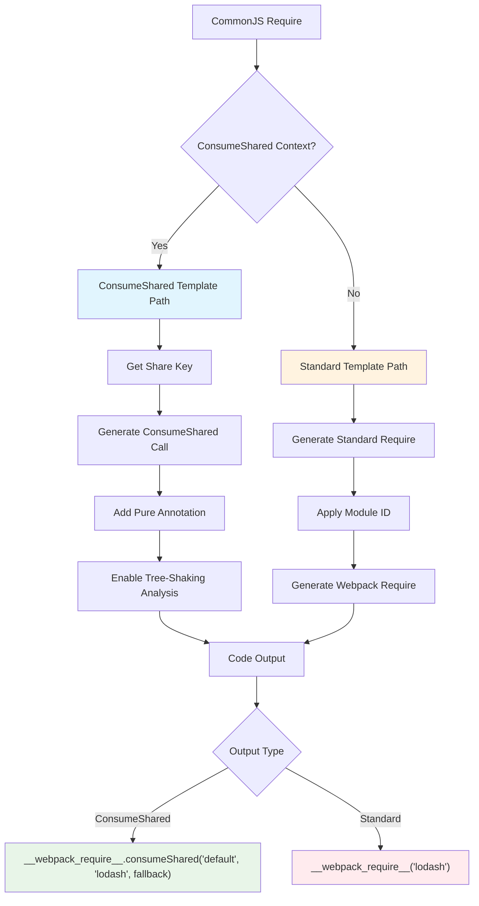
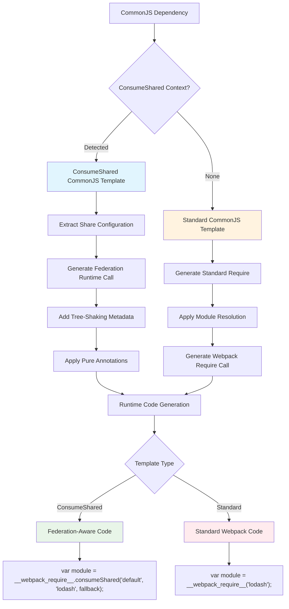

# CommonJS Visual Diagrams - Rspack Implementation

## Table of Contents

1. [CommonJS Dependency Flow](#commonjs-dependency-flow)
2. [CommonJS Template Rendering Pipeline](#commonjs-template-rendering-pipeline)
3. [CommonJS vs ESM Comparison](#commonjs-vs-esm-comparison)
4. [CommonJS Runtime Generation](#commonjs-runtime-generation)

> **Note**: For ConsumeShared integration patterns, see [CommonJS Integration with Module Federation](../module-federation/commonjs-integration.md).

---

## CommonJS Dependency Flow

### CommonJS Require Flow in Rspack

For Module Federation specific flows, see [CommonJS Integration with Module Federation](../module-federation/commonjs-integration.md).

```
┌─────────────────────────────────────────────────────────────────┐
│                    COMMONJS REQUIRE PROCESSING                  │
│                                                                 │
│ Input: const util = require('lodash');                         │
│                    │                                            │
│                    ▼                                            │
│ ┌─────────────────────────────────────────────────────────────┐ │
│ │               Dependency Detection                          │ │
│ │                                                             │ │
│ │  1. CommonJS Parser Analysis                                │ │
│ │     ┌─────────────────────────────────────────────────┐   │ │
│ │     │ Pattern: require('module_name')                 │   │ │
│ │     │ ├─ Extract: module_name = "lodash"              │   │ │
│ │     │ ├─ Context: CommonJS module context             │   │ │
│ │     │ └─ Create: CommonJSRequireDependency            │   │ │
│ │     └─────────────────────────────────────────────────┘   │ │
│ │                    │                                        │ │
│ │                    ▼                                        │ │
│ │  2. ConsumeShared Detection                                 │ │
│ │     ┌─────────────────────────────────────────────────┐   │ │
│ │     │ detect_consume_shared_context()                 │   │ │
│ │     │ ├─ Check parent module type                     │   │ │
│ │     │ ├─ Check incoming connections                   │   │ │
│ │     │ ├─ Search for ConsumeShared ancestors           │   │ │
│ │     │ └─ Result: None (Current Limitation)            │   │ │
│ │     └─────────────────────────────────────────────────┘   │ │
│ └─────────────────────────────────────────────────────────────┘ │
│                    │                                            │
│                    ▼                                            │
│ ┌─────────────────────────────────────────────────────────────┐ │
│ │              Template Generation                            │ │
│ │                                                             │ │
│ │  1. Runtime Template Selection                              │ │
│ │     ┌─────────────────────────────────────────────────┐   │ │
│ │     │ if consume_shared_key.is_some() {               │   │ │
│ │     │   // ConsumeShared template (Future)            │   │ │
│ │     │   template = ConsumeSharedTemplate              │   │ │
│ │     │ } else {                                        │   │ │
│ │     │   // Standard CommonJS template                 │   │ │
│ │     │   template = CommonJSRequireTemplate            │   │ │
│ │     │ }                                               │   │ │
│ │     └─────────────────────────────────────────────────┘   │ │
│ │                    │                                        │ │
│ │                    ▼                                        │ │
│ │  2. Code Generation                                         │ │
│ │     ┌─────────────────────────────────────────────────┐   │ │
│ │     │ Standard CommonJS:                              │   │ │
│ │     │ var util = __webpack_require__("lodash");       │   │ │
│ │     │                                                 │   │ │
│ │     │ ConsumeShared (Future):                         │   │ │
│ │     │ var util = __webpack_require__.consumeShared(   │   │ │
│ │     │   "default", "lodash", fallback                 │   │ │
│ │     │ );                                              │   │ │
│ │     └─────────────────────────────────────────────────┘   │ │
│ └─────────────────────────────────────────────────────────────┘ │
└─────────────────────────────────────────────────────────────────┘
```

### CommonJS Export Processing Flow

```
┌─────────────────────────────────────────────────────────────────┐
│                   COMMONJS EXPORTS PROCESSING                  │
│                                                                 │
│ Input: exports.helper = function() {...};                     │
│        module.exports = { util: value };                       │
│                    │                                            │
│                    ▼                                            │
│ ┌─────────────────────────────────────────────────────────────┐ │
│ │              Export Pattern Detection                       │ │
│ │                                                             │ │
│ │  1. CommonJS Export Patterns                                │ │
│ │     ┌─────────────────────────────────────────────────┐   │ │
│ │     │ Pattern Types:                                  │   │ │
│ │     │ ├─ exports.name = value                         │   │ │
│ │     │ ├─ exports["name"] = value                      │   │ │
│ │     │ ├─ module.exports = value                       │   │ │
│ │     │ └─ module.exports.name = value                  │   │ │
│ │     └─────────────────────────────────────────────────┘   │ │
│ │                    │                                        │ │
│ │                    ▼                                        │ │
│ │  2. Dependency Creation                                     │ │
│ │     ┌─────────────────────────────────────────────────┐   │ │
│ │     │ exports.helper → CommonJSExportsDependency      │   │ │
│ │     │ ├─ export_name: "helper"                        │   │ │
│ │     │ ├─ value_range: AST position                    │   │ │
│ │     │ └─ expression_range: full expression            │   │ │
│ │     └─────────────────────────────────────────────────┘   │ │
│ └─────────────────────────────────────────────────────────────┘ │
│                    │                                            │
│                    ▼                                            │
│ ┌─────────────────────────────────────────────────────────────┐ │
│ │             ConsumeShared Integration                       │ │
│ │                                                             │ │
│ │  1. Context Detection (Enhanced)                            │ │
│ │     ┌─────────────────────────────────────────────────┐   │ │
│ │     │ get_consume_shared_key() {                      │   │ │
│ │     │   // Check if this module is accessed via       │   │ │
│ │     │   // ConsumeShared parent                       │   │ │
│ │     │   if let Some(key) = detect_context() {         │   │ │
│ │     │     return Some(key);                           │   │ │
│ │     │   }                                             │   │ │
│ │     │   return None;                                  │   │ │
│ │     │ }                                               │   │ │
│ │     └─────────────────────────────────────────────────┘   │ │
│ │                    │                                        │ │
│ │                    ▼                                        │ │
│ │  2. Template Application                                    │ │
│ │     ┌─────────────────────────────────────────────────┐   │ │
│ │     │ if consume_shared_key.is_some() {               │   │ │
│ │     │   // Apply ConsumeShared semantics              │   │ │  
│ │     │   add_pure_annotation();                        │   │ │
│ │     │   enable_tree_shaking();                        │   │ │
│ │     │ }                                               │   │ │
│ │     └─────────────────────────────────────────────────┘   │ │
│ └─────────────────────────────────────────────────────────────┘ │
└─────────────────────────────────────────────────────────────────┘
```

---

## CommonJS Template Rendering Pipeline

### CommonJS Require Template Processing



### CommonJS Export Template Processing

```mermaid
graph TD
    A[CommonJS Export] --> B[Parse Export Pattern]
    
    B --> C{Export Type}
    C -->|exports.name| D[Named Export]
    C -->|module.exports| E[Default Export]
    C -->|exports['name']| F[Dynamic Export]
    
    D --> D1[Extract Export Name]
    E --> E1[Handle Default Export]
    F --> F1[Handle Dynamic Key]
    
    D1 --> G[Generate Export Code]
    E1 --> G
    F1 --> G
    
    G --> H{ConsumeShared Context?}
    H -->|Yes| I[Add Tree-Shaking Metadata]
    H -->|No| J[Standard Export Generation]
    
    I --> K[Enhanced Export Code]
    J --> L[Standard Export Code]
    
    K --> M["/* ESM export */ exports.helper = helper;"]
    L --> N["exports.helper = helper;"]
    
    style I fill:#e1f5fe
    style J fill:#fff3e0
    style M fill:#e8f5e8
    style N fill:#ffebee
```

---

## CommonJS ConsumeShared Integration

### Integration Architecture Overview

```
┌─────────────────────────────────────────────────────────────────┐
│                 COMMONJS CONSUMESHARED INTEGRATION              │
│                                                                 │
│ ┌─────────────────────────────────────────────────────────────┐ │
│ │                Current State (Limited)                      │ │
│ │                                                             │ │
│ │  CommonJS Module: utils.js                                  │ │
│ │     ┌─────────────────────────────────────────────────┐   │ │
│ │     │ const lodash = require('lodash');               │   │ │
│ │     │ const { debounce } = lodash;                    │   │ │
│ │     │                                                 │   │ │
│ │     │ // Detection Result:                            │   │ │
│ │     │ // ❌ ConsumeShared: None                       │   │ │
│ │     │ // ➡️  Standard require()                       │   │ │
│ │     └─────────────────────────────────────────────────┘   │ │
│ └─────────────────────────────────────────────────────────────┘ │
│                    │                                            │
│                    ▼                                            │
│ ┌─────────────────────────────────────────────────────────────┐ │
│ │               Enhanced Integration (Future)                 │ │
│ │                                                             │ │
│ │  ConsumeShared Detection Enhancement:                       │ │
│ │     ┌─────────────────────────────────────────────────┐   │ │
│ │     │ 1. Parent Module Analysis                       │   │ │
│ │     │    ├─ Check module.parent → ConsumeShared       │   │ │
│ │     │    └─ Extract share_key from parent             │   │ │
│ │     │                                                 │   │ │
│ │     │ 2. Incoming Connection Analysis                 │   │ │
│ │     │    ├─ Traverse incoming connections             │   │ │
│ │     │    ├─ Find ConsumeShared origin modules         │   │ │
│ │     │    └─ Propagate share context                   │   │ │
│ │     │                                                 │   │ │
│ │     │ 3. Fallback Module Relationship                 │   │ │
│ │     │    ├─ Identify as ConsumeShared fallback        │   │ │
│ │     │    ├─ Inherit ConsumeShared properties          │   │ │
│ │     │    └─ Enable federation features               │   │ │
│ │     └─────────────────────────────────────────────────┘   │ │
│ └─────────────────────────────────────────────────────────────┘ │
│                    │                                            │
│                    ▼                                            │
│ ┌─────────────────────────────────────────────────────────────┐ │
│ │              Implementation Challenges                      │ │
│ │                                                             │ │
│ │  Technical Limitations:                                     │ │
│ │     ┌─────────────────────────────────────────────────┐   │ │
│ │     │ 1. Module Resolution Timing                     │   │ │
│ │     │    ├─ CommonJS resolved before ConsumeShared    │   │ │
│ │     │    ├─ Parent context not available at parse     │   │ │
│ │     │    └─ Requires deferred analysis                │   │ │
│ │     │                                                 │   │ │
│ │     │ 2. Dependency Graph Complexity                  │   │ │
│ │     │    ├─ Circular dependency detection             │   │ │
│ │     │    ├─ Multi-level module relationships          │   │ │
│ │     │    └─ Cache invalidation challenges             │   │ │
│ │     │                                                 │   │ │
│ │     │ 3. Code Generation Compatibility               │   │ │
│ │     │    ├─ CommonJS vs ESM template differences      │   │ │
│ │     │    ├─ Runtime loader integration               │   │ │
│ │     │    └─ Tree-shaking annotation support          │   │ │
│ │     └─────────────────────────────────────────────────┘   │ │
│ └─────────────────────────────────────────────────────────────┘ │
└─────────────────────────────────────────────────────────────────┘
```

### ConsumeShared Detection Flow for CommonJS

```mermaid
graph TD
    A[CommonJS require() call] --> B[Create CommonJSRequireDependency]
    
    B --> C[detect_consume_shared_context()]
    
    C --> D{Check Parent Module}
    D -->|Found| E[Parent is ConsumeShared?]
    D -->|Not Found| F[Check Incoming Connections]
    
    E -->|Yes| G[Extract Share Key]
    E -->|No| F
    
    F --> H{Any ConsumeShared Origins?}
    H -->|Yes| I[Extract Share Key from Origin]
    H -->|No| J[No ConsumeShared Context]
    
    G --> K[Return Share Key]
    I --> K
    J --> L[Return None]
    
    K --> M[Apply ConsumeShared Template]
    L --> N[Apply Standard Template]
    
    M --> O[Enhanced CommonJS with Federation Features]
    N --> P[Standard CommonJS require()]
    
    style G fill:#e8f5e8
    style I fill:#e8f5e8
    style J fill:#ffebee
    style M fill:#e1f5fe
    style N fill:#fff3e0
```

---

## CommonJS vs ESM Comparison

### Module System Comparison in Module Federation

```
┌─────────────────────────────────────────────────────────────────┐
│              COMMONJS VS ESM IN MODULE FEDERATION               │
│                                                                 │
│ ┌─────────────────────────┐  ┌─────────────────────────┐       │
│ │        CommonJS         │  │          ESM            │       │
│ │                         │  │                         │       │
│ │  Source Code:           │  │  Source Code:           │       │
│ │  const util =           │  │  import { debounce }    │       │
│ │    require('lodash');   │  │    from 'lodash';       │       │
│ │                         │  │                         │       │
│ │  Dependency Type:       │  │  Dependency Type:       │       │
│ │  CommonJSRequire        │  │  ESMImportSpecifier     │       │
│ │                         │  │                         │       │
│ │  ConsumeShared Support: │  │  ConsumeShared Support: │       │
│ │  ❌ Limited (Current)   │  │  ✅ Full Support        │       │
│ │                         │  │                         │       │
│ │  Tree-Shaking:          │  │  Tree-Shaking:          │       │
│ │  ❌ Not Available       │  │  ✅ Full Support        │       │
│ │                         │  │                         │       │
│ │  Pure Annotations:      │  │  Pure Annotations:      │       │
│ │  ❌ Not Applied         │  │  ✅ Applied             │       │
│ │                         │  │                         │       │
│ │  Generated Code:        │  │  Generated Code:        │       │
│ │  var util =             │  │  /* ESM import */       │       │
│ │  __webpack_require__    │  │  var lodash =           │       │
│ │  ("lodash");            │  │  /* #__PURE__ */        │       │
│ │                         │  │  __webpack_require__    │       │
│ │                         │  │  ("lodash");            │       │
│ └─────────────────────────┘  └─────────────────────────┘       │
│                    │                     │                      │
│                    ▼                     ▼                      │
│ ┌─────────────────────────────────────────────────────────────┐ │
│ │                    Runtime Behavior                         │ │
│ │                                                             │ │
│ │  CommonJS (Current):                                        │ │
│ │     ┌─────────────────────────────────────────────────┐   │ │
│ │     │ // Direct require - no federation benefits      │   │ │
│ │     │ var util = __webpack_require__("lodash");       │   │ │
│ │     │ // Loads from local node_modules                │   │ │
│ │     │ // No sharing, no version resolution            │   │ │
│ │     │ // No tree-shaking optimization                 │   │ │
│ │     └─────────────────────────────────────────────────┘   │ │
│ │                                                             │ │
│ │  ESM (Current):                                             │ │
│ │     ┌─────────────────────────────────────────────────┐   │ │
│ │     │ // ConsumeShared-aware loading                  │   │ │
│ │     │ var lodash = /* #__PURE__ */                    │   │ │
│ │     │   __webpack_require__.consumeShared(            │   │ │
│ │     │     "default", "lodash", fallback               │   │ │
│ │     │   );                                            │   │ │
│ │     │ // Supports sharing and version resolution      │   │ │
│ │     │ // Enables tree-shaking optimization            │   │ │
│ │     └─────────────────────────────────────────────────┘   │ │
│ └─────────────────────────────────────────────────────────────┘ │
│                    │                                            │
│                    ▼                                            │
│ ┌─────────────────────────────────────────────────────────────┐ │
│ │               Enhancement Roadmap                           │ │
│ │                                                             │ │
│ │  Phase 1: Detection Enhancement                             │ │
│ │     ┌─────────────────────────────────────────────────┐   │ │
│ │     │ ✅ Implement parent module detection            │   │ │
│ │     │ ✅ Add incoming connection analysis             │   │ │
│ │     │ ✅ Debug logging for investigation              │   │ │
│ │     └─────────────────────────────────────────────────┘   │ │
│ │                                                             │ │
│ │  Phase 2: Template Integration                              │ │
│ │     ┌─────────────────────────────────────────────────┐   │ │
│ │     │ 🔄 Extend template generation logic             │   │ │
│ │     │ 🔄 Add ConsumeShared template for CommonJS      │   │ │
│ │     │ 🔄 Implement pure annotation support            │   │ │
│ │     └─────────────────────────────────────────────────┘   │ │
│ │                                                             │ │
│ │  Phase 3: Runtime Integration                               │ │
│ │     ┌─────────────────────────────────────────────────┐   │ │
│ │     │ ⏳ Integrate with ConsumeShared runtime         │   │ │
│ │     │ ⏳ Add tree-shaking analysis support            │   │ │
│ │     │ ⏳ Enable version resolution                     │   │ │
│ │     └─────────────────────────────────────────────────┘   │ │
│ └─────────────────────────────────────────────────────────────┘ │
└─────────────────────────────────────────────────────────────────┘
```

### Feature Compatibility Matrix

```mermaid
graph TB
    subgraph "Module Federation Features"
        F1[ConsumeShared Support]
        F2[Tree-Shaking Analysis]
        F3[Pure Annotations]
        F4[Version Resolution]
        F5[Share Scope Integration]
        F6[Fallback Handling]
    end
    
    subgraph "ESM Support Status"
        E1[✅ Full Support]
        E2[✅ Full Support]
        E3[✅ Full Support]
        E4[✅ Full Support]
        E5[✅ Full Support]
        E6[✅ Full Support]
    end
    
    subgraph "CommonJS Support Status"
        C1[❌ Limited/None]
        C2[❌ Not Available]
        C3[❌ Not Applied]
        C4[❌ Not Available]
        C5[❌ Limited Access]
        C6[✅ Basic Support]
    end
    
    F1 --> E1
    F1 --> C1
    F2 --> E2
    F2 --> C2
    F3 --> E3
    F3 --> C3
    F4 --> E4
    F4 --> C4
    F5 --> E5
    F5 --> C5
    F6 --> E6
    F6 --> C6
    
    style E1 fill:#e8f5e8
    style E2 fill:#e8f5e8
    style E3 fill:#e8f5e8
    style E4 fill:#e8f5e8
    style E5 fill:#e8f5e8
    style E6 fill:#e8f5e8
    
    style C1 fill:#ffebee
    style C2 fill:#ffebee
    style C3 fill:#ffebee
    style C4 fill:#ffebee
    style C5 fill:#fff3e0
    style C6 fill:#e8f5e8
```



---

## CommonJS Runtime Generation

### CommonJS Template Code Generation Pipeline



### Runtime Integration Architecture

```
┌─────────────────────────────────────────────────────────────────┐
│                  COMMONJS RUNTIME INTEGRATION                  │
│                                                                 │
│ ┌─────────────────────────────────────────────────────────────┐ │
│ │                Standard CommonJS Runtime                    │ │
│ │                                                             │ │
│ │  Generated Code:                                            │ │
│ │     ┌─────────────────────────────────────────────────┐   │ │
│ │     │ // Standard require() call                      │   │ │
│ │     │ var lodash = __webpack_require__("lodash");     │   │ │
│ │     │                                                 │   │ │
│ │     │ // Direct module loading                        │   │ │
│ │     │ // No federation features                       │   │ │
│ │     │ // No sharing or version resolution             │   │ │
│ │     └─────────────────────────────────────────────────┘   │ │
│ └─────────────────────────────────────────────────────────────┘ │
│                    │                                            │
│                    ▼                                            │
│ ┌─────────────────────────────────────────────────────────────┐ │
│ │             Enhanced CommonJS Runtime (Future)              │ │
│ │                                                             │ │
│ │  ConsumeShared Integration:                                 │ │
│ │     ┌─────────────────────────────────────────────────┐   │ │
│ │     │ // ConsumeShared-aware require()                │   │ │
│ │     │ var lodash = (function() {                      │   │ │
│ │     │   try {                                         │   │ │
│ │     │     // Try shared scope first                   │   │ │
│ │     │     return __webpack_require__.consumeShared(   │   │ │
│ │     │       "default", "lodash", "^4.17.0"           │   │ │
│ │     │     );                                          │   │ │
│ │     │   } catch (e) {                                 │   │ │
│ │     │     // Fallback to local module                │   │ │
│ │     │     return __webpack_require__("lodash");       │   │ │
│ │     │   }                                             │   │ │
│ │     │ })();                                           │   │ │
│ │     └─────────────────────────────────────────────────┘   │ │
│ │                                                             │ │
│ │  Tree-Shaking Integration:                                  │ │
│ │     ┌─────────────────────────────────────────────────┐   │ │
│ │     │ // Pure annotation for tree-shaking             │   │ │
│ │     │ /* #__PURE__ */ var lodash =                    │   │ │
│ │     │   __webpack_require__.consumeShared(            │   │ │
│ │     │     "default", "lodash", fallback               │   │ │
│ │     │   );                                            │   │ │
│ │     │                                                 │   │ │
│ │     │ // Export usage tracking                        │   │ │
│ │     │ var { debounce } = lodash;  // Track usage      │   │ │
│ │     └─────────────────────────────────────────────────┘   │ │
│ └─────────────────────────────────────────────────────────────┘ │
│                    │                                            │
│                    ▼                                            │
│ ┌─────────────────────────────────────────────────────────────┐ │
│ │              Runtime Loader Integration                     │ │
│ │                                                             │ │
│ │  ConsumeShared Runtime Module Extensions:                   │ │
│ │     ┌─────────────────────────────────────────────────┐   │ │
│ │     │ __webpack_require__.consumeSharedCommonJS = {   │   │ │
│ │     │   load: function(shareScope, shareKey, version) │   │ │
│ │     │     // CommonJS-specific loading logic          │   │ │
│ │     │     var shared = getSharedScope(shareScope);    │   │ │
│ │     │     if (shared[shareKey]) {                     │   │ │
│ │     │       return shared[shareKey].get();            │   │ │
│ │     │     }                                           │   │ │
│ │     │     throw new Error("Shared not found");        │   │ │
│ │     │   },                                            │   │ │
│ │     │   loadWithFallback: function(scope, key, fb) {  │   │ │
│ │     │     try {                                       │   │ │
│ │     │       return this.load(scope, key);             │   │ │
│ │     │     } catch (e) {                               │   │ │
│ │     │       return fb();                              │   │ │
│ │     │     }                                           │   │ │
│ │     │   }                                             │   │ │
│ │     │ };                                              │   │ │
│ │     └─────────────────────────────────────────────────┘   │ │
│ └─────────────────────────────────────────────────────────────┘ │
└─────────────────────────────────────────────────────────────────┘
```

---

## Summary

This document provides CommonJS-specific visual diagrams that complement the existing Module Federation documentation. The diagrams illustrate:

### Key Insights

1. **Current Limitations**: CommonJS modules have limited ConsumeShared integration compared to ESM modules
2. **Detection Challenges**: ConsumeShared context detection for CommonJS requires enhanced parent module and connection analysis
3. **Template Differences**: CommonJS and ESM use different code generation templates with varying federation support levels
4. **Runtime Integration**: Future enhancements will require specialized CommonJS runtime integration with the ConsumeShared system

### Implementation Status

- ✅ **Completed**: Basic CommonJS dependency detection and template generation
- 🔄 **In Progress**: Enhanced ConsumeShared detection with debugging support
- ⏳ **Planned**: Full ConsumeShared integration, tree-shaking support, and runtime enhancements

### Technical Architecture

The diagrams show how CommonJS modules interact with the Module Federation system at different levels:
- **Dependency Level**: How `require()` calls are parsed and processed
- **Template Level**: How code generation differs between standard and ConsumeShared contexts
- **Runtime Level**: How the generated code integrates with the Module Federation runtime system

These visual flows provide a comprehensive understanding of CommonJS module handling within the Rspack Module Federation ecosystem, highlighting both current capabilities and future enhancement opportunities.