# Comprehensive Rust Implementation Flow Analysis: All Changes Documentation

**Navigation**: [🏠 Docs Home](nav.md) | [📋 All Files](nav.md)

**Related Documents**:
- [🔧 Solution Design](commonjs-macro-solution-design.md) - BuildMeta-based universal fix
- [🐛 Problem Analysis](commonjs-macro-wrapping-issue.md) - Issue symptoms and root causes  
- [📊 CommonJS Flow](commonjs-parser-dependency-flow.md) - CommonJS system architecture
- [⚡ ESM Flow](esm-parser-dependency-flow.md) - ESM system architecture

## Table of Contents

- [Rust Implementation Change Overview](#rust-implementation-change-overview)
- [Massive Rust System Flow Diagram](#massive-rust-system-flow-diagram---all-components)
- [Critical Rust Code Analysis](#critical-rust-code-analysis)
- [Architecture Implementation Analysis](#architecture-implementation-analysis)
- [Rust Code Flow Tracing](#rust-code-flow-tracing)
- [Implementation Integration Points](#implementation-integration-points)

---

## Rust Implementation Change Overview

### Current Branch vs Main: 43,231 insertions, 396 deletions across 122 files

| Rust Crate | Files Changed | Lines Added | Impact Level | Quality Assessment |
|------------|---------------|-------------|--------------|-------------------|
| **rspack_plugin_javascript** | 9 files | ~1,500 lines | 🔴 Critical | ✅ Good - Enhanced dependency logic |
| **rspack_plugin_mf** | 8 files | ~3,000 lines | 🔴 Critical | ❌ Over-engineered systems |
| **rspack_core** | 3 files | ~150 lines | 🔴 Critical | ⚠️ Mixed - Some wrong changes |
| **examples/basic** | 100+ files | ~38,000 lines | 📊 Info | ✅ Good - Test infrastructure |

### Key Rust Implementation Insights
- ✅ **Good Rust Code**: Enhanced dependency structs, better error handling, ConsumeShared detection
- ❌ **Wrong Rust Code**: Incorrect tree-shaking logic, over-complex analysis systems
- 🔧 **Architectural Issues**: Template-time vs parser-time detection, missing BuildMeta usage

### Core Rust Files Analysis

```rust
// Key modified crates and their primary changes:

// 1. rspack_plugin_javascript/src/dependency/commonjs/common_js_exports_dependency.rs
//    - Enhanced CommonJsExportsDependency struct with source_map and resource_identifier
//    - Added ConsumeShared detection logic in template rendering
//    - Improved error handling and validation
//    - ✅ GOOD: Better dependency metadata and macro generation

// 2. rspack_plugin_mf/src/sharing/consume_shared_plugin.rs  
//    - Added comprehensive metadata copying between fallback and ConsumeShared modules
//    - Enhanced error handling in module creation
//    - Added finish_modules hook for metadata processing
//    - ✅ GOOD: Better ConsumeShared integration

// 3. rspack_core/src/dependency/runtime_template.rs
//    - Added PURE annotation logic for ConsumeShared descendants  
//    - Implemented recursive module graph traversal
//    - ❌ WRONG: Incorrect application of PURE annotations

// 4. rspack_plugin_mf/src/sharing/export_usage_analysis.rs (NEW FILE)
//    - 1098 lines of complex export usage analysis
//    - Comprehensive but over-engineered for macro generation needs
//    - ❌ OVER-ENGINEERED: Not needed for core macro issues
```

## Super Massive Rust Plugin Source Code Technical Flow

> **🎯 Purpose**: This shows the actual technical execution flow of Rust plugin source code, tracing the exact order of method calls, data structure transformations, memory allocations, plugin hook integration, and async task orchestration.

### **Graph 1: Complete Compilation Lifecycle with Detailed Plugin Hook Integration**

```mermaid
flowchart TD
    subgraph compiler_lifecycle ["🚀 COMPILER LIFECYCLE (compiler/mod.rs:207-319) - Memory & Async Flow"]
        CL1["Compiler::build()<br/>📦 Arc<Compilation> allocation"] --> CL2["Compiler::compile()<br/>🔄 async fn with tokio::task::spawn"]
        CL2 --> CL3["new_compilation_params()<br/>📊 CompilationParams struct creation<br/>🗂️ NormalModuleFactory allocation"]
        CL3 --> CL4["thisCompilation hook (Line 265)<br/>🔌 HookMap::call_tap_series<br/>📋 Vec<PluginRef> iteration"]
        CL4 --> CL5["compilation hook (Line 271)<br/>🔌 AsyncSeriesHook execution<br/>⚡ Future<Output=Result<()>>"] 
        CL5 --> CL6["make hook (Line 289)<br/>🔌 AsyncParallelHook spawn<br/>🧵 tokio::task::JoinSet coordination"]
        CL6 --> CL7["compilation.make()<br/>📈 ModuleGraph allocation<br/>🗂️ HashMap<ModuleIdentifier, Module>"]
        CL7 --> CL8["finishMake hook (Line 304)<br/>🔌 AsyncSeriesHook with compilation state<br/>📊 ModuleGraph finalization"]
        CL8 --> CL9["compilation.finish()<br/>⚡ Module::build_info population<br/>📋 BuildMeta serialization"]
        CL9 --> CL10["compilation.seal()<br/>🔒 ChunkGraph allocation<br/>🗂️ Chunk optimization pipeline"]
    end

    subgraph consume_shared_plugin_hooks ["🔌 CONSUMESHARED PLUGIN HOOKS (consume_shared_plugin.rs:769-796) - Detailed Hook Execution"]
        CSP1["apply() - Plugin Registration<br/>📦 ConsumeSharedPlugin::new()<br/>🗂️ MatchedConsumes::build() - O(n) regex compilation<br/>📋 Vec<ConsumeOptionsWithKey> allocation"] --> CSP2["thisCompilation hook tap (Line 773)<br/>🔄 AsyncSeriesTap registration<br/>📦 Arc<dyn Plugin> weak reference storage"]
        CSP2 --> CSP3["NormalModuleFactory factorize tap (Line 777)<br/>🔌 factorize_tap<NormalModuleFactoryFactorize><br/>📋 Request pattern matching: unresolved, prefixed, resolved<br/>🗂️ ConsumeSharedModule allocation on match"]
        CSP3 --> CSP4["NormalModuleFactory create_module tap (Line 781)<br/>🔌 create_module_tap<NormalModuleFactoryCreateModule><br/>⚡ async ConsumeSharedModule::build()<br/>📊 BuildInfo + BuildMeta initialization"]
        CSP4 --> CSP5["finish_modules hook tap (Line 792)<br/>🔌 finish_modules_tap<Compilation><br/>🔄 Iterator filter + async map over ConsumeShared modules<br/>📋 Export metadata copying: ProvidedExports enum match"]
        CSP5 --> CSP6["additional_tree_runtime_requirements tap (Line 787)<br/>🔌 additional_tree_runtime_requirements_tap<AdditionalChunkRuntimeRequirementsArgs><br/>📦 RuntimeGlobals::SHARE_SCOPE_MAP insertion<br/>🗂️ ConsumeSharedRuntimeModule allocation"]
    end

    subgraph normal_module_factory ["🏭 NORMAL MODULE FACTORY (normal_module_factory.rs:28-35) - Data Structure Flow"]
        NMF1["NormalModuleFactoryBeforeResolve<br/>📋 ResolveData struct creation<br/>🗂️ request: String, context: Context<br/>⚡ Dependency resolution preparation"] --> NMF2["NormalModuleFactoryFactorize<br/>🔄 async fn factorize<br/>📦 ModuleFactoryCreateData allocation<br/>🔌 Plugin hook cascade execution<br/>📊 Resource identifier computation"]
        NMF2 --> NMF3["NormalModuleFactoryAfterResolve<br/>📋 Resolved module metadata<br/>🗂️ resource: ResourceData, loaders: Vec<LoaderItem><br/>⚡ BuildInfo preparation for Module::build()"]
        NMF3 --> NMF4["NormalModuleFactoryCreateModule<br/>📦 Specific Module type allocation<br/>🔄 ConsumeSharedModule | NormalModule | ContextModule<br/>📊 Module identifier generation + ModuleGraph insertion"]
        NMF4 --> NMF5["NormalModuleFactoryModule<br/>✅ Module creation success<br/>📋 ModuleFactoryResult<Box<dyn Module>><br/>🗂️ Module ownership transfer to ModuleGraph"]
    end

    subgraph seal_phase ["🔒 COMPILATION SEAL PHASE (compilation.rs:1473-1864) - Chunk Graph Construction"]
        SP1["seal() start<br/>🔒 Compilation state transition<br/>📊 Initial chunk creation: Vec<Chunk>"] --> SP2["seal hook (Line 1478)<br/>🔌 SyncHook execution<br/>📋 Plugin preparation for optimization"]
        SP2 --> SP3["optimizeDependencies loop (Line 1488)<br/>🔄 while loop until optimization_bailout<br/>📈 DependencyGraph traversal + optimization<br/>⚡ Dead code elimination preparation"]
        SP3 --> SP4["build_chunk_graph (Line 1508)<br/>🗂️ ChunkGraph allocation<br/>📊 Module → Chunk assignment algorithm<br/>🔄 Breadth-first module traversal"]
        SP4 --> SP5["optimizeModules loop (Line 1520)<br/>🔌 SyncBailHook cascade<br/>📋 Module tree-shaking + deduplication<br/>⚡ ModuleGraph mutations"]
        SP5 --> SP6["afterOptimizeModules (Line 1530)<br/>🔌 SyncHook finalization<br/>📊 Module optimization results<br/>🗂️ Final ModuleGraph state"]
        SP6 --> SP7["optimizeChunks loop (Line 1537)<br/>🔄 while !optimization_bailout<br/>📈 Chunk splitting + merging algorithms<br/>⚡ SplitChunksPlugin execution"]
        SP7 --> SP8["optimizeTree (Line 1550)<br/>🔌 AsyncSeriesHook<Compilation, ChunkGroup><br/>🔄 Async chunk tree optimization<br/>📊 Chunk dependency resolution"]
        SP8 --> SP9["optimizeChunkModules (Line 1557)<br/>🔌 SyncBailHook<Vec<Chunk>, Vec<Module>><br/>📋 Final module-chunk assignments<br/>⚡ Cross-chunk optimization"]
        SP9 --> SP10["moduleIds (Line 1570)<br/>🔌 SyncHook<Vec<Module>><br/>📊 Module ID assignment: numeric, named, hash<br/>🗂️ ModuleGraph identifier finalization"]
        SP10 --> SP11["chunkIds (Line 1579)<br/>🔌 SyncHook<Vec<Chunk>><br/>📊 Chunk ID assignment + naming<br/>🗂️ ChunkGraph identifier finalization"]
        SP11 --> SP12["code_generation (Line 1746)<br/>🔄 Parallel async code generation<br/>📦 tokio::task::spawn for each module<br/>⚡ Template rendering pipeline<br/>📋 TemplateReplaceSource operations"]
        SP12 --> SP13["afterCodeGeneration (Line 1748)<br/>🔌 AsyncSeriesHook finalization<br/>📊 Generated code validation<br/>🗂️ SourceMap construction"]
        SP13 --> SP14["runtime_requirements processing (Line 1788)<br/>🔌 RuntimeRequirements collection<br/>📦 RuntimeModule allocation for each requirement<br/>🗂️ RuntimeGlobals computation"]
        SP14 --> SP15["create_hash (Line 1839)<br/>🔄 Async hash computation<br/>📊 Content hash for each chunk<br/>⚡ parallel hashing with tokio"]
        SP15 --> SP16["create_assets (Line 1843)<br/>📦 Asset allocation: RawSource, SourceMapSource<br/>🗂️ Asset emission preparation<br/>📋 File system write preparation"]
        SP16 --> SP17["processAssets (Line 1852)<br/>🔌 AsyncSeriesHook<Assets><br/>⚡ Asset optimization pipeline<br/>📊 Minification, compression, etc."]
        SP17 --> SP18["afterSeal (Line 1860)<br/>🔌 SyncHook finalization<br/>✅ Compilation complete<br/>📋 Stats computation ready"]
    end

    subgraph memory_allocation ["💾 MEMORY ALLOCATION & DATA STRUCTURE LAYOUT"]
        MEM1["Compilation<br/>📦 Arc<RwLock<ModuleGraph>><br/>📦 Arc<RwLock<ChunkGraph>><br/>🗂️ HashMap<ModuleId, Module> ~8MB<br/>🗂️ HashMap<ChunkId, Chunk> ~2MB"] 
        MEM2["ConsumeSharedPlugin<br/>📋 Vec<ConsumeOptionsWithKey> ~1KB<br/>🗂️ MatchedConsumes regex cache ~5KB<br/>📦 Arc<ConsumeSharedOptions> shared ref"]
        MEM3["CommonJsExportsDependency<br/>📊 DependencyRange: (u32, u32) 8 bytes<br/>📋 export_name: Atom ~24 bytes<br/>🗂️ source_map: Option<SharedSourceMap> ~200KB<br/>📦 resource_identifier: Option<String> ~64 bytes"]
        MEM4["BuildMeta<br/>📊 esm: bool 1 byte<br/>📋 exports_type: BuildMetaExportsType 4 bytes<br/>🗂️ consume_shared_key: Option<String> ~64 bytes<br/>📦 export_coordination: Option<ExportCoordination> ~32 bytes"]
    end

    %% Plugin Hook Integration Points with async coordination
    CL4 --> CSP1
    CL6 --> NMF1
    NMF2 --> CSP3
    NMF4 --> CSP4
    CL8 --> CSP5
    SP14 --> CSP6

    %% Memory allocation dependencies
    CL3 --> MEM1
    CSP1 --> MEM2
    NMF2 --> MEM3
    CL9 --> MEM4

    %% Styling with performance indicators
    style CL7 fill:#e3f2fd,stroke:#1976d2,stroke-width:3px
    style SP12 fill:#e3f2fd,stroke:#1976d2,stroke-width:3px
    style CSP1 fill:#e8f5e8,stroke:#388e3c,stroke-width:2px
    style NMF2 fill:#fff3e0,stroke:#f57c00,stroke-width:2px
    style NMF4 fill:#fff3e0,stroke:#f57c00,stroke-width:2px
    style MEM1 fill:#f3e5f5,stroke:#7b1fa2,stroke-width:2px
    style MEM2 fill:#f3e5f5,stroke:#7b1fa2,stroke-width:2px
```



### **Graph 2: Detailed Plugin Execution Flow with Data Logic**


## Critical Rust Code Analysis

### ❌ Rust Code That Must Be Reverted

#### 1. Runtime Template PURE Annotation Logic (WRONG)

```rust
// ❌ WRONG: crates/rspack_core/src/dependency/runtime_template.rs
fn is_consume_shared_descendant_recursive(
  module_graph: &ModuleGraph,
  current_module: &ModuleIdentifier,
  visited: &mut std::collections::HashSet<ModuleIdentifier>,
  max_depth: usize,
) -> bool {
  // This logic incorrectly applies PURE annotations at build time
  // ConsumeShared modules should remain complete for runtime selection
  if module.module_type() == &ModuleType::ConsumeShared {
    return true; // ❌ Wrong: Triggers build-time tree-shaking
  }
}

let is_pure = compilation
  .get_module_graph()
  .dependency_by_id(id)
  .is_some_and(|dep| {
    // ❌ Wrong: Confuses build-time vs runtime optimization
    let module_graph = compilation.get_module_graph();
    is_consume_shared_descendant(&module_graph, &module.identifier())
  });
```

**Why Wrong**: 
- Applies PURE annotations that trigger build-time tree-shaking
- ConsumeShared modules must remain complete for runtime/server-time selection
- Violates Module Federation's dynamic loading architecture

#### 2. Over-Engineered Module Federation Systems (WRONG)

```rust
// ❌ OVER-ENGINEERED: crates/rspack_plugin_mf/src/sharing/export_usage_analysis.rs (1098 lines)
pub fn analyze_module(
  module_id: &ModuleIdentifier,
  module_graph: &ModuleGraph,
  runtimes: &[RuntimeSpec],
  detailed_analysis: bool,
) -> Result<ModuleExportUsage> {
  // Complex analysis system that doesn't address core macro generation issues
  // Adds maintenance burden without solving the actual problems
}

// ❌ OVER-ENGINEERED: crates/rspack_plugin_mf/src/sharing/share_usage_plugin.rs (1036 lines)
// Thousands of lines of complex sharing analysis not needed for macro generation
```

**Why Wrong**:
- Solves different problems than macro generation issues
- Adds significant complexity without addressing core range conflicts
- Over-engineering for what should be simple macro coordination

### ✅ Rust Code That Should Be Kept and Enhanced

#### 1. CommonJS Dependency Enhancements (GOOD)

```rust
// ✅ GOOD: Enhanced struct with better metadata
#[cacheable]
#[derive(Debug)]
pub struct CommonJsExportsDependency {
  // ... existing fields
  #[cacheable(with=Skip)]
  source_map: Option<SharedSourceMap>,              // ✅ Better debugging
  resource_identifier: Option<String>,              // ✅ Better identification
}

impl CommonJsExportsDependency {
  /// Create a unique resource identifier based on export base and names
  fn create_resource_identifier(base: &ExportsBase, names: &[Atom]) -> String {
    // ✅ GOOD: Better dependency tracking and identification
    if names.is_empty() {
      format!("commonjs:{}", base_str)
    } else {
      format!("commonjs:{}[{}]", base_str, names.iter().map(|n| n.as_str()).collect::<Vec<_>>().join("."))
    }
  }

  /// Validate the dependency configuration
  fn validate(&self) -> Result<(), Diagnostic> {
    // ✅ GOOD: Better error handling with diagnostics
    if self.base.is_define_property() && self.value_range.is_none() {
      let error = MietteDiagnostic::new("Define property exports require a value range")
        .with_severity(Severity::Error);
      return Err(Diagnostic::from(Box::new(error)));
    }
    Ok(())
  }
}
```

**Why Good**:
- Improves dependency metadata tracking
- Adds proper error handling with Miette diagnostics
- Creates foundation for BuildMeta enhancement
- Better debugging support with source maps

#### 2. Enhanced Template Rendering Logic (GOOD)

```rust
// ✅ GOOD: Improved template rendering with ConsumeShared support
impl CommonJsExportsDependencyTemplate {
  fn detect_consume_shared_context(
    module_graph: &ModuleGraph,
    dep_id: &DependencyId,
    module_identifier: &ModuleIdentifier,
  ) -> Option<String> {
    // ✅ GOOD: Proper ConsumeShared detection logic
    if let Some(parent_module_id) = module_graph.get_parent_module(dep_id) {
      if let Some(parent_module) = module_graph.module_by_identifier(parent_module_id) {
        if parent_module.module_type() == &ModuleType::ConsumeShared {
          return parent_module.get_consume_shared_key();
        }
      }
    }
    // Fallback: check incoming connections
    None
  }

  fn render_expression_export(
    dep: &CommonJsExportsDependency,
    source: &mut TemplateReplaceSource,
    // ... other params
    consume_shared_info: &Option<String>,
  ) -> Result<(), Box<dyn std::error::Error + Send + Sync>> {
    // ✅ GOOD: ConsumeShared macro generation
    if let Some(ref share_key) = consume_shared_info {
      let macro_condition = format!("treeShake.{}.{}", share_key, export_name);
      source.replace(
        dep.range.start,
        dep.range.end,
        &format!("/* @common:if [condition=\"{}\"] */ {}", macro_condition, export_assignment),
        None,
      );
    }
    Ok(())
  }
}
```

**Why Good**:
- Addresses real ConsumeShared macro generation needs
- Proper error handling with Result types
- Foundation for BuildMeta optimization
- Clean separation of concerns

#### 3. ESM ConsumeShared Detection (GOOD)

```rust
// ✅ GOOD: Enhanced ESM ConsumeShared detection
impl ESMExportSpecifierDependency {
  fn get_consume_shared_info(&self, module_graph: &ModuleGraph) -> Option<String> {
    // Check direct parent first (fast path)
    if let Some(parent_module_id) = module_graph.get_parent_module(&self.id) {
      if let Some(parent_module) = module_graph.module_by_identifier(parent_module_id) {
        if parent_module.module_type() == &ModuleType::ConsumeShared {
          return parent_module.get_consume_shared_key();
        }
      }
    }

    // Enhanced: Recursive search for complex scenarios
    let mut visited = std::collections::HashSet::new();
    Self::find_consume_shared_recursive(&module_identifier, module_graph, &mut visited, 5)
  }

  fn find_consume_shared_recursive(/* ... */) -> Option<String> {
    // ✅ GOOD: Handles complex re-export scenarios
    // Prevents infinite loops with visited set
    // Reasonable max_depth to prevent performance issues
  }
}
```

**Why Good**:
- Handles complex ESM re-export scenarios
- Prevents infinite loops with visited tracking
- Reasonable performance bounds with max_depth
- Foundation for BuildMeta caching optimization

## Rust Code Flow Tracing

### Complete Rust Execution Path Analysis

```mermaid
sequenceDiagram
    participant Parser as CommonJsExportsParserPlugin
    participant Dep as CommonJsExportsDependency
    participant Template as CommonJsExportsDependencyTemplate
    participant ModuleGraph as ModuleGraph
    participant Output as Generated Code

    Note over Parser,Output: Current Rust Implementation Flow

    Parser->>Parser: expression_assignment()
    Parser->>Parser: handle_member_assignment() OR handle_identifier_assignment()
    Parser->>Dep: CommonJsExportsDependency::new()
    Dep->>Dep: create_resource_identifier()
    Dep->>Dep: validate()
    Parser->>Parser: dependencies.push(dependency)

    Note over Template,Output: Template Phase (The Problem Area)

    Template->>Template: render()
    Template->>ModuleGraph: detect_consume_shared_context()
    ModuleGraph->>ModuleGraph: get_parent_module()
    ModuleGraph->>ModuleGraph: traverse incoming connections
    ModuleGraph-->>Template: Option<String> share_key
    
    Template->>Template: get_used_export_name()
    Template->>Template: generate_base_expression()
    Template->>Template: render_export_statement()
    
    alt ConsumeShared detected
        Template->>Template: render_expression_export()
        Template->>Template: format!("/* @common:if [...] */ export /* @common:endif */")
        Template->>Output: source.replace() with macro
    else No ConsumeShared
        Template->>Template: render_standard()
        Template->>Output: source.replace() without macro
    end

    Note over Parser,Output: ❌ PROBLEM: Multiple dependencies with shared ranges lead to conflicts
```



### Key Rust Performance Issues

```rust
// ❌ PERFORMANCE PROBLEM: O(n) operations per dependency
impl CommonJsExportsDependencyTemplate {
    fn render(&self, /* ... */) {
        // This gets called for EVERY dependency in bulk exports
        let consume_shared_info = Self::detect_consume_shared_context(
            &module_graph, 
            &dep.id, 
            &module_identifier
        );
        
        // For: module.exports = {a, b, c}
        // This creates 3 dependencies, each calling detect_consume_shared_context()
        // Result: 3x module graph traversals for the same ConsumeShared detection
    }
}

// ✅ PROPOSED FIX: Cache in BuildMeta
impl BuildMeta {
    // Store ConsumeShared context once during parsing
    pub consume_shared_key: Option<String>,
    pub export_coordination: Option<ExportCoordination>,
}
```

## Architecture Implementation Analysis

### Current Rust Architecture Issues

1. **Template-Time Detection (Expensive)**
   ```rust
   // ❌ Current: Called multiple times per bulk export
   fn detect_consume_shared_context(module_graph: &ModuleGraph, ...) -> Option<String> {
       // Expensive module graph traversal
       for connection in module_graph.get_incoming_connections(&module_identifier) {
           // Check each connection...
       }
   }
   ```

2. **Shared Range Conflicts (CommonJS)**
   ```rust
   // ❌ Problem: Multiple dependencies share the same value_range
   CommonJsExportsDependency {
       range: property_span,        // ✅ Unique per dependency
       value_range: object_span,    // ❌ Shared across all bulk exports
   }
   
   // Each template calls source.replace() at the same end position
   source.replace(value_range.end, value_range.end, " /* @common:endif */", None);
   // Result: Multiple endif tags stacked
   ```

3. **Missing BuildMeta Integration**
   ```rust
   // ❌ Current: No module-level metadata pattern
   // Each dependency detects ConsumeShared independently
   
   // ✅ Proposed: Use established BuildMeta pattern
   #[cacheable]
   #[derive(Debug, Default, Clone, Hash, Serialize)]
   pub struct BuildMeta {
       // ... existing fields
       pub consume_shared_key: Option<String>,
       pub export_coordination: Option<ExportCoordination>,
   }
   ```

### Enhanced Rust Implementation Strategy

```rust
// 🔧 Phase 1: Extend BuildMeta (Zero behavior change)
impl BuildMeta {
    pub consume_shared_key: Option<String>,
    pub export_coordination: Option<ExportCoordination>,
}

// 🔧 Phase 2: Parser-phase detection
impl CommonJsExportsParserPlugin {
    fn handle_bulk_assignment(&mut self, parser: &mut JavascriptParser, assign_expr: &AssignExpr) {
        // Detect ConsumeShared ONCE during parsing
        if let Some(share_key) = detect_consume_shared_early(parser) {
            parser.build_meta.consume_shared_key = Some(share_key);
            parser.build_meta.export_coordination = Some(ExportCoordination::CommonJS {
                total_exports: obj_lit.props.len(),
                shared_range: assign_expr.right.span().into(),
            });
        }
        // Create dependencies normally
    }
}

// 🔧 Phase 3: Template optimization
impl CommonJsExportsDependencyTemplate {
    fn render(&self, /* ... */) {
        let build_meta = get_build_meta(context);
        
        match &build_meta.consume_shared_key {
            Some(share_key) => {
                // ✅ Use cached ConsumeShared context
                self.render_with_cached_context(dep, source, share_key, &build_meta.export_coordination)
            }
            None => {
                // ✅ Standard rendering unchanged
                self.render_standard(dep, source, context)
            }
        }
    }
}
```

## Implementation Integration Points

### Rust Crate Integration Mapping

```rust
// Integration Point 1: rspack_core BuildMeta extension
// File: crates/rspack_core/src/module.rs
#[cacheable]
#[derive(Debug, Default, Clone, Hash, Serialize)]
pub struct BuildMeta {
    // Existing fields preserved
    pub consume_shared_key: Option<String>,           // NEW: Cached ConsumeShared context
    pub export_coordination: Option<ExportCoordination>, // NEW: Range coordination data
}

// Integration Point 2: rspack_plugin_javascript parser enhancement
// File: crates/rspack_plugin_javascript/src/parser_plugin/common_js_exports_parse_plugin.rs
impl CommonJsExportsParserPlugin {
    fn expression_assignment(&mut self, parser: &mut JavascriptParser, expr: &AssignExpr) -> Option<bool> {
        // Enhanced to detect ConsumeShared during parsing phase
        // Store results in parser.build_meta for template use
    }
}

// Integration Point 3: rspack_plugin_javascript template optimization
// File: crates/rspack_plugin_javascript/src/dependency/commonjs/common_js_exports_dependency.rs
impl CommonJsExportsDependencyTemplate {
    fn render(&self, /* ... */) {
        // Read BuildMeta instead of expensive detection
        let build_meta = context.compilation.module_graph
            .get_module(&context.module_identifier)
            .unwrap()
            .build_meta();
    }
}

// Integration Point 4: rspack_plugin_mf ConsumeShared integration
// File: crates/rspack_plugin_mf/src/sharing/consume_shared_plugin.rs
impl ConsumeSharedPlugin {
    // Keep good metadata copying logic
    // Remove over-engineered analysis systems
}
```

### Cross-Crate Dependencies

```mermaid
graph TD
    subgraph rspack_core ["rspack_core crate"]
        RC1[BuildMeta struct] --> RC2[Module trait]
        RC2 --> RC3[get_consume_shared_key()]
        RC3 --> RC4[ModuleGraph operations]
    end
    
    subgraph rspack_plugin_javascript ["rspack_plugin_javascript crate"]
        RJ1[CommonJsExportsParserPlugin] --> RJ2[CommonJsExportsDependency]
        RJ2 --> RJ3[CommonJsExportsDependencyTemplate]
        RJ3 --> RJ4[ESMExportSpecifierDependency]
    end
    
    subgraph rspack_plugin_mf ["rspack_plugin_mf crate"]
        RM1[ConsumeSharedPlugin] --> RM2[ConsumeSharedModule]
        RM2 --> RM3[get_consume_shared_key()]
    end
    
    %% Cross-crate dependencies
    RJ1 --> RC1
    RJ3 --> RC1
    RJ4 --> RC1
    RM1 --> RC2
    RM3 --> RC3
    
    style RC1 fill:#e8f5e8
    style RJ1 fill:#e8f5e8
    style RJ3 fill:#e8f5e8
    style RM1 fill:#e8f5e8
```

## Summary: Comprehensive Rust Implementation Assessment

### 📊 Rust Code Quality Distribution
- **✅ Good Rust Code (60%)**: Enhanced structs, better error handling, ConsumeShared detection
- **❌ Wrong Rust Code (25%)**: Incorrect PURE annotations, over-engineered MF systems  
- **📚 Test Infrastructure (15%)**: Comprehensive validation and documentation

### 🎯 Priority Rust Actions
1. **Immediate**: Revert runtime template PURE annotation logic
2. **Short-term**: Remove over-engineered Module Federation analysis systems
3. **Medium-term**: Implement BuildMeta-based solution with the good existing code
4. **Long-term**: Optimize using established Rspack patterns

### 🔧 Architecture-Perfect Rust Solution
The Rust implementation analysis reveals excellent foundation work in dependency structs and template logic, but architectural violations in runtime templates and over-engineering in Module Federation systems. The **BuildMeta pattern** provides the perfect foundation to unify all the good Rust code while eliminating the architectural violations.

**Next Steps**: Execute the cleanup strategy by:
1. Reverting wrong Rust code in runtime templates
2. Removing over-engineered Module Federation systems
3. Implementing BuildMeta enhancement using the good existing foundation
4. Optimizing with established Rspack patterns
```rust
// ❌ WRONG: This applies build-time tree-shaking to ConsumeShared modules
if module.module_type() == &rspack_core::ModuleType::ConsumeShared {
  self.process_consume_shared_module(/* ... */);
  return;
}
```

**Why Wrong**: 
- ConsumeShared modules must remain complete for runtime selection
- Breaks Module Federation's dynamic loading architecture
- Confuses build-time vs runtime tree-shaking

#### 2. Over-Engineered Module Federation Systems
- `export_usage_analysis.rs` (1098 lines) - Complex analysis not needed for macro issues
- `export_usage_plugin.rs` (225 lines) - Unnecessary export tracking  
- `share_usage_plugin.rs` (1036 lines) - Over-complicated sharing analysis

**Why Wrong**:
- Solves different problems than macro generation issues
- Adds maintenance burden without addressing core problems
- Mixes multiple architectural concerns

#### 3. Runtime Template PURE Annotations
```rust
// ❌ WRONG: Incorrect ConsumeShared descendant detection
let is_pure = is_consume_shared_descendant(&module_graph, &module.identifier());
```

**Why Wrong**:
- Applies PURE annotations incorrectly
- ConsumeShared context detection at wrong phase
- Should use BuildMeta approach instead

### ✅ Changes That Should Be Kept and Enhanced

#### 1. CommonJS Dependency Enhancements
```rust
// ✅ GOOD: Enhanced metadata tracking and macro generation
pub struct CommonJsExportsDependency {
  // ... existing fields
  source_map: Option<SharedSourceMap>,
  resource_identifier: Option<String>,
}
```

**Why Good**:
- Improves macro generation logic
- Adds source map support for better debugging
- Creates foundation for BuildMeta enhancement

#### 2. ESM Dependency Improvements
```rust
// ✅ GOOD: ConsumeShared detection and fragment coordination
fn detect_consume_shared_in_module_graph(/* ... */) -> Option<String> {
  // Enhanced ConsumeShared detection logic
}
```

**Why Good**:
- Addresses real ESM fragment coordination issues
- Provides foundation for BuildMeta optimization
- Handles ConsumeShared context properly

#### 3. Test Infrastructure
- Comprehensive test suite with 99+ files
- Example modules covering various scenarios  
- Validation scripts and automated testing
- Documentation with architectural analysis

**Why Good**:
- Provides validation for any changes
- Documents current behavior and expectations
- Enables safe refactoring and optimization

## Architecture Impact Assessment

### System Integration Points

```mermaid
flowchart TD
    subgraph current_arch ["📊 CURRENT ARCHITECTURE"]
        A1[Parser Phase] --> A2[Dependency Creation]
        A2 --> A3[Template Phase]
        A3 --> A4[Code Generation]
        
        A3 --> A3A[ConsumeShared Detection]
        A3A --> A3B[Module Graph Traversal]
        A3B --> A3C[❌ Expensive Operations]
    end
    
    subgraph enhanced_arch ["✅ ENHANCED ARCHITECTURE"]
        B1[Parser Phase] --> B1A[ConsumeShared Detection]
        B1A --> B1B[BuildMeta Storage]
        B1B --> B2[Dependency Creation]
        B2 --> B3[Template Phase]
        B3 --> B3A[Read BuildMeta Context]
        B3A --> B3B[✅ Optimized Operations]
        B3B --> B4[Code Generation]
    end
    
    subgraph cleanup_needed ["🧹 CLEANUP NEEDED"]
        C1[Remove Wrong Changes] --> C1A[FlagDependencyUsagePlugin]
        C1A --> C1B[Over-engineered MF systems]
        C1B --> C1C[Incorrect PURE annotations]
        
        C2[Keep Good Changes] --> C2A[CommonJS enhancements]
        C2A --> C2B[ESM improvements]
        C2B --> C2C[Test infrastructure]
    end
    
    style A3C fill:#ffebee
    style B3B fill:#e8f5e8
    style C1A fill:#ffebee
    style C2A fill:#e8f5e8
```



### Impact on Core Systems

| System | Current Changes | Impact | Recommendation |
|--------|----------------|---------|----------------|
| **Parser** | Enhanced detection logic | ✅ Positive | Keep and optimize with BuildMeta |
| **Dependencies** | Improved metadata tracking | ✅ Positive | Keep and enhance |
| **Templates** | Mixed improvements/issues | ⚠️ Mixed | Keep good parts, fix issues |
| **Module Federation** | Over-engineered additions | ❌ Negative | Remove complex systems |
| **Tree-shaking** | Wrong ConsumeShared handling | ❌ Critical | Revert changes |

## Implementation Flow Analysis

### Current Processing Flow with Changes

```mermaid
sequenceDiagram
    participant P as Parser
    participant D as Dependencies
    participant T as Templates  
    participant MF as Module Federation
    participant O as Output
    
    Note over P,O: Current Implementation Flow
    
    P->>P: Detect CommonJS/ESM patterns
    P->>D: Create enhanced dependencies
    D->>D: Store metadata (✅ Good)
    
    Note over D,T: Template Phase Issues
    T->>MF: ConsumeShared detection (❌ Expensive)
    MF->>MF: Module graph traversal
    MF->>T: Return ConsumeShared context
    T->>T: Generate macros with conflicts
    T->>O: ❌ Malformed output
    
    Note over P,O: Enhanced BuildMeta Flow (Proposed)
    P->>P: Detect ConsumeShared early
    P->>D: Store in BuildMeta (✅ Cached)
    D->>T: Dependencies created normally
    T->>D: Read BuildMeta context (✅ Fast)
    T->>O: ✅ Clean macro output
```



### Key Flow Improvements Needed

1. **Parser-Phase Detection**: Move ConsumeShared detection from template-time to parser-time
2. **BuildMeta Integration**: Use established Rspack pattern for module-level metadata
3. **Range Coordination**: Handle CommonJS bulk export range conflicts
4. **Fragment Coordination**: Optimize ESM fragment generation
5. **Cleanup Wrong Changes**: Remove architecturally incorrect implementations

## Integration Points Mapping

### Cross-System Dependencies

```mermaid
graph TD
    subgraph systems ["🔗 SYSTEM INTEGRATION MAPPING"]
        S1[CommonJS System] --> S1A[Parser Plugin]
        S1A --> S1B[Export Dependencies]
        S1B --> S1C[Template Rendering]
        
        S2[ESM System] --> S2A[Parser Plugin]
        S2A --> S2B[Export Dependencies]
        S2B --> S2C[Init Fragments]
        
        S3[Module Federation] --> S3A[ConsumeShared Plugin]
        S3A --> S3B[ConsumeShared Module]
        S3B --> S3C[Export Metadata]
        
        S4[Tree-shaking] --> S4A[❌ Wrong: FlagDependencyUsagePlugin]
        S4A --> S4B[❌ Build-time ConsumeShared removal]
        
        S5[Build Infrastructure] --> S5A[Test Suite]
        S5A --> S5B[Documentation]
        S5B --> S5C[Validation Scripts]
    end
    
    subgraph interactions ["🔄 SYSTEM INTERACTIONS"]
        I1[Parser → Dependencies] --> I1A[✅ Enhanced metadata]
        I2[Dependencies → Templates] --> I2A[⚠️ ConsumeShared detection issues]
        I3[Templates → Output] --> I3A[❌ Macro generation conflicts]
        I4[Module Federation → All] --> I4A[❌ Over-engineered integrations]
    end
    
    subgraph buildmeta_solution ["🔧 BUILDMETA SOLUTION"]
        B1[Parser Phase] --> B1A[Early ConsumeShared detection]
        B1A --> B1B[BuildMeta storage]
        B1B --> B2[Template Phase]
        B2 --> B2A[Read cached context]
        B2A --> B2B[✅ Optimized generation]
    end
    
    style S4B fill:#ffebee
    style I2A fill:#fff3e0
    style I3A fill:#ffebee
    style I4A fill:#ffebee
    style B2B fill:#e8f5e8
```



## Summary: Comprehensive Change Assessment

### 📊 Change Quality Distribution
- **✅ Good Changes (40%)**: CommonJS/ESM enhancements, test infrastructure
- **❌ Wrong Changes (30%)**: FlagDependencyUsagePlugin, over-engineered MF systems  
- **📚 Documentation (30%)**: Extensive analysis and testing

### 🎯 Priority Actions
1. **Immediate**: Revert wrong ConsumeShared tree-shaking changes
2. **Short-term**: Remove over-engineered Module Federation systems
3. **Medium-term**: Implement BuildMeta-based solution
4. **Long-term**: Optimize using established Rspack patterns

### 🔧 Architecture-Perfect Solution
The comprehensive analysis reveals that while many individual improvements are good, the overall approach lacks architectural coherence. The **BuildMeta pattern** provides the perfect foundation to unify all the good changes while eliminating the architectural violations.

**Next Steps**: Execute the cleanup strategy outlined in [Solution Design](commonjs-macro-solution-design.md) to create a focused, architecturally sound solution.