# ESM Parser Dependency Flow Analysis

**Navigation**: [🏠 Docs Home](#file-a-md) | [📋 All Files](#file-a-md)

**Related Documents**:

- [🐛 Problem Analysis](commonjs-macro-wrapping-issue.md) - Issue symptoms and root causes
- [🔧 Solution Design](commonjs-macro-solution-design.md) - BuildMeta-based universal fix
- [📊 CommonJS Comparison](commonjs-parser-dependency-flow.md) - CommonJS processing counterpart

## Table of Contents

- [ESM Detection and Module Type Resolution](#esm-detection-and-module-type-resolution)
- [ESM Dependency Types and Responsibilities](#esm-dependency-types-and-responsibilities)
- [Export Processing Logic Breakdown](#export-processing-logic-breakdown)
- [Complete ESM Parser Flow](#complete-esm-parser-dependency-flow-visualization)
- [Enhanced ESM Architecture](#enhanced-esm-architecture-buildmeta-integration)
- [ESM vs CommonJS Comparison](#esm-vs-commonjs-comparison)
- [Key Architectural Insights](#key-architectural-insights)

---

## ESM Detection and Module Type Resolution

> **🔧 Enhanced Solution**: See [BuildMeta Pattern](commonjs-macro-solution-design.md#codebase-analysis-findings) for universal metadata approach

ESM detection occurs early in the parsing pipeline and determines the module processing strategy.

### ESM vs CommonJS Decision Flow


> **📊 CommonJS Comparison**: See [Module Type Detection](commonjs-parser-dependency-flow.md#module-type-detection) for CommonJS processing

## ESM Dependency Types and Responsibilities

> **🔧 Enhanced Metadata**: See [Universal BuildMeta Enhancement](commonjs-macro-solution-design.md#universal-buildmeta-enhancement) for metadata structure

### Core ESM Dependencies

**ESMExportSpecifierDependency** - Named export handler

- Triggers: `export { foo, bar }`
- **Enhancement**: [BuildMeta with fragment coordination](commonjs-macro-solution-design.md#system-comparison-current-vs-enhanced-architecture)

**ESMExportImportedSpecifierDependency** - Re-export handler

- Triggers: `export { foo } from 'module'`
- **Enhancement**: [Pre-computed ConsumeShared context](commonjs-macro-solution-design.md#parser-phase-detection-universal)

**ESMExportExpressionDependency** - Default export handler

- Triggers: `export default value`
- **Enhancement**: [Module coordination via BuildMeta](commonjs-macro-solution-design.md#universal-template-enhancement)

### ESM Fragment Coordination

> **🐛 Current Problem**: See [Fragment Coordination Problems](commonjs-macro-wrapping-issue.md#fragment-coordination-problems) for details


## Export Processing Logic Breakdown

> **🔧 Solution**: See [Parser-Phase Detection](commonjs-macro-solution-design.md#parser-phase-detection-universal) for enhanced approach

### Bulk Export Handling (Better than CommonJS)

ESM handles bulk exports more elegantly than CommonJS due to individual dependency ranges:

```mermaid
flowchart TD
    subgraph esm_current [✅ ESM Current Handling]
        A["export { a, b, c }"] --> B[Create 3 Dependencies]
        B --> C[Each Has Individual Range]
        C --> D[No Range Conflicts]
        D --> E[✅ Clean Template Generation]
    end

    subgraph esm_enhanced [✅ ESM Enhanced with BuildMeta]
        F["export { a, b, c }"] --> G[Detect ConsumeShared at Parse Time]
        G --> H[Store Context in BuildMeta]
        H --> I[Fragment Coordination Data]
        I --> J[Dependencies Created Normally]
        J --> K[Templates Read BuildMeta Context]
        K --> L[Optimized Fragment Generation]
        L --> M[✅ Single ConsumeShared Detection]
    end

    subgraph benefits [ESM Enhancement Benefits]
        N[✅ No Range Conflicts]
        O[✅ Module-Level Context]
        P[✅ Parser-Phase Detection]
        Q[✅ Fragment Coordination]
    end

    style E fill:#e8f5e8
    style M fill:#e8f5e8
    style G fill:#e3f2fd
    style H fill:#e3f2fd
    style K fill:#e3f2fd
    style L fill:#e3f2fd
```



> **📊 CommonJS Comparison**: See [Assignment Processing Logic](commonjs-parser-dependency-flow.md#assignment-processing-logic---comprehensive-flow) for CommonJS bulk export problems

## Complete ESM Parser-Dependency Flow Visualization

> **📊 System Context**: See [Enhanced Architecture](commonjs-macro-solution-design.md#system-comparison-current-vs-enhanced-architecture) for universal solution


> **📊 CommonJS Comparison**: See [Complete Parser Flow](commonjs-parser-dependency-flow.md#complete-parser-dependency-flow-visualization) for CommonJS processing differences

## Enhanced ESM Architecture: BuildMeta Integration

> **🔧 Complete Solution**: See [BuildMeta Pattern](commonjs-macro-solution-design.md#codebase-analysis-findings) for established Rspack patterns

### ESM-Specific BuildMeta Enhancement

```rust
// Enhanced BuildMeta for ESM dependencies
let build_meta = &context.compilation.module_graph
  .get_module(&context.module_identifier)
  .unwrap()
  .build_meta();

match &build_meta.consume_shared_context {
  Some(context) => {
    // Use pre-computed ConsumeShared context and fragment coordination
    match &build_meta.bulk_export_coordination {
      Some(BulkExportCoordination::ESM { fragment_group_id, export_count, fragment_priority }) => {
        let fragment = create_esm_export_fragment_with_macro(
          dep,
          context,
          fragment_group_id,
          *fragment_priority
        );

        // Set proper stage for coordinated rendering
        fragment.set_stage(InitFragmentStage::StageConstants + fragment_priority);
        context.init_fragments.push(Box::new(fragment));
      }
      _ => {
        // Individual export with ConsumeShared context
        self.render_esm_with_consume_shared_macro_only(dep, source, context);
      }
    }
  }
  None => {
    // Existing ESM template logic unchanged
    self.render_standard_esm_export(dep, source, context);
  }
}
```

### ESM Fragment Coordination Benefits

```mermaid
graph TD
    subgraph current [❌ Current ESM Template Processing]
        A[Multiple ESM Dependencies] --> B[Each Detects ConsumeShared]
        B --> C[Multiple Graph Traversals]
        C --> D[Redundant Share Key Extraction]
        D --> E[Multiple Similar Fragments]
    end

    subgraph enhanced [✅ Enhanced ESM with BuildMeta]
        F[Multiple ESM Dependencies] --> G[Shared BuildMeta Context]
        G --> H[Single ConsumeShared Detection]
        H --> I[Pre-computed Share Key]
        I --> J[Coordinated Fragment Generation]
        J --> K[Optimized Fragment Ordering]
    end

    subgraph benefits [ESM Enhancement Benefits]
        L[✅ Single Detection Pass]
        M[✅ Module-Level Context]
        N[✅ Fragment Coordination]
        O[✅ Performance Optimization]
    end

    style C fill:#fff3e0
    style D fill:#fff3e0
    style E fill:#fff3e0
    style G fill:#e3f2fd
    style H fill:#e3f2fd
    style I fill:#e3f2fd
    style J fill:#e3f2fd
    style K fill:#e8f5e8
```



### Fragment Coordination System

> **🔧 Solution Context**: See [Fragment-Based Solution](commonjs-macro-wrapping-issue.md#fragment-based-solution-architecture) for how this could apply to CommonJS

**ESM Advantage**: Uses `ESMExportInitFragment` with:

- **Single Fragment Key**: All exports merged automatically
- **Stage-based Processing**: Deterministic ordering
- **Coordination**: No range conflicts like CommonJS
- **BuildMeta Integration**: Module-level context for all fragments

## ESM vs CommonJS Comparison

> **📊 Complete Analysis**: See [System Comparison](commonjs-macro-solution-design.md#system-comparison-current-vs-enhanced-architecture) for comprehensive details

### Architecture Differences with Enhanced Solution

| Aspect                      | ESM Current                        | CommonJS Current                 | Enhanced Universal Solution                                                                    |
| --------------------------- | ---------------------------------- | -------------------------------- | ---------------------------------------------------------------------------------------------- |
| **Bulk Export Handling**    | ✅ Individual ranges, no conflicts | ❌ Shared ranges, conflicts      | [BuildMeta coordination](commonjs-macro-solution-design.md#universal-buildmeta-enhancement)    |
| **Template System**         | Init fragments                     | Direct source replacement        | [Pre-computed context](commonjs-macro-solution-design.md#parser-phase-detection-universal)     |
| **ConsumeShared Detection** | ⚠️ Template-time, per fragment     | ❌ Template-time, per dependency | [Parser-phase, module-level](commonjs-macro-solution-design.md#benefits-of-buildmeta-approach) |
| **Fragment Coordination**   | ⚠️ Limited coordination            | ❌ No coordination               | [Module-level coordination](commonjs-macro-solution-design.md#universal-template-enhancement)  |
| **Performance**             | ⚠️ Redundant operations            | ❌ Expensive + conflicts         | ✅ Optimized + cached                                                                          |
| **Processing Order**        | ✅ First priority                  | ✅ Fallback works well           | Both                                                                                           |

### Template Generation Quality

```rust
// ESM: Fragment-coordinated macro generation ✅
__webpack_require__.d(__webpack_exports__, {
    a: () => /* @common:if [...] */ value_a /* @common:endif */,
    b: () => /* @common:if [...] */ value_b /* @common:endif */
});

// CommonJS: Conflicting macro generation ❌
module.exports = {
    /* @common:if [...] */ module.exports.a,  // ✗ Wrong reference
    /* @common:if [...] */ module.exports.b   // ✗ Wrong reference
} /* @common:endif */ /* @common:endif */;    // ✗ Stacked endifs
```

> **🐛 CommonJS Issues**: See [Specific Symptoms](commonjs-macro-wrapping-issue.md#specific-symptoms) for complete problem breakdown

## Fragment Coordination Problems

> **🔧 Universal Solution**: See [Proposed Architecture](commonjs-macro-solution-design.md#revised-solution-architecture-buildmeta-pattern) for how to fix both systems

### ESM Fragment Issues (Minor)


**ESM Issues** (minor compared to CommonJS):

- **Performance**: Redundant ConsumeShared detection per dependency
- **Fragment Duplication**: Multiple fragments with same macro logic
- **Coordination**: Init fragments work but could be optimized

**ESM Strengths**:

- **No Range Conflicts**: Individual dependency ranges prevent conflicts
- **Automatic Merging**: Fragment key system coordinates outputs
- **Clean Macros**: Proper macro placement in fragment content

### ESM Advantages over CommonJS

> **📊 CommonJS Issues**: See [CommonJS Problems](commonjs-parser-dependency-flow.md#assignment-processing-logic---comprehensive-flow) for detailed comparison

1. **No Range Conflicts**: ESM dependencies have individual ranges
2. **Fragment System**: More flexible than direct source replacement
3. **Better Coordination**: Init fragments can be ordered and coordinated
4. **Cleaner Architecture**: ESM processing is more modular

### Universal Enhancement Benefits

> **🔧 Universal Solution**: See [Architecture-Perfect Solution](commonjs-macro-solution-design.md#summary-architecture-perfect-solution) for complete benefits

1. **Parser-Phase Detection**: Both ESM and CommonJS benefit from early ConsumeShared detection
2. **BuildMeta Pattern**: Uses established Rspack metadata infrastructure for both systems
3. **Module Coordination**: Handles ESM fragment coordination and CommonJS range coordination
4. **Performance Optimization**: Eliminates redundant operations in both systems

## Key Architectural Insights

> **🔧 Solution Insights**: See [Architecture-Perfect Solution](commonjs-macro-solution-design.md#summary-architecture-perfect-solution) for comprehensive analysis

### ESM System Strengths

- **Individual Dependency Ranges**: No conflicts like CommonJS bulk exports
- **Init Fragment Architecture**: More flexible than direct source replacement
- **Modular Processing**: Each export type handled independently
- **Better Coordination Potential**: Fragment system allows for ordering and grouping

### ESM Enhancement Opportunities

- **ConsumeShared Detection**: Move from template-time to parser-time
- **Fragment Coordination**: Optimize multiple ConsumeShared fragments via BuildMeta
- **Context Sharing**: Share ConsumeShared context across related fragments
- **Performance**: Eliminate redundant graph traversals

### Universal Architecture Benefits

> **📊 Enhanced Architecture**: See [Enhanced Architecture](commonjs-parser-dependency-flow.md#enhanced-architecture-buildmeta-integration) for CommonJS comparison

- **Consistent Metadata Pattern**: BuildMeta used by both ESM and CommonJS
- **Parser-Phase Optimization**: Early detection benefits both systems
- **Module-Aware Coordination**: Handles different coordination needs appropriately
- **Perfect Infrastructure**: Automatic caching and serialization for both systems

### Integration Points

- **Module Federation**: Universal ConsumeShared detection for both ESM and CommonJS
- **Tree-Shaking**: Consistent macro generation across module types
- **Performance**: Cached metadata eliminates redundant operations
- **Maintainability**: Single solution for both ESM and CommonJS systems
