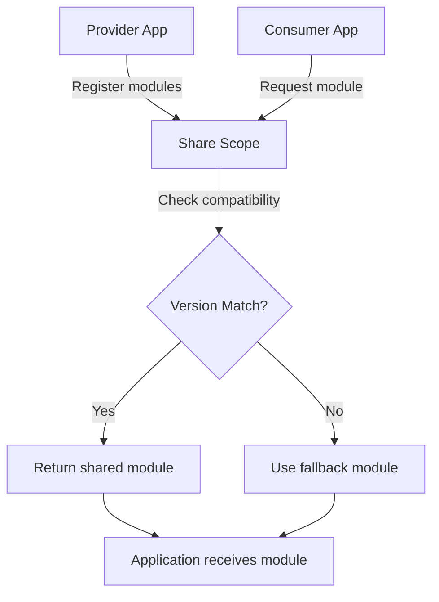

# Core Concepts: ConsumeShared and ProvideShared

## Overview

This document explains the core concepts of Rspack's Module Federation sharing system, focusing on how **ConsumeShared** and **ProvideShared** work together to enable seamless module sharing across micro-frontend applications. These concepts form the foundation for advanced tree-shaking, version management, and runtime optimization.

## ConsumeShared - Module Consumption

### What is ConsumeShared?

ConsumeShared is the mechanism that allows applications to consume modules from other applications in a micro-frontend architecture. It provides intelligent fallback handling, version compatibility checking, and sophisticated usage tracking for optimal bundle optimization.

### Core Structure

```rust
pub struct ConsumeSharedModule {
    // Module identification
    identifier: ModuleIdentifier,
    lib_ident: String,  // Format: "webpack/sharing/consume/{shareScope}/{shareKey}"
    
    // Configuration
    context: Context,
    options: ConsumeOptions,
    
    // Module structure
    dependencies: Vec<DependencyId>,
    blocks: Vec<AsyncDependenciesBlockIdentifier>,
}

pub struct ConsumeOptions {
    pub share_key: String,               // Key to lookup in share scope
    pub share_scope: String,             // Target share scope (default: "default")
    pub import: Option<String>,          // Fallback module path
    pub import_resolved: Option<String>, // Resolved fallback path
    pub required_version: Option<ConsumeVersion>, // Version requirement
    pub strict_version: bool,            // Enforce exact version match
    pub singleton: bool,                 // Only one instance allowed
    pub eager: bool,                     // Load synchronously
}
```

### Configuration Options

#### Basic Configuration
```javascript
// Consumer application configuration
new ModuleFederationPlugin({
  consumes: {
    "lodash-es": {
      singleton: false,        // Allow multiple instances
      strictVersion: true,     // Enforce version compatibility
      requiredVersion: "^4.17.21", // Minimum version requirement
      eager: false,           // Load asynchronously when needed
      shareScope: "default",  // Use default share scope
      fallback: "lodash-es"   // Local fallback module
    }
  }
})
```

#### Advanced Configuration
```javascript
// Advanced consumer configuration with multiple strategies
new ModuleFederationPlugin({
  consumes: {
    "react": {
      singleton: true,         // Force single instance
      strictVersion: false,    // Allow version differences
      requiredVersion: "^18.0.0",
      eager: true,            // Load synchronously
      shareScope: "react-scope"
    },
    "@company/utils": {
      singleton: false,
      requiredVersion: "^2.0.0",
      fallback: "./local-utils", // Custom fallback
      shareScope: "utilities"
    }
  }
})
```

### Resolution Process

ConsumeShared modules follow a sophisticated resolution process:

1. **Share Scope Lookup**: Attempts to find the module in the configured share scope
2. **Version Compatibility**: Checks version requirements using semver matching
3. **Singleton Handling**: Ensures single instance for singleton modules
4. **Fallback Resolution**: Uses local module if shared version is unavailable/incompatible

```javascript
// Generated consumer resolution logic
var resolveHandler = function(data) {
    return loadStrictSingletonVersionCheckFallback(
        data.shareScope,      // "default"
        data.shareKey,        // "lodash-es"
        data.requiredVersion, // "^4.17.21"
        data.fallback         // Local module factory
    );
};
```

### Usage Analysis and Tree-Shaking

ConsumeShared modules include sophisticated usage tracking:

#### Export Usage Detection
```rust
// Real-world usage analysis for lodash-es
ShareUsageData {
    share_key: "lodash-es",
    provided_exports: [
        "chunk", "compact", "concat", "debounce", "throttle", 
        "map", "filter", "reduce", "forEach", // ... 200+ functions
    ],
    imported_exports: [
        "debounce", "throttle", "chunk", "map"  // Application imports
    ],
    actually_used_exports: [
        "debounce", "chunk"  // Actually referenced in code
    ],
    unused_imports: [
        "throttle", "map"    // Imported but unused
    ],
    export_details: [
        {
            export_name: "debounce",
            usage_state: "Used",
            is_imported: true,
            is_used: true,
            annotation: "KEEP"
        },
        {
            export_name: "throttle", 
            usage_state: "ImportedButUnused",
            is_imported: true,
            is_used: false,
            annotation: "ELIMINATE"
        }
    ],
    has_unused_imports: true
}
```

#### Pure Annotation System
ConsumeShared modules automatically receive pure annotations for tree-shaking:

```javascript
// Before optimization
import { debounce, throttle, chunk, map } from 'lodash-es';

// After ConsumeShared pure annotation
/* ESM import */var lodash_es = /* #__PURE__ */ __webpack_require__("lodash-es");
var debounce = lodash_es.debounce;
var throttle = lodash_es.throttle;  // Marked for elimination
var chunk = lodash_es.chunk;
var map = lodash_es.map;            // Marked for elimination
```

## ProvideShared - Module Provision

### What is ProvideShared?

ProvideShared is the mechanism that allows applications to expose modules to other applications in the micro-frontend ecosystem. It handles module registration, version management, and runtime sharing infrastructure.

### Core Structure

```rust
pub struct ProvideSharedModule {
    // Module identification
    identifier: ModuleIdentifier,
    lib_ident: String,  // Format: "webpack/sharing/provide/{shareScope}/{name}"
    
    // Sharing configuration
    name: String,           // Key used in share scope registry
    share_scope: String,    // Scope namespace (default: "default")
    version: ProvideVersion,// Version of the provided module
    request: String,        // Original module request path
    
    // Sharing behavior
    eager: bool,            // Synchronous vs asynchronous loading
    singleton: Option<bool>,// Force single instance across containers
    required_version: Option<ConsumeVersion>, // Minimum version constraints
    strict_version: Option<bool>,  // Enforce exact version matching
}
```

### Configuration Options

#### Basic Configuration
```javascript
// Provider application configuration
new ModuleFederationPlugin({
  shared: {
    "react": {
      singleton: true,
      version: "18.2.0",
      eager: false
    },
    "lodash-es": {
      singleton: false,
      version: "4.17.21", 
      eager: true
    }
  }
})
```

#### Advanced Configuration
```javascript
// Advanced provider configuration with custom options
new ModuleFederationPlugin({
  shared: {
    "react": {
      singleton: true,
      version: "18.2.0",
      eager: false,
      shareScope: "react-scope",
      requiredVersion: "^18.0.0"
    },
    "@company/design-system": {
      singleton: false,
      version: "2.1.0",
      eager: true,
      shareScope: "design-system",
      import: "./src/design-system/index.js" // Custom import path
    }
  }
})
```

### Registration Process

ProvideShared modules follow this registration process:

1. **Module Interception**: ProvideSharedPlugin scans module requests during compilation
2. **Configuration Matching**: Matches requests against provided configurations
3. **Module Creation**: Creates ProvideSharedModule instances with sharing metadata
4. **Runtime Registration**: Generates code to register modules in the global share scope

```javascript
// Generated provider registration code
__webpack_require__.S["default"] = {
  "react": {
    "18.2.0": {
      get: () => __webpack_require__("./node_modules/react/index.js"),
      from: "provider-app",
      eager: false
    }
  },
  "lodash-es": {
    "4.17.21": {
      get: () => __webpack_require__("./node_modules/lodash-es/lodash.js"),
      from: "provider-app", 
      eager: true
    }
  }
};
```

## Provider-Consumer Relationship

### Connection Flow

The relationship between ProvideShared and ConsumeShared follows this flow:



### Share Scope Data Structure

The share scope maintains a hierarchical structure for module sharing:

```javascript
__webpack_require__.S = {
    "default": {           // Share scope name
        "react": {         // Module key
            "18.2.0": {    // Version
                get: factory,     // Module factory function
                from: "app-a",    // Provider identification
                eager: false,     // Loading strategy
                loaded: false,    // Load state
                singleton: true   // Singleton constraint
            },
            "17.0.0": {    // Alternative version
                get: factory,
                from: "app-c", 
                eager: false,
                loaded: false,
                singleton: true
            }
        },
        "lodash-es": {
            "4.17.21": {
                get: factory,
                from: "app-a",
                eager: true,
                loaded: true,
                singleton: false
            }
        }
    }
};
```

### Version Resolution Strategies

#### Semantic Version Matching
```javascript
var satisfy = function(range, version) {
    var reqRange = parseRange(range);
    var providedVersion = parseRange(version);
    
    switch(reqRange.operator) {
        case "^": // Compatible version (same major)
            return providedVersion.major === reqRange.major &&
                   (providedVersion.minor > reqRange.minor ||
                    (providedVersion.minor === reqRange.minor && 
                     providedVersion.patch >= reqRange.patch));
        case "~": // Approximately equivalent (same major.minor)
            return providedVersion.major === reqRange.major &&
                   providedVersion.minor === reqRange.minor &&
                   providedVersion.patch >= reqRange.patch;
        default: // Exact match
            return version === range;
    }
};
```

#### Multi-Version Support
Different applications can provide different versions of the same module:

```javascript
// Provider A provides React 18.2.0
register("react", "18.2.0", reactFactory, false);

// Provider B provides React 17.0.0  
register("react", "17.0.0", react17Factory, false);

// Consumer resolves based on requirements
var resolveReact = function(requiredVersion) {
    var availableVersions = Object.keys(__webpack_require__.S["default"]["react"]);
    
    for (var version of availableVersions) {
        if (satisfy(requiredVersion, version)) {
            return __webpack_require__.S["default"]["react"][version].get();
        }
    }
    
    // No compatible version found - use fallback
    return fallbackReactFactory();
};
```

## Configuration Patterns

### Common Sharing Patterns

#### 1. Framework Sharing (React, Vue, Angular)
```javascript
// Provider configuration
shared: {
    "react": {
        singleton: true,      // Critical: only one React instance
        version: "18.2.0",
        eager: false,         // Load when needed
        strictVersion: false  // Allow minor version differences
    },
    "react-dom": {
        singleton: true,      // Must match React singleton
        version: "18.2.0",
        eager: false
    }
}

// Consumer configuration
consumes: {
    "react": {
        singleton: true,
        requiredVersion: "^18.0.0",
        fallback: "react"
    },
    "react-dom": {
        singleton: true,
        requiredVersion: "^18.0.0", 
        fallback: "react-dom"
    }
}
```

#### 2. Utility Library Sharing (Lodash, Moment, etc.)
```javascript
// Provider configuration
shared: {
    "lodash-es": {
        singleton: false,     // Multiple instances OK
        version: "4.17.21",
        eager: true,          // Load immediately
        strictVersion: true   // Enforce exact version
    }
}

// Consumer configuration
consumes: {
    "lodash-es": {
        singleton: false,
        requiredVersion: "^4.17.0",
        fallback: "lodash-es",
        strictVersion: false  // Allow compatible versions
    }
}
```

#### 3. Design System Sharing
```javascript
// Provider configuration
shared: {
    "@company/design-system": {
        singleton: true,      // Consistent styling
        version: "2.1.0",
        eager: false,
        shareScope: "design-system" // Dedicated scope
    }
}

// Consumer configuration
consumes: {
    "@company/design-system": {
        singleton: true,
        requiredVersion: "^2.0.0",
        shareScope: "design-system",
        fallback: "./local-design-system"
    }
}
```

### Loading Strategies

#### Eager vs Lazy Loading
```javascript
// Eager loading - synchronous
shared: {
    "critical-lib": {
        eager: true,    // Loaded immediately with main bundle
        singleton: true
    }
}

// Lazy loading - asynchronous
shared: {
    "optional-lib": {
        eager: false,   // Loaded on-demand
        singleton: false
    }
}
```

#### Singleton Management
```javascript
// Singleton enforcement
shared: {
    "react": {
        singleton: true,        // Only one instance allowed
        strictVersion: false,   // Allow version flexibility
    }
}

// Multiple instances allowed
shared: {
    "lodash": {
        singleton: false,       // Multiple instances OK
        strictVersion: true,    // Enforce exact version
    }
}
```

## Best Practices

### 1. Version Strategy
```javascript
// Recommended version strategy
shared: {
    "framework-lib": {
        requiredVersion: "^18.0.0",  // Flexible major version
        strictVersion: false,        // Allow minor differences
        singleton: true,            // Single instance for frameworks
    },
    "utility-lib": {
        requiredVersion: "^4.17.0",  // Flexible compatibility
        strictVersion: false,        // Allow minor differences
        singleton: false,           // Performance over memory
    }
}
```

### 2. Tree-Shaking Optimization
```javascript
// Optimize for tree-shaking
shared: {
    "lodash-es": {
        import: "lodash-es",        // Specific import path
        shareScope: "utilities",    // Dedicated scope
        eager: false,              // On-demand loading
    }
}
```

### 3. Monitoring and Debugging
```javascript
// Production monitoring
new EnhancedShareUsagePlugin({
    filename: 'share-usage-analysis.json',
    detect_unused_imports: true,
    runtime_analysis: true,
    performance_tracking: true
})
```

### 4. Error Handling
```javascript
// Comprehensive fallback strategy
consumes: {
    "external-lib": {
        fallback: "./local-implementation", // Always provide fallback
        strictVersion: false,               // Be flexible with versions
        singleton: false,                   // Avoid singleton conflicts
    }
}
```

## Performance Characteristics

### Memory Usage
```javascript
// Runtime memory footprint
MemoryUsage {
    share_scope_registry: "~2KB",     // Share scope metadata
    version_resolution_cache: "~1KB", // Cached version checks
    module_factory_cache: "~3KB",     // Cached module factories
    connection_tracking: "~500B",     // Connection state
    
    total_overhead: "~6.5KB"          // Total MF overhead
}
```

### Load Performance
```javascript
// ConsumeShared loading characteristics
LoadingStrategy {
    eager: false,           // Loaded on-demand
    singleton: false,       // Multiple instances allowed
    strict_version: true,   // Version validation required
    
    performance_metrics: {
        resolution_time: "~15ms",    // Share scope lookup + version check
        fallback_time: "~45ms",      // Local module loading
        cache_hit_rate: "85%",       // Share scope cache efficiency
        bundle_size_impact: "-12KB", // Tree-shaking savings
    }
}
```

## Summary

ConsumeShared and ProvideShared form the core of Rspack's Module Federation system, enabling:

1. **Seamless Module Sharing**: Automatic resolution between providers and consumers
2. **Intelligent Fallback**: Robust error handling with local module fallbacks
3. **Version Management**: Sophisticated semantic version compatibility checking
4. **Performance Optimization**: Advanced tree-shaking with unused import elimination
5. **Flexible Configuration**: Support for various sharing patterns and loading strategies
6. **Runtime Reliability**: Comprehensive error handling and monitoring capabilities

These concepts work together to provide a robust foundation for micro-frontend architectures while maintaining optimal bundle sizes through intelligent tree-shaking and usage analysis.