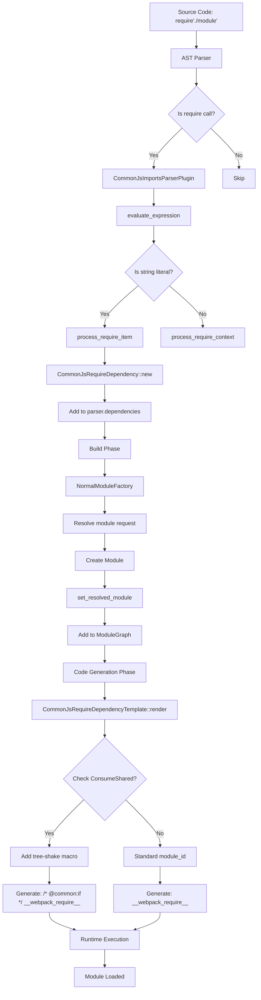
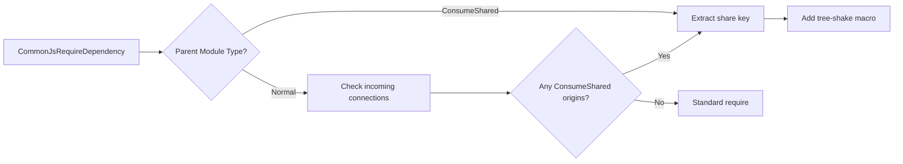

# CommonJsRequireDependency Flow Diagram

## Visual Flow Representation



## Detailed Step Descriptions

### 1. Parsing Phase

```rust
// Step 1: Parser encounters require() call
call_expr: &CallExpr {
    callee: "require",
    args: ["./module"]
}

// Step 2: CommonJsImportsParserPlugin handles it
fn call(&self, parser: &mut JavascriptParser, call_expr: &CallExpr, for_name: &str) {
    if for_name == "require" {
        self.require_handler(parser, CallOrNewExpr::Call(call_expr), for_name)
    }
}

// Step 3: Evaluate the argument
let param = parser.evaluate_expression(&call_expr.args[0].expr);

// Step 4: Create dependency if string literal
if param.is_string() {
    let dep = CommonJsRequireDependency::new(
        param.string().to_string(),  // "./module"
        range_expr,                   // source location
        Some(span.into()),           // full expression span
        parser.in_try,               // optional if in try-catch
        Some(parser.source_map.clone()),
    );
    parser.dependencies.push(Box::new(dep));
}
```

### 2. Build Phase

```rust
// Step 1: Module factory processes the dependency
compilation.set_dependency_factory(
    DependencyType::CjsRequire,
    params.normal_module_factory.clone(),
);

// Step 2: Resolve the module request
// NormalModuleFactory resolves "./module" to actual file path

// Step 3: Create module graph connection
module_graph.set_resolved_module(
    original_module_identifier,  // the module containing require()
    dependency_id,              // the CommonJsRequireDependency id
    module_identifier,          // the resolved module
);
```

### 3. Code Generation Phase

```rust
// Step 1: Template renders the dependency
fn render(&self, dep: &CommonJsRequireDependency, source: &mut TemplateReplaceSource) {
    // Get the resolved module identifier
    let module_identifier = module_graph
        .module_identifier_by_dependency_id(&dep.id);
    
    // Check for ConsumeShared context
    let consume_shared_info = Self::detect_consume_shared_context(
        module_graph,
        &dep.id,
        &target_module_id,
        &dep.request
    );
    
    // Generate the runtime code
    let base_module_reference = module_id(
        compilation,
        &dep.id,
        &dep.request,
        false,
    );
    
    // Apply ConsumeShared wrapper if needed
    let final_replacement = if let Some(share_key) = consume_shared_info {
        format!(
            "/* @common:if [condition=\"treeShake.{}.default\"] */ {} /* @common:endif */",
            share_key, base_module_reference
        )
    } else {
        base_module_reference.to_string()
    };
    
    // Replace the original require() call
    source.replace(dep.range.start, dep.range.end - 1, &final_replacement, None);
}
```

### 4. Generated Output Examples

#### Standard require():
```javascript
// Input
const lodash = require('lodash');

// Output
const lodash = __webpack_require__(/*! lodash */ "./node_modules/lodash/lodash.js");
```

#### ConsumeShared require():
```javascript
// Input (in a ConsumeShared context)
const lodash = require('lodash');

// Output
const lodash = /* @common:if [condition="treeShake.lodash.default"] */ __webpack_require__(/*! lodash */ "./node_modules/lodash/lodash.js") /* @common:endif */;
```

## Key Data Structures

### CommonJsRequireDependency
```rust
pub struct CommonJsRequireDependency {
    id: DependencyId,
    request: String,              // e.g., "./module" or "lodash"
    optional: bool,               // true if in try-catch
    range: DependencyRange,       // source location of require argument
    range_expr: Option<DependencyRange>, // full expression range
    source_map: Option<SharedSourceMap>,
    factorize_info: FactorizeInfo,
}
```

### ModuleGraphConnection
```rust
pub struct ModuleGraphConnection {
    dependency_id: DependencyId,
    original_module_identifier: Option<ModuleIdentifier>,
    module_identifier: ModuleIdentifier,
    active: bool,
    conditional: bool,
}
```

## Integration with Module Federation

### ConsumeShared Detection Flow



### Tree-shaking Integration

The ConsumeShared macros enable conditional loading based on tree-shaking analysis:

1. **Detection**: Identify if the require() is for a shared module
2. **Macro Generation**: Wrap with `@common:if` conditional
3. **Runtime Decision**: The macro processor evaluates conditions at runtime
4. **Optimization**: Unused shared modules can be eliminated

## Performance Considerations

1. **Static Analysis**: Only string literal requires are optimized
2. **Module Graph**: Connections enable efficient traversal
3. **Caching**: Source maps and module resolutions are cached
4. **Lazy Loading**: ConsumeShared modules can be loaded on-demand