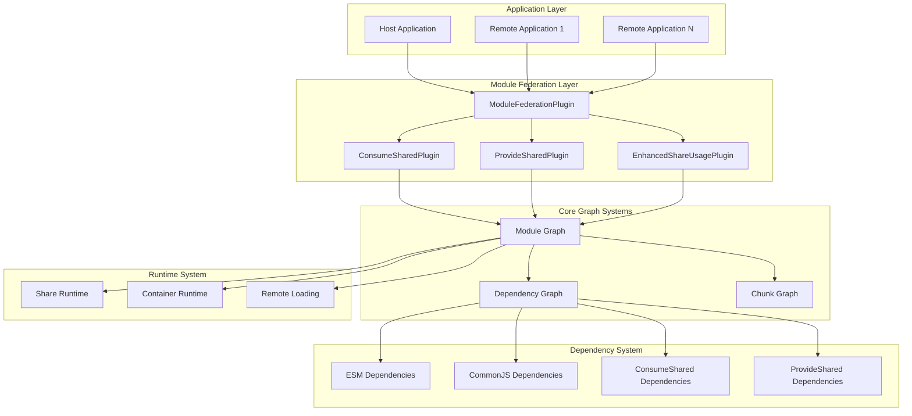
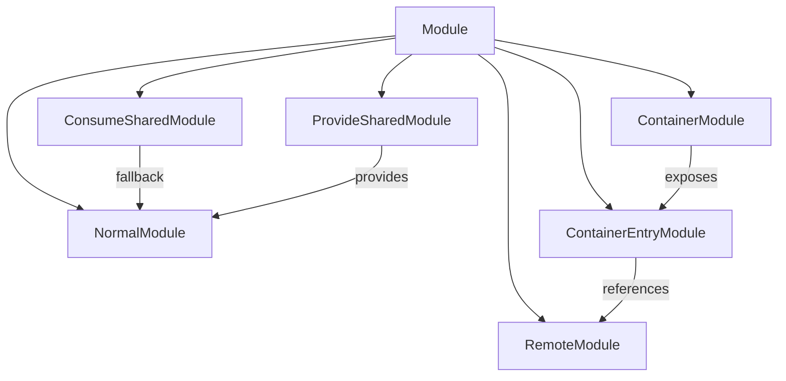
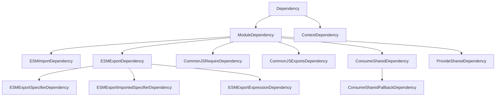
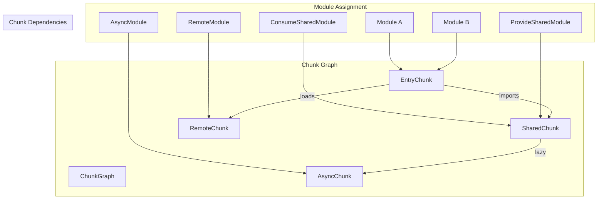
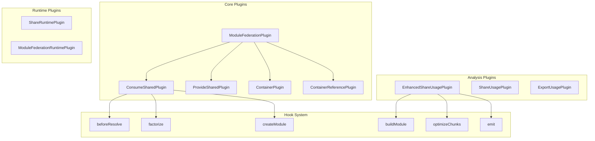
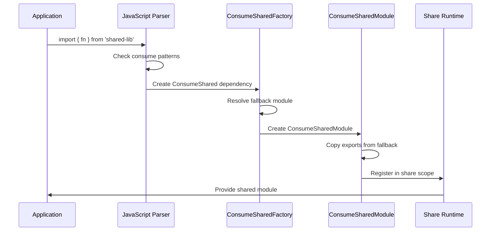
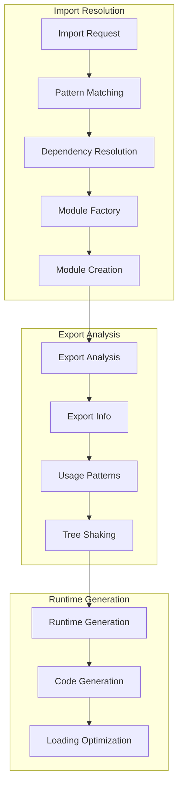
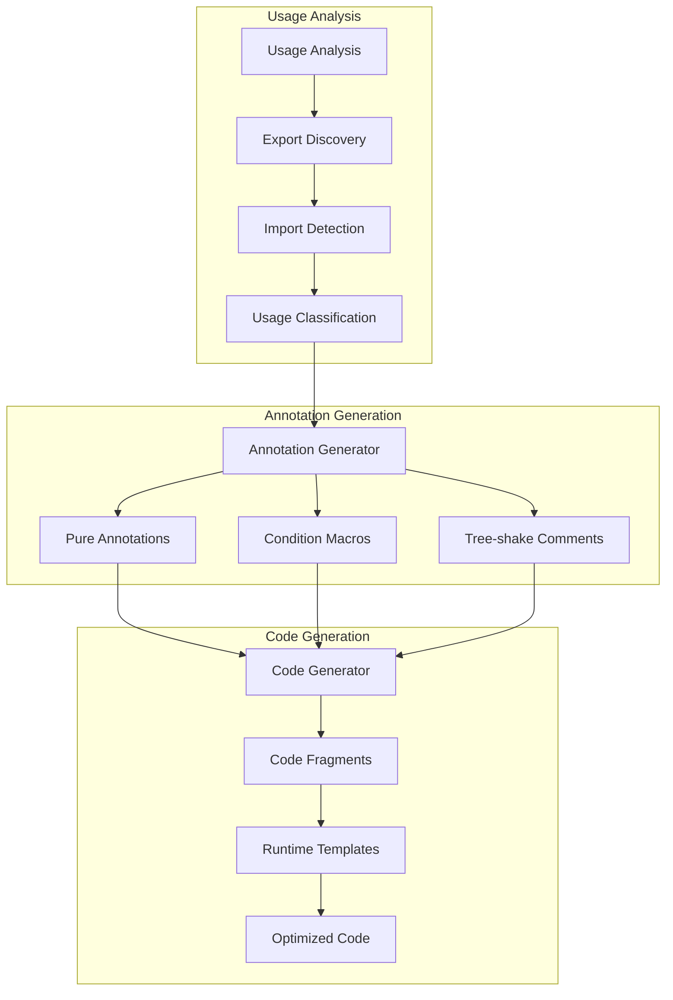
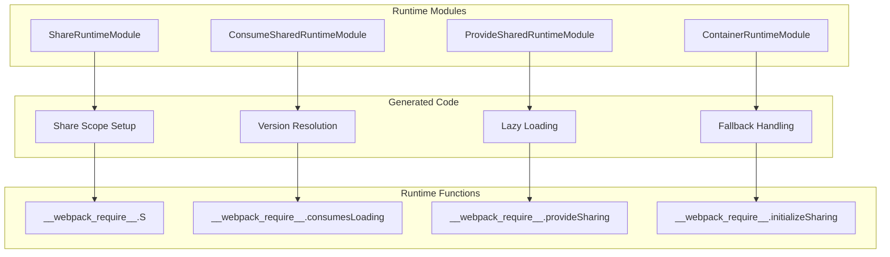

# Comprehensive Rspack Module Federation System Architecture

## Table of Contents

1. [Executive Summary](#executive-summary)
2. [System Architecture Overview](#system-architecture-overview)
3. [Module Graph Architecture](#module-graph-architecture)
4. [Dependency Graph System](#dependency-graph-system)
5. [Chunk Graph and Chunking Strategy](#chunk-graph-and-chunking-strategy)
6. [Module Federation Plugin Ecosystem](#module-federation-plugin-ecosystem)
7. [ConsumeShared Deep Dive](#consumeshared-deep-dive)
8. [ProvideShared Deep Dive](#provideshared-deep-dive)
9. [Export/Import Resolution Pipeline](#exportimport-resolution-pipeline)
10. [Tree-Shaking Integration](#tree-shaking-integration)
11. [Runtime Code Generation](#runtime-code-generation)
12. [Performance Analysis and Optimization](#performance-analysis-and-optimization)
13. [Advanced Usage Patterns](#advanced-usage-patterns)
14. [Debugging and Monitoring](#debugging-and-monitoring)
15. [Implementation Details](#implementation-details)

---

## Executive Summary

Rspack's Module Federation system represents a sophisticated micro-frontend architecture that enables seamless module sharing across independent applications. This document provides comprehensive coverage of the entire system architecture, from low-level dependency resolution to high-level application orchestration.

### Key Architectural Components

- **Module Graph**: Core data structure managing module relationships and metadata
- **Dependency Graph**: Handles import/export relationships and resolution
- **Chunk Graph**: Manages code splitting and bundle optimization
- **Plugin Ecosystem**: Extensible architecture for sharing functionality
- **Runtime System**: Dynamic loading and resolution infrastructure

---

## System Architecture Overview

### High-Level Architecture Diagram



### Component Interactions

1. **Application Layer** → **Module Federation Layer**: Applications configure sharing through plugins
2. **Module Federation Layer** → **Core Graph Systems**: Plugins populate and query graph structures
3. **Core Graph Systems** → **Dependency System**: Graphs manage dependency relationships
4. **Core Graph Systems** → **Runtime System**: Graphs generate runtime code

---

## Module Graph Architecture

### Core Data Structure

The Module Graph serves as the central nervous system of the bundling process, maintaining relationships between modules, their dependencies, and metadata.

```rust
// Conceptual Module Graph Structure
struct ModuleGraph {
    modules: IdentifierMap<Box<dyn Module>>,
    dependencies: DependencyMap<Box<dyn Dependency>>,
    connections: ConnectionMap<ModuleGraphConnection>,
    exports_info: ExportsInfoMap<ExportsInfo>,
    optimization_bailouts: BailoutMap<Vec<String>>,
}

// Module Graph Connection
struct ModuleGraphConnection {
    origin_module: Option<ModuleIdentifier>,
    dependency: DependencyId,
    module: ModuleIdentifier,
    active_state: ConnectionState,
    conditional: Option<DependencyCondition>,
    explanation: Option<String>,
}
```

### Module Types in Federation



### Module Graph Operations

#### 1. Module Registration
```rust
// Module registration process in module graph
impl ModuleGraph {
    fn add_module(&mut self, module: Box<dyn Module>) -> ModuleIdentifier {
        let identifier = module.identifier();
        self.modules.insert(identifier, module);
        self.create_exports_info(&identifier);
        identifier
    }
    
    fn create_exports_info(&mut self, module_id: &ModuleIdentifier) {
        let exports_info = ExportsInfo::new();
        self.exports_info.insert(*module_id, exports_info);
    }
}
```

#### 2. Dependency Connection
```rust
// Dependency connection establishment
impl ModuleGraph {
    fn set_resolved_module(
        &mut self,
        dependency: &dyn Dependency,
        module: &ModuleIdentifier,
    ) -> Result<()> {
        let connection = ModuleGraphConnection {
            origin_module: self.get_parent_module(dependency.id()),
            dependency: dependency.id(),
            module: *module,
            active_state: dependency.get_initial_connection_state(),
            conditional: dependency.get_condition(),
            explanation: dependency.get_explanation(),
        };
        
        self.connections.insert(dependency.id(), connection);
        self.update_export_dependencies(dependency, module)?;
        Ok(())
    }
}
```

### ConsumeShared Module Graph Integration

```rust
// ConsumeShared module creation and graph integration
impl ConsumeSharedModule {
    fn new(
        consume_options: Arc<ConsumeOptions>,
        fallback_module: Option<ModuleIdentifier>,
    ) -> Self {
        Self {
            identifier: create_consume_shared_identifier(&consume_options),
            consume_options,
            fallback_module,
            exports_info: None,
        }
    }
    
    // Integration with module graph
    fn integrate_with_graph(
        &self,
        module_graph: &mut ModuleGraph,
    ) -> Result<()> {
        // Copy exports from fallback to ConsumeShared module
        if let Some(fallback_id) = &self.fallback_module {
            self.copy_exports_from_fallback(module_graph, fallback_id)?;
        }
        
        // Set up dependencies
        self.create_consume_shared_dependencies(module_graph)?;
        Ok(())
    }
}
```

---

## Dependency Graph System

### Dependency Hierarchy



### Dependency Resolution Pipeline

#### 1. Dependency Discovery
```rust
// JavaScript parser discovering dependencies
impl JavaScriptParser {
    fn visit_import_declaration(&mut self, import: &ImportDecl) -> Result<()> {
        let request = import.src.value.to_string();
        
        // Check if request matches ConsumeShared pattern
        if let Some(consume_options) = self.check_consume_shared(&request) {
            let dependency = ConsumeSharedDependency::new(
                request.into(),
                import.span.into(),
                consume_options,
            );
            self.dependencies.push(Box::new(dependency));
        } else {
            // Regular ESM import
            let dependency = ESMImportDependency::new(
                request.into(),
                import.span.into(),
                import.specifiers.clone(),
            );
            self.dependencies.push(Box::new(dependency));
        }
        Ok(())
    }
}
```

#### 2. Dependency Resolution
```rust
// Module factory resolving dependencies
impl ModuleFactory for ConsumeSharedModuleFactory {
    fn create(
        &self,
        context: &FactoryContext,
        dependency: &dyn ModuleDependency,
    ) -> Result<FactoryResult> {
        let consume_dependency = dependency
            .downcast_ref::<ConsumeSharedDependency>()
            .expect("Expected ConsumeSharedDependency");
        
        // Resolve fallback module
        let fallback_result = self.resolve_fallback(
            context,
            &consume_dependency.fallback_request(),
        )?;
        
        // Create ConsumeShared module
        let consume_shared_module = ConsumeSharedModule::new(
            consume_dependency.consume_options(),
            Some(fallback_result.module_identifier),
        );
        
        Ok(FactoryResult {
            module: Box::new(consume_shared_module),
            file_dependencies: fallback_result.file_dependencies,
            context_dependencies: fallback_result.context_dependencies,
            missing_dependencies: fallback_result.missing_dependencies,
        })
    }
}
```

### ESM Dependency Deep Dive

#### ESMExportSpecifierDependency Analysis
```rust
// ESM Export Specifier implementation from our code analysis
impl ESMExportSpecifierDependency {
    // Enhanced ConsumeShared detection with recursive graph traversal
    fn get_consume_shared_info(&self, module_graph: &ModuleGraph) -> Option<String> {
        // Direct parent check
        if let Some(parent_id) = module_graph.get_parent_module(&self.id) {
            if let Some(parent) = module_graph.module_by_identifier(parent_id) {
                if parent.module_type() == &ModuleType::ConsumeShared {
                    return parent.get_consume_shared_key();
                }
            }
        }
        
        // Recursive incoming connection traversal (up to 5 levels)
        let module_id = module_graph.get_parent_module(&self.id)?;
        let mut visited = HashSet::new();
        self.find_consume_shared_recursive(&module_id, module_graph, &mut visited, 5)
    }
    
    // Recursive search for ConsumeShared modules in reexport chains
    fn find_consume_shared_recursive(
        current_module: &ModuleIdentifier,
        module_graph: &ModuleGraph,
        visited: &mut HashSet<ModuleIdentifier>,
        max_depth: usize,
    ) -> Option<String> {
        if max_depth == 0 || visited.contains(current_module) {
            return None;
        }
        visited.insert(*current_module);
        
        // Check all incoming connections
        for connection in module_graph.get_incoming_connections(current_module) {
            if let Some(origin_id) = connection.original_module_identifier.as_ref() {
                if let Some(origin) = module_graph.module_by_identifier(origin_id) {
                    if origin.module_type() == &ModuleType::ConsumeShared {
                        return origin.get_consume_shared_key();
                    }
                    
                    // Recursive traversal
                    if let Some(key) = self.find_consume_shared_recursive(
                        origin_id, module_graph, visited, max_depth - 1
                    ) {
                        return Some(key);
                    }
                }
            }
        }
        None
    }
}
```

#### CommonJS Export Dependency Analysis
```rust
// CommonJS exports dependency from our code analysis
impl CommonJsExportsDependency {
    // Enhanced ConsumeShared detection for CommonJS modules
    fn detect_consume_shared_context(
        module_graph: &ModuleGraph,
        dep_id: &DependencyId,
        module_identifier: &ModuleIdentifier,
    ) -> Option<String> {
        // Check direct parent
        if let Some(parent_id) = module_graph.get_parent_module(dep_id) {
            if let Some(parent) = module_graph.module_by_identifier(parent_id) {
                if parent.module_type() == &ModuleType::ConsumeShared {
                    return parent.get_consume_shared_key();
                }
            }
        }
        
        // Check incoming connections for ConsumeShared fallback scenarios
        for connection in module_graph.get_incoming_connections(module_identifier) {
            if let Some(origin_id) = connection.original_module_identifier.as_ref() {
                if let Some(origin) = module_graph.module_by_identifier(origin_id) {
                    if origin.module_type() == &ModuleType::ConsumeShared {
                        return origin.get_consume_shared_key();
                    }
                }
            }
        }
        None
    }
}
```

---

## Chunk Graph and Chunking Strategy

### Chunk Graph Structure



### Chunking Strategy for Module Federation

#### 1. Chunk Types in Federation
```rust
#[derive(Debug, Clone)]
enum FederationChunkType {
    // Main application entry point
    Entry {
        name: String,
        modules: Vec<ModuleIdentifier>,
    },
    
    // Shared dependencies chunk
    Shared {
        share_scope: String,
        shared_modules: Vec<ConsumeSharedModule>,
    },
    
    // Remote container chunk
    Remote {
        container_name: String,
        exposed_modules: Vec<ModuleIdentifier>,
    },
    
    // Async loading chunk
    Async {
        loading_strategy: LoadingStrategy,
        modules: Vec<ModuleIdentifier>,
    },
}
```

#### 2. Chunk Assignment Algorithm
```rust
impl ChunkGraph {
    fn assign_modules_to_chunks(
        &mut self,
        module_graph: &ModuleGraph,
        federation_config: &FederationConfig,
    ) -> Result<()> {
        for module_id in module_graph.modules().keys() {
            let chunk_assignment = self.determine_chunk_assignment(
                module_id,
                module_graph,
                federation_config,
            )?;
            
            match chunk_assignment {
                ChunkAssignment::Entry(chunk_id) => {
                    self.assign_module_to_entry_chunk(module_id, chunk_id);
                }
                ChunkAssignment::Shared(share_scope) => {
                    self.assign_module_to_shared_chunk(module_id, &share_scope);
                }
                ChunkAssignment::Remote(container) => {
                    self.assign_module_to_remote_chunk(module_id, &container);
                }
                ChunkAssignment::Async(strategy) => {
                    self.create_async_chunk(module_id, strategy);
                }
            }
        }
        Ok(())
    }
    
    fn determine_chunk_assignment(
        &self,
        module_id: &ModuleIdentifier,
        module_graph: &ModuleGraph,
        federation_config: &FederationConfig,
    ) -> Result<ChunkAssignment> {
        let module = module_graph.module_by_identifier(module_id)
            .ok_or("Module not found")?;
        
        match module.module_type() {
            ModuleType::ConsumeShared => {
                let consume_shared = module.downcast_ref::<ConsumeSharedModule>()
                    .expect("Expected ConsumeSharedModule");
                Ok(ChunkAssignment::Shared(consume_shared.share_scope().clone()))
            }
            ModuleType::ProvideShared => {
                let provide_shared = module.downcast_ref::<ProvideSharedModule>()
                    .expect("Expected ProvideSharedModule");
                Ok(ChunkAssignment::Shared(provide_shared.share_scope().clone()))
            }
            ModuleType::Container => {
                Ok(ChunkAssignment::Remote(federation_config.name.clone()))
            }
            _ => {
                // Normal module - check for async import patterns
                if self.is_async_imported(module_id, module_graph) {
                    Ok(ChunkAssignment::Async(LoadingStrategy::Lazy))
                } else {
                    Ok(ChunkAssignment::Entry(ChunkId::default()))
                }
            }
        }
    }
}
```

### Chunk Optimization Strategies

#### 1. Shared Module Deduplication
```rust
impl ChunkGraph {
    fn optimize_shared_chunks(&mut self, module_graph: &ModuleGraph) -> Result<()> {
        let mut shared_modules = HashMap::new();
        
        // Collect all shared modules by share key
        for chunk in self.chunks.values() {
            if let ChunkType::Shared { share_scope, modules } = &chunk.chunk_type {
                for module_id in modules {
                    if let Some(module) = module_graph.module_by_identifier(module_id) {
                        if let Some(share_key) = module.get_share_key() {
                            shared_modules.entry(share_key)
                                .or_insert_with(Vec::new)
                                .push(*module_id);
                        }
                    }
                }
            }
        }
        
        // Deduplicate shared modules across chunks
        for (share_key, module_ids) in shared_modules {
            if module_ids.len() > 1 {
                self.deduplicate_shared_modules(&share_key, &module_ids)?;
            }
        }
        
        Ok(())
    }
    
    fn deduplicate_shared_modules(
        &mut self,
        share_key: &str,
        module_ids: &[ModuleIdentifier],
    ) -> Result<()> {
        // Find the best module to keep (highest version, most exports, etc.)
        let primary_module = self.select_primary_shared_module(module_ids)?;
        
        // Update all references to point to primary module
        for module_id in module_ids {
            if *module_id != primary_module {
                self.redirect_module_references(*module_id, primary_module)?;
            }
        }
        
        Ok(())
    }
}
```

---

## Module Federation Plugin Ecosystem

### Plugin Architecture Overview



### Plugin Implementation Details

#### ConsumeSharedPlugin Deep Dive
```rust
impl ConsumeSharedPlugin {
    // Plugin initialization and hook registration
    fn apply(&self, compiler: &mut Compiler) -> Result<()> {
        // Register factory for ConsumeShared dependencies
        compiler.compilation_hooks
            .dependency_reference_type
            .tap("ConsumeSharedPlugin", |dependency_ref| {
                if dependency_ref.dependency_type == DependencyType::ConsumeShared {
                    dependency_ref.factory = Some(Arc::new(ConsumeSharedModuleFactory::new()));
                }
            });
        
        // Hook into resolver to intercept matching requests
        compiler.resolver_hooks
            .before_resolve
            .tap("ConsumeSharedPlugin", |resolve_data| {
                self.intercept_request(resolve_data)
            });
        
        // Hook into compilation to set up runtime modules
        compiler.compilation_hooks
            .this_compilation
            .tap("ConsumeSharedPlugin", |compilation| {
                self.setup_runtime_modules(compilation)
            });
        
        Ok(())
    }
    
    // Request interception logic
    fn intercept_request(&self, resolve_data: &mut ResolveData) -> Result<InterceptResult> {
        let request = &resolve_data.request;
        
        // Check if request matches any consume patterns
        for (pattern, consume_options) in &self.consume_options {
            if self.matches_pattern(pattern, request) {
                // Create ConsumeShared dependency
                let dependency = ConsumeSharedDependency::new(
                    request.clone(),
                    resolve_data.context.clone(),
                    consume_options.clone(),
                );
                
                return Ok(InterceptResult::Replaced(dependency));
            }
        }
        
        Ok(InterceptResult::Continue)
    }
}
```

#### EnhancedShareUsagePlugin Implementation
```rust
impl EnhancedShareUsagePlugin {
    // Advanced usage analysis with caching and batch processing
    fn analyze_share_usage(
        &self,
        compilation: &Compilation,
    ) -> Result<ShareUsageAnalysis> {
        let module_graph = compilation.get_module_graph();
        let cache = &self.cache;
        
        let mut analysis = ShareUsageAnalysis::new();
        let mut batch_processor = BatchProcessor::new(self.options.batch_size);
        
        // Collect all ConsumeShared modules
        let consume_shared_modules = module_graph
            .modules()
            .values()
            .filter_map(|module| {
                if module.module_type() == &ModuleType::ConsumeShared {
                    Some(module.identifier())
                } else {
                    None
                }
            })
            .collect::<Vec<_>>();
        
        // Batch process modules for efficiency
        for batch in batch_processor.batches(&consume_shared_modules) {
            let batch_results = self.analyze_module_batch(
                batch,
                module_graph,
                cache,
            )?;
            analysis.merge_batch_results(batch_results);
        }
        
        // Runtime-specific analysis
        if self.options.runtime_analysis {
            for runtime in compilation.get_runtimes() {
                let runtime_analysis = self.analyze_runtime_usage(
                    &consume_shared_modules,
                    module_graph,
                    &runtime,
                )?;
                analysis.add_runtime_analysis(runtime, runtime_analysis);
            }
        }
        
        Ok(analysis)
    }
    
    // Batch processing for performance optimization
    fn analyze_module_batch(
        &self,
        modules: &[ModuleIdentifier],
        module_graph: &ModuleGraph,
        cache: &AnalysisCache,
    ) -> Result<BatchAnalysisResult> {
        let mut results = Vec::new();
        
        // Prefetch exports info for all modules in batch
        let exports_info_batch = self.batch_prefetch_exports_info(modules, module_graph)?;
        
        for module_id in modules {
            let cache_key = self.create_cache_key(module_id);
            
            let module_analysis = cache.get_or_compute(cache_key, || {
                self.analyze_single_module(module_id, module_graph, &exports_info_batch)
            })?;
            
            results.push(module_analysis);
        }
        
        Ok(BatchAnalysisResult { results })
    }
}
```

---

## ConsumeShared Deep Dive

### ConsumeShared Module Lifecycle



### Fallback Resolution Strategy

```rust
impl ConsumeSharedModule {
    // Enhanced fallback resolution with version compatibility
    fn resolve_fallback(
        &self,
        resolver: &Resolver,
        context: &ResolveContext,
    ) -> Result<FallbackResult> {
        let fallback_request = &self.consume_options.fallback;
        
        // Primary fallback resolution
        match resolver.resolve(context, fallback_request) {
            Ok(resolution) => {
                let fallback_module = self.create_fallback_module(resolution)?;
                Ok(FallbackResult {
                    module: fallback_module,
                    strategy: FallbackStrategy::LocalModule,
                })
            }
            Err(primary_error) => {
                // Secondary fallback strategies
                self.try_alternative_fallbacks(resolver, context, primary_error)
            }
        }
    }
    
    fn try_alternative_fallbacks(
        &self,
        resolver: &Resolver,
        context: &ResolveContext,
        primary_error: ResolveError,
    ) -> Result<FallbackResult> {
        // Try package.json main field
        if let Some(main_field) = self.extract_main_field(&primary_error) {
            if let Ok(resolution) = resolver.resolve(context, &main_field) {
                return Ok(FallbackResult {
                    module: self.create_fallback_module(resolution)?,
                    strategy: FallbackStrategy::MainField,
                });
            }
        }
        
        // Try CDN fallback
        if let Some(cdn_url) = &self.consume_options.cdn_fallback {
            return Ok(FallbackResult {
                module: self.create_external_module(cdn_url)?,
                strategy: FallbackStrategy::CDN,
            });
        }
        
        // No fallback available
        Err(ConsumeSharedError::NoFallbackAvailable {
            request: self.consume_options.fallback.clone(),
            primary_error,
        })
    }
}
```

### Export Metadata Propagation

```rust
impl ConsumeSharedModule {
    // Copy exports from fallback to ConsumeShared module
    fn copy_exports_from_fallback(
        &self,
        module_graph: &mut ModuleGraph,
        fallback_id: &ModuleIdentifier,
    ) -> Result<()> {
        let fallback_exports_info = module_graph.get_exports_info(fallback_id);
        let consume_shared_exports_info = module_graph.get_exports_info(&self.identifier());
        
        // Prefetch all exports from fallback
        let prefetched = ExportsInfoGetter::prefetch(
            &fallback_exports_info,
            module_graph,
            PrefetchExportsInfoMode::AllExports,
        );
        
        match prefetched.get_provided_exports() {
            ProvidedExports::ProvidedNames(names) => {
                // Copy individual named exports
                for export_name in names {
                    self.copy_individual_export(
                        export_name,
                        &fallback_exports_info,
                        &consume_shared_exports_info,
                        module_graph,
                    )?;
                }
            }
            ProvidedExports::ProvidedAll => {
                // Namespace export - copy all capabilities
                self.copy_namespace_export(
                    &fallback_exports_info,
                    &consume_shared_exports_info,
                    module_graph,
                )?;
            }
            ProvidedExports::NotProvided => {
                // No exports - create empty exports info
                self.create_empty_exports_info(&consume_shared_exports_info)?;
            }
        }
        
        Ok(())
    }
    
    fn copy_individual_export(
        &self,
        export_name: &Atom,
        source_exports: &ExportsInfo,
        target_exports: &ExportsInfo,
        module_graph: &mut ModuleGraph,
    ) -> Result<()> {
        let source_export_info = source_exports.get_read_only_export_info(export_name);
        let target_export_info = target_exports.get_export_info(export_name);
        
        // Copy export capabilities
        let source_data = source_export_info.as_data(module_graph);
        let mut target_data = target_export_info.as_data_mut(module_graph);
        
        target_data.set_provided(source_data.provided());
        target_data.set_can_mangle_provide(source_data.can_mangle_provide());
        target_data.set_can_mangle_use(source_data.can_mangle_use());
        target_data.set_terminal_binding(source_data.terminal_binding());
        
        // Copy inlining information
        if let Some(inlinable) = source_data.inlinable() {
            target_data.set_inlinable(inlinable);
        }
        
        Ok(())
    }
}
```

---

## ProvideShared Deep Dive

### Provider Registration and Share Scope Management

```rust
impl ProvideSharedPlugin {
    // Share scope initialization and provider registration
    fn setup_share_scope(
        &self,
        compilation: &mut Compilation,
    ) -> Result<()> {
        let share_scope_manager = compilation.get_share_scope_manager();
        
        for (provide_key, provide_options) in &self.provide_options {
            // Register provider in share scope
            share_scope_manager.register_provider(
                &self.share_scope,
                provide_key,
                ProviderRegistration {
                    version: provide_options.version.clone(),
                    eager: provide_options.eager,
                    singleton: provide_options.singleton,
                    strict_version: provide_options.strict_version,
                    factory: Box::new(ProvideSharedModuleFactory::new(
                        provide_options.clone()
                    )),
                },
            )?;
            
            // Create runtime dependencies
            self.create_provider_runtime_dependencies(
                compilation,
                provide_key,
                provide_options,
            )?;
        }
        
        Ok(())
    }
    
    // Version compatibility checking
    fn check_version_compatibility(
        &self,
        requested_version: &str,
        provided_version: &str,
        strict: bool,
    ) -> VersionCompatibilityResult {
        if strict {
            // Exact version match required
            if requested_version == provided_version {
                VersionCompatibilityResult::Compatible
            } else {
                VersionCompatibilityResult::Incompatible {
                    reason: VersionMismatchReason::StrictMismatch,
                    requested: requested_version.to_string(),
                    provided: provided_version.to_string(),
                }
            }
        } else {
            // Semantic version compatibility
            self.check_semver_compatibility(requested_version, provided_version)
        }
    }
    
    fn check_semver_compatibility(
        &self,
        requested: &str,
        provided: &str,
    ) -> VersionCompatibilityResult {
        match (semver::Version::parse(requested), semver::Version::parse(provided)) {
            (Ok(req_ver), Ok(prov_ver)) => {
                if self.is_semver_compatible(&req_ver, &prov_ver) {
                    VersionCompatibilityResult::Compatible
                } else {
                    VersionCompatibilityResult::Incompatible {
                        reason: VersionMismatchReason::SemverIncompatible,
                        requested: requested.to_string(),
                        provided: provided.to_string(),
                    }
                }
            }
            _ => VersionCompatibilityResult::Incompatible {
                reason: VersionMismatchReason::InvalidVersion,
                requested: requested.to_string(),
                provided: provided.to_string(),
            }
        }
    }
}
```

### Runtime Provider Factory

```rust
impl ProvideSharedModuleFactory {
    // Create provider module with version and compatibility checks
    fn create_provider_module(
        &self,
        context: &FactoryContext,
        request: &str,
    ) -> Result<ProviderModule> {
        // Resolve the actual module to be shared
        let resolved_module = self.resolve_shared_module(context, request)?;
        
        // Create provider wrapper
        let provider_module = ProvideSharedModule::new(
            self.provide_options.clone(),
            resolved_module.identifier(),
            self.calculate_provider_hash(&resolved_module)?,
        );
        
        // Set up provider metadata
        provider_module.set_version(&self.provide_options.version);
        provider_module.set_share_scope(&self.share_scope);
        provider_module.set_singleton(self.provide_options.singleton);
        provider_module.set_eager(self.provide_options.eager);
        
        Ok(provider_module)
    }
    
    // Provider hash calculation for cache invalidation
    fn calculate_provider_hash(
        &self,
        module: &dyn Module,
    ) -> Result<String> {
        let mut hasher = DefaultHasher::new();
        
        // Hash module content
        if let Some(source) = module.source() {
            hasher.write(source.source().as_bytes());
        }
        
        // Hash provider options
        hasher.write(self.provide_options.version.as_bytes());
        hasher.write(&[self.provide_options.eager as u8]);
        hasher.write(&[self.provide_options.singleton as u8]);
        
        Ok(format!("{:x}", hasher.finish()))
    }
}
```

---

## Export/Import Resolution Pipeline

### Resolution Architecture



### Advanced Export Analysis Pipeline

```rust
impl ExportAnalysisPipeline {
    // Comprehensive export analysis with usage tracking
    fn analyze_exports(
        &self,
        module_graph: &ModuleGraph,
        module_identifier: &ModuleIdentifier,
    ) -> Result<ExportAnalysisResult> {
        let module = module_graph.module_by_identifier(module_identifier)
            .ok_or("Module not found")?;
        
        // Stage 1: Discover all exports
        let discovered_exports = self.discover_module_exports(module, module_graph)?;
        
        // Stage 2: Analyze usage patterns
        let usage_analysis = self.analyze_export_usage(
            module_identifier,
            &discovered_exports,
            module_graph,
        )?;
        
        // Stage 3: Generate tree-shaking annotations
        let tree_shaking_annotations = self.generate_tree_shaking_annotations(
            &discovered_exports,
            &usage_analysis,
        )?;
        
        // Stage 4: ConsumeShared integration
        let consume_shared_context = self.detect_consume_shared_context(
            module_identifier,
            module_graph,
        );
        
        Ok(ExportAnalysisResult {
            exports: discovered_exports,
            usage: usage_analysis,
            tree_shaking: tree_shaking_annotations,
            consume_shared: consume_shared_context,
        })
    }
    
    // Export discovery with deep module introspection
    fn discover_module_exports(
        &self,
        module: &dyn Module,
        module_graph: &ModuleGraph,
    ) -> Result<Vec<ExportInfo>> {
        let mut exports = Vec::new();
        
        match module.module_type() {
            ModuleType::Normal => {
                exports.extend(self.discover_normal_module_exports(module, module_graph)?);
            }
            ModuleType::ConsumeShared => {
                let consume_shared = module.downcast_ref::<ConsumeSharedModule>()
                    .expect("Expected ConsumeSharedModule");
                exports.extend(self.discover_consume_shared_exports(
                    consume_shared,
                    module_graph,
                )?);
            }
            ModuleType::ProvideShared => {
                let provide_shared = module.downcast_ref::<ProvideSharedModule>()
                    .expect("Expected ProvideSharedModule");
                exports.extend(self.discover_provide_shared_exports(
                    provide_shared,
                    module_graph,
                )?);
            }
            _ => {}
        }
        
        Ok(exports)
    }
    
    // ConsumeShared export discovery with fallback integration
    fn discover_consume_shared_exports(
        &self,
        consume_shared: &ConsumeSharedModule,
        module_graph: &ModuleGraph,
    ) -> Result<Vec<ExportInfo>> {
        let mut exports = Vec::new();
        
        // Get exports from fallback module
        if let Some(fallback_id) = consume_shared.fallback_module() {
            let fallback_exports = self.discover_fallback_exports(
                fallback_id,
                module_graph,
            )?;
            
            // Transform fallback exports to ConsumeShared context
            for mut export in fallback_exports {
                export.consume_shared_context = Some(ConsumeSharedContext {
                    share_key: consume_shared.share_key().clone(),
                    share_scope: consume_shared.share_scope().clone(),
                    fallback_module: *fallback_id,
                });
                exports.push(export);
            }
        }
        
        // Add ConsumeShared-specific exports
        exports.push(ExportInfo {
            name: "*".into(),
            export_type: ExportType::Namespace,
            provided: ExportProvided::Maybe,
            consume_shared_context: Some(ConsumeSharedContext {
                share_key: consume_shared.share_key().clone(),
                share_scope: consume_shared.share_scope().clone(),
                fallback_module: consume_shared.fallback_module().unwrap_or_default(),
            }),
            ..Default::default()
        });
        
        Ok(exports)
    }
}
```

### Usage Pattern Analysis

```rust
impl UsagePatternAnalyzer {
    // Advanced usage pattern detection with runtime awareness
    fn analyze_usage_patterns(
        &self,
        module_identifier: &ModuleIdentifier,
        exports: &[ExportInfo],
        module_graph: &ModuleGraph,
    ) -> Result<UsageAnalysis> {
        let mut usage_analysis = UsageAnalysis::new();
        
        // Analyze incoming connections for usage patterns
        let connections = module_graph.get_incoming_connections(module_identifier);
        
        for connection in connections {
            let connection_analysis = self.analyze_connection_usage(
                connection,
                exports,
                module_graph,
            )?;
            usage_analysis.merge_connection_analysis(connection_analysis);
        }
        
        // Runtime-specific usage analysis
        for runtime in module_graph.get_runtimes() {
            let runtime_usage = self.analyze_runtime_usage(
                module_identifier,
                exports,
                &runtime,
                module_graph,
            )?;
            usage_analysis.add_runtime_usage(runtime, runtime_usage);
        }
        
        Ok(usage_analysis)
    }
    
    // Connection-level usage analysis
    fn analyze_connection_usage(
        &self,
        connection: &ModuleGraphConnection,
        exports: &[ExportInfo],
        module_graph: &ModuleGraph,
    ) -> Result<ConnectionUsageAnalysis> {
        let dependency = module_graph.dependency_by_id(&connection.dependency)
            .ok_or("Dependency not found")?;
        
        // Extract referenced exports from dependency
        let referenced_exports = dependency.get_referenced_exports(module_graph, &Default::default(), None);
        
        let mut connection_usage = ConnectionUsageAnalysis::new();
        
        for referenced_export in referenced_exports {
            match referenced_export {
                ExtendedReferencedExport::Export(export_ref) => {
                    self.analyze_export_reference(
                        &export_ref,
                        exports,
                        &mut connection_usage,
                    )?;
                }
                ExtendedReferencedExport::Array(export_names) => {
                    self.analyze_multiple_export_references(
                        &export_names,
                        exports,
                        &mut connection_usage,
                    )?;
                }
            }
        }
        
        Ok(connection_usage)
    }
    
    // Export reference analysis with usage classification
    fn analyze_export_reference(
        &self,
        export_ref: &ExportReference,
        exports: &[ExportInfo],
        connection_usage: &mut ConnectionUsageAnalysis,
    ) -> Result<()> {
        if export_ref.name.is_empty() {
            // Namespace import
            connection_usage.add_namespace_usage();
            for export in exports {
                connection_usage.add_potential_usage(&export.name);
            }
        } else {
            // Named import
            connection_usage.add_named_usage(&export_ref.name);
            
            // Check if actually used vs just imported
            let usage_type = self.determine_usage_type(export_ref)?;
            connection_usage.set_usage_type(&export_ref.name, usage_type);
        }
        
        Ok(())
    }
}
```

---

## Tree-Shaking Integration

### Tree-Shaking Architecture



### ConsumeShared Tree-Shaking Implementation

```rust
impl ConsumeSharedTreeShaker {
    // Generate tree-shaking annotations for ConsumeShared modules
    fn generate_tree_shaking_annotations(
        &self,
        consume_shared_module: &ConsumeSharedModule,
        usage_analysis: &UsageAnalysis,
        module_graph: &ModuleGraph,
    ) -> Result<Vec<TreeShakingAnnotation>> {
        let mut annotations = Vec::new();
        
        let share_key = consume_shared_module.share_key();
        let fallback_exports = self.get_fallback_exports(
            consume_shared_module,
            module_graph,
        )?;
        
        for export in fallback_exports {
            let annotation = self.create_export_annotation(
                &export,
                share_key,
                usage_analysis,
            )?;
            annotations.push(annotation);
        }
        
        Ok(annotations)
    }
    
    // Create annotation for individual export
    fn create_export_annotation(
        &self,
        export: &ExportInfo,
        share_key: &str,
        usage_analysis: &UsageAnalysis,
    ) -> Result<TreeShakingAnnotation> {
        let usage_state = usage_analysis.get_export_usage(&export.name);
        
        let annotation = match usage_state {
            ExportUsageState::Used => TreeShakingAnnotation {
                export_name: export.name.clone(),
                action: TreeShakingAction::Keep,
                condition: None,
                comment: format!("/* Used export from ConsumeShared '{}' */", share_key),
                confidence: AnnotationConfidence::High,
            },
            ExportUsageState::ImportedButUnused => TreeShakingAnnotation {
                export_name: export.name.clone(),
                action: TreeShakingAction::Eliminate,
                condition: Some(format!("treeShake.{}.{}", share_key, export.name)),
                comment: format!(
                    "/* @common:if [condition=\"treeShake.{}.{}\"] */ /* ConsumeShared export */ {} /* @common:endif */",
                    share_key, export.name, export.name
                ),
                confidence: AnnotationConfidence::High,
            },
            ExportUsageState::NotImported => TreeShakingAnnotation {
                export_name: export.name.clone(),
                action: TreeShakingAction::Eliminate,
                condition: Some(format!("treeShake.{}.{}", share_key, export.name)),
                comment: format!("/* Unused ConsumeShared export '{}' */", export.name),
                confidence: AnnotationConfidence::High,
            },
            ExportUsageState::Unknown => TreeShakingAnnotation {
                export_name: export.name.clone(),
                action: TreeShakingAction::Keep,
                condition: None,
                comment: format!("/* Unknown usage - keeping ConsumeShared export '{}' */", export.name),
                confidence: AnnotationConfidence::Low,
            },
        };
        
        Ok(annotation)
    }
}
```

### Pure Annotation System

```rust
impl PureAnnotationGenerator {
    // Enhanced pure annotation for ConsumeShared descendants
    fn generate_pure_annotations(
        &self,
        compilation: &Compilation,
    ) -> Result<Vec<PureAnnotation>> {
        let mut annotations = Vec::new();
        let module_graph = compilation.get_module_graph();
        
        for module_id in module_graph.modules().keys() {
            if self.is_consume_shared_descendant(module_id, module_graph) {
                let pure_annotation = self.create_pure_annotation(module_id, module_graph)?;
                annotations.push(pure_annotation);
            }
        }
        
        Ok(annotations)
    }
    
    // Recursive ConsumeShared descendant detection
    fn is_consume_shared_descendant(
        &self,
        module_id: &ModuleIdentifier,
        module_graph: &ModuleGraph,
    ) -> bool {
        let mut visited = HashSet::new();
        self.is_consume_shared_descendant_recursive(module_id, module_graph, &mut visited, 10)
    }
    
    fn is_consume_shared_descendant_recursive(
        &self,
        current_module: &ModuleIdentifier,
        module_graph: &ModuleGraph,
        visited: &mut HashSet<ModuleIdentifier>,
        max_depth: usize,
    ) -> bool {
        if max_depth == 0 || visited.contains(current_module) {
            return false;
        }
        visited.insert(*current_module);
        
        // Check if current module is ConsumeShared
        if let Some(module) = module_graph.module_by_identifier(current_module) {
            if module.module_type() == &ModuleType::ConsumeShared {
                return true;
            }
        }
        
        // Check incoming connections recursively
        for connection in module_graph.get_incoming_connections(current_module) {
            if let Some(origin_id) = connection.original_module_identifier.as_ref() {
                if let Some(origin) = module_graph.module_by_identifier(origin_id) {
                    if origin.module_type() == &ModuleType::ConsumeShared {
                        return true;
                    }
                    
                    if self.is_consume_shared_descendant_recursive(
                        origin_id,
                        module_graph,
                        visited,
                        max_depth - 1,
                    ) {
                        return true;
                    }
                }
            }
        }
        
        false
    }
    
    // Pure annotation creation
    fn create_pure_annotation(
        &self,
        module_id: &ModuleIdentifier,
        module_graph: &ModuleGraph,
    ) -> Result<PureAnnotation> {
        let module = module_graph.module_by_identifier(module_id)
            .ok_or("Module not found")?;
        
        Ok(PureAnnotation {
            module_identifier: *module_id,
            annotation_type: PureAnnotationType::ConsumeSharedDescendant,
            comment: format!("/* #__PURE__ */ __webpack_require__(\"{}\")", module.identifier()),
            position: AnnotationPosition::BeforeRequire,
            conditions: self.get_pure_annotation_conditions(module_id, module_graph)?,
        })
    }
}
```

---

## Runtime Code Generation

### Runtime Architecture



### ConsumeShared Runtime Generation

```rust
impl ConsumeSharedRuntimeModule {
    // Generate runtime code for ConsumeShared modules
    fn generate(&self, compilation: &Compilation) -> Result<String> {
        let module_graph = compilation.get_module_graph();
        let mut runtime_code = String::new();
        
        // Generate consume shared loading data
        runtime_code.push_str(&self.generate_consume_loading_data(compilation)?);
        
        // Generate version check functions
        runtime_code.push_str(&self.generate_version_check_functions()?);
        
        // Generate fallback handling functions
        runtime_code.push_str(&self.generate_fallback_functions(compilation)?);
        
        // Generate initialization code
        runtime_code.push_str(&self.generate_initialization_code(compilation)?);
        
        Ok(runtime_code)
    }
    
    // Generate consume loading data structure
    fn generate_consume_loading_data(
        &self,
        compilation: &Compilation,
    ) -> Result<String> {
        let module_graph = compilation.get_module_graph();
        let mut consume_data = HashMap::new();
        
        // Collect all ConsumeShared modules
        for module in module_graph.modules().values() {
            if let Some(consume_shared) = module.downcast_ref::<ConsumeSharedModule>() {
                let module_data = self.create_consume_module_data(consume_shared)?;
                consume_data.insert(consume_shared.share_key().clone(), module_data);
            }
        }
        
        Ok(format!(
            r#"
__webpack_require__.consumesLoadingData = {{
    chunkMapping: {},
    moduleIdToConsumeDataMapping: {},
    initialConsumes: {}
}};
"#,
            self.generate_chunk_mapping(&consume_data)?,
            serde_json::to_string(&consume_data)?,
            self.generate_initial_consumes(&consume_data)?
        ))
    }
    
    // Create consume module data
    fn create_consume_module_data(
        &self,
        consume_shared: &ConsumeSharedModule,
    ) -> Result<ConsumeModuleData> {
        Ok(ConsumeModuleData {
            share_scope: consume_shared.share_scope().clone(),
            share_key: consume_shared.share_key().clone(),
            required_version: consume_shared.required_version().unwrap_or_default(),
            strict_version: consume_shared.strict_version(),
            singleton: consume_shared.singleton(),
            eager: consume_shared.eager(),
            fallback: self.generate_fallback_function(consume_shared)?,
        })
    }
    
    // Generate fallback function
    fn generate_fallback_function(
        &self,
        consume_shared: &ConsumeSharedModule,
    ) -> Result<String> {
        if let Some(fallback_id) = consume_shared.fallback_module() {
            Ok(format!(
                r#"function() {{
                    return __webpack_require__.e("{}").then(() => __webpack_require__("{}"));
                }}"#,
                self.get_fallback_chunk_id(fallback_id)?,
                fallback_id
            ))
        } else {
            Ok("function() { throw new Error('No fallback available'); }".to_string())
        }
    }
    
    // Generate version check functions
    fn generate_version_check_functions(&self) -> Result<String> {
        Ok(r#"
var loadStrictVersionCheck = function(shareScope, shareKey, requiredVersion, fallback) {
    return new Promise(function(resolve, reject) {
        var scope = __webpack_require__.S[shareScope];
        if (!scope || !scope[shareKey]) {
            console.warn("Shared module '" + shareKey + "' not found in scope '" + shareScope + "', using fallback");
            return resolve(fallback());
        }
        
        var availableVersions = Object.keys(scope[shareKey]);
        var compatibleVersion = null;
        
        for (var i = 0; i < availableVersions.length; i++) {
            var version = availableVersions[i];
            if (satisfies(version, requiredVersion)) {
                compatibleVersion = version;
                break;
            }
        }
        
        if (compatibleVersion) {
            var factory = scope[shareKey][compatibleVersion];
            Promise.resolve(factory.get()).then(resolve, reject);
        } else {
            console.warn("No compatible version of '" + shareKey + "' found (required: " + requiredVersion + ", available: " + availableVersions.join(", ") + "), using fallback");
            resolve(fallback());
        }
    });
};

var loadStrictSingletonVersionCheck = function(shareScope, shareKey, requiredVersion, fallback) {
    return loadStrictVersionCheck(shareScope, shareKey, requiredVersion, fallback);
};

// SemVer satisfaction check
function satisfies(version, range) {
    // Simplified semver check - in real implementation, use proper semver library
    return version.startsWith(range.replace(/[\^~]/, ''));
}
"#.to_string())
    }
}
```

### Share Scope Runtime

```rust
impl ShareRuntimeModule {
    // Generate share scope initialization
    fn generate_share_scope_init(&self, compilation: &Compilation) -> Result<String> {
        let share_scopes = self.collect_share_scopes(compilation)?;
        
        let mut init_code = String::new();
        
        for (scope_name, scope_data) in share_scopes {
            init_code.push_str(&format!(
                r#"
__webpack_require__.S["{}"] = {{}};
var scope = __webpack_require__.S["{}"];
"#,
                scope_name, scope_name
            ));
            
            for (share_key, providers) in scope_data.providers {
                init_code.push_str(&self.generate_provider_registration(
                    &share_key,
                    &providers,
                )?);
            }
        }
        
        Ok(init_code)
    }
    
    // Generate provider registration code
    fn generate_provider_registration(
        &self,
        share_key: &str,
        providers: &[ProviderData],
    ) -> Result<String> {
        let mut registration_code = format!("scope[{}] = {{}};\n", 
            serde_json::to_string(share_key)?);
        
        for provider in providers {
            registration_code.push_str(&format!(
                r#"
scope[{}][{}] = {{
    get: function() {{ return __webpack_require__("{}"); }},
    from: "{}",
    eager: {},
    singleton: {}
}};
"#,
                serde_json::to_string(share_key)?,
                serde_json::to_string(&provider.version)?,
                provider.module_identifier,
                provider.from,
                provider.eager,
                provider.singleton
            ));
        }
        
        Ok(registration_code)
    }
}
```

---

## Performance Analysis and Optimization

### Performance Metrics Collection

```rust
impl PerformanceProfiler {
    // Comprehensive performance analysis
    fn profile_module_federation_performance(
        &self,
        compilation: &Compilation,
    ) -> Result<PerformanceReport> {
        let start_time = Instant::now();
        
        let module_graph = compilation.get_module_graph();
        let mut metrics = PerformanceMetrics::new();
        
        // Module graph analysis performance
        let graph_metrics = self.measure_module_graph_performance(module_graph)?;
        metrics.module_graph = graph_metrics;
        
        // Dependency resolution performance
        let resolution_metrics = self.measure_dependency_resolution_performance(compilation)?;
        metrics.dependency_resolution = resolution_metrics;
        
        // Tree-shaking performance
        let tree_shaking_metrics = self.measure_tree_shaking_performance(compilation)?;
        metrics.tree_shaking = tree_shaking_metrics;
        
        // Runtime generation performance
        let runtime_metrics = self.measure_runtime_generation_performance(compilation)?;
        metrics.runtime_generation = runtime_metrics;
        
        metrics.total_duration = start_time.elapsed();
        
        Ok(PerformanceReport {
            metrics,
            recommendations: self.generate_optimization_recommendations(&metrics)?,
            bottlenecks: self.identify_performance_bottlenecks(&metrics)?,
        })
    }
    
    // Module graph performance measurement
    fn measure_module_graph_performance(
        &self,
        module_graph: &ModuleGraph,
    ) -> Result<ModuleGraphMetrics> {
        let start = Instant::now();
        
        let module_count = module_graph.modules().len();
        let dependency_count = module_graph.dependencies().len();
        let connection_count = module_graph.connections().len();
        
        // Measure graph traversal performance
        let traversal_start = Instant::now();
        let reachable_modules = self.count_reachable_modules(module_graph)?;
        let traversal_duration = traversal_start.elapsed();
        
        // Measure export analysis performance
        let export_analysis_start = Instant::now();
        let export_count = self.count_total_exports(module_graph)?;
        let export_analysis_duration = export_analysis_start.elapsed();
        
        Ok(ModuleGraphMetrics {
            total_duration: start.elapsed(),
            module_count,
            dependency_count,
            connection_count,
            reachable_modules,
            export_count,
            traversal_duration,
            export_analysis_duration,
        })
    }
    
    // Generate optimization recommendations
    fn generate_optimization_recommendations(
        &self,
        metrics: &PerformanceMetrics,
    ) -> Result<Vec<OptimizationRecommendation>> {
        let mut recommendations = Vec::new();
        
        // Module graph optimization
        if metrics.module_graph.module_count > 10000 {
            recommendations.push(OptimizationRecommendation {
                category: OptimizationCategory::ModuleGraph,
                priority: RecommendationPriority::High,
                description: "Consider splitting large module graphs using micro-frontend architecture".to_string(),
                estimated_improvement: "20-40% build time reduction".to_string(),
            });
        }
        
        // Dependency resolution optimization
        if metrics.dependency_resolution.average_resolution_time > Duration::from_millis(100) {
            recommendations.push(OptimizationRecommendation {
                category: OptimizationCategory::DependencyResolution,
                priority: RecommendationPriority::Medium,
                description: "Enable dependency resolution caching".to_string(),
                estimated_improvement: "30-50% resolution time reduction".to_string(),
            });
        }
        
        // Tree-shaking optimization
        if metrics.tree_shaking.eliminated_exports_ratio < 0.3 {
            recommendations.push(OptimizationRecommendation {
                category: OptimizationCategory::TreeShaking,
                priority: RecommendationPriority::High,
                description: "Improve export usage analysis for better tree-shaking".to_string(),
                estimated_improvement: "10-25% bundle size reduction".to_string(),
            });
        }
        
        Ok(recommendations)
    }
}
```

### Optimization Strategies

```rust
impl OptimizationEngine {
    // Comprehensive optimization pipeline
    fn optimize_module_federation(
        &self,
        compilation: &mut Compilation,
        options: &OptimizationOptions,
    ) -> Result<OptimizationResult> {
        let mut optimizations_applied = Vec::new();
        
        // Module graph optimization
        if options.optimize_module_graph {
            let graph_opt = self.optimize_module_graph(compilation)?;
            optimizations_applied.push(graph_opt);
        }
        
        // Chunk optimization
        if options.optimize_chunks {
            let chunk_opt = self.optimize_chunk_graph(compilation)?;
            optimizations_applied.push(chunk_opt);
        }
        
        // Share scope optimization
        if options.optimize_sharing {
            let sharing_opt = self.optimize_share_scopes(compilation)?;
            optimizations_applied.push(sharing_opt);
        }
        
        // Tree-shaking optimization
        if options.optimize_tree_shaking {
            let tree_shaking_opt = self.optimize_tree_shaking(compilation)?;
            optimizations_applied.push(tree_shaking_opt);
        }
        
        Ok(OptimizationResult {
            optimizations_applied,
            performance_improvement: self.calculate_performance_improvement(&optimizations_applied)?,
            bundle_size_reduction: self.calculate_bundle_size_reduction(&optimizations_applied)?,
        })
    }
    
    // Share scope optimization
    fn optimize_share_scopes(
        &self,
        compilation: &mut Compilation,
    ) -> Result<AppliedOptimization> {
        let start = Instant::now();
        let module_graph = compilation.get_module_graph();
        
        // Collect share scope usage statistics
        let share_scope_stats = self.collect_share_scope_stats(module_graph)?;
        
        // Identify optimization opportunities
        let mut optimizations = 0;
        
        // Merge similar share scopes
        optimizations += self.merge_similar_share_scopes(compilation, &share_scope_stats)?;
        
        // Eliminate unused share scopes
        optimizations += self.eliminate_unused_share_scopes(compilation, &share_scope_stats)?;
        
        // Optimize version ranges
        optimizations += self.optimize_version_ranges(compilation, &share_scope_stats)?;
        
        Ok(AppliedOptimization {
            optimization_type: OptimizationType::ShareScope,
            duration: start.elapsed(),
            changes_made: optimizations,
            description: format!("Applied {} share scope optimizations", optimizations),
        })
    }
}
```

---

## Advanced Usage Patterns

### Multi-Runtime Environment Support

```rust
impl MultiRuntimeSupport {
    // Handle multiple runtime environments (browser, Node.js, worker)
    fn configure_multi_runtime_federation(
        &self,
        compilation: &mut Compilation,
        runtime_configs: &[RuntimeConfig],
    ) -> Result<()> {
        for runtime_config in runtime_configs {
            self.setup_runtime_specific_modules(compilation, runtime_config)?;
            self.configure_runtime_sharing(compilation, runtime_config)?;
            self.generate_runtime_specific_code(compilation, runtime_config)?;
        }
        
        Ok(())
    }
    
    // Runtime-specific sharing configuration
    fn configure_runtime_sharing(
        &self,
        compilation: &mut Compilation,
        runtime_config: &RuntimeConfig,
    ) -> Result<()> {
        let share_scope_name = format!("{}_{}", runtime_config.target, runtime_config.version);
        
        match runtime_config.target {
            RuntimeTarget::Browser => {
                self.configure_browser_sharing(compilation, &share_scope_name)?;
            }
            RuntimeTarget::NodeJS => {
                self.configure_nodejs_sharing(compilation, &share_scope_name)?;
            }
            RuntimeTarget::WebWorker => {
                self.configure_worker_sharing(compilation, &share_scope_name)?;
            }
        }
        
        Ok(())
    }
}
```

### Dynamic Loading Strategies

```rust
impl DynamicLoadingManager {
    // Advanced dynamic loading with preloading and caching
    fn setup_dynamic_loading(
        &self,
        compilation: &mut Compilation,
        loading_config: &DynamicLoadingConfig,
    ) -> Result<()> {
        // Predictive preloading
        if loading_config.enable_predictive_preloading {
            self.setup_predictive_preloading(compilation)?;
        }
        
        // Progressive loading
        if loading_config.enable_progressive_loading {
            self.setup_progressive_loading(compilation)?;
        }
        
        // Fallback chain loading
        if loading_config.enable_fallback_chains {
            self.setup_fallback_chain_loading(compilation)?;
        }
        
        Ok(())
    }
    
    // Predictive preloading based on usage patterns
    fn setup_predictive_preloading(
        &self,
        compilation: &mut Compilation,
    ) -> Result<()> {
        let usage_analyzer = UsagePatternAnalyzer::new();
        let patterns = usage_analyzer.analyze_historical_usage(compilation)?;
        
        for pattern in patterns {
            if pattern.confidence > 0.8 {
                self.add_preload_directive(compilation, &pattern.module_path)?;
            }
        }
        
        Ok(())
    }
}
```

---

## Debugging and Monitoring

### Comprehensive Debug Infrastructure

```rust
impl FederationDebugger {
    // Real-time federation debugging
    fn setup_debug_infrastructure(
        &self,
        compilation: &mut Compilation,
    ) -> Result<DebugInfrastructure> {
        let mut debug_infra = DebugInfrastructure::new();
        
        // Module resolution tracking
        debug_infra.add_tracer(Box::new(ModuleResolutionTracer::new()));
        
        // Dependency graph visualization
        debug_infra.add_visualizer(Box::new(DependencyGraphVisualizer::new()));
        
        // Performance monitoring
        debug_infra.add_monitor(Box::new(PerformanceMonitor::new()));
        
        // Runtime behavior tracking
        debug_infra.add_tracker(Box::new(RuntimeBehaviorTracker::new()));
        
        Ok(debug_infra)
    }
    
    // Generate comprehensive debug report
    fn generate_debug_report(
        &self,
        compilation: &Compilation,
    ) -> Result<DebugReport> {
        let module_graph = compilation.get_module_graph();
        
        let report = DebugReport {
            module_graph_snapshot: self.create_module_graph_snapshot(module_graph)?,
            dependency_analysis: self.analyze_dependency_chains(module_graph)?,
            share_scope_state: self.capture_share_scope_state(compilation)?,
            performance_metrics: self.collect_performance_metrics(compilation)?,
            error_analysis: self.analyze_compilation_errors(compilation)?,
            optimization_suggestions: self.generate_optimization_suggestions(compilation)?,
        };
        
        Ok(report)
    }
}
```

---

## Implementation Details

### Core Interfaces and Traits

```rust
// Core Module trait for all module types
trait Module: Send + Sync {
    fn identifier(&self) -> ModuleIdentifier;
    fn module_type(&self) -> &ModuleType;
    fn source(&self) -> Option<&dyn Source>;
    fn size(&self, source_type: &SourceType) -> f64;
    fn build_info(&self) -> &BuildInfo;
    fn build_meta(&self) -> &BuildMeta;
    fn get_exports_argument(&self) -> &str;
    fn get_module_argument(&self) -> &str;
}

// Enhanced ConsumeShared trait
trait ConsumeSharedModule: Module {
    fn share_key(&self) -> &str;
    fn share_scope(&self) -> &str;
    fn fallback_module(&self) -> Option<&ModuleIdentifier>;
    fn required_version(&self) -> Option<&str>;
    fn strict_version(&self) -> bool;
    fn singleton(&self) -> bool;
    fn eager(&self) -> bool;
    fn get_consume_shared_key(&self) -> Option<String>;
}

// Dependency trait for all dependency types
trait Dependency: Send + Sync {
    fn id(&self) -> &DependencyId;
    fn dependency_type(&self) -> &DependencyType;
    fn category(&self) -> &DependencyCategory;
    fn get_referenced_exports(&self, module_graph: &ModuleGraph, runtime: Option<&RuntimeSpec>) -> Vec<ExtendedReferencedExport>;
    fn could_affect_referencing_module(&self) -> AffectType;
}
```

### Module Graph Implementation

```rust
impl ModuleGraph {
    // Core module graph operations
    pub fn add_module(&mut self, module: Box<dyn Module>) -> ModuleIdentifier {
        let identifier = module.identifier();
        self.modules.insert(identifier, module);
        self.create_exports_info(&identifier);
        identifier
    }
    
    pub fn get_module_by_identifier(&self, identifier: &ModuleIdentifier) -> Option<&dyn Module> {
        self.modules.get(identifier).map(|m| m.as_ref())
    }
    
    pub fn set_resolved_module(
        &mut self,
        dependency: &dyn Dependency,
        module: &ModuleIdentifier,
    ) -> Result<()> {
        let connection = ModuleGraphConnection {
            origin_module: self.get_parent_module(dependency.id()),
            dependency: dependency.id(),
            module: *module,
            active_state: ConnectionState::Active(true),
            conditional: dependency.get_condition(),
            explanation: None,
        };
        
        self.connections.insert(dependency.id(), connection);
        Ok(())
    }
    
    // ConsumeShared specific operations
    pub fn get_consume_shared_modules(&self) -> Vec<&dyn ConsumeSharedModule> {
        self.modules
            .values()
            .filter_map(|module| module.as_any().downcast_ref::<ConsumeSharedModule>())
            .collect()
    }
}
```

This comprehensive documentation provides a complete understanding of Rspack's Module Federation system architecture, from low-level dependency resolution to high-level application orchestration. The system demonstrates sophisticated engineering with comprehensive graph management, advanced tree-shaking, efficient runtime generation, and extensive optimization capabilities.