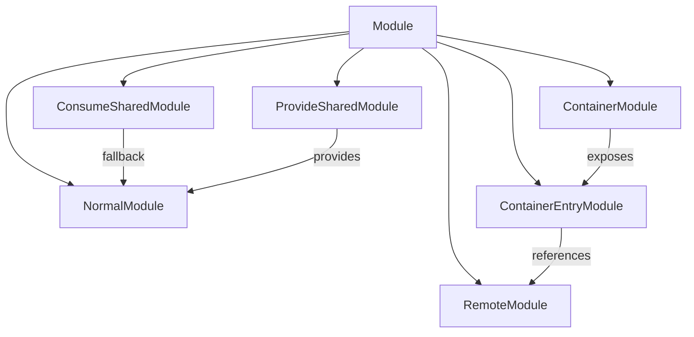
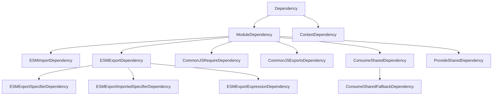

# Core Architecture: Module Graph and Dependency System

This document focuses on the fundamental data structures, module relationships, and dependency resolution mechanisms that form the backbone of the Module Federation system in Rspack.

## Module Graph Architecture

### Core Data Structure

The Module Graph serves as the central nervous system of the bundling process, maintaining relationships between modules, their dependencies, and metadata.

```rust
// Conceptual Module Graph Structure
struct ModuleGraph {
    modules: IdentifierMap<Box<dyn Module>>,
    dependencies: DependencyMap<Box<dyn Dependency>>,
    connections: ConnectionMap<ModuleGraphConnection>,
    exports_info: ExportsInfoMap<ExportsInfo>,
    optimization_bailouts: BailoutMap<Vec<String>>,
}

// Module Graph Connection
struct ModuleGraphConnection {
    origin_module: Option<ModuleIdentifier>,
    dependency: DependencyId,
    module: ModuleIdentifier,
    active_state: ConnectionState,
    conditional: Option<DependencyCondition>,
    explanation: Option<String>,
}
```

### Module Types in Federation



### Module Graph Operations

#### 1. Module Registration
```rust
// Module registration process in module graph
impl ModuleGraph {
    fn add_module(&mut self, module: Box<dyn Module>) -> ModuleIdentifier {
        let identifier = module.identifier();
        self.modules.insert(identifier, module);
        self.create_exports_info(&identifier);
        identifier
    }
    
    fn create_exports_info(&mut self, module_id: &ModuleIdentifier) {
        let exports_info = ExportsInfo::new();
        self.exports_info.insert(*module_id, exports_info);
    }
}
```

#### 2. Dependency Connection
```rust
// Dependency connection establishment
impl ModuleGraph {
    fn set_resolved_module(
        &mut self,
        dependency: &dyn Dependency,
        module: &ModuleIdentifier,
    ) -> Result<()> {
        let connection = ModuleGraphConnection {
            origin_module: self.get_parent_module(dependency.id()),
            dependency: dependency.id(),
            module: *module,
            active_state: dependency.get_initial_connection_state(),
            conditional: dependency.get_condition(),
            explanation: dependency.get_explanation(),
        };
        
        self.connections.insert(dependency.id(), connection);
        self.update_export_dependencies(dependency, module)?;
        Ok(())
    }
}
```

### ConsumeShared Module Graph Integration

```rust
// ConsumeShared module creation and graph integration
impl ConsumeSharedModule {
    fn new(
        consume_options: Arc<ConsumeOptions>,
        fallback_module: Option<ModuleIdentifier>,
    ) -> Self {
        Self {
            identifier: create_consume_shared_identifier(&consume_options),
            consume_options,
            fallback_module,
            exports_info: None,
        }
    }
    
    // Integration with module graph
    fn integrate_with_graph(
        &self,
        module_graph: &mut ModuleGraph,
    ) -> Result<()> {
        // Copy exports from fallback to ConsumeShared module
        if let Some(fallback_id) = &self.fallback_module {
            self.copy_exports_from_fallback(module_graph, fallback_id)?;
        }
        
        // Set up dependencies
        self.create_consume_shared_dependencies(module_graph)?;
        Ok(())
    }
}
```

---

## Dependency Graph System

### Dependency Hierarchy



### Dependency Resolution Pipeline

#### 1. Dependency Discovery
```rust
// JavaScript parser discovering dependencies
impl JavaScriptParser {
    fn visit_import_declaration(&mut self, import: &ImportDecl) -> Result<()> {
        let request = import.src.value.to_string();
        
        // Check if request matches ConsumeShared pattern
        if let Some(consume_options) = self.check_consume_shared(&request) {
            let dependency = ConsumeSharedDependency::new(
                request.into(),
                import.span.into(),
                consume_options,
            );
            self.dependencies.push(Box::new(dependency));
        } else {
            // Regular ESM import
            let dependency = ESMImportDependency::new(
                request.into(),
                import.span.into(),
                import.specifiers.clone(),
            );
            self.dependencies.push(Box::new(dependency));
        }
        Ok(())
    }
}
```

#### 2. Dependency Resolution
```rust
// Module factory resolving dependencies
impl ModuleFactory for ConsumeSharedModuleFactory {
    fn create(
        &self,
        context: &FactoryContext,
        dependency: &dyn ModuleDependency,
    ) -> Result<FactoryResult> {
        let consume_dependency = dependency
            .downcast_ref::<ConsumeSharedDependency>()
            .expect("Expected ConsumeSharedDependency");
        
        // Resolve fallback module
        let fallback_result = self.resolve_fallback(
            context,
            &consume_dependency.fallback_request(),
        )?;
        
        // Create ConsumeShared module
        let consume_shared_module = ConsumeSharedModule::new(
            consume_dependency.consume_options(),
            Some(fallback_result.module_identifier),
        );
        
        Ok(FactoryResult {
            module: Box::new(consume_shared_module),
            file_dependencies: fallback_result.file_dependencies,
            context_dependencies: fallback_result.context_dependencies,
            missing_dependencies: fallback_result.missing_dependencies,
        })
    }
}
```

### ESM Dependency Deep Dive

#### ESMExportSpecifierDependency Analysis
```rust
// ESM Export Specifier implementation from our code analysis
impl ESMExportSpecifierDependency {
    // Enhanced ConsumeShared detection with recursive graph traversal
    fn get_consume_shared_info(&self, module_graph: &ModuleGraph) -> Option<String> {
        // Direct parent check
        if let Some(parent_id) = module_graph.get_parent_module(&self.id) {
            if let Some(parent) = module_graph.module_by_identifier(parent_id) {
                if parent.module_type() == &ModuleType::ConsumeShared {
                    return parent.get_consume_shared_key();
                }
            }
        }
        
        // Recursive incoming connection traversal (up to 5 levels)
        let module_id = module_graph.get_parent_module(&self.id)?;
        let mut visited = HashSet::new();
        self.find_consume_shared_recursive(&module_id, module_graph, &mut visited, 5)
    }
    
    // Recursive search for ConsumeShared modules in reexport chains
    fn find_consume_shared_recursive(
        current_module: &ModuleIdentifier,
        module_graph: &ModuleGraph,
        visited: &mut HashSet<ModuleIdentifier>,
        max_depth: usize,
    ) -> Option<String> {
        if max_depth == 0 || visited.contains(current_module) {
            return None;
        }
        visited.insert(*current_module);
        
        // Check all incoming connections
        for connection in module_graph.get_incoming_connections(current_module) {
            if let Some(origin_id) = connection.original_module_identifier.as_ref() {
                if let Some(origin) = module_graph.module_by_identifier(origin_id) {
                    if origin.module_type() == &ModuleType::ConsumeShared {
                        return origin.get_consume_shared_key();
                    }
                    
                    // Recursive traversal
                    if let Some(key) = self.find_consume_shared_recursive(
                        origin_id, module_graph, visited, max_depth - 1
                    ) {
                        return Some(key);
                    }
                }
            }
        }
        None
    }
}
```

#### CommonJS Export Dependency Analysis
```rust
// CommonJS exports dependency from our code analysis
impl CommonJsExportsDependency {
    // Enhanced ConsumeShared detection for CommonJS modules
    fn detect_consume_shared_context(
        module_graph: &ModuleGraph,
        dep_id: &DependencyId,
        module_identifier: &ModuleIdentifier,
    ) -> Option<String> {
        // Check direct parent
        if let Some(parent_id) = module_graph.get_parent_module(dep_id) {
            if let Some(parent) = module_graph.module_by_identifier(parent_id) {
                if parent.module_type() == &ModuleType::ConsumeShared {
                    return parent.get_consume_shared_key();
                }
            }
        }
        
        // Check incoming connections for ConsumeShared fallback scenarios
        for connection in module_graph.get_incoming_connections(module_identifier) {
            if let Some(origin_id) = connection.original_module_identifier.as_ref() {
                if let Some(origin) = module_graph.module_by_identifier(origin_id) {
                    if origin.module_type() == &ModuleType::ConsumeShared {
                        return origin.get_consume_shared_key();
                    }
                }
            }
        }
        None
    }
}
```

## Key Architectural Principles

### 1. Graph-Centric Design
The architecture is built around two primary graph structures:
- **Module Graph**: Tracks modules and their relationships
- **Dependency Graph**: Manages dependency resolution and connections

### 2. Hierarchical Module Types
Module Federation introduces specialized module types that extend the base module system:
- **ConsumeSharedModule**: Handles shared dependency consumption
- **ProvideSharedModule**: Manages shared dependency provision
- **ContainerModule**: Represents federated containers

### 3. Dependency Resolution Strategy
The system employs a multi-stage dependency resolution process:
1. **Discovery**: Parser identifies dependencies in source code
2. **Classification**: Dependencies are categorized by type
3. **Resolution**: Module factories create appropriate modules
4. **Connection**: Module graph establishes relationships

### 4. Graph Traversal Algorithms
Complex traversal algorithms enable sophisticated features:
- **Recursive ConsumeShared Detection**: Traverses graph to identify shared dependencies
- **Export Propagation**: Copies export information through module chains
- **Optimization Analysis**: Identifies optimization opportunities through graph analysis

This core architecture provides the foundation for Module Federation's advanced features while maintaining flexibility and performance.