# Detailed Implementation Diagrams - Rspack Module Federation

## Table of Contents

1. [Module Graph Implementation](#module-graph-implementation)
2. [Dependency Resolution Details](#dependency-resolution-details)
3. [Chunk Graph Technical Details](#chunk-graph-technical-details)
4. [Runtime Execution Implementation](#runtime-execution-implementation)
5. [Tree-Shaking Implementation](#tree-shaking-implementation)
6. [ConsumeShared Lifecycle Details](#consumeshared-lifecycle-details)
7. [ProvideShared Technical Implementation](#provideshared-technical-implementation)
8. [Import Processing Flows](#import-processing-flows)
9. [Code Generation Details](#code-generation-details)

---

## Module Graph Implementation

### Module Graph Structure with Federation

```mermaid
graph TD
    subgraph "Normal Modules"
        NM1[src/app.js]
        NM2[src/utils.js]
        NM3[src/components/Button.js]
    end
    
    subgraph "ConsumeShared Modules"
        CSM1[consume: react@^18.0.0]
        CSM2[consume: lodash@^4.17.0]
        CSM3[consume: @shared/utils@^1.0.0]
    end
    
    subgraph "ProvideShared Modules"
        PSM1[provide: react@18.2.0]
        PSM2[provide: @myapp/components@1.0.0]
    end
    
    subgraph "Fallback Modules"
        FB1[node_modules/react/index.js]
        FB2[node_modules/lodash/index.js]
        FB3[node_modules/@shared/utils/index.js]
    end
    
    subgraph "Container Modules"
        CM1[Container Entry]
        CM2[Exposed Module: Button]
        CM3[Remote Entry]
    end
    
    NM1 -->|imports| CSM1
    NM1 -->|imports| CSM2
    NM2 -->|imports| CSM3
    NM3 -->|uses| CSM1
    
    CSM1 -.->|fallback| FB1
    CSM2 -.->|fallback| FB2
    CSM3 -.->|fallback| FB3
    
    PSM1 -->|wraps| FB1
    PSM2 -->|wraps| NM3
    
    CM1 -->|exposes| CM2
    CM2 -->|references| NM3
    CM3 -->|loads| CM1
    
    style CSM1 fill:#e1f5fe
    style CSM2 fill:#e1f5fe
    style CSM3 fill:#e1f5fe
    style PSM1 fill:#e8f5e8
    style PSM2 fill:#e8f5e8
    style FB1 fill:#fff3e0
    style FB2 fill:#fff3e0
    style FB3 fill:#fff3e0
```

### Module Graph Connection Details

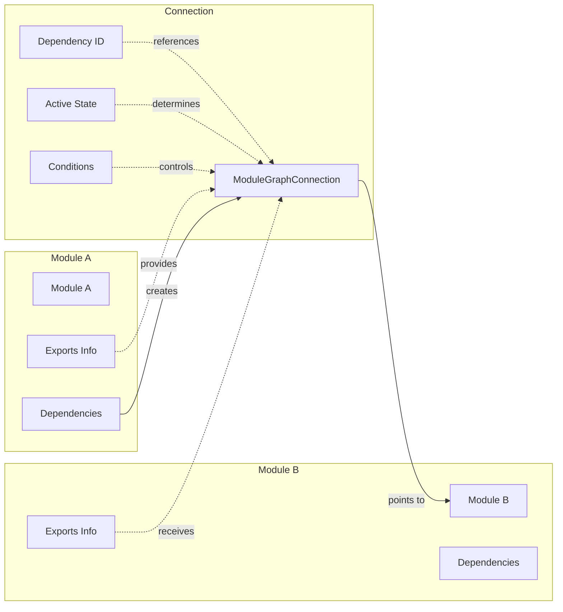

---

## Dependency Resolution Details

### Dependency Types Hierarchy

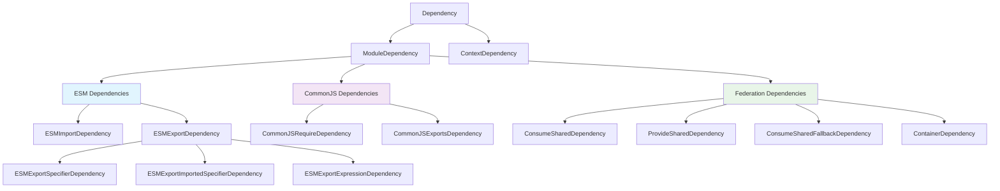

### Dependency Resolution Pipeline

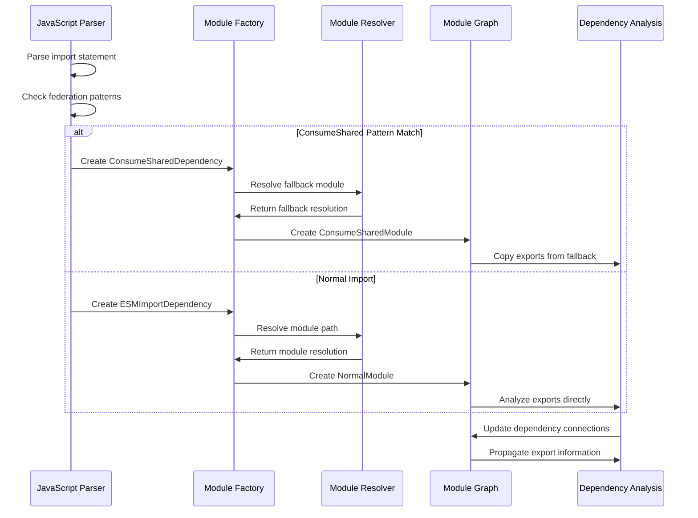

### Export Resolution Chain

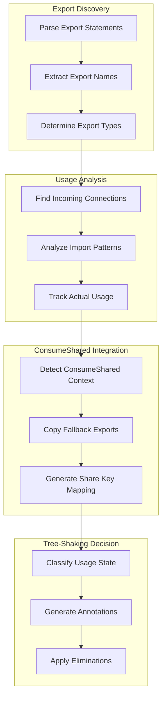

---

## Chunk Graph Technical Details

### Chunk Types and Assignment

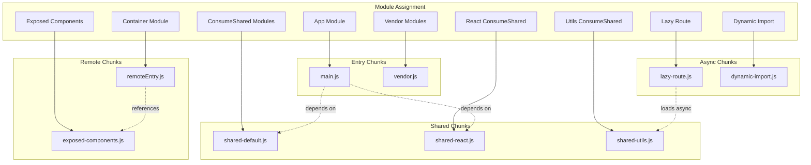

### Chunk Optimization Strategy

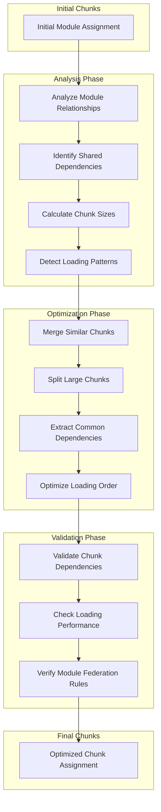

---

## Runtime Execution Implementation

### Share Scope Initialization

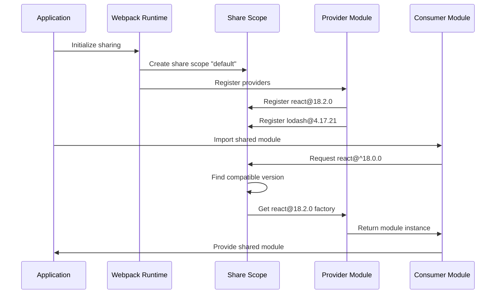

### ConsumeShared Resolution Flow

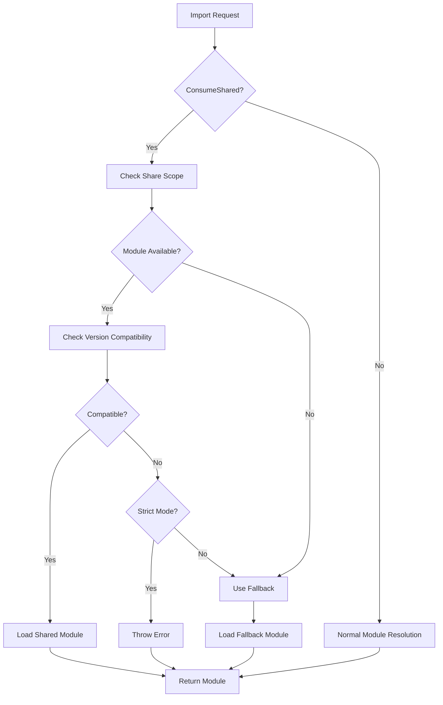

### Dynamic Loading Sequence

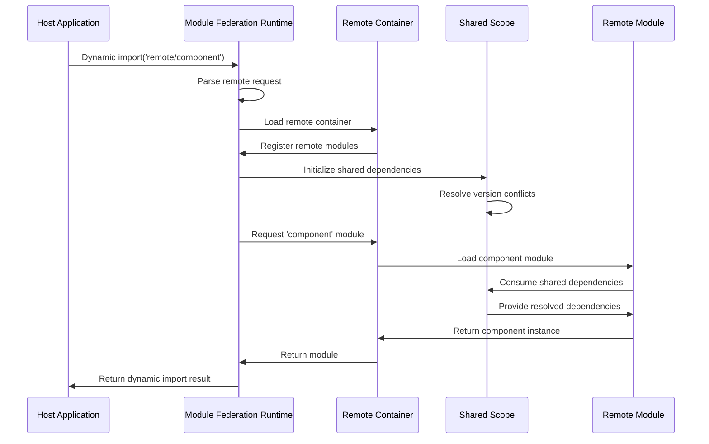

---

## Tree-Shaking Implementation

### Export Usage Analysis Flow

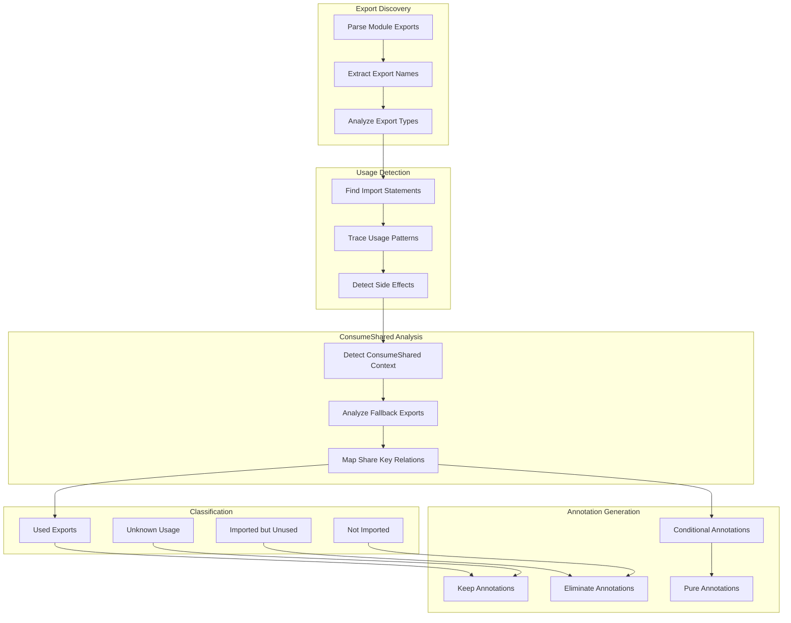

### Tree-Shaking Decision Matrix

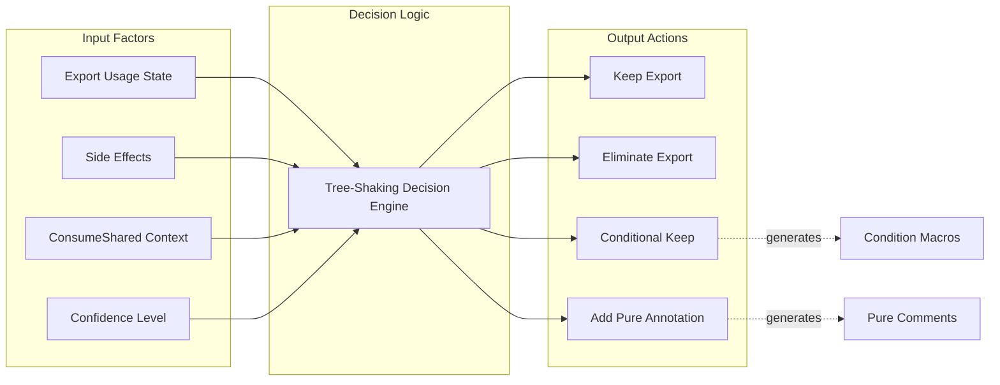

### ConsumeShared Tree-Shaking Integration

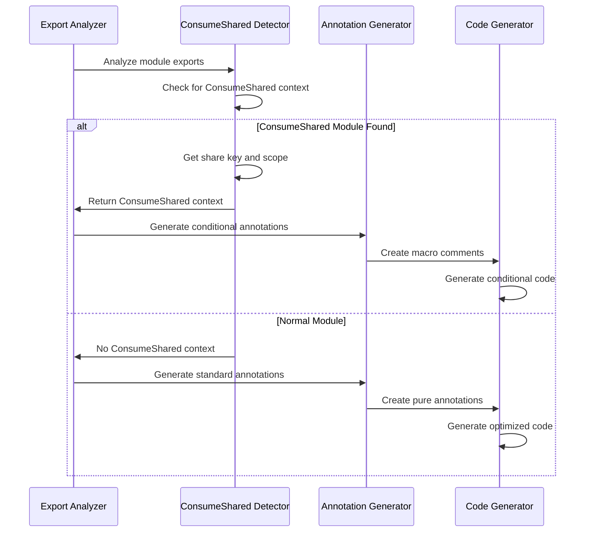

---

## ConsumeShared Lifecycle Details

### ConsumeShared Module Creation

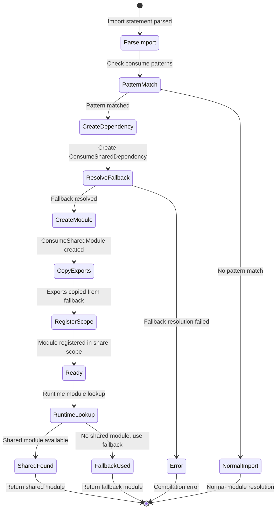

### Export Metadata Propagation

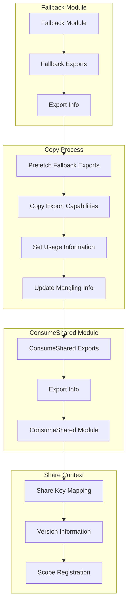

### ConsumeShared Dependency Resolution

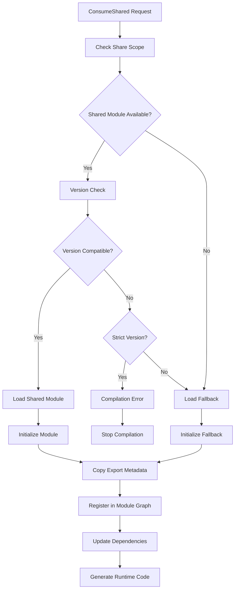

---

## ProvideShared Technical Implementation

### Provider Registration Flow

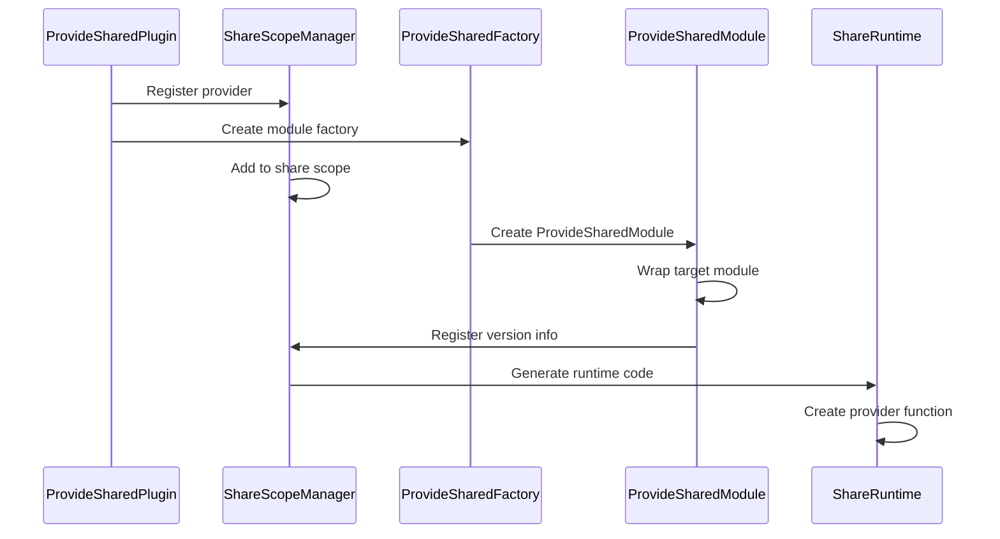

---

## Import Processing Flows

### Complete Import-to-Resolution Flow

```
┌─────────────────────────────────────────────────────────────────┐
│                    MAIN APPLICATION                             │
│                                                                 │
│   src/app.js:                                                  │
│   import { debounce, map } from 'lodash';                      │
│   import { Component } from 'react';                           │
│                    │                                            │
│                    ▼                                            │
│ ┌─────────────────────────────────────────────────────────────┐ │
│ │                MODULE RESOLUTION                            │ │
│ │                                                             │ │
│ │  1. Factorize Hook                                          │ │
│ │     ┌─────────────────────────────────────────────────┐   │ │
│ │     │ ConsumeSharedPlugin.factorize()                 │   │ │
│ │     │ ├─ Check "lodash" in unresolved patterns        │   │ │
│ │     │ ├─ Check "react" in unresolved patterns         │   │ │
│ │     │ └─ Create ConsumeSharedModule instances         │   │ │
│ │     └─────────────────────────────────────────────────┘   │ │
│ │                    │                                        │ │
│ │                    ▼                                        │ │
│ │  2. Module Creation                                         │ │
│ │     ┌─────────────────────────────────────────────────┐   │ │
│ │     │ ConsumeSharedModule {                           │   │ │
│ │     │   share_key: "lodash",                          │   │ │
│ │     │   share_scope: "default",                       │   │ │
│ │     │   fallback: "lodash",                           │   │ │
│ │     │   version: "^4.17.0",                           │   │ │
│ │     │   singleton: true,                              │   │ │
│ │     │   eager: false                                  │   │ │
│ │     │ }                                               │   │ │
│ │     └─────────────────────────────────────────────────┘   │ │
│ └─────────────────────────────────────────────────────────────┘ │
└─────────────────────────────────────────────────────────────────┘
                                │
                                ▼
┌─────────────────────────────────────────────────────────────────┐
│                    DEPENDENCY RESOLUTION                        │
│                                                                 │
│ ┌─────────────────────────────────────────────────────────────┐ │
│ │                ConsumeSharedModule.build()                  │ │
│ │                                                             │ │
│ │  1. Fallback Resolution                                     │ │
│ │     ┌─────────────────────────────────────────────────┐   │ │
│ │     │ import: "lodash"                                │   │ │
│ │     │ ├─ Resolver.resolve()                           │   │ │
│ │     │ ├─ Result: "./node_modules/lodash/index.js"     │   │ │
│ │     │ └─ Create: ConsumeSharedFallbackDependency      │   │ │
│ │     └─────────────────────────────────────────────────┘   │ │
│ │                    │                                        │ │
│ │                    ▼                                        │ │
│ │  2. Loading Strategy                                        │ │
│ │     ┌─────────────────┐  ┌─────────────────────────────┐   │ │
│ │     │ Eager Loading   │  │ Lazy Loading                │   │ │
│ │     │ ├─ Direct Dep   │  │ ├─ AsyncDependenciesBlock   │   │ │
│ │     │ └─ Sync Access  │  │ └─ Promise-based Loading    │   │ │
│ │     └─────────────────┘  └─────────────────────────────┘   │ │
│ └─────────────────────────────────────────────────────────────┘ │
└─────────────────────────────────────────────────────────────────┘
                                │
                                ▼
┌─────────────────────────────────────────────────────────────────┐
│                    EXPORT METADATA PROCESSING                   │
│                                                                 │
│ ┌─────────────────────────────────────────────────────────────┐ │
│ │            finish_modules Hook Execution                    │ │
│ │                                                             │ │
│ │  copy_exports_from_fallback_to_consume_shared()             │ │
│ │     ┌─────────────────────────────────────────────────┐   │ │
│ │     │ Source: ./node_modules/lodash/index.js          │   │ │
│ │     │ ├─ ExportsInfo.get_provided_exports()           │   │ │
│ │     │ ├─ Result: ["debounce", "map", "filter", ...]   │   │ │
│ │     │ └─ Export metadata for each function            │   │ │
│ │     └─────────────────────────────────────────────────┘   │ │
│ │                    │                                        │ │
│ │                    ▼                                        │ │
│ │     ┌─────────────────────────────────────────────────┐   │ │
│ │     │ Target: ConsumeSharedModule("lodash")           │   │ │
│ │     │ ├─ Copy export names and capabilities           │   │ │
│ │     │ ├─ Copy mangle information                      │   │ │
│ │     │ ├─ Copy nested export info                      │   │ │
│ │     │ └─ Set has_provide_info = true                  │   │ │
│ │     └─────────────────────────────────────────────────┘   │ │
│ └─────────────────────────────────────────────────────────────┘ │
└─────────────────────────────────────────────────────────────────┘
```

### Fallback Module Analysis Details

```
┌─────────────────────────────────────────────────────────────────┐
│                 FALLBACK MODULE ANALYSIS                        │
│                                                                 │
│ Input: ConsumeSharedModule("lodash")                           │
│                    │                                            │
│                    ▼                                            │
│ ┌─────────────────────────────────────────────────────────────┐ │
│ │              Find Fallback Module                           │ │
│ │                                                             │ │
│ │  1. API Method (Preferred)                                  │ │
│ │     ┌─────────────────────────────────────────────────┐   │ │
│ │     │ ConsumeSharedModule::find_fallback_module_id()  │   │ │
│ │     │ └─ Returns: ModuleIdentifier                    │   │ │
│ │     └─────────────────────────────────────────────────┘   │ │
│ │                    │                                        │ │
│ │                    ▼                                        │ │
│ │  2. Dependency Traversal (Fallback)                        │ │
│ │     ┌─────────────────────────────────────────────────┐   │ │
│ │     │ for dep in module.get_dependencies() {          │   │ │
│ │     │   if dep.dependency_type() ==                   │   │ │
│ │     │      "consume shared fallback" {                │   │ │
│ │     │     return module_graph                         │   │ │
│ │     │       .module_identifier_by_dependency_id()     │   │ │
│ │     │   }                                             │   │ │
│ │     │ }                                               │   │ │
│ │     └─────────────────────────────────────────────────┘   │ │
│ └─────────────────────────────────────────────────────────────┘ │
│                    │                                            │
│                    ▼                                            │
│ ┌─────────────────────────────────────────────────────────────┐ │
│ │              Analyze Fallback Exports                       │ │
│ │                                                             │ │
│ │  Result: ./node_modules/lodash/index.js                    │ │
│ │     ┌─────────────────────────────────────────────────┐   │ │
│ │     │ ExportsInfoGetter::prefetch()                   │   │ │
│ │     │ ├─ Mode: PrefetchExportsInfoMode::AllExports    │   │ │
│ │     │ ├─ Provided: ["debounce", "map", "filter",      │   │ │
│ │     │ │            "throttle", "chunk", "compact",    │   │ │
│ │     │ │            "concat", "difference", ...]       │   │ │
│ │     │ ├─ Side Effects: false                          │   │ │
│ │     │ └─ Export Details: {                            │   │ │
│ │     │     "debounce": {                               │   │ │
│ │     │       provided: true,                           │   │ │
│ │     │       can_mangle: true,                         │   │ │
│ │     │       terminal_binding: true                    │   │ │
│ │     │     }                                           │   │ │
│ │     │   }                                             │   │ │
│ │     └─────────────────────────────────────────────────┘   │ │
│ └─────────────────────────────────────────────────────────────┘ │
└─────────────────────────────────────────────────────────────────┘
```

---

## Code Generation Details

### ConsumeShared Runtime Module Generation

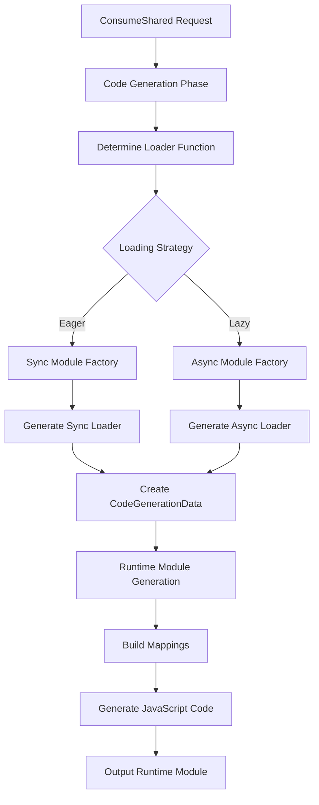

### Runtime Code Structure

```
┌─────────────────────────────────────────────────────────────────┐
│              RUNTIME CODE GENERATION FLOW                     │
│                                                                 │
│ ┌─────────────────────────────────────────────────────────────┐ │
│ │           Code Generation Phase                             │ │
│ │                                                             │ │
│ │  ConsumeSharedModule.code_generation()                      │ │
│ │     ┌─────────────────────────────────────────────────┐   │ │
│ │     │ 1. Determine Loader Function                    │   │ │
│ │     │    ├─ Base: "loaders.load"                      │   │ │
│ │     │    ├─ + Version: "loadVersionCheck"             │   │ │
│ │     │    ├─ + Strict: "loadStrictVersionCheck"        │   │ │
│ │     │    └─ + Singleton: "loadSingletonVersionCheck"  │   │ │
│ │     │                                                 │   │ │
│ │     │ 2. Generate Arguments                           │   │ │
│ │     │    ├─ shareScope: "default"                     │   │ │
│ │     │    ├─ shareKey: "lodash"                        │   │ │
│ │     │    ├─ version: "^4.17.0"                        │   │ │
│ │     │    └─ fallback: factory function                │   │ │
│ │     │                                                 │   │ │
│ │     │ 3. Create Factory Function                      │   │ │
│ │     │    ├─ Eager: sync_module_factory()              │   │ │
│ │     │    └─ Lazy: async_module_factory()              │   │ │
│ │     └─────────────────────────────────────────────────┘   │ │
│ │                    │                                        │ │
│ │                    ▼                                        │ │
│ │  CodeGenerationDataConsumeShared {                          │ │
│ │     ┌─────────────────────────────────────────────────┐   │ │
│ │     │ share_scope: "default",                         │   │ │
│ │     │ share_key: "lodash",                            │   │ │
│ │     │ import: false,                                  │   │ │
│ │     │ required_version: Some("^4.17.0"),              │   │ │
│ │     │ strict_version: false,                          │   │ │
│ │     │ singleton: true,                                │   │ │
│ │     │ eager: false,                                   │   │ │
│ │     │ fallback: Some("function() { ... }")           │   │ │
│ │     └─────────────────────────────────────────────────┘   │ │
│ └─────────────────────────────────────────────────────────────┘ │
│                    │                                            │
│                    ▼                                            │
│ ┌─────────────────────────────────────────────────────────────┐ │
│ │          Runtime Module Generation                          │ │
│ │                                                             │ │
│ │  ConsumeSharedRuntimeModule.generate()                      │ │
│ │     ┌─────────────────────────────────────────────────┐   │ │
│ │     │ 1. Collect Module Data                          │   │ │
│ │     │    ├─ Iterate all chunks                        │   │ │
│ │     │    ├─ Find ConsumeShared modules                │   │ │
│ │     │    └─ Extract CodeGenerationData                │   │ │
│ │     │                                                 │   │ │
│ │     │ 2. Build Mappings                               │   │ │
│ │     │    ├─ chunkMapping: chunk → module IDs          │   │ │
│ │     │    ├─ moduleIdToConsumeDataMapping: config      │   │ │
│ │     │    └─ initialConsumes: eager modules            │   │ │
│ │     │                                                 │   │ │
│ │     │ 3. Generate JavaScript Code                     │   │ │
│ │     │    ├─ __webpack_require__.consumesLoadingData   │   │ │
│ │     │    ├─ Include JavaScript loaders                │   │ │
│ │     │    └─ Include loader selection logic            │   │ │
│ │     └─────────────────────────────────────────────────┘   │ │
│ └─────────────────────────────────────────────────────────────┘ │
│                    │                                            │
│                    ▼                                            │
│ ┌─────────────────────────────────────────────────────────────┐ │
│ │              Final JavaScript Output                        │ │
│ │                                                             │ │
│ │     ┌─────────────────────────────────────────────────┐   │ │
│ │     │ __webpack_require__.consumesLoadingData = {     │   │ │
│ │     │   chunkMapping: {                               │   │ │
│ │     │     "main": ["default-lodash"]                  │   │ │
│ │     │   },                                            │   │ │
│ │     │   moduleIdToConsumeDataMapping: {               │   │ │
│ │     │     "lodash": {                                 │   │ │
│ │     │       shareScope: "default",                   │   │ │
│ │     │       shareKey: "lodash",                       │   │ │
│ │     │       requiredVersion: "^4.17.0",               │   │ │
│ │     │       singleton: true,                          │   │ │
│ │     │       fallback: function() { ... }             │   │ │
│ │     │     }                                           │   │ │
│ │     │   },                                            │   │ │
│ │     │   initialConsumes: []                           │   │ │
│ │     │ };                                              │   │ │
│ │     │                                                 │   │ │
│ │     │ // JavaScript loaders for version resolution   │   │ │
│ │     │ var load = ...                                  │   │ │
│ │     │ var loadVersionCheck = ...                      │   │ │
│ │     │ var resolveHandler = ...                        │   │ │
│ │     └─────────────────────────────────────────────────┘   │ │
│ └─────────────────────────────────────────────────────────────┘ │
└─────────────────────────────────────────────────────────────────┘
```

This document provides detailed technical diagrams showing the implementation-level flows, component interactions, and code generation processes within the Rspack Module Federation system. These diagrams are designed for developers who need to understand the intricate workings of the system at the code level.