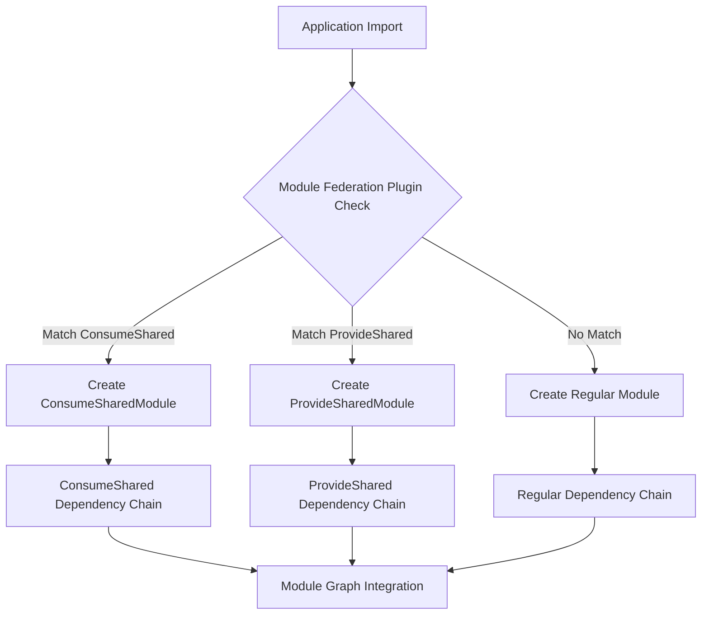
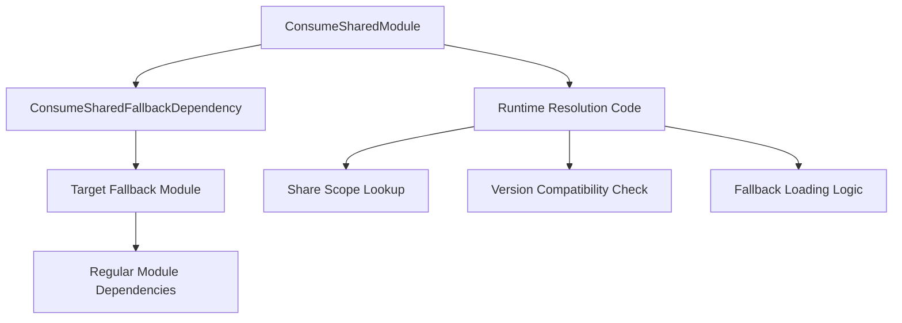
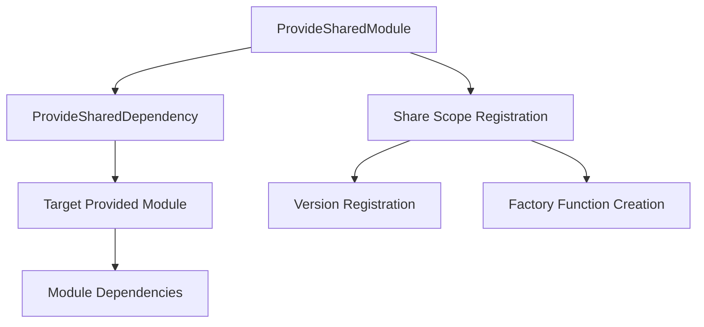
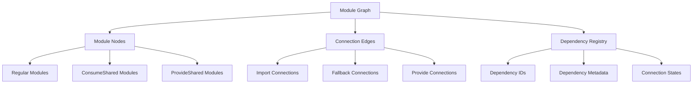
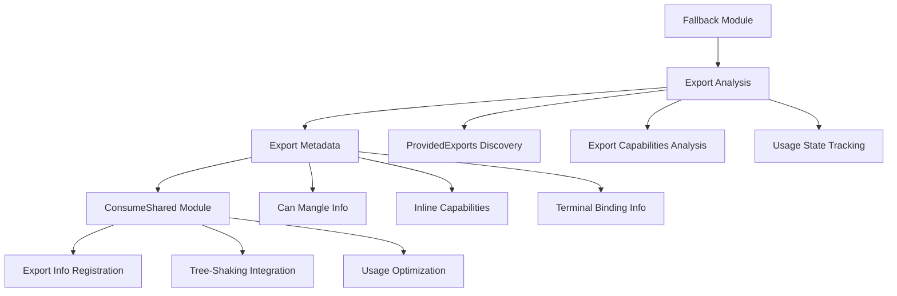
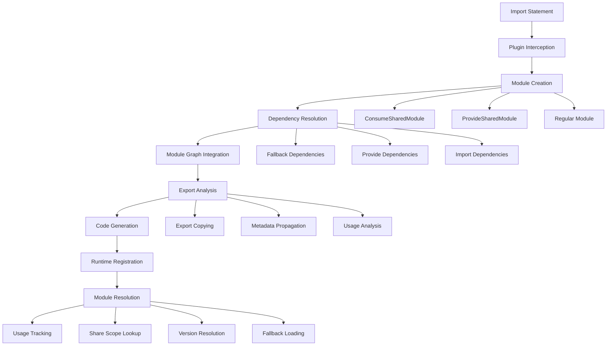

# Module Interlinking Architecture - Import, Consume, and Provide Systems

## Overview

This document provides comprehensive analysis of how modules are interlinked in Rspack's Module Federation system, covering the complete flow from import statements to module resolution, including the intricate relationships between importing, consuming, and providing modules.

## Core Module Types and Their Relationships

### 1. **Regular Import Modules** - Standard Module Dependencies

Regular import modules handle standard ES6 imports and CommonJS requires without Module Federation involvement.

```javascript
// Application code
import { debounce } from 'lodash-es';
import React from 'react';
import './styles.css';
```

**Implementation Flow:**
```rust
// Created during parsing
pub struct ESMImportSpecifierDependency {
    id: DependencyId,
    request: String,           // "lodash-es"
    ids: Vec<Atom>,           // ["debounce"]
    name: Atom,               // "debounce"
    range: DependencyRange,
    // ... other fields
}
```

### 2. **ConsumeShared Modules** - Shared Module Consumers

ConsumeShared modules attempt to use shared modules from the federation scope, with fallback to local modules.

```rust
// ConsumeShared module structure
pub struct ConsumeSharedModule {
    identifier: ModuleIdentifier,
    context: Context,
    options: ConsumeOptions {
        import: Option<String>,           // "./node_modules/lodash-es"
        import_resolved: Option<String>,  // Resolved fallback path
        share_key: String,               // "lodash-es"
        share_scope: String,             // "default"
        required_version: Option<ConsumeVersion>, // "^4.17.21"
        strict_version: bool,            // true
        singleton: bool,                 // false
        eager: bool,                     // false
    },
    dependencies: Vec<DependencyId>,     // Fallback dependencies
    blocks: Vec<AsyncDependenciesBlockIdentifier>, // Async loading blocks
}
```

### 3. **ProvideShared Modules** - Shared Module Providers

ProvideShared modules expose local modules to the federation scope for consumption by other applications.

```rust
// ProvideShared module structure
pub struct ProvideSharedModule {
    identifier: ModuleIdentifier,
    name: String,                        // "lodash-es"
    share_scope: String,                // "default"
    version: ProvideVersion,            // "4.17.21"
    request: String,                    // "./node_modules/lodash-es"
    eager: bool,                        // false
    singleton: Option<bool>,            // Some(false)
    required_version: Option<ConsumeVersion>,
    dependencies: Vec<DependencyId>,     // Target module dependencies
}
```

## Module Interlinking Mechanisms

### Phase 1: Module Request Interception



**Interception Logic:**
```rust
// ConsumeSharedPlugin.factorize()
async fn factorize(&self, data: &mut ModuleFactoryCreateData) -> Result<Option<BoxModule>> {
    let request = dep.request();
    let consumes = self.get_matched_consumes();
    
    // Check if request matches consume patterns
    if let Some(matched) = consumes.unresolved.get(request) {
        // Create ConsumeShared module instead of regular module
        let consume_shared_module = self.create_consume_shared_module(
            &data.context,
            request,
            matched.clone(),
            &mut add_diagnostic,
        ).await?;
        return Ok(Some(consume_shared_module.boxed()));
    }
    
    // Check prefix patterns
    for (prefix, options) in &consumes.prefixed {
        if request.starts_with(prefix) {
            // Create prefixed ConsumeShared module
            // ...
        }
    }
    
    Ok(None) // Let normal module factory handle
}
```

### Phase 2: Dependency Chain Creation

#### **ConsumeShared Dependency Chain**



**Implementation:**
```rust
// ConsumeSharedModule.build()
async fn build(&mut self, build_context: BuildContext<'_>) -> Result<BuildResult> {
    let mut dependencies = Vec::new();
    let mut blocks = Vec::new();
    
    // Create fallback dependency
    if let Some(fallback) = &self.options.import {
        let fallback_dep = Box::new(ConsumeSharedFallbackDependency::new(
            fallback.clone()
        ));
        
        if self.options.eager {
            // Synchronous loading - direct dependency
            dependencies.push(fallback_dep as BoxDependency);
        } else {
            // Asynchronous loading - wrapped in async block
            let async_block = AsyncDependenciesBlock::new(
                self.identifier,
                None,
                None,
                vec![fallback_dep],
                None,
            );
            blocks.push(Box::new(async_block));
        }
    }
    
    Ok(BuildResult {
        dependencies,
        blocks,
        // ...
    })
}
```

#### **ProvideShared Dependency Chain**



**Implementation:**
```rust
// ProvideSharedModule.build()
async fn build(&mut self, build_context: BuildContext<'_>) -> Result<BuildResult> {
    let mut dependencies = Vec::new();
    
    // Create dependency to the provided module
    let provide_dep = Box::new(ProvideSharedDependency::new(
        self.request.clone()
    ));
    
    if self.eager {
        dependencies.push(provide_dep as BoxDependency);
    } else {
        // Create async block for lazy loading
        let async_block = AsyncDependenciesBlock::new(
            self.identifier,
            None,
            None,
            vec![provide_dep],
            None,
        );
        blocks.push(Box::new(async_block));
    }
    
    Ok(BuildResult {
        dependencies,
        blocks,
        // ...
    })
}
```

### Phase 3: Module Graph Construction



**Module Graph Integration:**
```rust
// Module graph construction
fn add_module_connection(
    &mut self,
    origin_module: Option<&ModuleIdentifier>,
    dependency: &BoxDependency,
    target_module: &ModuleIdentifier,
) {
    let connection = ModuleGraphConnection {
        origin_module_identifier: origin_module.copied(),
        dependency_id: dependency.id().clone(),
        module_identifier: *target_module,
        is_target_active: |module_graph, runtime, runtime_spec| {
            // Connection state logic
            match dependency.dependency_type() {
                DependencyType::ConsumeSharedFallback => {
                    // Check if shared module is available
                    if self.is_shared_module_available(dependency, runtime) {
                        ConnectionState::CircularConnection // Skip fallback
                    } else {
                        ConnectionState::Active(true) // Use fallback
                    }
                }
                DependencyType::ProvideModuleForShared => {
                    ConnectionState::Active(true) // Always active for provision
                }
                _ => ConnectionState::Active(true)
            }
        },
        // ...
    };
    
    self.connections.insert(dependency.id().clone(), connection);
}
```

## Export Information Propagation

### Fallback-to-ConsumeShared Export Copying



**Implementation:**
```rust
// Copy exports from fallback to ConsumeShared
fn copy_exports_from_fallback_to_consume_shared(
    module_graph: &mut ModuleGraph,
    fallback_id: &ModuleIdentifier,
    consume_shared_id: &ModuleIdentifier,
) -> Result<()> {
    // Get export information from fallback module
    let fallback_exports_info = module_graph.get_exports_info(fallback_id);
    let consume_shared_exports_info = module_graph.get_exports_info(consume_shared_id);
    
    // Prefetch all export metadata efficiently
    let prefetched_fallback = ExportsInfoGetter::prefetch(
        &fallback_exports_info,
        module_graph,
        PrefetchExportsInfoMode::AllExports,
    );
    
    let fallback_provided = prefetched_fallback.get_provided_exports();
    
    match fallback_provided {
        ProvidedExports::ProvidedNames(export_names) => {
            // Copy each specific export with full metadata
            for export_name in export_names {
                let consume_shared_export_info = 
                    consume_shared_exports_info.get_export_info(module_graph, &export_name);
                let fallback_export_info = 
                    fallback_exports_info.get_export_info(module_graph, &export_name);
                
                // Copy comprehensive export metadata
                copy_export_metadata(
                    module_graph,
                    &fallback_export_info,
                    &consume_shared_export_info,
                )?;
            }
            
            // Mark ConsumeShared as having complete export information
            consume_shared_exports_info.set_has_provide_info(module_graph);
        }
        ProvidedExports::ProvidedAll => {
            // Mark all exports as provided (namespace export)
            consume_shared_exports_info.set_unknown_exports_provided(
                module_graph,
                true,  // provided
                None,  // no exclude exports
                None,  // no can_mangle
                None,  // no terminal_binding
                None,  // no target_key
            );
        }
        ProvidedExports::Unknown => {
            // Keep unknown status - conservative approach
        }
    }
    
    Ok(())
}

fn copy_export_metadata(
    module_graph: &mut ModuleGraph,
    fallback_export_info: &ExportInfo,
    consume_shared_export_info: &ExportInfo,
) -> Result<()> {
    // Copy provided status
    if let Some(provided) = fallback_export_info.as_data(module_graph).provided() {
        consume_shared_export_info
            .as_data_mut(module_graph)
            .set_provided(Some(provided));
    }
    
    // Copy mangling capabilities
    if let Some(can_mangle) = fallback_export_info
        .as_data(module_graph)
        .can_mangle_provide()
    {
        consume_shared_export_info
            .as_data_mut(module_graph)
            .set_can_mangle_provide(Some(can_mangle));
    }
    
    // Copy nested export information
    if let Some(nested_exports_info) = 
        fallback_export_info.as_data(module_graph).exports_info()
    {
        consume_shared_export_info
            .as_data_mut(module_graph)
            .set_exports_info(Some(nested_exports_info));
    }
    
    // Copy terminal binding information
    let terminal_binding = fallback_export_info
        .as_data(module_graph)
        .terminal_binding();
    if terminal_binding {
        consume_shared_export_info
            .as_data_mut(module_graph)
            .set_terminal_binding(terminal_binding);
    }
    
    Ok(())
}
```

## Runtime Code Generation and Module Resolution

### ConsumeShared Resolution Logic

```javascript
// Generated runtime resolution for ConsumeShared modules
var resolveConsumeShared = function(shareScope, shareKey, requiredVersion, fallback, strict, singleton) {
    return new Promise(function(resolve, reject) {
        // Step 1: Check share scope availability
        var scope = __webpack_require__.S[shareScope];
        if (!scope || !scope[shareKey]) {
            console.warn(`Shared module ${shareKey} not found in scope ${shareScope}, using fallback`);
            return resolve(fallback());
        }
        
        // Step 2: Find compatible version
        var availableVersions = Object.keys(scope[shareKey]);
        var compatibleVersion = null;
        var highestVersion = null;
        
        for (var version of availableVersions) {
            if (satisfy(requiredVersion, version)) {
                if (!compatibleVersion || versionLt(compatibleVersion, version)) {
                    compatibleVersion = version;
                }
            }
            if (!highestVersion || versionLt(highestVersion, version)) {
                highestVersion = version;
            }
        }
        
        // Step 3: Handle strict version checking
        if (strict && !compatibleVersion) {
            if (highestVersion) {
                console.error(`Strict version check failed for ${shareKey}. Required: ${requiredVersion}, Available: ${availableVersions.join(', ')}`);
                return reject(new Error(`Version mismatch for ${shareKey}`));
            } else {
                return resolve(fallback());
            }
        }
        
        var selectedVersion = compatibleVersion || highestVersion;
        if (!selectedVersion) {
            return resolve(fallback());
        }
        
        // Step 4: Handle singleton constraint
        if (singleton) {
            var singletonKey = `${shareScope}:${shareKey}`;
            if (window.__webpack_singleton_cache__[singletonKey]) {
                return resolve(window.__webpack_singleton_cache__[singletonKey]);
            }
        }
        
        // Step 5: Load the shared module
        var factory = scope[shareKey][selectedVersion];
        try {
            var modulePromise = factory.get();
            if (modulePromise && typeof modulePromise.then === 'function') {
                // Async module
                modulePromise.then(function(module) {
                    if (singleton) {
                        window.__webpack_singleton_cache__[singletonKey] = module;
                    }
                    resolve(module);
                }).catch(function(error) {
                    console.warn(`Failed to load shared module ${shareKey}@${selectedVersion}, using fallback:`, error);
                    resolve(fallback());
                });
            } else {
                // Sync module
                if (singleton) {
                    window.__webpack_singleton_cache__[singletonKey] = modulePromise;
                }
                resolve(modulePromise);
            }
        } catch (error) {
            console.warn(`Error loading shared module ${shareKey}@${selectedVersion}, using fallback:`, error);
            resolve(fallback());
        }
    });
};
```

### ProvideShared Registration Logic

```javascript
// Generated runtime registration for ProvideShared modules
var registerSharedModule = function(shareScope, shareKey, version, factory, eager) {
    // Initialize share scope if needed
    __webpack_require__.S[shareScope] = __webpack_require__.S[shareScope] || {};
    var scope = __webpack_require__.S[shareScope];
    
    // Initialize module entry
    scope[shareKey] = scope[shareKey] || {};
    var versions = scope[shareKey];
    
    // Check for existing version
    if (versions[version]) {
        console.warn(`Shared module ${shareKey}@${version} already registered, skipping`);
        return;
    }
    
    // Register the module factory
    versions[version] = {
        get: factory,
        from: __webpack_require__.federation.name || 'unknown',
        eager: !!eager,
        loaded: false,
        loading: null
    };
    
    // Handle eager loading
    if (eager) {
        try {
            var module = factory();
            versions[version].loaded = true;
            return module;
        } catch (error) {
            console.error(`Failed to eagerly load shared module ${shareKey}@${version}:`, error);
            versions[version].loaded = false;
        }
    }
};

// Registration calls for provided modules
registerSharedModule("default", "lodash-es", "4.17.21", function() {
    return __webpack_require__("./node_modules/lodash-es/lodash.js");
}, false);

registerSharedModule("default", "react", "18.2.0", function() {
    return __webpack_require__("./node_modules/react/index.js");
}, false);
```

## Module Lifecycle and State Management

### Complete Module Lifecycle



### Module State Tracking

```rust
// Module state management
pub struct ModuleState {
    pub loading_state: LoadingState,
    pub resolution_state: ResolutionState,
    pub federation_state: FederationState,
}

pub enum LoadingState {
    NotLoaded,
    Loading,
    Loaded(Box<dyn Module>),
    Failed(String),
}

pub enum ResolutionState {
    Unresolved,
    Resolving,
    Resolved(ModuleIdentifier),
    ResolutionFailed(String),
}

pub enum FederationState {
    NotFederated,
    ConsumeShared {
        share_key: String,
        fallback_used: bool,
        version_resolved: Option<String>,
    },
    ProvideShared {
        share_key: String,
        version: String,
        registered: bool,
    },
}
```

## Cross-Module Communication Patterns

### 1. **Direct Import Pattern**
```javascript
// Application code
import { debounce } from 'lodash-es';
// Direct dependency resolution without federation
```

### 2. **Consume-Provide Pattern**
```javascript
// Consumer application
import { debounce } from 'lodash-es'; // Resolved via ConsumeShared

// Provider application - shares the same module
// Automatically registered via ProvideShared
```

### 3. **Fallback Pattern**
```javascript
// Consumer application with fallback
import { debounce } from 'lodash-es'; 
// First tries shared scope, falls back to local ./node_modules/lodash-es
```

### 4. **Version Negotiation Pattern**
```javascript
// Multiple consumers with different version requirements
// Consumer A: requires lodash-es@^4.17.0
// Consumer B: requires lodash-es@^4.18.0
// System resolves to highest compatible version
```

## Performance Optimizations and Caching

### Module Resolution Caching

```javascript
// Runtime caching mechanisms
var moduleResolutionCache = {
    resolved: new Map(),        // shareScope:shareKey -> resolved module
    failed: new Set(),          // Failed resolution attempts
    pending: new Map(),         // Ongoing resolution promises
    
    getOrResolve: function(shareScope, shareKey, requiredVersion, fallback) {
        var cacheKey = `${shareScope}:${shareKey}@${requiredVersion}`;
        
        // Check resolved cache
        if (this.resolved.has(cacheKey)) {
            return Promise.resolve(this.resolved.get(cacheKey));
        }
        
        // Check failed cache
        if (this.failed.has(cacheKey)) {
            return fallback();
        }
        
        // Check pending resolutions
        if (this.pending.has(cacheKey)) {
            return this.pending.get(cacheKey);
        }
        
        // Start new resolution
        var promise = resolveConsumeShared(shareScope, shareKey, requiredVersion, fallback)
            .then(function(module) {
                this.resolved.set(cacheKey, module);
                this.pending.delete(cacheKey);
                return module;
            }.bind(this))
            .catch(function(error) {
                this.failed.add(cacheKey);
                this.pending.delete(cacheKey);
                return fallback();
            }.bind(this));
        
        this.pending.set(cacheKey, promise);
        return promise;
    }
};
```

### Dependency Optimization

```rust
// Dependency optimization during compilation
fn optimize_dependencies(
    &mut self,
    compilation: &mut Compilation,
) -> Result<()> {
    let module_graph = compilation.get_module_graph();
    
    // Find ConsumeShared modules that could be optimized
    for (module_id, module) in module_graph.modules() {
        if module.module_type() == &ModuleType::ConsumeShared {
            // Check if shared module is actually available
            if !self.is_shared_module_likely_available(module_id, &module_graph) {
                // Convert to direct dependency to avoid runtime overhead
                self.convert_to_direct_dependency(module_id, compilation)?;
            }
        }
    }
    
    Ok(())
}
```

## Summary

The module interlinking architecture in Rspack's Module Federation provides:

1. **Flexible Import Resolution**: Seamless switching between shared and local modules
2. **Comprehensive Metadata Propagation**: Complete export information flows from providers to consumers
3. **Robust Fallback Mechanisms**: Graceful degradation when shared modules are unavailable
4. **Performance Optimization**: Caching, eager loading, and dependency optimization
5. **Type Safety**: Strong typing throughout the compilation and runtime phases
6. **Developer Experience**: Clear separation of concerns and comprehensive error handling

This architecture enables sophisticated micro-frontend scenarios while maintaining reliability, performance, and developer experience through intelligent module resolution and comprehensive metadata management.