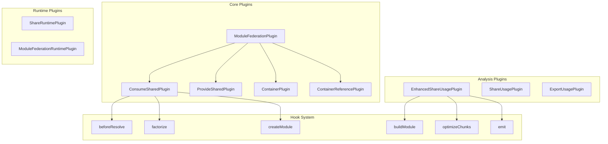
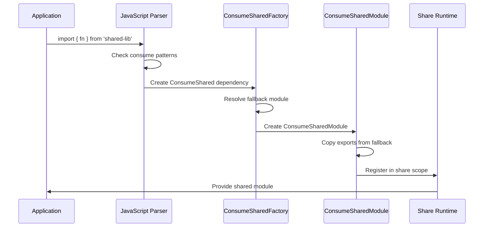

# Module Federation Plugin Ecosystem

## Table of Contents

1. [Plugin Architecture Overview](#plugin-architecture-overview)
2. [Plugin Implementation Details](#plugin-implementation-details)
3. [ConsumeShared Deep Dive](#consumeshared-deep-dive)
4. [ProvideShared Deep Dive](#provideshared-deep-dive)

---

## Plugin Architecture Overview



## Plugin Implementation Details

### ConsumeSharedPlugin Deep Dive
```rust
impl ConsumeSharedPlugin {
    // Plugin initialization and hook registration
    fn apply(&self, compiler: &mut Compiler) -> Result<()> {
        // Register factory for ConsumeShared dependencies
        compiler.compilation_hooks
            .dependency_reference_type
            .tap("ConsumeSharedPlugin", |dependency_ref| {
                if dependency_ref.dependency_type == DependencyType::ConsumeShared {
                    dependency_ref.factory = Some(Arc::new(ConsumeSharedModuleFactory::new()));
                }
            });
        
        // Hook into resolver to intercept matching requests
        compiler.resolver_hooks
            .before_resolve
            .tap("ConsumeSharedPlugin", |resolve_data| {
                self.intercept_request(resolve_data)
            });
        
        // Hook into compilation to set up runtime modules
        compiler.compilation_hooks
            .this_compilation
            .tap("ConsumeSharedPlugin", |compilation| {
                self.setup_runtime_modules(compilation)
            });
        
        Ok(())
    }
    
    // Request interception logic
    fn intercept_request(&self, resolve_data: &mut ResolveData) -> Result<InterceptResult> {
        let request = &resolve_data.request;
        
        // Check if request matches any consume patterns
        for (pattern, consume_options) in &self.consume_options {
            if self.matches_pattern(pattern, request) {
                // Create ConsumeShared dependency
                let dependency = ConsumeSharedDependency::new(
                    request.clone(),
                    resolve_data.context.clone(),
                    consume_options.clone(),
                );
                
                return Ok(InterceptResult::Replaced(dependency));
            }
        }
        
        Ok(InterceptResult::Continue)
    }
}
```

### EnhancedShareUsagePlugin Implementation
```rust
impl EnhancedShareUsagePlugin {
    // Advanced usage analysis with caching and batch processing
    fn analyze_share_usage(
        &self,
        compilation: &Compilation,
    ) -> Result<ShareUsageAnalysis> {
        let module_graph = compilation.get_module_graph();
        let cache = &self.cache;
        
        let mut analysis = ShareUsageAnalysis::new();
        let mut batch_processor = BatchProcessor::new(self.options.batch_size);
        
        // Collect all ConsumeShared modules
        let consume_shared_modules = module_graph
            .modules()
            .values()
            .filter_map(|module| {
                if module.module_type() == &ModuleType::ConsumeShared {
                    Some(module.identifier())
                } else {
                    None
                }
            })
            .collect::<Vec<_>>();
        
        // Batch process modules for efficiency
        for batch in batch_processor.batches(&consume_shared_modules) {
            let batch_results = self.analyze_module_batch(
                batch,
                module_graph,
                cache,
            )?;
            analysis.merge_batch_results(batch_results);
        }
        
        // Runtime-specific analysis
        if self.options.runtime_analysis {
            for runtime in compilation.get_runtimes() {
                let runtime_analysis = self.analyze_runtime_usage(
                    &consume_shared_modules,
                    module_graph,
                    &runtime,
                )?;
                analysis.add_runtime_analysis(runtime, runtime_analysis);
            }
        }
        
        Ok(analysis)
    }
    
    // Batch processing for performance optimization
    fn analyze_module_batch(
        &self,
        modules: &[ModuleIdentifier],
        module_graph: &ModuleGraph,
        cache: &AnalysisCache,
    ) -> Result<BatchAnalysisResult> {
        let mut results = Vec::new();
        
        // Prefetch exports info for all modules in batch
        let exports_info_batch = self.batch_prefetch_exports_info(modules, module_graph)?;
        
        for module_id in modules {
            let cache_key = self.create_cache_key(module_id);
            
            let module_analysis = cache.get_or_compute(cache_key, || {
                self.analyze_single_module(module_id, module_graph, &exports_info_batch)
            })?;
            
            results.push(module_analysis);
        }
        
        Ok(BatchAnalysisResult { results })
    }
}
```

---

## ConsumeShared Deep Dive

### ConsumeShared Module Lifecycle



### Fallback Resolution Strategy

```rust
impl ConsumeSharedModule {
    // Enhanced fallback resolution with version compatibility
    fn resolve_fallback(
        &self,
        resolver: &Resolver,
        context: &ResolveContext,
    ) -> Result<FallbackResult> {
        let fallback_request = &self.consume_options.fallback;
        
        // Primary fallback resolution
        match resolver.resolve(context, fallback_request) {
            Ok(resolution) => {
                let fallback_module = self.create_fallback_module(resolution)?;
                Ok(FallbackResult {
                    module: fallback_module,
                    strategy: FallbackStrategy::LocalModule,
                })
            }
            Err(primary_error) => {
                // Secondary fallback strategies
                self.try_alternative_fallbacks(resolver, context, primary_error)
            }
        }
    }
    
    fn try_alternative_fallbacks(
        &self,
        resolver: &Resolver,
        context: &ResolveContext,
        primary_error: ResolveError,
    ) -> Result<FallbackResult> {
        // Try package.json main field
        if let Some(main_field) = self.extract_main_field(&primary_error) {
            if let Ok(resolution) = resolver.resolve(context, &main_field) {
                return Ok(FallbackResult {
                    module: self.create_fallback_module(resolution)?,
                    strategy: FallbackStrategy::MainField,
                });
            }
        }
        
        // Try CDN fallback
        if let Some(cdn_url) = &self.consume_options.cdn_fallback {
            return Ok(FallbackResult {
                module: self.create_external_module(cdn_url)?,
                strategy: FallbackStrategy::CDN,
            });
        }
        
        // No fallback available
        Err(ConsumeSharedError::NoFallbackAvailable {
            request: self.consume_options.fallback.clone(),
            primary_error,
        })
    }
}
```

### Export Metadata Propagation

```rust
impl ConsumeSharedModule {
    // Copy exports from fallback to ConsumeShared module
    fn copy_exports_from_fallback(
        &self,
        module_graph: &mut ModuleGraph,
        fallback_id: &ModuleIdentifier,
    ) -> Result<()> {
        let fallback_exports_info = module_graph.get_exports_info(fallback_id);
        let consume_shared_exports_info = module_graph.get_exports_info(&self.identifier());
        
        // Prefetch all exports from fallback
        let prefetched = ExportsInfoGetter::prefetch(
            &fallback_exports_info,
            module_graph,
            PrefetchExportsInfoMode::AllExports,
        );
        
        match prefetched.get_provided_exports() {
            ProvidedExports::ProvidedNames(names) => {
                // Copy individual named exports
                for export_name in names {
                    self.copy_individual_export(
                        export_name,
                        &fallback_exports_info,
                        &consume_shared_exports_info,
                        module_graph,
                    )?;
                }
            }
            ProvidedExports::ProvidedAll => {
                // Namespace export - copy all capabilities
                self.copy_namespace_export(
                    &fallback_exports_info,
                    &consume_shared_exports_info,
                    module_graph,
                )?;
            }
            ProvidedExports::NotProvided => {
                // No exports - create empty exports info
                self.create_empty_exports_info(&consume_shared_exports_info)?;
            }
        }
        
        Ok(())
    }
    
    fn copy_individual_export(
        &self,
        export_name: &Atom,
        source_exports: &ExportsInfo,
        target_exports: &ExportsInfo,
        module_graph: &mut ModuleGraph,
    ) -> Result<()> {
        let source_export_info = source_exports.get_read_only_export_info(export_name);
        let target_export_info = target_exports.get_export_info(export_name);
        
        // Copy export capabilities
        let source_data = source_export_info.as_data(module_graph);
        let mut target_data = target_export_info.as_data_mut(module_graph);
        
        target_data.set_provided(source_data.provided());
        target_data.set_can_mangle_provide(source_data.can_mangle_provide());
        target_data.set_can_mangle_use(source_data.can_mangle_use());
        target_data.set_terminal_binding(source_data.terminal_binding());
        
        // Copy inlining information
        if let Some(inlinable) = source_data.inlinable() {
            target_data.set_inlinable(inlinable);
        }
        
        Ok(())
    }
}
```

---

## ProvideShared Deep Dive

### Provider Registration and Share Scope Management

```rust
impl ProvideSharedPlugin {
    // Share scope initialization and provider registration
    fn setup_share_scope(
        &self,
        compilation: &mut Compilation,
    ) -> Result<()> {
        let share_scope_manager = compilation.get_share_scope_manager();
        
        for (provide_key, provide_options) in &self.provide_options {
            // Register provider in share scope
            share_scope_manager.register_provider(
                &self.share_scope,
                provide_key,
                ProviderRegistration {
                    version: provide_options.version.clone(),
                    eager: provide_options.eager,
                    singleton: provide_options.singleton,
                    strict_version: provide_options.strict_version,
                    factory: Box::new(ProvideSharedModuleFactory::new(
                        provide_options.clone()
                    )),
                },
            )?;
            
            // Create runtime dependencies
            self.create_provider_runtime_dependencies(
                compilation,
                provide_key,
                provide_options,
            )?;
        }
        
        Ok(())
    }
    
    // Version compatibility checking
    fn check_version_compatibility(
        &self,
        requested_version: &str,
        provided_version: &str,
        strict: bool,
    ) -> VersionCompatibilityResult {
        if strict {
            // Exact version match required
            if requested_version == provided_version {
                VersionCompatibilityResult::Compatible
            } else {
                VersionCompatibilityResult::Incompatible {
                    reason: VersionMismatchReason::StrictMismatch,
                    requested: requested_version.to_string(),
                    provided: provided_version.to_string(),
                }
            }
        } else {
            // Semantic version compatibility
            self.check_semver_compatibility(requested_version, provided_version)
        }
    }
    
    fn check_semver_compatibility(
        &self,
        requested: &str,
        provided: &str,
    ) -> VersionCompatibilityResult {
        match (semver::Version::parse(requested), semver::Version::parse(provided)) {
            (Ok(req_ver), Ok(prov_ver)) => {
                if self.is_semver_compatible(&req_ver, &prov_ver) {
                    VersionCompatibilityResult::Compatible
                } else {
                    VersionCompatibilityResult::Incompatible {
                        reason: VersionMismatchReason::SemverIncompatible,
                        requested: requested.to_string(),
                        provided: provided.to_string(),
                    }
                }
            }
            _ => VersionCompatibilityResult::Incompatible {
                reason: VersionMismatchReason::InvalidVersion,
                requested: requested.to_string(),
                provided: provided.to_string(),
            }
        }
    }
}
```

### Runtime Provider Factory

```rust
impl ProvideSharedModuleFactory {
    // Create provider module with version and compatibility checks
    fn create_provider_module(
        &self,
        context: &FactoryContext,
        request: &str,
    ) -> Result<ProviderModule> {
        // Resolve the actual module to be shared
        let resolved_module = self.resolve_shared_module(context, request)?;
        
        // Create provider wrapper
        let provider_module = ProvideSharedModule::new(
            self.provide_options.clone(),
            resolved_module.identifier(),
            self.calculate_provider_hash(&resolved_module)?,
        );
        
        // Set up provider metadata
        provider_module.set_version(&self.provide_options.version);
        provider_module.set_share_scope(&self.share_scope);
        provider_module.set_singleton(self.provide_options.singleton);
        provider_module.set_eager(self.provide_options.eager);
        
        Ok(provider_module)
    }
    
    // Provider hash calculation for cache invalidation
    fn calculate_provider_hash(
        &self,
        module: &dyn Module,
    ) -> Result<String> {
        let mut hasher = DefaultHasher::new();
        
        // Hash module content
        if let Some(source) = module.source() {
            hasher.write(source.source().as_bytes());
        }
        
        // Hash provider options
        hasher.write(self.provide_options.version.as_bytes());
        hasher.write(&[self.provide_options.eager as u8]);
        hasher.write(&[self.provide_options.singleton as u8]);
        
        Ok(format!("{:x}", hasher.finish()))
    }
}
```