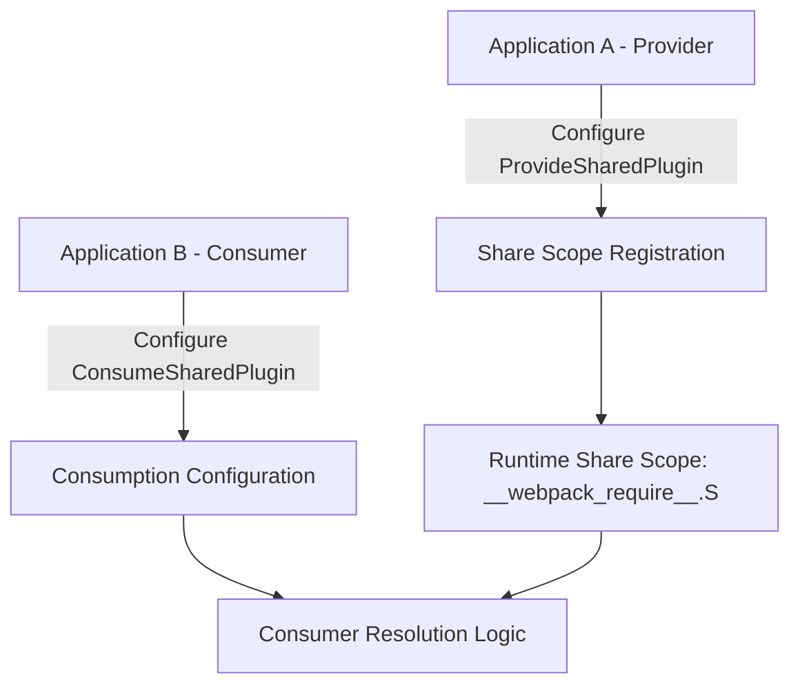
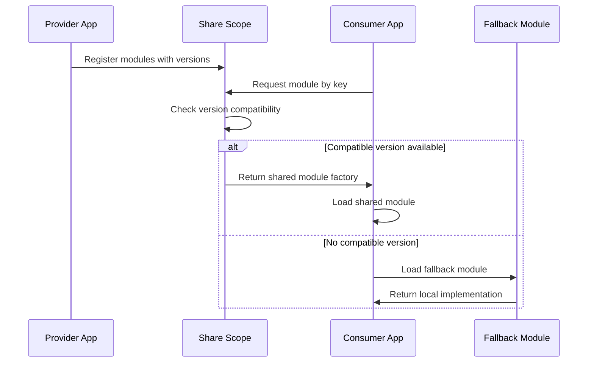

# Rspack Module Federation Provider-Consumer Architecture

## Overview

This document provides comprehensive analysis of the Provider-Consumer architecture in Rspack's Module Federation system, detailing how shared modules are connected, how data flows between providers and consumers, and the complete lifecycle of shared module resolution.

## Core Architecture Components

### Provider Side: ProvideSharedModule

The `ProvideSharedModule` is responsible for exposing modules to the share scope, making them available for consumption by other applications in the micro-frontend ecosystem.

#### **Structure and Responsibilities**

```rust
pub struct ProvideSharedModule {
    // Module identification
    identifier: ModuleIdentifier,
    lib_ident: String,  // Format: "webpack/sharing/provide/{shareScope}/{name}"
    readable_identifier: String,
    
    // Sharing configuration
    name: String,           // Key used in share scope registry
    share_scope: String,    // Scope namespace (default: "default")
    version: ProvideVersion,// Version of the provided module
    request: String,        // Original module request path
    
    // Sharing behavior
    eager: bool,            // Synchronous vs asynchronous loading
    singleton: Option<bool>,// Force single instance across containers
    required_version: Option<ConsumeVersion>, // Minimum version constraints
    strict_version: Option<bool>,  // Enforce exact version matching
    
    // Module structure
    blocks: Vec<AsyncDependenciesBlockIdentifier>,
    dependencies: Vec<DependencyId>,
    build_info: BuildInfo,
    build_meta: BuildMeta,
}
```

#### **Provider Registration Process**

1. **Module Interception**: `ProvideSharedPlugin` scans module requests during compilation
2. **Configuration Matching**: Matches requests against provided configurations using multiple strategies:
   - **Exact matching**: `"react"` matches `"react"`
   - **Prefix matching**: `"@scope/"` matches `"@scope/package"`
   - **Path resolution**: Absolute/relative paths are resolved first

3. **Module Creation**: Creates `ProvideSharedModule` instances with sharing metadata
4. **Runtime Registration**: Generates code to register modules in the global share scope

```javascript
// Generated provider registration code
__webpack_require__.S["default"] = {
  "react": {
    "18.2.0": {
      get: () => __webpack_require__("./node_modules/react/index.js"),
      from: "provider-app",
      eager: false
    }
  },
  "lodash": {
    "4.17.21": {
      get: () => __webpack_require__("./node_modules/lodash/index.js"),
      from: "provider-app", 
      eager: false
    }
  }
};
```

### Consumer Side: ConsumeSharedModule

The `ConsumeSharedModule` handles consumption of shared modules with sophisticated fallback and version resolution mechanisms.

#### **Structure and Responsibilities**

```rust
pub struct ConsumeSharedModule {
    // Core identification
    identifier: ModuleIdentifier,
    lib_ident: String,  // Format: "webpack/sharing/consume/{shareScope}/{shareKey}"
    readable_identifier: String,
    
    // Module structure
    blocks: Vec<AsyncDependenciesBlockIdentifier>,
    dependencies: Vec<DependencyId>,
    
    // Configuration
    context: Context,
    options: ConsumeOptions,
    
    // Build metadata
    factory_meta: Option<FactoryMeta>,
    build_info: BuildInfo,
    build_meta: BuildMeta,
}

pub struct ConsumeOptions {
    pub import: Option<String>,           // Fallback module path
    pub import_resolved: Option<String>,  // Resolved fallback path
    pub share_key: String,               // Key to lookup in share scope
    pub share_scope: String,             // Target share scope
    pub required_version: Option<ConsumeVersion>,  // Version requirement
    pub package_name: Option<String>,    // Package name for resolution
    pub strict_version: bool,            // Enforce exact version match
    pub singleton: bool,                 // Only one instance allowed
    pub eager: bool,                     // Load synchronously
}
```

#### **Consumer Resolution Process**

1. **Share Scope Lookup**: Attempts to find the module in the configured share scope
2. **Version Compatibility**: Checks version requirements using semver matching
3. **Singleton Handling**: Ensures single instance for singleton modules
4. **Fallback Resolution**: Uses local module if shared version is unavailable/incompatible

```javascript
// Generated consumer resolution code
var resolveHandler = function(data) {
    return loadStrictSingletonVersionCheckFallback(
        data.shareScope,    // "default"
        data.shareKey,      // "react"
        data.requiredVersion, // "^18.0.0"
        data.fallback       // Local module factory
    );
};
```

## Provider-Consumer Connection Flow

### Phase 1: Configuration and Setup



#### **Provider Configuration Example**
```javascript
// Application A (Provider)
new ModuleFederationPlugin({
  provides: {
    "react": {
      singleton: true,
      version: "18.2.0",
      eager: false
    },
    "lodash": {
      singleton: false,
      version: "4.17.21",
      eager: true
    }
  }
})
```

#### **Consumer Configuration Example**
```javascript
// Application B (Consumer)
new ModuleFederationPlugin({
  consumes: {
    "react": {
      singleton: true,
      requiredVersion: "^18.0.0",
      fallback: "./local-react"
    },
    "lodash": {
      singleton: false,
      requiredVersion: "^4.0.0",
      fallback: "lodash"
    }
  }
})
```

### Phase 2: Runtime Initialization

```javascript
// Provider initialization
__webpack_require__.S = __webpack_require__.S || {};
var scope = __webpack_require__.S["default"] = __webpack_require__.S["default"] || {};

// Register provided modules
var register = function(name, version, factory, eager) {
    var versions = scope[name] = scope[name] || {};
    versions[version] = { 
        get: factory, 
        from: "provider-app",
        eager: !!eager 
    };
};

register("react", "18.2.0", () => __webpack_require__("react"), false);
register("lodash", "4.17.21", () => __webpack_require__("lodash"), true);
```

### Phase 3: Consumer Resolution

```javascript
// Consumer resolution with fallback
var loadStrictSingletonVersionCheckFallback = function(scope, key, requiredVersion, fallback) {
    return loadSingletonVersionCheckFallback(scope, key, requiredVersion, fallback, true);
};

var loadSingletonVersionCheckFallback = function(scope, key, requiredVersion, fallback, strict) {
    return load(scope, key).then(function(factory) {
        // Version compatibility check
        if (factory && satisfy(requiredVersion, factory.version)) {
            // Singleton check
            if (singleton && hasSingleton(key)) {
                return getSingleton(key);
            }
            return factory.get();
        }
        // Fallback to local module
        return fallback();
    });
};
```

## Data Flow Analysis

### Share Scope Data Structure

The share scope maintains a hierarchical structure:

```javascript
__webpack_require__.S = {
    "default": {           // Share scope name
        "react": {         // Module key
            "18.2.0": {    // Version
                get: factory,     // Module factory function
                from: "app-a",    // Provider identification
                eager: false,     // Loading strategy
                loaded: false,    // Load state
                singleton: true   // Singleton constraint
            },
            "17.0.0": {    // Alternative version
                get: factory,
                from: "app-c", 
                eager: false,
                loaded: false,
                singleton: true
            }
        },
        "lodash": {
            "4.17.21": {
                get: factory,
                from: "app-a",
                eager: true,
                loaded: true,
                singleton: false
            }
        }
    },
    "custom-scope": {      // Additional share scopes
        // ... other shared modules
    }
};
```

### Connection Lifecycle



## Version Resolution Strategies

### Version Matching Logic

```javascript
// Semantic version parsing and comparison
var parseRange = function(str) {
    var match = str.match(/^([\^~]?)(\d+)(?:\.(\d+))?(?:\.(\d+))?/);
    return {
        operator: match[1] || "",
        major: parseInt(match[2]),
        minor: parseInt(match[3]) || 0,
        patch: parseInt(match[4]) || 0
    };
};

var satisfy = function(range, version) {
    var reqRange = parseRange(range);
    var providedVersion = parseRange(version);
    
    switch(reqRange.operator) {
        case "^": // Compatible version (same major)
            return providedVersion.major === reqRange.major &&
                   (providedVersion.minor > reqRange.minor ||
                    (providedVersion.minor === reqRange.minor && 
                     providedVersion.patch >= reqRange.patch));
        case "~": // Approximately equivalent (same major.minor)
            return providedVersion.major === reqRange.major &&
                   providedVersion.minor === reqRange.minor &&
                   providedVersion.patch >= reqRange.patch;
        default: // Exact match
            return version === range;
    }
};
```

### Singleton Resolution

```javascript
var singletonRegistry = {};

var getSingleton = function(key) {
    if (singletonRegistry[key]) {
        return singletonRegistry[key];
    }
    throw new Error("Singleton " + key + " not initialized");
};

var setSingleton = function(key, factory) {
    if (singletonRegistry[key]) {
        console.warn("Singleton " + key + " already registered");
        return singletonRegistry[key];
    }
    return singletonRegistry[key] = factory();
};
```

## Advanced Connection Patterns

### Multi-Version Support

Different applications can provide different versions of the same module:

```javascript
// Provider A provides React 18.2.0
register("react", "18.2.0", reactFactory, false);

// Provider B provides React 17.0.0  
register("react", "17.0.0", react17Factory, false);

// Consumer resolves based on requirements
var resolveReact = function(requiredVersion) {
    var availableVersions = Object.keys(__webpack_require__.S["default"]["react"]);
    
    for (var version of availableVersions) {
        if (satisfy(requiredVersion, version)) {
            return __webpack_require__.S["default"]["react"][version].get();
        }
    }
    
    // No compatible version found - use fallback
    return fallbackReactFactory();
};
```

### Eager vs Lazy Loading

```javascript
// Eager loading - synchronous
if (eager) {
    var module = factory.get();
    // Module is immediately available
} else {
    // Lazy loading - asynchronous
    factory.get().then(function(module) {
        // Module loaded asynchronously
    });
}
```

### Cross-Scope Sharing

```javascript
// Multiple share scopes for different contexts
__webpack_require__.S = {
    "default": { /* common modules */ },
    "ui-components": { /* UI library modules */ },
    "utilities": { /* utility modules */ },
    "analytics": { /* analytics modules */ }
};

// Cross-scope resolution
var resolveFromScope = function(scope, key, fallback) {
    if (__webpack_require__.S[scope] && __webpack_require__.S[scope][key]) {
        return __webpack_require__.S[scope][key];
    }
    return fallback;
};
```

## Connection State Management

### Active Connection States

```rust
pub enum ConnectionState {
    Active(bool),           // Connection is active and should be processed
    TransitiveOnly,         // Connection exists but is transitive
    CircularConnection,     // Circular dependency detected
}
```

### Connection Analysis

```rust
// Analyze incoming connections to ConsumeShared module
let connections = module_graph.get_incoming_connections(consume_shared_id);

for connection in connections {
    match connection.active_state(module_graph, runtime, runtime_spec) {
        ConnectionState::Active(true) => {
            // Process active connection
            process_connection(connection);
        },
        ConnectionState::TransitiveOnly => {
            // Include transitive dependencies for completeness
            process_transitive_connection(connection);
        },
        ConnectionState::CircularConnection => {
            // Skip circular connections to avoid infinite loops
            continue;
        }
    }
}
```

## Export Metadata Propagation

### From Provider to Consumer

```rust
// Copy export information from fallback module to ConsumeShared module
fn copy_exports_from_fallback_to_consume_shared(
    module_graph: &mut ModuleGraph,
    fallback_id: &ModuleIdentifier,
    consume_shared_id: &ModuleIdentifier,
) -> Result<()> {
    use rspack_core::ExportProvided;

    // Get exports info for both modules
    let fallback_exports_info = module_graph.get_exports_info(fallback_id);
    let consume_shared_exports_info = module_graph.get_exports_info(consume_shared_id);

    // Get the fallback module's provided exports
    let prefetched_fallback = ExportsInfoGetter::prefetch(
        &fallback_exports_info,
        module_graph,
        PrefetchExportsInfoMode::AllExports,
    );

    let fallback_provided = prefetched_fallback.get_provided_exports();

    // Copy the provided exports to the ConsumeShared module
    match fallback_provided {
        ProvidedExports::ProvidedNames(export_names) => {
            for export_name in export_names {
                let consume_shared_export_info = 
                    consume_shared_exports_info.get_export_info(module_graph, &export_name);
                let fallback_export_info = 
                    fallback_exports_info.get_export_info(module_graph, &export_name);

                // Copy export metadata
                copy_export_metadata(
                    module_graph,
                    &fallback_export_info,
                    &consume_shared_export_info
                );
            }

            // Mark ConsumeShared module as having complete provide info
            consume_shared_exports_info.set_has_provide_info(module_graph);
        },
        ProvidedExports::ProvidedAll => {
            // Mark all exports as provided
            consume_shared_exports_info.set_unknown_exports_provided(
                module_graph,
                true, // provided
                None, None, None, None,
            );
        },
        ProvidedExports::Unknown => {
            // Keep unknown status
        }
    }

    Ok(())
}
```

## Connection Debugging and Analysis

### Connection Visualization

```javascript
// Runtime connection debugging
window.__webpack_module_federation_debug__ = {
    shareScopes: __webpack_require__.S,
    
    getConnectionInfo: function(shareScope, key) {
        var scope = __webpack_require__.S[shareScope];
        if (!scope || !scope[key]) {
            return null;
        }
        
        return {
            available_versions: Object.keys(scope[key]),
            providers: Object.values(scope[key]).map(v => v.from),
            loading_strategies: Object.values(scope[key]).map(v => ({
                eager: v.eager,
                loaded: v.loaded
            }))
        };
    },
    
    testResolution: function(shareScope, key, requiredVersion) {
        // Test version resolution without actually loading
        var scope = __webpack_require__.S[shareScope];
        if (!scope || !scope[key]) {
            return { status: "not_found", fallback: true };
        }
        
        for (var version in scope[key]) {
            if (satisfy(requiredVersion, version)) {
                return { 
                    status: "found", 
                    version: version,
                    provider: scope[key][version].from,
                    fallback: false
                };
            }
        }
        
        return { status: "version_mismatch", fallback: true };
    }
};
```

### Connection Health Monitoring

```javascript
// Monitor connection health
var connectionHealth = {
    successful_resolutions: 0,
    fallback_resolutions: 0,
    failed_resolutions: 0,
    
    recordResolution: function(type) {
        this[type + "_resolutions"]++;
    },
    
    getHealthMetrics: function() {
        var total = this.successful_resolutions + 
                   this.fallback_resolutions + 
                   this.failed_resolutions;
        
        return {
            success_rate: this.successful_resolutions / total,
            fallback_rate: this.fallback_resolutions / total,
            failure_rate: this.failed_resolutions / total,
            total_resolutions: total
        };
    }
};
```

## Summary

The Provider-Consumer architecture in Rspack's Module Federation system provides:

1. **Robust Connection Management**: Sophisticated version resolution and fallback mechanisms
2. **Flexible Sharing Strategies**: Support for eager/lazy loading, singleton constraints, and multi-version scenarios
3. **Comprehensive Metadata Propagation**: Complete export information flow from providers to consumers
4. **Advanced Debugging Capabilities**: Runtime introspection and connection health monitoring
5. **Scalable Architecture**: Support for multiple share scopes and cross-application sharing

This architecture enables complex micro-frontend scenarios while maintaining reliability and performance through intelligent fallback mechanisms and optimized loading strategies.