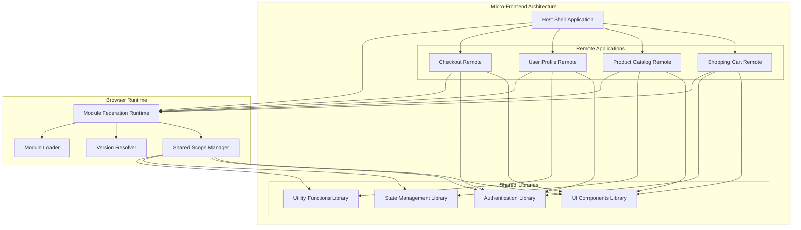
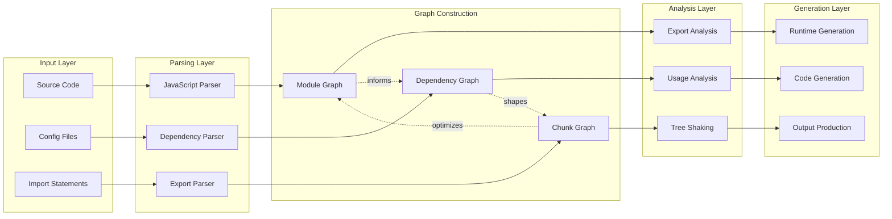
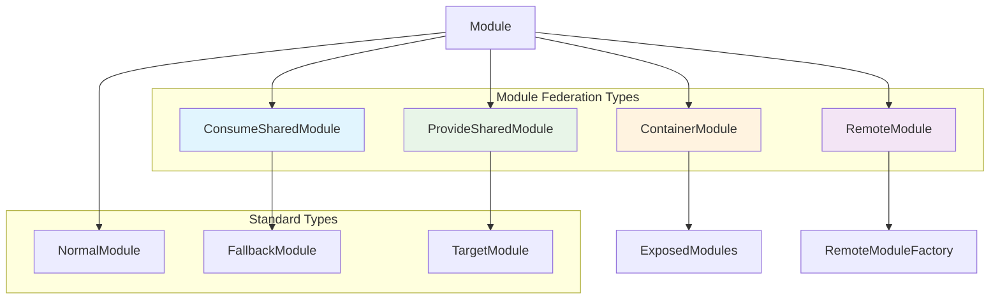
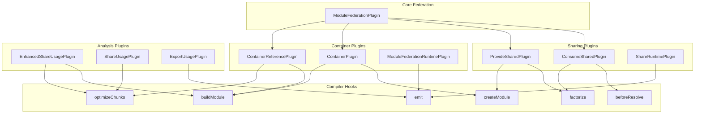
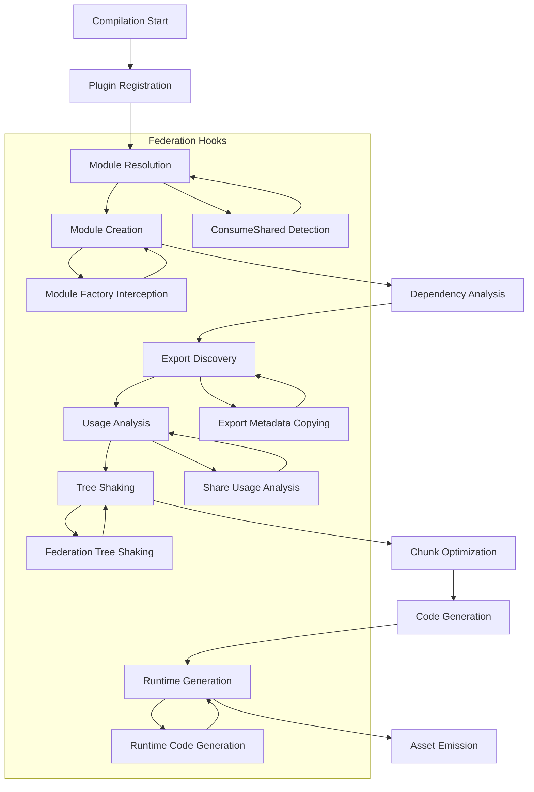
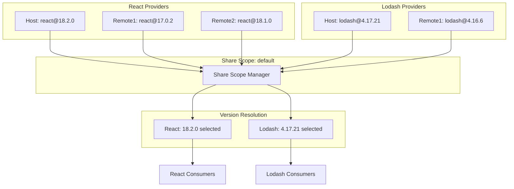
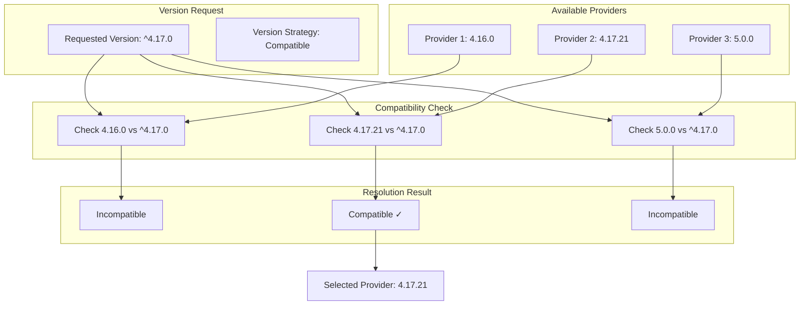
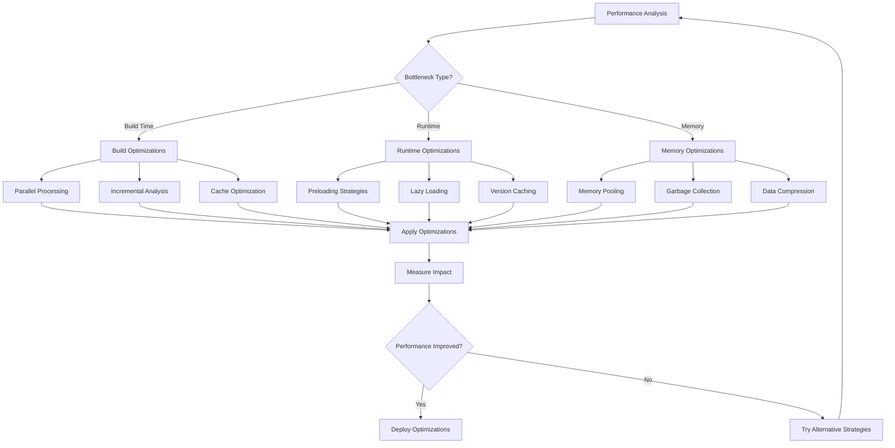
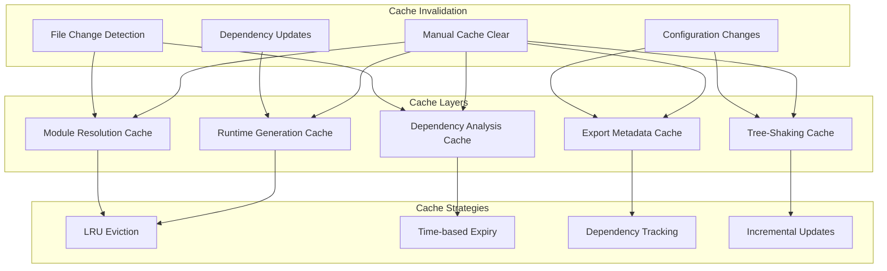

# System Architecture Diagrams - Rspack Module Federation

## Table of Contents

1. [High-Level Architecture](#high-level-architecture)
2. [Core Graph Systems](#core-graph-systems)
3. [Module Federation Ecosystem](#module-federation-ecosystem)
4. [Share Scope Management](#share-scope-management)
5. [Performance Overview](#performance-overview)

---

## High-Level Architecture

### Module Federation System Overview

```mermaid
graph TB
    subgraph "Host Application"
        HA[Host App Entry]
        HMF[ModuleFederationPlugin]
        HCS[ConsumeSharedPlugin]
        HPS[ProvideSharedPlugin]
    end
    
    subgraph "Remote Application 1"
        R1A[Remote 1 Entry]
        R1MF[ModuleFederationPlugin]
        R1PS[ProvideSharedPlugin]
        R1CS[ConsumeSharedPlugin]
    end
    
    subgraph "Remote Application 2"
        R2A[Remote 2 Entry]
        R2MF[ModuleFederationPlugin]
        R2PS[ProvideSharedPlugin]
        R2CS[ConsumeSharedPlugin]
    end
    
    subgraph "Shared Scope"
        SS[Share Scope: default]
        SS1[react@18.0.0]
        SS2[lodash@4.17.21]
        SS3[utils@1.0.0]
    end
    
    HA --> HMF
    HMF --> HCS
    HMF --> HPS
    
    R1A --> R1MF
    R1MF --> R1PS
    R1MF --> R1CS
    
    R2A --> R2MF
    R2MF --> R2PS
    R2MF --> R2CS
    
    HCS -.->|consumes| SS
    HPS -.->|provides| SS
    R1CS -.->|consumes| SS
    R1PS -.->|provides| SS
    R2CS -.->|consumes| SS
    R2PS -.->|provides| SS
    
    SS --> SS1
    SS --> SS2
    SS --> SS3
```

### Application Network Topology



---

## Core Graph Systems

### Module Graph Integration Overview



### Module Types Hierarchy



---

## Module Federation Ecosystem

### Plugin Architecture



### Build Process Integration



---

## Share Scope Management

### Shared Scope Architecture



### Version Resolution Strategy



---

## Performance Overview

### Performance Analysis Layers

```mermaid
graph TD
    subgraph "Build Phase Performance"
        B1[Module Resolution: 23%]
        B2[Dependency Analysis: 31%]
        B3[Export Copying: 18%]
        B4[Code Generation: 28%]
    end
    
    subgraph "Runtime Performance"
        R1[Share Scope Lookup: 15%]
        R2[Version Resolution: 8%]
        R3[Module Loading: 45%]
        R4[Fallback Resolution: 32%]
    end
    
    subgraph "Memory Usage"
        M1[Module Graph: 45MB]
        M2[Dependency Cache: 23MB]
        M3[Export Metadata: 12MB]
        M4[Share Scope Data: 8MB]
    end
    
    B2 --> O1[Batch Processing Optimization]
    B3 --> O2[Lazy Export Copying]
    R3 --> O3[Preloading Strategy]
    R4 --> O4[Fallback Caching]
    
    M1 --> O5[Memory Pooling]
    M2 --> O6[Cache Optimization]
```



### Optimization Strategy Overview



### Caching System Architecture



This document provides high-level conceptual diagrams showing the overall architecture, system relationships, and strategic overviews of the Rspack Module Federation system. These diagrams are designed to give stakeholders and architects a clear understanding of how the system components work together at a macro level.