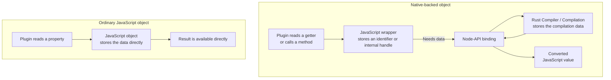
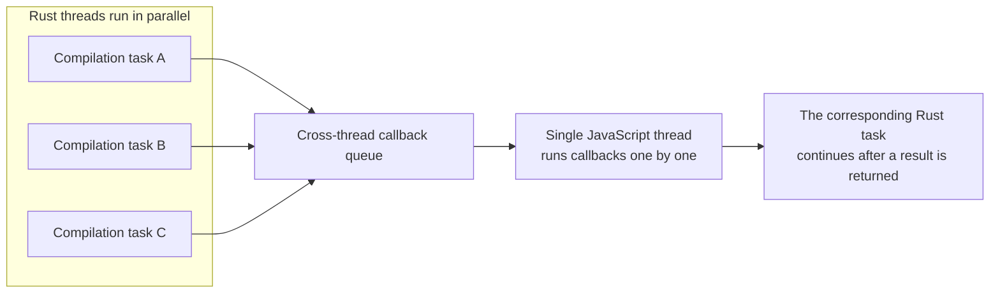

# JavaScript API architecture

Rspack exposes a webpack-compatible JavaScript API through `@rspack/core`, while most compilation
work runs in Rust. The two layers communicate through a Node-API binding.

## What is a native-backed object?

The data of an ordinary JavaScript object is stored directly in the JavaScript engine. For example,
JavaScript can read the `name` property of `{ name: 'main' }` without calling into Rust.

Objects such as `Compilation`, `Module`, `Chunk`, and graph objects work differently in Rspack.
They have corresponding JavaScript objects, but most of their compilation data is stored in Rust.
The JavaScript object usually stores only an identifier or internal handle that can locate the Rust
data. When a plugin reads certain getters or calls certain methods, Rspack accesses Rust through the
Node-API binding and converts the result back into a JavaScript value. These objects are called
**native-backed objects**.



The two kinds of objects can use exactly the same JavaScript syntax while behaving differently:

| Object type                | Where the data is stored | What happens on property access or method call       | Lifetime                               |
| -------------------------- | ------------------------ | ---------------------------------------------------- | -------------------------------------- |
| Ordinary JavaScript object | JavaScript memory        | Read directly without crossing the binding           | Data normally exists while referenced  |
| Native-backed object       | Primarily in Rust        | May read or modify data through the Node-API binding | Limited by its compiler or compilation |

A native-backed object can also contain both kinds of properties:

- immutable data such as strings and numbers may be copied into JavaScript when the object is
  created, so reading it later does not access Rust;
- getters and methods may access Rust on every call to retrieve current compilation data or perform
  an operation.

The continued existence of the JavaScript object does not prove that its Rust data is still valid.
The object may still be printable and passable after its compilation has been cleaned up, but
getters or methods that depend on Rust data will then throw an error.

This implementation model has two direct consequences:

1. **Lifetime:** A native-backed object can usually be used only within the compiler, compilation,
   or hook execution scope that produced it.
2. **Performance:** Reading a getter or calling a method may convert data between JavaScript and
   Rust. Repeating the same access in a hot loop can accumulate significant cost.

If data is needed later, extract strings, numbers, or ordinary JavaScript objects while the
native-backed object is still valid instead of retaining the native-backed object itself.

## Compiler lifecycle

Creating an `@rspack/core` `Compiler` does not immediately create its native compiler. Option
normalization and plugin `apply` calls happen in JavaScript first. Rspack creates the Rust compiler
on demand when a build API such as `run()` or `watch()` is called for the first time.

After the native compiler has been created, the following information has already been finalized
and passed to Rust:

- normalized options and builtin plugins;
- registration functions that connect JavaScript hooks to the native hook adapter;
- file-system and resolver-factory wrappers used for cross-language calls.

Do not assume that arbitrary changes to `compiler.options` will still be synchronized to Rust after
the native compiler has been created. Apply plugins and finish configuration before the first call
to `run()` or `watch()`.

:::warning Differences from webpack
Rspack's current native data model has stricter lifetimes than webpack's JavaScript object model:

- A `Compiler` instance can have only one active `Compilation` at a time. Every build, including
  each watch rebuild, creates a new `Compilation`. When a new build starts, the previous
  `Compilation` becomes stale, and Rspack cleans up its Rust data and binding caches.
- Keeping an old JavaScript `Compilation` object does not extend the lifetime of its Rust data.
  Calling a stale native-backed getter or method, or accessing a cleaned-up `Module`, `Chunk`, graph
  object, dependency, or block, throws an error indicating that the object is no longer available.

In watch mode, always obtain native-backed objects from the latest `Compilation`.
:::

When a compiler is no longer needed, call `close()` and wait for its callback. This waits for the
current compilation to finish and releases the native resources and JavaScript callbacks owned by
the compiler.

## Compilation and object lifetimes

Every build, including each watch rebuild, creates a new `Compilation`. Objects such as `Module`,
`Chunk`, and graph objects obtained from a `Compilation` do not copy all of their data into
JavaScript. Reading some properties or calling some methods still requires Rspack to retrieve data
from the current Rust compilation through Node-API.

These objects look like ordinary JavaScript objects, but they can be used only during the build that
produced them.

Follow these rules:

- Use a `Compilation` and its `Module`, `Chunk`, graph, dependency, and block objects only in hooks
  and callbacks for the current build.
- Unless the API documentation explicitly promises a longer lifetime, do not retain these objects
  after the hook finishes or into the next build.
- If information is needed later, save JavaScript-owned strings or numbers such as identifiers,
  names, paths, and hashes, or convert the data into an ordinary JavaScript object.
- After a watch rebuild, obtain objects again from the new `Compilation` instead of reusing objects
  saved from the previous build.
- Do not rely on JavaScript reference equality across different compilers or builds.

For webpack compatibility, Rspack may return the same JavaScript object for the same Rust object.
This does not mean that the JavaScript object retains the corresponding Rust data indefinitely.
After the Rust data has been cleaned up, accessing properties or methods that depend on it throws an
error.

## Hook and callback execution

The Rust compiler can use multiple threads to run several independent compilation tasks at the same
time. JavaScript hooks, loaders, and other callbacks cannot run directly on those Rust threads.
They must be scheduled back into the JavaScript environment in which the Rspack compiler was
created.

User code in one JavaScript environment runs on one JavaScript thread. Even if multiple Rust
threads trigger callbacks at the same time, those callbacks enter a queue and are executed one by
one on the JavaScript thread:



The cost of hooks and callbacks is therefore not limited to Node-API conversion and thread
scheduling. More importantly, they introduce a **serial execution point**: multiple Rust tasks that
could otherwise run in parallel may all wait for the JavaScript queue. The more frequently a
callback runs and the longer it takes, the more it can reduce the benefits of Rust parallelism.
Rust work before and after the callback can still run in parallel, but the part that depends on the
JavaScript result is limited by single-threaded throughput.

### Why loaders are especially likely to become a bottleneck

Rspack can process several files at the same time, but JavaScript loaders must run on the
JavaScript thread. When several files need loader processing at once, their JavaScript loaders
queue up, and the Rust compilation tasks waiting for those results pause at that boundary. The
heavier the JavaScript loader and the more often it runs, the closer the overall build gets to
serial execution.

When equivalent functionality is available, prefer an Rspack builtin loader. For example:

- use [`builtin:swc-loader`](/guide/features/builtin-swc-loader) for JavaScript and TypeScript
  transforms;
- use [`builtin:lightningcss-loader`](/guide/features/builtin-lightningcss-loader) for CSS
  transforms.

Builtin loaders run on the Rust side, reducing JavaScript queueing and cross-language data
conversion while making better use of Rspack's parallelism.

## Efficient usage

### Read once in hot loops

Read and retain data obtained from Rust during a single pass:

```js
compilation.hooks.processAssets.tap('ExamplePlugin', () => {
  const moduleInfo = [];

  for (const module of compilation.modules) {
    const size = module.size();
    moduleInfo.push({
      identifier: module.identifier(),
      size,
    });
  }

  consumeModuleInfo(moduleInfo);
});
```

`module.size()` retrieves data from Rust through the binding. Keeping `size` in a local variable
avoids calling `module.size()` again in later logic.
