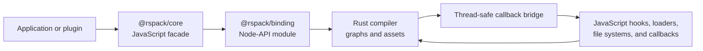

# JavaScript API architecture

Rspack exposes a webpack-compatible JavaScript API from `@rspack/core`, while most compilation work
runs in Rust. The two layers communicate through a Node-API binding.

This page documents implementation details that affect correctness and performance. These details
describe the current implementation, not additional API compatibility guarantees. Applications
should import APIs from `@rspack/core`; `@rspack/binding` is an internal package and does not follow
the public compatibility contract of `@rspack/core`.

## Mental model



`@rspack/core` is not only a thin native function wrapper. It provides the webpack-compatible object
model, Tapable-style hooks, option normalization, source adapters, file-system adapters, and
JavaScript implementations of some APIs. The binding owns native compiler state and exposes
operations and views needed by the JavaScript facade.

## API implementation models

Knowing which model an API uses helps predict its lifetime and cost.

| Model                       | Examples                                                           | Behavior                                                                                   |
| --------------------------- | ------------------------------------------------------------------ | ------------------------------------------------------------------------------------------ |
| JavaScript-owned facade     | Hook objects, logging helpers, parts of cache APIs                 | Runs entirely in JavaScript unless it calls another binding-backed object                  |
| Native operation            | `compiler.run()`, `compiler.close()`, resolver and SWC operations  | Enters Rust once and returns a value, callback, or Promise                                 |
| Native-backed object        | `Compilation`, `Module`, `Chunk`, `ModuleGraph`, `ChunkGraph`      | The JavaScript object contains identity that is resolved against native compiler state     |
| Materialized value          | Arrays, sets, option objects, and some stats data                  | Native data is converted into JavaScript-owned data at the time of access                  |
| Live adapter or proxy       | `compilation.assets`, sources, file systems                        | JavaScript operations may invoke the binding on every property access or method call       |
| Rust-to-JavaScript callback | Plugin hooks, loaders, filename functions, externals, file systems | Rust schedules JavaScript work and waits for its result when the compilation depends on it |

An API can combine models. For example, `compilation.modules` materializes a new JavaScript `Set`,
but the `Module` values in that set are native-backed objects.

## Compiler lifecycle

Creating an `@rspack/core` `Compiler` does not immediately create the native compiler. Rspack
normalizes options and applies plugins first. The native compiler is created lazily when a build
first needs it.

After native initialization:

- the normalized options and builtin plugin registrations have been translated for Rust;
- JavaScript hook registration functions have been connected to the native hook adapter;
- configured file systems and the resolver factory have been wrapped for cross-language calls.

Do not rely on arbitrary mutations to `compiler.options` being reflected after the native compiler
has been created. Prefer finalizing configuration and applying plugins before calling `run()` or
`watch()`.

A `Compiler` supports only one active compilation at a time. Do not overlap `run()` and `watch()`,
or call `run()` twice concurrently. Call `close()` and wait for its callback when the compiler is no
longer needed.

## Compilation and object lifetimes

Each build, including each watch rebuild, creates a new `Compilation`. Many objects reachable from a
compilation are views over that compilation's native state rather than detached JavaScript
snapshots.

Use these rules:

- Treat `Compilation`, `Module`, `Chunk`, graph objects, dependencies, and blocks as
  compilation-scoped.
- Do not retain binding-backed values from a hook and access them after the hook or compilation has
  finished unless that API explicitly documents a longer lifetime.
- When data is needed later, store stable JavaScript-owned values such as identifiers, names, paths,
  hashes, or a purpose-built snapshot.
- Obtain objects again from the current `Compilation` during watch rebuilds instead of reusing
  objects from the previous build.
- Do not assume that object identity is meaningful across compilers or compilations.

Rspack preserves JavaScript object identity for selected binding-backed objects where webpack
compatibility requires it. That cache does not extend the lifetime of the underlying native object.
Access after native state has been removed can fail.

## Hook and callback execution

The Rust compiler can run work away from the JavaScript main thread, but JavaScript callbacks must
run in their JavaScript environment. Rspack uses a thread-safe callback bridge to schedule them.

When Rust reaches a JavaScript hook:

1. The native hook adapter checks whether JavaScript taps are registered.
2. Arguments are converted into JavaScript values or binding-backed objects.
3. The callback is scheduled in the JavaScript environment.
4. Rust waits for the return value when the compilation depends on it.
5. Returned data or errors are converted back to Rust.

Unused hook types are skipped so that they do not pay the callback registration and invocation cost
on every build. Register taps during plugin application or the documented compilation setup hooks,
before the lifecycle point that invokes them.

Synchronous taps should complete quickly. Promise-based taps allow asynchronous work, but the
corresponding compilation stage still waits for the Promise. A per-module hook, loader, resolver
callback, or filename function can run hundreds or thousands of times, so even small JavaScript or
conversion costs accumulate.

## Collections, getters, and sources

Different JavaScript-looking collections have different behavior:

- `compilation.modules` and `compilation.builtModules` materialize a `Set` of the current members.
  Accessing properties or methods on each module can still cross the binding.
- `compilation.chunks` is a cached read-only collection containing native-backed chunk objects.
- named chunk and chunk-group maps perform native lookups as their keys and values are requested.
- `compilation.assets` is a Proxy. Enumerating keys, reading a source, writing a source, and deleting
  a property invoke separate operations.
- asset sources are adapted between the binding representation and `webpack-sources`. Avoid reading
  source content when only asset names or metadata are needed.
- stats conversion can traverse large module and chunk graphs. Request only the fields needed by
  tooling.

Do not infer complexity only from JavaScript syntax. A property getter can perform a native graph
lookup or materialize a collection.

## Efficient usage

### Read once in hot loops

Prefer extracting the values needed for one pass:

```js
compilation.hooks.processAssets.tap('ExamplePlugin', () => {
  const moduleIds = [];
  for (const module of compilation.modules) {
    moduleIds.push(module.identifier());
  }

  consumeModuleIds(moduleIds);
});
```

Avoid repeatedly rebuilding the same collection or calling the same native-backed getter from a
nested loop:

```js
// Avoid this pattern in a hot hook.
for (const chunk of compilation.chunks) {
  for (const module of compilation.modules) {
    inspect(chunk, module, compilation.moduleGraph);
  }
}
```

### Prefer stable values over retained objects

```js
let lastBuildModuleIds = [];

compiler.hooks.thisCompilation.tap('ExamplePlugin', (compilation) => {
  compilation.hooks.finishModules.tap('ExamplePlugin', (modules) => {
    lastBuildModuleIds = Array.from(modules, (module) => module.identifier());
  });
});
```

Retaining the identifiers is safer than retaining the `Module` objects and accessing them during a
later rebuild.

### Minimize JavaScript callbacks in native hot paths

Prefer builtin loaders and plugins when they provide the required behavior. If a JavaScript callback
is necessary:

- perform cheap rejection checks first;
- cache immutable derived configuration outside the callback;
- avoid repeated source conversion;
- batch work when the API provides a batch operation;
- avoid synchronous file-system or CPU-heavy work.

## API family guide

| API family                | Dominant implementation model                                 | Important consideration                                                      |
| ------------------------- | ------------------------------------------------------------- | ---------------------------------------------------------------------------- |
| Compiler and watching     | JavaScript lifecycle plus native build operation              | One active compilation per compiler; close resources explicitly              |
| Compilation and assets    | Native-backed state plus proxies and materialized collections | Use only in the owning compilation and avoid unnecessary source reads        |
| Module and chunk graphs   | Native graph queries                                          | Repeated getters and nested queries can amplify binding overhead             |
| Plugin hooks              | Rust-to-JavaScript callbacks                                  | Hook frequency and sync/async behavior determine cost                        |
| Loader API                | JavaScript callbacks inside module building                   | Runs on a hot path and may keep the native build waiting                     |
| Resolver and file systems | Native operation with optional JavaScript adapters            | Custom JavaScript implementations add callbacks to resolution and I/O        |
| Stats                     | Graph traversal and JavaScript materialization                | Request only required fields                                                 |
| SWC API                   | Direct native operation                                       | Async methods return Promises; sync methods block the caller                 |
| Browser API               | WASI binding and browser adapters                             | Platform capabilities and performance differ from the native Node.js binding |

## Diagnosing lifetime and bridge problems

Errors saying that a compilation, module, or compiler is no longer available usually indicate that a
binding-backed object escaped its supported lifetime, a previous watch compilation was retained, or
the compiler was closed or garbage-collected.

When investigating:

1. Identify the hook and compilation that produced the object.
2. Check whether it is used after an `await`, callback, rebuild, or `close()`.
3. Replace retained objects with identifiers or copied data.
4. Reduce the example to determine whether the operation is JavaScript-owned, materialized, or
   binding-backed.

For contributor-facing implementation details, see the
[JavaScript binding architecture](/contribute/architecture/javascript-binding).
