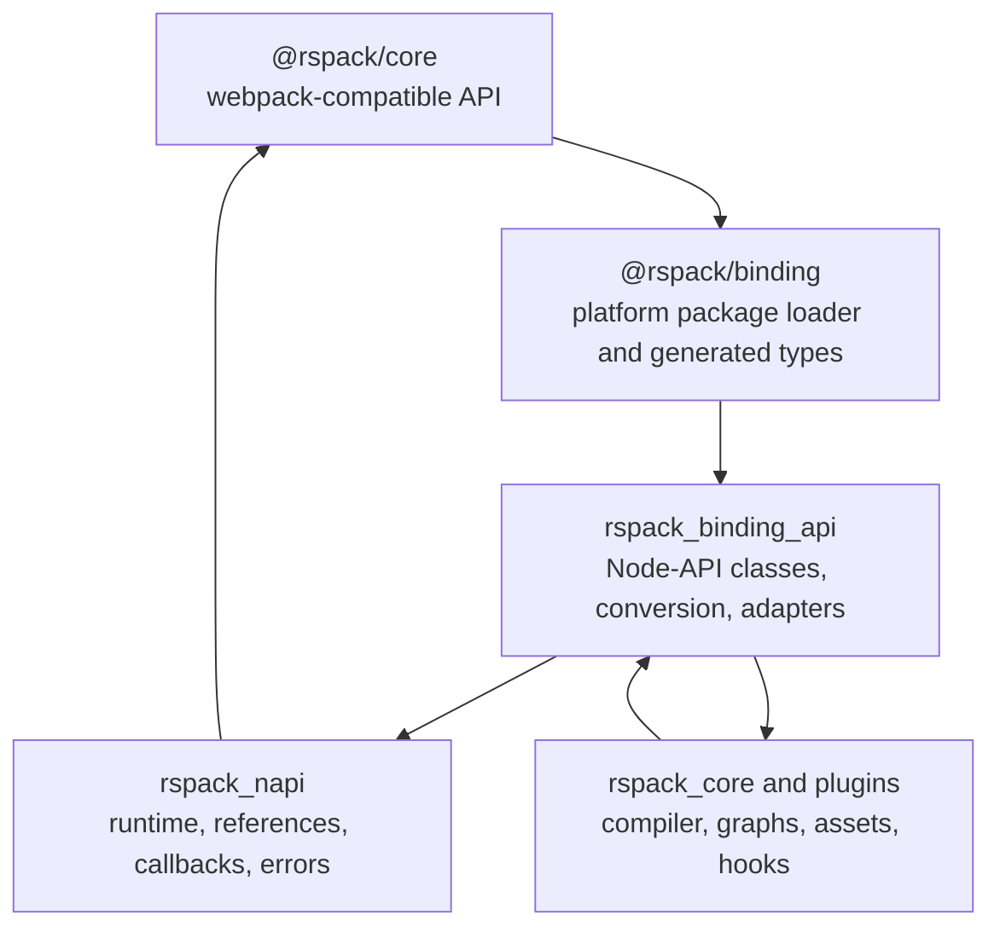
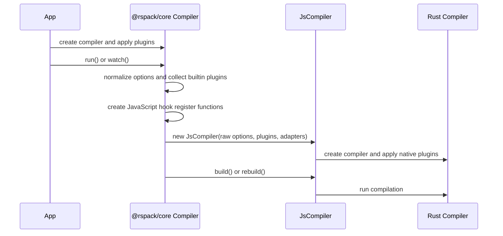

# JavaScript binding architecture

This document describes how Rspack implements the JavaScript API across `@rspack/core`, Node-API,
and the Rust compiler. It is intended for contributors changing the JavaScript facade, binding
classes, hook adapters, loaders, or native object wrappers.

The public API is `@rspack/core`. `@rspack/binding` and the Rust binding crates are internal
implementation surfaces and may change without preserving their standalone API.

## Layer boundaries



| Layer                    | Primary location                        | Responsibility                                                                                 |
| ------------------------ | --------------------------------------- | ---------------------------------------------------------------------------------------------- |
| Public JavaScript facade | `packages/rspack/src/`                  | webpack compatibility, normalized options, public classes, hooks, JavaScript-only behavior     |
| Binding package          | `crates/node_binding/`                  | Native package loading, platform packages, WASI wrappers, generated TypeScript declarations    |
| Binding API              | `crates/rspack_binding_api/`            | `#[napi]` exports, raw option conversion, native-backed objects, hook and file-system adapters |
| Node-API support         | `crates/rspack_napi/`                   | Tokio runtime, thread-safe functions, JavaScript references, Promise and error conversion      |
| Compiler core            | `crates/rspack_core/` and plugin crates | Compilation state, graphs, native hooks, module building, optimization, code generation        |

Dependencies should point toward the core. `rspack_core` must not depend on JavaScript facade types.
Compatibility-only behavior should normally remain in `packages/rspack`, while reusable compilation
behavior belongs in Rust.

## Compiler initialization

The JavaScript `Compiler` is created before its native `JsCompiler`.



`Compiler.#getInstance()` is the important JavaScript entry:

1. It checks that `@rspack/core` and `@rspack/binding` versions match.
2. It converts normalized options into `RawOptions`.
3. It attaches references used by functions and virtual modules.
4. It creates hook registration functions.
5. It wraps configured file systems and the resolver factory.
6. It constructs the native `JsCompiler`.

Initialization is lazy so plugins can finish configuring the JavaScript compiler before conversion.
After the native compiler exists, arbitrary JavaScript option mutation is not automatically
retranslated.

The native `JsCompiler` owns the Rust compiler, compiler-scoped callback references, dependency
caches, compiler context, and optional virtual file store. Build and rebuild operations run through
the binding runtime and complete through JavaScript callbacks. `close()` waits for active work,
releases compiler-scoped callbacks, and drops native state unless the internal `unsafeFastDrop`
mode requests process-lifetime cleanup.

## JavaScript-to-Rust calls

A direct JavaScript API call can take one of four paths:

1. **JavaScript only:** no binding call is made.
2. **Value conversion:** a JavaScript object is converted into an owned Rust DTO.
3. **Native-backed lookup:** an identifier or wrapper is resolved against current compilation state.
4. **Adapter callback:** Rust calls a JavaScript implementation, such as a custom file system.

Prefer owned values at the boundary when identity and live mutation are not required. Native-backed
objects are necessary for webpack-compatible graph APIs, but they require explicit lifetime and
revocation rules.

Conversion cost belongs to the API design. A method returning a large `Vec` can be more expensive
than its Rust lookup, while a JavaScript getter can hide a native lookup and allocation.

## Rust-to-JavaScript hooks

JavaScript hooks are not registered as ordinary Rust taps at compiler construction. The bridge uses
an interceptor model:

1. `packages/rspack/src/taps/` maps public hook objects to `RegisterJsTapKind` values.
2. JavaScript provides functions that return taps for requested stage ranges.
3. `JsHooksAdapterPlugin` installs one interceptor on each supported native hook.
4. The interceptor asks JavaScript for the taps needed by that native hook.
5. Each tap is stored as a thread-safe JavaScript function.
6. Native hook arguments are converted, the JavaScript tap is scheduled, and its result is awaited
   when required.

The bridge has two performance mechanisms:

- **non-skippable registers:** hook kinds with no JavaScript usage can return before querying taps;
- **tap registration caches:** frequently invoked hooks, such as per-module hooks, can reuse the
  converted tap list.

Changing registration, stages, or invalidation requires checking both sides of the bridge. A hook
that exists in the JavaScript facade but is missing from `RegisterJsTapKind` or
`JsHooksAdapterPlugin` will not run natively. Incorrect caching can retain closures or miss taps
added later.

Synchronous and Promise-returning taps use different conversion paths. Promise hooks wait for the
JavaScript Promise and convert rejection into an `rspack_error::Error`. A native task must never
call JavaScript directly from a worker thread.

## Thread and runtime model

`rspack_napi` owns a process-level Tokio runtime while Node-API environments are active. Async
binding operations are spawned on that runtime. Environment cleanup hooks shut the runtime down
after the final environment is removed.

Thread-safe functions queue work into the JavaScript environment. The native task sends owned
arguments or binding wrappers, then awaits a one-shot response. The callback invocation is
non-blocking from the Node-API queue's perspective, but the Rust compilation stage can still wait
for the returned value.

Important invariants:

- raw JavaScript values are not accessed directly from Rust worker threads;
- values sent through a thread-safe function must satisfy their cross-thread ownership contract;
- borrowed Rust references must not outlive the native operation that owns them;
- sync JavaScript APIs block their caller even if Rust internally uses the binding runtime;
- core CPU parallelism should follow Rspack's `rayon` and `rspack_parallel` boundaries rather than
  introducing binding-specific task orchestration.

## Native-backed objects

### Compilation

Rust-to-JavaScript conversion uses `JsCompilationWrapper` to preserve one native JavaScript
`JsCompilation` instance per `CompilationId`. On the JavaScript side, `Compiler` uses a `WeakMap` to
associate that native instance with one public `Compilation` facade.

`JsCompilation` currently contains the compilation identifier and a pointer to the Rust
`Compilation`. Access is valid only while the owning compiler still exposes that compilation.
Wrapper caches are cleared as compilations are replaced or the compiler is cleaned up.

This two-level cache preserves compatibility identity:

```text
Rust CompilationId
  -> native JsCompilation instance
  -> public @rspack/core Compilation instance
```

It must not turn old watch compilations into aliases of the latest compilation.

### Module

`ModuleObject` maintains a per-compiler, per-identifier JavaScript instance cache. A module access
normally resolves its identifier through the active compilation's module graph.

Some callbacks expose a module while it is temporarily owned by a module factory, build task,
loader runner, or module executor rather than the main module graph. The current implementation can
attach a callback-scoped native pointer as a fallback. Revoked-module and compiler cleanup remove or
invalidate cached instances.

The fallback exists to preserve webpack-compatible object identity and access during off-graph
phases. It also creates strict lifetime and aliasing assumptions; see
[JavaScript binding design debt](/contribute/architecture/javascript-binding-design-debt).

### Chunk, graph, and dependency wrappers

Most wrappers store an identifier, key, compilation identifier, weak native reference, or a
combination of them. Methods resolve the current Rust value before performing a query. Contributors
must decide explicitly whether a new result is:

- an owned snapshot;
- a materialized collection of native-backed elements;
- a live view;
- a mutable adapter;
- a callback-scoped capability.

Do not add a pointer-backed wrapper merely because it is the shortest way to expose a Rust
reference.

## Collections and adapters

The JavaScript facade intentionally presents webpack-compatible collection shapes even when native
storage differs.

Examples:

- `Compilation.modules` materializes a JavaScript `Set` from native module wrappers.
- `Compilation.chunks` caches a read-only set-like binding object.
- named chunk maps use a JavaScript read-only map facade with native key and value lookups.
- `Compilation.assets` uses a Proxy whose traps call native asset operations.
- source conversion maps between `webpack-sources` and the binding `JsSource` representation.
- dependency collections use facade objects that translate bulk additions into native operations.

When changing these APIs, document whether iteration is a snapshot or live, whether element identity
is cached, how mutation is committed, and how many boundary crossings common operations require.

## Errors and panics

Errors can cross the boundary in both directions:

- Rust errors become Node-API errors or callback errors.
- JavaScript throws and Promise rejections become `rspack_error::Error`.
- async Rust panics are caught at task boundaries and converted into JavaScript errors where
  possible.
- JavaScript error objects may need conversion inside their original environment to preserve
  message, stack, and custom fields.

Public errors should describe the violated lifecycle or operation, not expose pointer or Node-API
implementation details. Error conversion must retain enough context to identify the hook, loader,
file, or compilation stage.

## Native and WASI bindings

`crates/node_binding` packages the generated Node-API declarations and platform loader. Native
packages contain the compiled addon. Browser and WebContainer support use WASI and emnapi adapters,
including worker and file-system shims.

Do not assume that an API available in the native build is meaningful in the browser build. New
binding APIs must be checked for:

- supported Node-API or emnapi behavior;
- transferable argument and return types;
- file-system assumptions;
- worker and Promise behavior;
- conditional Rust features;
- generated native and WASI exports.

`napi-binding.d.ts` is generated. Its manual header is assembled by
`crates/node_binding/scripts/dts-header.js`; edit the Rust annotations or the header source instead
of editing generated declarations by hand.

## Change recipes

### Add or change a native method

1. Confirm that the behavior belongs in Rust rather than the JavaScript compatibility layer.
2. Choose an owned DTO, identifier lookup, or explicit wrapper model.
3. Implement the `#[napi]` surface in `rspack_binding_api`.
4. Adapt it in the public class under `packages/rspack/src`.
5. Test lifecycle failure as well as the success path.
6. Build the binding before building JavaScript.
7. Update the public API and implementation notes if behavior or cost is user-visible.

### Add a JavaScript hook backed by Rust

1. Define or locate the native hook.
2. Add the `RegisterJsTapKind` and interceptor conversion.
3. Install it in `JsHooksAdapterPlugin`.
4. Add the JavaScript registration adapter under `packages/rspack/src/taps/`.
5. Decide sync versus Promise behavior and whether registration can be cached or skipped.
6. Test stage ordering, errors, repeated builds, parallel compilers, and cleanup.

### Add a native-backed object

Before implementation, write down:

- the native owner;
- the stable identity key;
- the valid access window;
- read and write capabilities;
- revocation behavior;
- cross-thread representation;
- JavaScript identity requirements;
- iteration and conversion cost.

If any item is unknown, the object model is not ready to expose.

## Source map

| Concern                       | Starting point                                             |
| ----------------------------- | ---------------------------------------------------------- |
| Public compiler lifecycle     | `packages/rspack/src/Compiler.ts`                          |
| Public compilation facade     | `packages/rspack/src/Compilation.ts`                       |
| Hook registration adapters    | `packages/rspack/src/taps/`                                |
| Native compiler and cleanup   | `crates/rspack_binding_api/src/lib.rs`                     |
| Native compilation API        | `crates/rspack_binding_api/src/compilation/`               |
| Module identity and access    | `crates/rspack_binding_api/src/module.rs`                  |
| Native hook adapter           | `crates/rspack_binding_api/src/plugins/js_hooks_plugin.rs` |
| Hook interceptors and caches  | `crates/rspack_binding_api/src/plugins/interceptor.rs`     |
| Loader bridge                 | `crates/rspack_binding_api/src/plugins/js_loader/`         |
| Runtime and thread-safe calls | `crates/rspack_napi/src/`                                  |
| Generated package and types   | `crates/node_binding/`                                     |
| Lifecycle and GC tests        | `tests/rspack-test/compilerCases/fixtures/tsfn-lifecycle/` |
