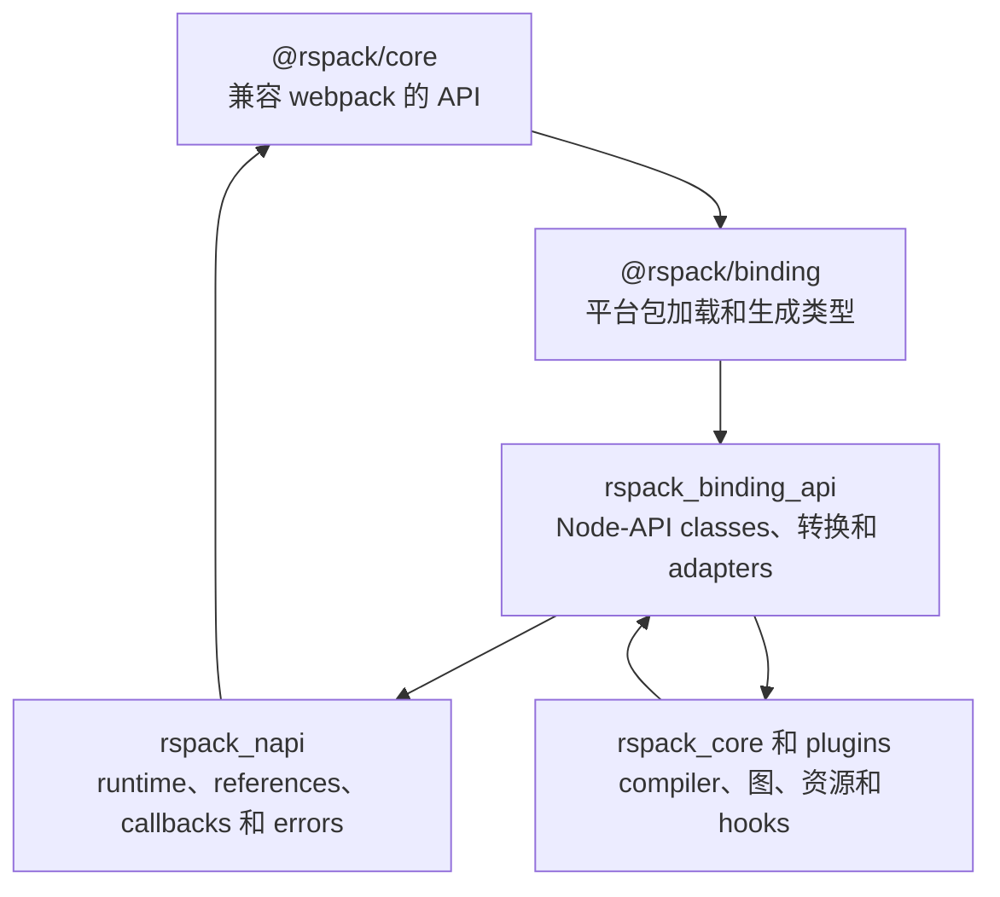
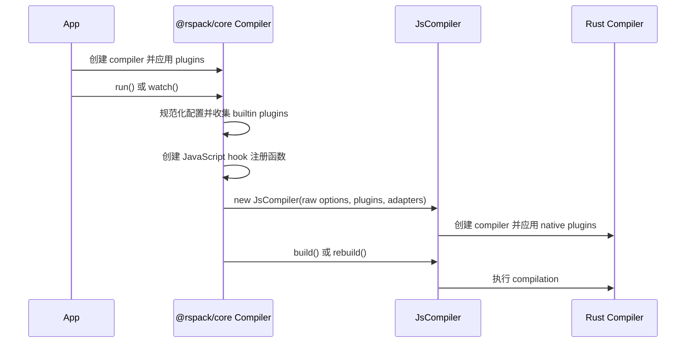

# JavaScript binding 架构

本文描述 Rspack 如何跨 `@rspack/core`、Node-API 和 Rust compiler 实现 JavaScript API。
适用于修改 JavaScript facade、binding class、hook adapter、loader 或 native 对象 wrapper
的贡献者。

公共 API 是 `@rspack/core`。`@rspack/binding` 和 Rust binding crates 属于内部实现，不保证
其独立 API 的兼容性。

## 分层边界



| 层                     | 主要位置                               | 职责                                                                             |
| ---------------------- | -------------------------------------- | -------------------------------------------------------------------------------- |
| 公共 JavaScript facade | `packages/rspack/src/`                 | webpack 兼容、配置规范化、公共 class、hooks 和 JavaScript 行为                   |
| Binding package        | `crates/node_binding/`                 | Native package 加载、平台包、WASI wrappers 和生成的 TypeScript 声明              |
| Binding API            | `crates/rspack_binding_api/`           | `#[napi]` exports、raw option 转换、native-backed 对象、hook 和文件系统 adapters |
| Node-API 支持          | `crates/rspack_napi/`                  | Tokio runtime、线程安全函数、JavaScript references、Promise 和 error 转换        |
| Compiler core          | `crates/rspack_core/` 和 plugin crates | Compilation 状态、图、native hooks、module build、优化和代码生成                 |

依赖方向应该指向 core。`rspack_core` 不应依赖 JavaScript facade 类型。只为兼容 webpack
存在的行为通常应该留在 `packages/rspack`，可复用的编译行为应该放在 Rust 中。

## Compiler 初始化

JavaScript `Compiler` 会先于 native `JsCompiler` 创建。



`Compiler.#getInstance()` 是关键的 JavaScript 入口：

1. 检查 `@rspack/core` 与 `@rspack/binding` 版本是否一致。
2. 将规范化配置转换为 `RawOptions`。
3. 附加函数和 virtual modules 使用的 references。
4. 创建 hook 注册函数。
5. 包装配置的文件系统和 resolver factory。
6. 构造 native `JsCompiler`。

初始化采用惰性方式，使 plugin 能在配置转换前完成 JavaScript compiler 设置。Native compiler
创建后，对 JavaScript 配置的任意修改不会自动重新转换。

Native `JsCompiler` 保存 Rust compiler、compiler-scoped callback references、dependency
caches、compiler context 和可选的 virtual file store。Build 和 rebuild 通过 binding runtime
运行并使用 JavaScript callback 完成。`close()` 等待活跃工作，释放 compiler-scoped callbacks，
并删除 native 状态；内部 `unsafeFastDrop` 模式除外，它将清理交给进程退出。

## JavaScript 到 Rust 调用

JavaScript API 的直接调用有四类路径：

1. **纯 JavaScript：** 不调用 binding。
2. **值转换：** 将 JavaScript object 转为 Rust 持有的 DTO。
3. **Native-backed 查询：** 根据 identifier 或 wrapper 从当前 compilation 状态解析对象。
4. **Adapter 回调：** Rust 调用自定义文件系统等 JavaScript 实现。

当 API 不需要 identity 和实时修改时，优先在边界使用 owned value。兼容 webpack 的图 API
通常需要 native-backed 对象，但必须定义明确的生命周期和撤销规则。

转换成本也是 API 设计的一部分。返回大型 `Vec` 的方法，其转换成本可能高于 Rust 查询本身；
一个 JavaScript getter 也可能隐藏 native 查询和内存分配。

## Rust 到 JavaScript hooks

JavaScript hooks 不会在 compiler 创建时直接注册为普通 Rust taps。当前 bridge 使用 interceptor：

1. `packages/rspack/src/taps/` 将公共 hook 对象映射到 `RegisterJsTapKind`。
2. JavaScript 提供按照 stage range 返回 taps 的注册函数。
3. `JsHooksAdapterPlugin` 在支持的 native hook 上安装 interceptor。
4. Interceptor 向 JavaScript 查询该 native hook 需要的 taps。
5. 每个 tap 保存为线程安全 JavaScript 函数。
6. Native hook 参数完成转换后调度 JavaScript tap，并在需要时等待结果。

Bridge 有两种性能机制：

- **non-skippable registers：** 没有 JavaScript 使用的 hook kind 可以在查询 taps 前返回；
- **tap registration caches：** 按 module 等高频 hook 可以复用已转换的 tap 列表。

修改 registration、stage 或 invalidation 时必须同时检查 bridge 两侧。JavaScript facade 中存在，
但没有加入 `RegisterJsTapKind` 或 `JsHooksAdapterPlugin` 的 hook 不会在 native 生命周期中运行。
错误的缓存可能保留 closure，或者遗漏后续增加的 tap。

同步 tap 和返回 Promise 的 tap 使用不同转换路径。Promise hook 会等待 JavaScript Promise，
并将 rejection 转成 `rspack_error::Error`。Native worker thread 不得直接调用 JavaScript。

## 线程和 runtime 模型

Node-API 环境存活期间，`rspack_napi` 管理一个进程级 Tokio runtime。异步 binding 操作运行在
该 runtime 中，最后一个环境删除后由 environment cleanup hook 关闭 runtime。

线程安全函数将工作放入 JavaScript 环境。Native task 传递 owned arguments 或 binding wrappers，
然后等待 one-shot response。Node-API queue 的调用是 non-blocking，但 Rust compilation stage
仍可能等待返回值。

重要约束：

- Rust worker thread 不得直接访问 raw JavaScript value；
- 通过线程安全函数传递的值必须满足跨线程所有权约定；
- 借用的 Rust reference 不能超过 native owner 的操作范围；
- 同步 JavaScript API 即使内部使用 binding runtime，也会阻塞调用者；
- Core CPU 并行应遵循 Rspack 的 `rayon` 和 `rspack_parallel` 边界，不应引入 binding 私有的
  task orchestration。

## Native-backed 对象

### Compilation

Rust 到 JavaScript 的转换使用 `JsCompilationWrapper`，为每个 `CompilationId` 保持一个 native
JavaScript `JsCompilation` instance。JavaScript `Compiler` 再使用 `WeakMap` 将 native instance
映射到一个公共 `Compilation` facade。

`JsCompilation` 当前保存 compilation identifier 和指向 Rust `Compilation` 的 pointer。只有在
所属 compiler 仍暴露该 compilation 时访问才有效。Compilation 替换或 compiler 清理时会清理
wrapper cache。

两级缓存用于保持兼容性 identity：

```text
Rust CompilationId
  -> native JsCompilation instance
  -> public @rspack/core Compilation instance
```

旧的 watch compilation 不能因为缓存而成为最新 compilation 的别名。

### Module

`ModuleObject` 按 compiler 和 identifier 缓存 JavaScript instance。常规 module 访问会使用
identifier 从当前 compilation 的 module graph 中解析。

部分 callback 会在 module 由 module factory、build task、loader runner 或 module executor
临时持有，而不是位于主 module graph 时暴露它。当前实现可以附加 callback-scoped native
pointer 作为 fallback。Revoked-module 和 compiler cleanup 会删除或使缓存 instance 失效。

这一 fallback 用来维持兼容 webpack 的对象 identity，以及 off-graph 阶段的访问能力，同时也
引入了严格的生命周期和 aliasing 假设，详见
[JavaScript binding 设计债务](/contribute/architecture/javascript-binding-design-debt)。

### Chunk、graph 和 dependency wrappers

大部分 wrapper 保存 identifier、key、compilation identifier、weak native reference，或者它们
的组合。方法执行查询前会解析当前 Rust value。增加结果类型时，必须明确它属于：

- owned snapshot；
- 包含 native-backed 元素的已物化集合；
- live view；
- mutable adapter；
- callback-scoped capability。

不能只因为 pointer-backed wrapper 实现最短，就使用它暴露 Rust reference。

## 集合和 adapters

即使 native 存储不同，JavaScript facade 仍有意提供兼容 webpack 的 collection shape。

例如：

- `Compilation.modules` 从 native module wrappers 物化 JavaScript `Set`。
- `Compilation.chunks` 缓存只读的 set-like binding 对象。
- named chunk map 使用 JavaScript 只读 map facade，并执行 native key/value 查询。
- `Compilation.assets` 使用 Proxy，其 traps 调用 native asset 操作。
- source conversion 在 `webpack-sources` 和 binding `JsSource` 之间转换。
- dependency collection 使用 facade 将批量添加转换为 native 操作。

修改这些 API 时，需要记录 iteration 是 snapshot 还是 live、element identity 是否缓存、mutation
如何提交，以及常见操作需要多少次跨边界调用。

## Error 和 panic

Error 可以双向跨越边界：

- Rust error 转为 Node-API error 或 callback error。
- JavaScript throw 和 Promise rejection 转为 `rspack_error::Error`。
- 异步 Rust panic 会尽可能在 task 边界捕获并转成 JavaScript error。
- JavaScript error object 可能需要在原环境中转换，以保留 message、stack 和自定义字段。

公共 error 应描述被破坏的生命周期或操作，不应暴露 pointer 或 Node-API 实现细节。Error
conversion 必须保留足够的 hook、loader、文件或 compilation stage 上下文。

## Native 和 WASI bindings

`crates/node_binding` 打包生成的 Node-API 声明和平台 loader。Native package 包含编译后的
addon；browser 和 WebContainer 支持使用 WASI 与 emnapi adapters，包括 worker 和文件系统 shim。

不能假设 native build 中可用的 API 在 browser build 中也有意义。新增 binding API 时需要检查：

- Node-API 或 emnapi 是否支持；
- 参数和返回值能否安全转换；
- 文件系统假设；
- worker 和 Promise 行为；
- 条件 Rust features；
- 生成的 native 和 WASI exports。

`napi-binding.d.ts` 是生成文件。它的手写 header 由
`crates/node_binding/scripts/dts-header.js` 组装；应该修改 Rust annotations 或 header source，
而不是直接修改生成声明。

## 修改配方

### 新增或修改 native method

1. 确认行为应该位于 Rust，而不是 JavaScript 兼容层。
2. 选择 owned DTO、identifier lookup 或明确的 wrapper model。
3. 在 `rspack_binding_api` 实现 `#[napi]` surface。
4. 在 `packages/rspack/src` 的公共 class 中适配。
5. 同时测试成功路径和生命周期失效。
6. 先构建 binding，再构建 JavaScript。
7. 如果行为或成本对用户可见，更新公共 API 和实现说明。

### 增加由 Rust 驱动的 JavaScript hook

1. 定义或找到 native hook。
2. 增加 `RegisterJsTapKind` 和 interceptor conversion。
3. 在 `JsHooksAdapterPlugin` 中安装。
4. 在 `packages/rspack/src/taps/` 增加 JavaScript registration adapter。
5. 决定 sync 或 Promise 行为，以及 registration 能否 cache 或 skip。
6. 测试 stage ordering、errors、rebuild、parallel compilers 和 cleanup。

### 增加 native-backed 对象

实现前必须写清：

- native owner；
- stable identity key；
- valid access window；
- read/write capability；
- revocation behavior；
- cross-thread representation；
- JavaScript identity requirement；
- iteration 和 conversion cost。

任何一项不明确，都说明对象模型尚不适合暴露。

## 源码索引

| 关注点                      | 起点                                                       |
| --------------------------- | ---------------------------------------------------------- |
| 公共 compiler 生命周期      | `packages/rspack/src/Compiler.ts`                          |
| 公共 compilation facade     | `packages/rspack/src/Compilation.ts`                       |
| Hook registration adapters  | `packages/rspack/src/taps/`                                |
| Native compiler 和 cleanup  | `crates/rspack_binding_api/src/lib.rs`                     |
| Native compilation API      | `crates/rspack_binding_api/src/compilation/`               |
| Module identity 和访问      | `crates/rspack_binding_api/src/module.rs`                  |
| Native hook adapter         | `crates/rspack_binding_api/src/plugins/js_hooks_plugin.rs` |
| Hook interceptors 和 caches | `crates/rspack_binding_api/src/plugins/interceptor.rs`     |
| Loader bridge               | `crates/rspack_binding_api/src/plugins/js_loader/`         |
| Runtime 和线程安全调用      | `crates/rspack_napi/src/`                                  |
| 生成 package 和 types       | `crates/node_binding/`                                     |
| 生命周期和 GC tests         | `tests/rspack-test/compilerCases/fixtures/tsfn-lifecycle/` |
